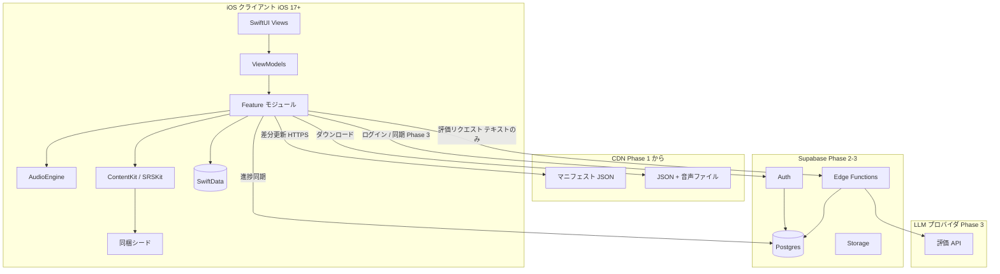
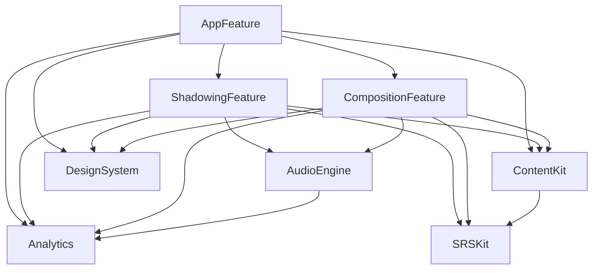
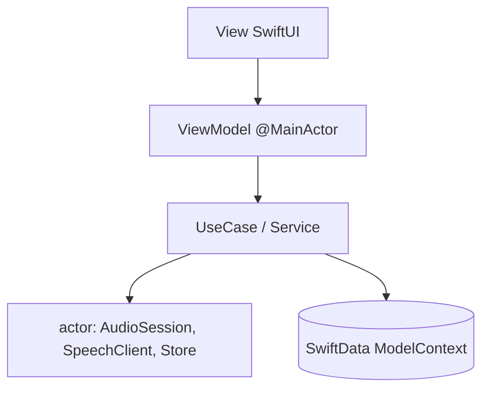
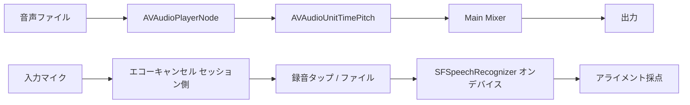
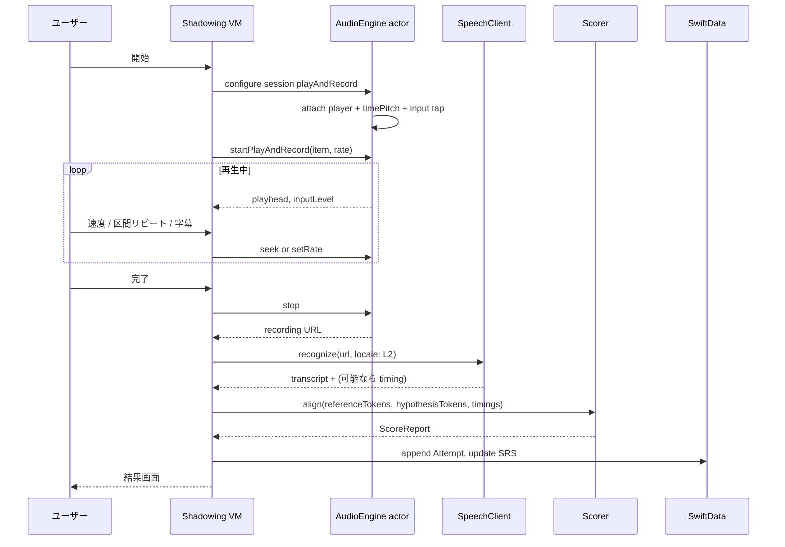
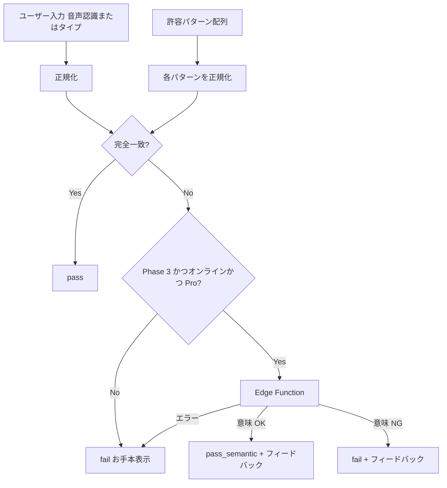
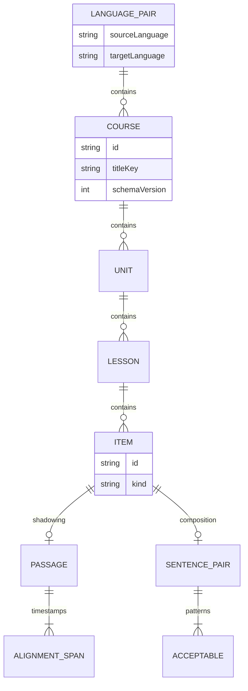
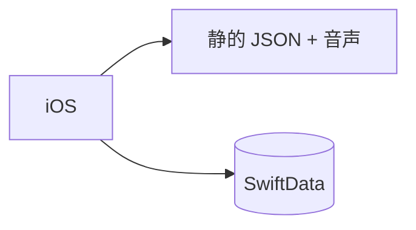

# アーキテクチャ

本書は SnapSpeak の実装方針を固定する。プロダクト意図は [product-overview.md](./product-overview.md)、フェーズ分割は [roadmap.md](./roadmap.md) を正とする。ここに書いたクライアント構成・音声パイプライン・データモデル・国際化は、ロードマップの各 Phase で「後から根本変更しない」前提である。

確定判断（再掲・変更しない）:

- SwiftUI、iOS 17+、MVVM + Swift Concurrency（async/await, actor）。**TCA は採用しない**（学習コストとチーム規模）。
- ローカル永続化は SwiftData。オフラインファースト。
- モジュールは Swift Package 分割。
- 録音・再生は AVFoundation。音声認識は Speech framework（オンデバイス優先）。
- 採点はお手本と認識結果のトークン列アライメント（編集距離 / DP）。
- 瞬間英作文の MVP 判定は許容パターンとの正規化マッチ。LLM は Phase 3。
- SRS は SM-2 ベースを SRSKit に独立。
- 言語ペア `(sourceLanguage, targetLanguage)` が第一級。
- バックエンドは Phase 1 静的配信 → Phase 2-3 Supabase → Phase 4 リージョン対応。

---

## 1. システム全体構成

Phase によって右側（クラウド）が増える。クライアント核は全 Phase で同じ。



### 1.1 責務分界

| 領域 | 責務 | 置かないもの |
|------|------|----------------|
| クライアント | 学習 UX、録音、ASR、採点、SRS 計算、オフライン学習 | LLM API キー、コンテンツの正本（配信後はキャッシュ） |
| CDN | 公開コンテンツの静的配信、マニフェスト | 個人学習データ |
| Supabase | アカウント、進捗の正本（同期後）、Edge の秘匿プロキシ | クライアントから直接叩く LLM |
| LLM | 意味評価と短いフィードバック文 | 音声バイナリ、無関係な個人プロファイル |

### 1.2 通信の原則

- 学習セッション中にネットワークは **必須にしない**。
- CDN は「更新と追加取得」専用。失敗時は既存ローカルで継続。
- Phase 3 の同期と LLM は、未ログイン・オフライン・API 失敗時にコア学習を止めない。

---

## 2. クライアントのモジュール構成とレイヤリング

### 2.1 パッケージ一覧

アプリ本体（Xcode App Target）は薄く、起動・DI・Scene のみを持つ。機能は Swift Package に置く。

| モジュール | 種別 | 責務 |
|------------|------|------|
| **AppFeature** | アプリシェル | タブ/ナビ、セッション開始、依存の組み立て、ディープリンク |
| **ShadowingFeature** | 機能 | シャドーイング画面、結果、プレイヤー状態機械 |
| **CompositionFeature** | 機能 | 瞬間英作文画面、入力モード、判定結果表示 |
| **AudioEngine** | インフラ | AVAudioEngine、セッション、再生速度、録音バッファ、割り込み |
| **ContentKit** | ドメイン | 言語ペア、JSON スキーマ、デコード、ダウンロード、シード、エンタイトルメント解決 |
| **SRSKit** | ドメイン | SM-2 カスタム、品質算出、スケジュール。UI を持たない |
| **DesignSystem** | UI | 色、タイポ、ボタン、カード。機能知識を持たない |
| **Analytics** | インフラ | イベント送信のプロトコルと実装。個人データ・音声を受け取らない |

依存方向は一方向にする。



禁止:

- Feature 同士の直接 import（共有が必要なら AppFeature か小さな Domain パッケージへ上げる）。
- DesignSystem から ContentKit / SwiftData への依存。
- SRSKit から SwiftUI / AVFoundation への依存。
- AudioEngine から SwiftData への依存（録音ファイルパスは Feature が渡す）。

### 2.2 レイヤリング（各 Feature 内部）

TCA を使わない。画面は MVVM、非同期と共有可変状態は Swift Concurrency で閉じる。



| 層 | ルール |
|----|--------|
| View | 状態を持たない。バインディングと意図（Intent）の発火のみ |
| ViewModel | `@MainActor`。画面状態、ユーザー意図の解釈、UseCase 呼び出し。AVAudioEngine を直接触らない |
| UseCase | レッスン開始、採点、SRS 更新などユースケース単位。テスト可能な純関数を優先 |
| actor | オーディオグラフ、Speech 認識タスク、StoreKit キューなど「同時に一つ」の資源 |
| SwiftData | 永続化。Model 型は ContentKit または専用 Persistence に置き、Feature はプロトコル経由でもよい |

ViewModel のスケッチ（実装時の目安。全文ではない）:

```swift
@MainActor
final class ShadowingLessonViewModel: ObservableObject {
    enum Phase { case loading, ready, playing, scoring, scored, failed(Error) }
    @Published private(set) var phase: Phase = .loading
    @Published var captionsEnabled: Bool
    @Published var rate: Float // 0.5 ... 1.5

    func start() async { /* AudioEngine.playAndRecord */ }
    func stopAndScore() async { /* Speech → align → persist → SRS */ }
}
```

### 2.3 ナビゲーション

- 階層は `NavigationStack`。レッスンプレイヤーはフルスクリーンカバーでもよい（録音中の誤ジェスチャ防止）。
- 画面間のデータは ID（`lessonId`, `itemId`）を渡し、大きな音声バッファは渡さない。

---

## 3. 音声処理パイプライン

シャドーイングは **再生と録音の同時実行** が前提。瞬間英作文は **録音（または無音のタイプ入力）と短時間 ASR**。

### 3.1 Audio Session

| 項目 | 方針 |
|------|------|
| カテゴリ | `.playAndRecord` |
| モード | シャドーイング中は `.voiceChat`（AEC を期待）。お手本だけのプレビューは `.spokenAudio` も可 |
| オプション | `.defaultToSpeaker` はスピーカー視聴時、`.allowBluetoothHFP` はヘッドセット |
| エコーキャンセル | ボイス処理オン。内蔵マイク + スピーカーはハウリング試験必須 |
| サンプルレート | 48 kHz またはハードウェアネイティブ。ASR 前に 16 kHz mono へ変換してよい |
| 割り込み | `AVAudioSession.interruptionNotification` を AudioEngine アクタが独占購読 |

端末 TTS（`AVSpeechSynthesizer`）は補助（ヒント読み上げ、お手本欠損時のフォールバック）。MVP のお手本正本は同梱または CDN の音声ファイル。

### 3.2 再生速度

- 範囲 **0.5x〜1.5x**。UI は離散プリセット（0.5 / 0.75 / 1.0 / 1.25 / 1.5）。
- `AVAudioUnitTimePitch` でレート変更、ピッチは 0（維持）。
- 文タイムスタンプは **原速の秒** で持ち、表示ヘッドは `originalTime = mediaTime * rate` の逆変換で同期する（実装時はノード時刻を単一のソース・オブ・トゥルースにする）。

### 3.3 パイプライン構成（シャドーイング）



録音はミキサー出力ではなく **入力ノード** から取る（お手本が採点用認識に混ざらないようにする）。ユーザーが聞きたいお手本は出力経路のみ。

### 3.4 シーケンス（シャドーイング 1 試行）



### 3.5 Speech framework

- `SFSpeechRecognizer(locale:)` の locale は **L2**（シャドーイング対象言語、瞬間英作文の産出言語）。
- `requiresOnDeviceRecognition = true` を優先。未対応デバイス/言語ではオンデバイス不可を検知し、（Phase 1）エラーメッセージ + タイプ入力誘導、または OS が許可する範囲のフォールバック。サーバ ASR を必須依存にしない。
- 認識タスクは 1 レッスン 1 アクタに直列化。キャンセル可能にする。
- 結果は `bestTranscription`。セグメント時刻が取れる場合は遅延計算に使う。取れない場合は録音長とお手本長からの粗遅延にフォールバック。

権限:

1. マイク（録音）
2. Speech 認識

拒否時: シャドーイングは開始不可（理由を説明）。瞬間英作文はタイプ入力へ。

### 3.6 瞬間英作文の音声

- 短い発話。VAD 相当は「無音閾値 + 最大秒数」。
- 認識完了後に正規化マッチ。お手本音声の再生は任意（正解提示時）。
- 再生と録音の同時は原則不要。カテゴリは `.record` でもよいが、正解音声をすぐ鳴らすため `.playAndRecord` で統一してもよい（AudioEngine のモード切替を明示）。

---

## 4. シャドーイング採点アルゴリズム

目的は「お手本スクリプトに対して、何を言い、何を飛ばし、どこで詰まったか」を返すこと。音素レベル DNN は Phase 1 の対象外。

### 4.1 前処理

1. お手本スクリプト（L2）と ASR 仮説を、言語別トークナイザに通す。
2. 正規化: 小文字化（ケースを持つ文字体系）、句読点除去、Unicode 正規化（NFC）、縮約の展開（英語）。
3. フィラーリスト（`uh`, `um`, `えー` など。L2 ロケール別）は **言い淀みカウント** に回し、アライメントの参照列からは除外してもよい。

英語トークン例:

```
don't you think it's...  →  do not you think it is
```

CJK（Phase 3）は文字 unigram + 辞書バイグラムなど、空白分割しないストラテジに差し替える。インタフェース:

```swift
protocol Tokenizer {
    func tokenize(_ text: String, language: LanguageCode) -> [Token]
}
struct Token: Equatable {
    var surface: String
    var normalized: String
    var startMs: Int?
    var endMs: Int?
}
```

### 4.2 アライメント（編集距離 DP）

参照トークン列 \(R = r_1..r_n\)、仮説 \(H = h_1..h_m\)。

コスト:

- 一致: \(r_i = h_j\)（正規化後）で 0
- 置換: 1
- 削除（抜け: 参照にあるが仮説に無い）: 1
- 挿入（余分: 言い直し・挿入語）: 1

標準 Levenshtein でバックトレースし、操作列を得る。

一致率:

\[
\mathrm{matchRate} = \frac{\#\mathrm{equal}}{\max(n, 1)}
\]

補助:

- **Precision** = equal / max(m, 1)（余分な発話が多いと下がる）
- **Recall** = equal / max(n, 1)（抜けが多いと下がる）

表示の主指標は Recall 寄りの matchRate。Precision は「言い淀み・繰り返し」の説明に使う。

### 4.3 抜け・言い淀み

| 現象 | DP 上の定義 | UI |
|------|-------------|-----|
| 抜け | 削除操作が連続、または単発 | お手本字幕で当該トークンを警告色 |
| 言い淀み | 同一正規化トークンの挿入繰り返し、またはフィラー | 「繰り返し」バッジ |
| 置換 | 別単語 | お手本と認識を並べて表示（認識テキストは結果画面のみ。分析には送らない） |

### 4.4 WPM

単語（またはトークン）数 / 発話時間（分）。発話時間は録音の実長から先頭末尾無音をトリム。

英語: トークン数ベースで十分。CJK: 文字数/分を併記する拡張点をスコア構造体に持たせる。

### 4.5 シャドーイング遅延（レイテンシ）

理想: 各参照トークンの音声開始時刻 \(t^R_i\)（コンテンツのタイムスタンプ）と、アライメントで対応した仮説トークンの時刻 \(t^H_{\pi(i)}\) の差。

\[
\mathrm{delay}_i = t^H_{\pi(i)} - t^R_i
\]

平均遅延と中央値を出す。対応が削除のトークンは除外。

仮説に時刻が無い場合: 録音開始をプレイヤー開始に合わせている前提で、仮説列を録音長に等間隔配置するフォールバック（精度低。結果に「概算」と出す）。

### 4.6 スコアレポート（永続化用）

```swift
struct ShadowingScore: Codable {
    var matchRate: Double      // 0...1
    var precision: Double
    var recall: Double
    var omissions: [AlignedSpan]
    var hesitations: Int
    var substitutions: Int
    var wpm: Double
    var delayMsMedian: Int?
    var delayIsApproximate: Bool
    var asrOnDevice: Bool
}
```

SRS 品質への写像は §6.3。UI は百分率表示、内部は 0...1。

---

## 5. 瞬間英作文の判定フロー

MVP は **複数許容解答との正規化マッチング**。意味同等の自由判定は Phase 3 の LLM。



Phase 1 は菱形 LLM が常に No。

### 5.1 正規化規則（英語 L2、Phase 1）

順序を固定し、単体テストする。

1. `NFKC` 相当の互換正規化（全角英数を半角へ）
2. 小文字化
3. スマートクォートを ASCII へ
4. 句読点除去（アポストロフィは縮約処理の前は保持）
5. 縮約展開テーブル（例）:
   - `don't` → `do not`
   - `it's` → `it is`（`it has` は許容パターン側で別解を用意）
   - `I'm` → `i am`
   - `won't` → `will not`
   - `can't` → `cannot` および `can not` の両パターンをゴールドに置くか、正規化で `can not` に寄せる（**テーブルを一箇所に固定**）
6. 連続空白の圧縮、トリム

冠詞 `a/an/the` の欠落は **不一致**（意味が変わりうるため）。助動詞の丁寧体はゴールドパターンでカバーする。

### 5.2 照合

```swift
func grade(input: String, acceptable: [String], locale: Locale) -> CompositionGrade {
    let hyp = normalize(input, locale: locale)
    let refs = acceptable.map { normalize($0, locale: locale) }
    if refs.contains(hyp) { return .pass(kind: .normalizedMatch) }
    return .fail
}
```

部分一致・編集距離しきい値は MVP では入れない（「ほぼ正解」の期待値がばらつくため）。近い誤答のヒントは Phase 3 の LLM に任せる。

### 5.3 応答時間

- `t0`: L1 文が画面に出た時刻
- `tSpeak`: 録音開始（タイプなら初キー）
- `tEnd`: 認識確定または送信

SRS には `tEnd - t0` を使う。極端な値（アプリを裏に出した）は上限でクリップ。

### 5.4 Phase 3 LLM 評価

クライアント → Edge Function ペイロード（最小）:

```json
{
  "languagePair": { "source": "ja", "target": "en" },
  "promptL1": "会議は延期になりました。",
  "acceptable": ["The meeting has been postponed.", "The meeting was postponed."],
  "hypothesis": "The meeting postponed.",
  "idempotencyKey": "attempt-uuid"
}
```

応答:

```json
{
  "verdict": "near_pass",
  "score": 0.7,
  "feedback": "完成した文にするには has been が必要です。"
}
```

- 音声は送らない。
- キーは Edge 側。レート制限。同一 `idempotencyKey` はキャッシュ。
- 失敗時は MVP 判定のまま。

---

## 6. SRS 設計（SRSKit）

独立モジュール。UI・Audio・ネットワークに依存しない。アルゴリズムは SM-2 をベースにカスタム。

### 6.1 対象アイテム

SRS カードのキーは `(languagePair, itemId, skill)`。

`skill`: `shadowing` | `composition`。同一文でも技能が違えば別カード。

### 6.2 SM-2 の保持値

```swift
struct SRSState: Codable, Equatable {
    var easiness: Double     // EF, 初期 2.5, 下限 1.3
    var intervalDays: Int    // 0, 1, 6, ...
    var repetitions: Int
    var dueAt: Date
    var lastReviewedAt: Date?
    var lastQuality: Int?    // 0...5
}
```

更新（品質 q = 0...5）:

- \(EF' = EF + (0.1 - (5-q)\times(0.08+(5-q)\times0.02))\)
- \(EF' < 1.3\) なら 1.3
- q < 3 なら `repetitions = 0`, `intervalDays = 1`（失敗は翌日）
- q ≥ 3:
  - repetitions == 0 → interval 1
  - repetitions == 1 → interval 6
  - else → `round(interval * EF')`
  - repetitions += 1

`dueAt = startOfDay(now, calendar) + intervalDays`。時刻は学習リマインダーと独立。カレンダーは **端末タイムゾーン**。

### 6.3 品質 q の自動算出

ユーザーに 0-5 を選ばせない。正答率（または一致率）と応答速度から決める。

**瞬間英作文**

| 条件 | q |
|------|---|
| fail | 1（完全な 0 は「見ていない」と区別するため予約。無回答・スキップが 0） |
| pass かつ応答が遅い（しきい値超） | 3 |
| pass かつ通常 | 4 |
| pass かつ速い（しきい値未満）かつヒント未使用 | 5 |
| ヒント使用で pass | 3 を上限 |

しきい値は言語・文字数で変える。初期: 英語 12 トークン未満は速い ≤ 4s、遅い ≥ 12s。定数は SRSKit の `GradingPolicy` に閉じる。

**シャドーイング**

| matchRate | 遅延中央値 | q 目安 |
|-----------|------------|--------|
| < 0.4 | any | 1 |
| 0.4..<0.6 | any | 2 |
| 0.6..<0.8 | 大きい | 3 |
| 0.6..<0.8 | 小さい | 4 |
| ≥ 0.8 | 大きい | 4 |
| ≥ 0.8 | 小さい | 5 |

「大きい遅延」の初期しきい値は 800 ms（検証で調整。定数化）。

### 6.4 キュー

Phase 1: レッスン内で SRS 更新のみ。専用キュー UI は任意。

Phase 2: `dueAt <= now` を skill 混在で取り、1 セッション上限 n 件。新規未学習は Course 順のレッスンが担当し、SRS は復習専用でもよい（新規導入をレッスン完了時にカード作成）。

### 6.5 純関数インタフェース

```swift
enum ReviewQuality: Int { case blackout = 0, fail = 1, hard = 2, pass = 3, good = 4, easy = 5 }

struct SRSEngine {
    var policy: GradingPolicy
    func qualityForComposition(pass: Bool, latencyMs: Int, usedHint: Bool) -> ReviewQuality
    func qualityForShadowing(score: ShadowingScore) -> ReviewQuality
    func review(state: SRSState, quality: ReviewQuality, now: Date, calendar: Calendar) -> SRSState
}
```

乱数なし。テストは固定 `now`。

---

## 7. データモデル

### 7.1 コンテンツ階層



- Course > Unit > Lesson > Item
- Item は `shadowing`（passage）または `composition`（sentence pair）
- 文単位タイムスタンプ（音声アライメント）を passage が持つ

### 7.2 コンテンツ JSON スキーマ例

配信・シードともこの形。`schemaVersion` は整数。アプリは **自分が知る最大以下** を読む。未知フィールドは無視（Decodable で柔軟に）。破壊的変更時はバージョンを上げ、旧アプリは旧ファイルを配信し続ける（マニフェストがアプリの `minAppVersion` を見てファイルを分岐）。

```json
{
  "schemaVersion": 1,
  "id": "course_daily_ja_en",
  "languagePair": { "sourceLanguage": "ja", "targetLanguage": "en" },
  "title": { "ja": "日常英会話", "en": "Daily English" },
  "manifestRevision": 3,
  "units": [
    {
      "id": "unit_01_greetings",
      "title": { "ja": "あいさつ", "en": "Greetings" },
      "lessons": [
        {
          "id": "lesson_01_shadowing",
          "mode": "shadowing",
          "items": [
            {
              "id": "item_p_001",
              "kind": "shadowing",
              "audio": {
                "relativePath": "audio/item_p_001.m4a",
                "durationMs": 42000,
                "checksumSha256": "…"
              },
              "passage": {
                "text": "Hi, I'm running a bit late. Could we start in ten minutes?",
                "spans": [
                  { "startMs": 0, "endMs": 900, "text": "Hi," },
                  { "startMs": 900, "endMs": 2100, "text": "I'm running" },
                  { "startMs": 2100, "endMs": 3200, "text": "a bit late." }
                ]
              }
            }
          ]
        },
        {
          "id": "lesson_02_composition",
          "mode": "composition",
          "items": [
            {
              "id": "item_c_001",
              "kind": "composition",
              "l1": "少し遅れます。10分後に始められますか。",
              "acceptable": [
                "I'm running a bit late. Could we start in ten minutes?",
                "I'm a little late. Can we start in ten minutes?",
                "I am running a bit late. Could we start in 10 minutes?"
              ],
              "audio": {
                "relativePath": "audio/item_c_001.m4a",
                "durationMs": 5000,
                "checksumSha256": "…"
              }
            }
          ]
        }
      ]
    }
  ]
}
```

型スケッチ:

```swift
struct LanguagePair: Codable, Hashable {
    var sourceLanguage: String // BCP-47 の言語サブタグ。例 "ja", "en", "es", "zh"
    var targetLanguage: String
}

enum ItemKind: String, Codable { case shadowing, composition }

struct AlignmentSpan: Codable {
    var startMs: Int
    var endMs: Int
    var text: String
}
```

マニフェスト（CDN）:

```json
{
  "schemaVersion": 1,
  "generatedAt": "2026-08-21T00:00:00Z",
  "courses": [
    {
      "id": "course_daily_ja_en",
      "languagePair": { "sourceLanguage": "ja", "targetLanguage": "en" },
      "revision": 3,
      "minAppVersion": "1.0.0",
      "contentUrl": "https://cdn.example.com/courses/course_daily_ja_en/3/index.json",
      "bytes": 184320,
      "checksumSha256": "…"
    }
  ]
}
```

差分更新: クライアントはコースごとの `revision` とチェックサムを SwiftData に持ち、増加分だけ取得。ファイル単位のパッチは Phase 1 必須としない（コース tar/zip の置き換えでよい）。

### 7.3 SwiftData スキーマ案

コンテンツ正本は JSON ファイル（シード bundle または Application Support 配下のダウンロード）。SwiftData は **ユーザー状態とキャッシュ索引**。

```swift
@Model final class DownloadedCourse {
    @Attribute(.unique) var courseId: String
    var sourceLanguage: String
    var targetLanguage: String
    var revision: Int
    var localPath: String
    var downloadedAt: Date
    var checksumSha256: String
}

@Model final class LessonAttempt {
    @Attribute(.unique) var id: UUID
    var courseId: String
    var lessonId: String
    var itemId: String
    var languagePairKey: String // "ja|en"
    var skill: String           // shadowing | composition
    var createdAt: Date
    var durationMs: Int
    var payloadJSON: Data       // Score または Grade。追記後イミュータブル
}

@Model final class SRSCard {
    @Attribute(.unique) var key: String // pair + itemId + skill
    var sourceLanguage: String
    var targetLanguage: String
    var itemId: String
    var skill: String
    var easiness: Double
    var intervalDays: Int
    var repetitions: Int
    var dueAt: Date
    var lastReviewedAt: Date?
    var lastQuality: Int?
    var updatedAt: Date          // LWW 用
}

@Model final class UserSettings {
    var uiLanguage: String       // String Catalog / AppleLanguages と同期可能なコード
    var sourceLanguage: String   // L1
    var targetLanguage: String   // L2
    var captionsEnabled: Bool
    var defaultRate: Float
    var reminderHour: Int?
    var updatedAt: Date
}

@Model final class EntitlementCache {
    var isPro: Bool
    var expirationDate: Date?
    var updatedAt: Date
}
```

学習履歴は **追記型**。`LessonAttempt` を update しない。SRS と Settings は上書き（同期時 LWW）。

マイグレーション: 初期は軽量。属性追加は任意値。リネームは VersionedSchema を Phase 2 までに導入。

---

## 8. バックエンド進化戦略

### 8.1 Phase 1 — サーバーレス最小



- アカウントなし。匿名。データは端末。
- コンテンツは CDN（CloudFront/S3 相当）任意。必須はシード同梱。
- 分析を送る場合も個人識別子を新規発行しないか、ランダムインストール ID（リセット可能）に留める。

### 8.2 Phase 2-3 — Supabase

| 機能 | 使い方 |
|------|--------|
| Auth | Sign in with Apple を第一候補。メールは任意 |
| Postgres | プロファイル、SRS スナップショット、attempt イベント、entitlement ミラー |
| Storage | ユーザー生成ファイルは原則持たない（録音は端末）。必要なら一時 |
| Edge Functions | LLM プロキシ、レート制限、キャッシュ、（必要なら）レシート検証の補助 |

同期:

- **ローカル優先**: オフライン書き込み可。オンラインで push/pull。
- **LWW**: `SRSCard`, `UserSettings` は `updatedAt`（可能ならサーバー `revision`）の新しい方。
- **追記**: `LessonAttempt` は UUID 主キーで insert only。欠損だけ埋める。
- 時計改ざん対策: 可能ならサーバー時刻で `dueAt` を再計算せず、間隔と `lastReviewedAt` を送りサーバーが due を出す、またはクライアント計算を信頼しつつ大きな未来日付をクリップ。

### 8.3 Phase 4 — リージョンとプライバシー

- データマップ（何がどのリージョンのどの表にあるか）を文書化。
- EU 向けはリージョンと DPA、削除 API、エクスポート。
- CDN は地域エッジ。個人データは CDN に置かない。
- LLM プロバイダへの送信は契約上の処理者として最小テキストのみ。

### 8.4 置かないもの

- 学習中のリアルタイムサーバ採点（必須にしない）
- クライアント埋め込みの LLM キー
- 録音のクラウド永久保存

---

## 9. 国際化設計

最重要要件。英語専用実装で「後から直す」ことを禁止する。

### 9.1 三層の言語

| 層 | 意味 | 初期値 (Phase 1) | 保存 |
|----|------|------------------|------|
| UI 言語 | ボタン、エラー、設定 | 日本語（`ja`） | システム言語 or アプリ上書き |
| L1 `sourceLanguage` | 母語。瞬間英作文の提示、対訳 | `ja` | UserSettings |
| L2 `targetLanguage` | 学習対象。ASR、お手本、産出 | `en` | UserSettings |

ありうる例: UI=`en`, L1=`es`, L2=`en`（Phase 4）。コードは常に三値を別変数で持つ。

### 9.2 UI 文字列

- すべて String Catalog（`.xcstrings`）。日本語だけでもリテラルを View に書かない。
- 用語: 「シャドーイング」「瞬間英作文」は glossary で固定。
- 複数形、変数（`%lld 件`）をカタログで扱う。
- Feature モジュールの文字列もカタログに集約するか、モジュールごと xcstrings を明示。

### 9.3 コンテンツ言語

- コースは必ず `languagePair` を持つ。カタログは現在ペアでフィルタ。
- `title` は辞書（UI 言語キー）。欠けると `sourceLanguage` キー、さらに `en` へフォールバック。
- 字幕は L2。L1 対訳は任意フィールドとしてスキーマに予約してもよい（Phase 1 シードでは必須にしない）。

### 9.4 ロケール切替

| 用途 | 使うロケール |
|------|----------------|
| 日付・数値・相対時刻 | UI 言語の `Locale` |
| Speech 認識 | L2 の BCP-47（`en-US`, `zh-CN`, `ko-KR` 等。地域は設定または既定表） |
| トークナイザ / 正規化 | L2 |
| TTS 補助ボイス | L2 |
| キーボード | 瞬間英作文タイプ時は L2 |

BCP-47 の地域（`en-US` vs `en-GB`）は Voice と ASR 精度に影響する。`LanguagePair` は言語サブタグを必須とし、地域は `SpeechLocaleResolver` で別管理する。

```swift
protocol SpeechLocaleResolver {
    func speechLocale(for targetLanguage: String, regionPreference: String?) -> Locale
}
```

### 9.5 レイアウト

- ダイナミックタイプ対応を DesignSystem の前提にする。
- 文字列伸長（Phase 4）に備え、固定幅ボタンを避ける。
- CJK と Latin の改行・フォントは DesignSystem のタイポ設定で切り替える。

---

## 10. 収益化と計測

### 10.1 StoreKit 2（Phase 2）

- サブスクリプション（期間は商品設計で決定）。
- 単一の `StoreActor` が `Transaction.updates` を購読。
- エンタイトルメントは `EntitlementCache` + ContentKit の `func canAccess(course:user:)`。
- 無料: シード、各コース先頭ユニット、日次の composition 上限など。プレイヤーは制限理由を知らず、ContentKit が `locked` を返す。

### 10.2 Analytics

- ファーストパーティ優先。ATT を要求しない範囲のイベント。
- 送ってよい: イベント名、言語ペアコード、レッスン ID、集計済みスコア帯（例: matchRate を 0.1 刻みに量子化）、所要時間帯。
- 送らない: 録音、生テキスト、氏名、精密位置。

例イベント: `lesson_started`, `lesson_completed`, `download_failed`, `paywall_shown`, `purchase_succeeded`。

実装は `Analytics` モジュールの `func track(_ event: AnalyticsEvent)` のみを Feature から呼ぶ。

---

## 11. 非機能要件

### 11.1 オフラインファースト

| 条件 | 期待動作 |
|------|----------|
| 初回起動・機内モード | シードで学習完了、履歴保存 |
| 追加コース未取得 | カタログは「要ダウンロード」と出し、シードは使える |
| 取得済み | 通信ゼロでプレイヤー・採点・SRS |
| CDN 失敗 | エラーは再試行可能。既存 revision を消さない |
| 同期失敗 Phase 3 | ローカルは成功。バナーで後で同期 |

録音ファイルは Attempt に紐づけて端末保存し、容量圧迫時はスコア JSON を残して音声を消せる（設定）。採点後の再認識が必要なら残す。

### 11.2 プライバシー

- 権限は使用直前。目的を String Catalog の usage 説明と画面の両方で書く。
- 音声は原則端末内。LLM はテキストのみ、オプトイン機能（Pro）。
- 分析は識別最小化。インストール ID のリセット手段を設定に置く。
- Phase 4: 削除権、エクスポート、処理の目的限定。

### 11.3 パフォーマンス

| 項目 | 目安 |
|------|------|
| レッスン開始までの音声オープン | 体感で待たせない。プリロード |
| 再生開始レイテンシ | AudioEngine をレッスン入場時に configure |
| 採点 | 数十秒音声の ASR は完了 overlay。メインスレッド禁止 |
| SwiftData | ダッシュボード集計はバックグラウンド |
| メモリ | 長時間録音を全量 RAM に載せない。ファイルへストリーム |
| アプリサイズ | シードは短く。追加は CDN |
| 熱・バッテリー | 連続シャドーイングでの CPU（TimePitch + ASR）。完了時にグラフを teardown |

### 11.4 信頼性

- Audio 割り込み後は「再開 or 最初から」を明示。中途半端なグラフを残さない。
- ASR タイムアウトはエラーにして再録音を促す。部分結果だけで確定しない。
- コンテンツ破損（チェックサム不一致）は当該コースを使用不可にし、再ダウンロード。

### 11.5 アクセシビリティ（学習アプリとしての下限）

- Dynamic Type、十分なコントラスト、録音中の VoiceOver ラベル。
- 点滅する採点演出を避ける。
- 字幕は難聴者のためではなく学習用だが、ON/OFF を設定に残す。

### 11.6 セキュリティ

- ATS。証明書ピンニングは CDN の運用コストと相談（必須にしない）。
- Edge の秘密はサーバのみ。
- コンテンツ改ざん: チェックサム。有料コースの「難読化」はDRM 相当を Phase 2 では過剰実装しない（エンタイトルメント + HTTPS）。

---

## 12. テスト方針（実装時の最低ライン）

| 対象 | 方法 |
|------|------|
| Tokenizer / normalize / SM-2 | 純関数のユニットテスト |
| アライメント DP | 固定トークン列のフィクスチャ |
| JSON デコード | schemaVersion 1 のゴールデンファイル |
| Audio | 実機マニュアル（シミュレータのマイク限界を文書化） |
| StoreKit | StoreKit Configuration / サンドボックス |
| 同期 LWW | 二つの `updatedAt` のテーブルテスト |

TCA を導入しないため、ViewModel は UseCase をプロトコルにしてテストする。

---

## 13. ディレクトリイメージ（アプリ側）

```
App/                          # ターゲット。DI、SwiftData コンテナ
Packages/
  AppFeature/
  ShadowingFeature/
  CompositionFeature/
  AudioEngine/
  ContentKit/                 # schema, seed, download, entitlement
  SRSKit/
  DesignSystem/
  Analytics/
Resources/
  Localizable.xcstrings
  Seed/                       # ja-en index.json + audio
```

本リポジトリの `/workspace/docs` は上記実装の設計正本である。コード追加時はスキーマとモジュール境界を本書に合わせ、逸脱する場合は先に本書を更新する。
