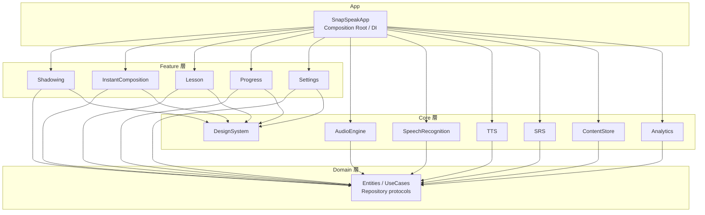
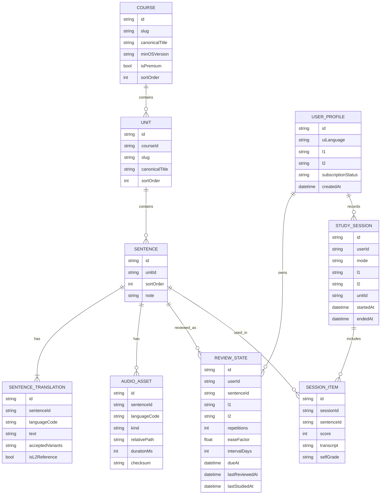

# SnapSpeak アーキテクチャ設計書

本文書は、iPhone 向け語学学習アプリ SnapSpeak の技術方針と実装の骨格を定義する。対象読者はクライアント実装・コンテンツ制作・基盤構築に関わるエンジニアである。

## 1. 概要と設計原則

SnapSpeak のコア体験は次の 2 つである。

- **シャドーイング**: お手本音声を聞きながら同時に声に出し、録音した自分の声と聞き比べる。
- **瞬間英作文（瞬間作文）**: L1 の文を見て／聞いて、制限時間内に L2 の文を口頭で作る。

展開は次の順で進める。設計は第 1 段の英語・日本人向けに閉じず、後段の拡張を最初から織り込む。

1. 英語学習・日本人向け（UI 日本語、L1=`ja`、L2=`en`）
2. 学習対象言語（L2）の拡張
3. 海外ユーザー向けグローバル展開（UI 多言語化、L1 の多様化）

### 1.1 最重要の分離

| 関心事 | 意味 | v1 の値 | 変更手段 |
| --- | --- | --- | --- |
| UI 言語 | 画面文言・日付・数値フォーマット | `ja` | String Catalog（`.xcstrings`）と Locale |
| L1 | 出題・解説・訳の提示言語（学習者の母語側） | `ja` | `LanguagePair.l1` |
| L2 | 学習対象言語（発話・お手本音声の言語） | `en` | `LanguagePair.l2` |

UI 言語と学習言語ペアは独立させる。v1 では結果としてすべて日本語／英語に揃うが、Feature 層が `NSLocalizedString` 相当の UI 文言と、コンテンツの `SentenceTranslation` を混同しないこと。

### 1.2 設計原則

- **オフラインファースト**: 学習セッションはネットワークなしで完結する。
- **コンテンツ中心**: 同じ `Sentence` をシャドーイングと瞬間作文の両方で使う。
- **音声パイプラインの抽象化**: STT / 発音評価 / TTS は protocol で差し替え可能にする。
- **端末内プライバシー既定**: 録音データはデフォルトで端末外に出さない。

## 2. 技術スタック

| 領域 | 採用 | 備考 |
| --- | --- | --- |
| 言語 | Swift 5.10+ | Swift Concurrency（`async`/`await`、`Actor`）を標準とする |
| UI | SwiftUI | iOS 17+（`Observation`、SwiftData、String Catalog を前提） |
| 最低 OS | iOS 17.0 | それ以前はサポートしない |
| 永続化 | SwiftData | 学習進捗・SRS・セッションログのローカル SoT |
| パッケージ | Swift Package Manager | マルチモジュール。CocoaPods は使わない |
| 音声 I/O | AVAudioSession + AVAudioEngine | 同時再生・録音の中核 |
| 音声認識（v1） | Speech framework（`SFSpeechRecognizer`） | オンデバイス優先 |
| TTS（v1） | `AVSpeechSynthesizer` | オフライン・追加課金なし |
| 課金 | StoreKit 2 | サブスクリプション |
| 分析 | Telemetry 抽象 + 採用 SDK | 実装は `Analytics` モジュールに閉じる |

アーキテクチャパターンは **MVVM + Repository のレイヤード構成** とする。

The Composable Architecture（TCA）は採用しない。学習コストが高く、音声セッションのような長寿命副作用（AVAudioEngine のグラフ、割り込み、ルート変更）を Reducer に載せる採用障壁が大きい。View は SwiftUI、状態は `@Observable` な ViewModel、副作用の境界は Repository / Service protocol に置く。

## 3. レイヤーとモジュール構成

依存の向きは **App → Feature → Domain ← Core** とする。Feature は Domain の protocol にのみ依存し、Core の具象型は App の Composition Root で注入する。例外は `DesignSystem` のみで、Feature から直接参照してよい。



### 3.1 モジュール責務

| モジュール | 責務 |
| --- | --- |
| `SnapSpeakApp` | `@main`、タブ構成、DI コンテナ、権限リクエストの起点、ディープリンク |
| `FeatureShadowing` | お手本再生、速度、区間リピート、同時録音、聞き比べ、一致度表示 |
| `FeatureInstantComposition` | L1 提示、制限時間、口頭回答、照合、自己判定、SRS 評価入力 |
| `FeatureLesson` | Course / Unit 一覧、学習モード選択、教材詳細 |
| `FeatureProgress` | 学習履歴、ストリーク、統計（Phase 2 で本格化） |
| `FeatureSettings` | 言語ペア、再生デバイス注意、権限、アカウント、プライバシー |
| `Domain` | `Sentence`、`LanguagePair`、UseCase、`SpeechRecognizing` 等の protocol。UIKit/AVFAudio に依存しない |
| `AudioEngine` | セッション設定、再生グラフ、録音、タップ、ファイル書き出し |
| `SpeechRecognition` | `SpeechRecognizing` の Speech framework 実装 |
| `TTS` | `TextSpeaking` の `AVSpeechSynthesizer` 実装 |
| `SRS` | SM-2 スケジューラ。永続化は Repository 経由 |
| `ContentStore` | バンドル／リモート JSON の読み込み、音声アセット解決、SwiftData への取り込み |
| `Analytics` | イベント定義と送信。ATT 状態を見て送信可否を決める |
| `DesignSystem` | Color / Typography / ボタン・波形・タイマー等の共通部品 |

パッケージはモノレポ内 `Packages/` に置き、App ターゲットがローカル Package を参照する。Feature 同士は依存しない。画面遷移が必要な場合は App が Coordinator（または SwiftUI の親 View）でつなぐ。

## 4. 音声処理

本アプリの技術的中核。すべての音声 I/O は `AudioEngine` モジュールに集約し、Feature から `AVAudioEngine` を直接触らない。

### 4.1 セッションと同時再生・録音

シャドーイングは **お手本再生とマイク録音を同時に行う** 必要がある。

- `AVAudioSession` のカテゴリは `.playAndRecord`。モードの既定は `.spokenAudio`。
- オプションは `.defaultToSpeaker`、`.allowBluetoothHFP`、`.allowBluetoothA2DP` を基本セットとする。
- 再生ノードと録音ノードを同一 `AVAudioEngine` グラフに載せ、お手本の再生開始と録音開始を同じレンダーサイクルに近づける。
- イヤホン（有線または Bluetooth）を推奨する。スピーカー再生ではお手本がマイクに回り込み、聞き比べと STT の精度が落ちる。初回シャドーイング前に案内し、Settings からも再表示できるようにする。
- スピーカー利用時のエコーキャンセリングは、`AVAudioSession` の voice processing（`.voiceChat` 相当の処理）を **オプション** として提供する。AEC は回り込みを抑える一方、録音された学習者の声質を変えるため、既定はオフ、スピーカー検出時のみオンを提案する。
- 着信・Siri・ルート変更は `AVAudioSession.interruptionNotification` と `routeChangeNotification` で扱い、学習中は一時停止して再開確認を出す。

録音フォーマットは AAC（`.m4a`）を既定とし、聞き比べ用にセッション終了までローカルファイルとして保持する。保持期間の既定は「その Unit を閉じるまで」。ユーザーが明示保存しない限り iCloud やサーバには上げない。

### 4.2 音声認識（STT）

v1 は Speech framework で実装する。

- `SFSpeechRecognizer` を使い、`requiresOnDeviceRecognition = true` を優先する。オンデバイスが使えない端末・言語ではネットワーク認識へフォールバックし、その旨を UI に出す。
- 認識言語は **L2 の BCP-47**（例: `en-US`）を渡す。UI 言語や L1 を渡さない。
- 瞬間作文は発話終了検出後のファイナル結果を正本とする。シャドーイングの一致度は、録音ファイルを事後認識した結果を使う（リアルタイム中間結果は UI フィードバックに留める）。

将来のサーバ側 STT（Whisper 系）や発音評価 API（Azure Pronunciation Assessment 等）に差し替えられるよう、Domain に次の protocol を置く。Feature は具象 SDK を import しない。

```swift
public protocol SpeechRecognizing: Sendable {
    func recognize(
        audioFileURL: URL,
        locale: Locale
    ) async throws -> SpeechRecognitionResult
}

public protocol PronunciationAssessing: Sendable {
    func assess(
        audioFileURL: URL,
        referenceText: String,
        locale: Locale
    ) async throws -> PronunciationAssessment
}

public struct SpeechRecognitionResult: Sendable {
    public let transcript: String
    public let confidence: Double?
}

public struct PronunciationAssessment: Sendable {
    public let overallScore: Double   // 0...100
    public let accuracyScore: Double?
    public let fluencyScore: Double?
    public let transcript: String
}
```

v1 の `PronunciationAssessing` 実装は、文字起こしと参照テキストの正規化マッチから簡易スコアを返すアダプタでよい。Azure 等は Phase 2 で別アダプタを追加する。

### 4.3 TTS

- v1 は `AVSpeechSynthesizer`。音声アセットが無い文のフォールバック、および瞬間作文の L1 読み上げに使う。
- 言語は L1 / L2 それぞれの BCP-47 を指定する。声の identifier は Settings で上書き可能にする。
- 将来は高品質なサーバ側 TTS で音声ファイルを事前生成し、CDN 配信する。`TextSpeaking` protocol と `AudioAsset` 解決を同じ経路に載せ、「ファイルがあればファイル、なければ TTS」とする。

```swift
public protocol TextSpeaking: Sendable {
    func speak(text: String, locale: Locale, rate: Float) async throws
    func synthesizeToFile(text: String, locale: Locale) async throws -> URL
}
```

### 4.4 シャドーイング体験

| 機能 | 仕様 |
| --- | --- |
| 再生速度 | 0.5x〜1.5x（0.1 刻み）。`AVAudioUnitTimePitch` でピッチを保ったまま変速する |
| 区間リピート | Unit 内の文、または文内のタイムスタンプ区間（アセットに word/sentence マーカーがある場合）をループ |
| 聞き比べ | お手本 → 自分の録音を連続再生。波形スクラブは v1 では文単位で十分 |
| 一致度スコア | STT の transcript と L2 参照テキストを正規化（小文字化、句読点除去、縮約展開）し、トークン単位の類似度（Levenshtein またはトークン F1）を 0–100 で表示。v1 は目安であり合否判定には使わない |

再生位置と録音位置の対応は、お手本の `playerTime` を録音ファイルのオフセットとして保存し、聞き比べ時に同じ区間を切れるようにする。

## 5. 瞬間英作文と SRS

### 5.1 出題フロー

1. 現在の `LanguagePair` と SRS キューから 1 文を取る。
2. L1 のテキストを表示し、同時に L1 音声（アセット優先、なければ TTS）を再生する。L2 テキストはデフォルト非表示（ヒントとして段階表示可）。
3. 制限時間内に口頭回答する。制限時間の既定は「L2 参照テキストの推定発話時間 × 2.0、下限 5 秒、上限 20 秒」。
4. 録音を `SpeechRecognizing` に渡し、L2 ロケールで文字起こしする。
5. 照合する。v1 は複数の正解例（参照訳 + `acceptedVariants`）との正規化マッチ、および学習者の自己判定（できた / あやしい / できなかった）を併用する。
6. 自己判定を SM-2 の quality（5 / 3 / 1）にマップして `ReviewState` を更新する。

将来（Phase 2 以降）は LLM による意味的正誤判定を `AnswerEvaluating` protocol の裏に追加する。v1 の API 形状は自己判定とルールマッチの結果を同じ `Evaluation` 型に載せておき、差し替え時に Feature を書き換えない。

### 5.2 SRS（SM-2）

`Core/SRS` は SuperMemo 2 をベースにする。

- 初期: `repetitions = 0`、`intervalDays = 0`、`easeFactor = 2.5`
- quality 0–5。v1 の自己判定マップは できた=5、あやしい=3、できなかった=1
- quality < 3 で `repetitions` を 0 に戻し、翌日再提示
- 間隔は 1 日 → 6 日 → `interval * easeFactor`
- `easeFactor` は SM-2 の式で更新し、下限 1.3

同じ `Sentence` に対する `ReviewState` は **ユーザー × LanguagePair × Sentence** で一意とする。シャドーイング完了は「接触」として `lastStudiedAt` を更新するが、既定では SRS の quality には入れない（モードを混ぜると間隔が壊れるため）。Settings で「シャドーイング完了を復習扱いにする」をオプトイン可能にする。

### 5.3 コンテンツの共有

Course / Unit / Sentence はモード非依存の教材である。Feature は「この文をシャドーイングする」「この文を瞬間作文する」という UseCase を呼ぶだけにする。教材追加は 1 回で両モードに効く。

## 6. データモデルと多言語設計

### 6.1 中心エンティティ

`Sentence` は特定の言語ペアに属さない。本文は `SentenceTranslation` の集合として持ち、各要素が BCP-47 言語コードとテキストを持つ。学習画面は `LanguagePair(l1: "ja", l2: "en")` でフィルタし、L1 提示・L2 参照・音声アセットを解決する。

階層は **Course > Unit > Sentence**。Course は「旅行英会話」のような教材セット、Unit は 10〜20 文程度の学習単位。

学習言語の追加は次を足せば成立する構造にする。画面ロジックに `if language == "en"` を書かない。

1. 各 Sentence への当該言語 `SentenceTranslation`
2. 当該言語の `AudioAsset`
3. STT / TTS に渡す Locale マッピング（言語コード → BCP-47）



補足:

- `SentenceTranslation.acceptedVariants` は JSON 配列（別表記・短縮形）を文字列で持つ。v1 の照合に使う。
- `AudioAsset.kind` は `model`（お手本）/ `slow` / `l1Prompt` を想定する。
- `StudySession.mode` は `shadowing` / `instantComposition`。
- `UserProfile.uiLanguage` と `l1` / `l2` は別フィールドである。

### 6.2 UI ローカライズ

- UI 文言は String Catalog（`.xcstrings`）のみ。Feature 内のリテラル日本語／英語は禁止（プレビュー用のダミーは除く）。
- 日付・数値・分数表示は `Locale.current`（またはユーザーが選んだ UI 言語の Locale）でフォーマットする。
- 教材タイトルは `canonicalTitle` をフォールバックとし、翻訳テーブル（Course/Unit の言語別タイトル）を Content JSON に持たせる。UI 言語と教材タイトル言語は一致しなくてよい。

## 7. データ永続化とバックエンド

### 7.1 ローカル（v1 から必須）

- SwiftData をローカルの Source of Truth にする。学習・SRS・セッションはオフラインで完結する。
- 教材マスターはアプリバンドルの JSON を初回起動で取り込み、以降はバージョン番号を見て差分適用する。
- リモート JSON（未バンドルの追加教材メタデータ）は起動時に取得を試み、失敗してもバンドル教材で学習を開始する。音声ファイルはオンデマンドキャッシュし、`AudioAsset.checksum` で検証する。

### 7.2 バックエンド導入方針

v1 はバックエンドなし（匿名ローカルプロファイル 1 つ）。Phase 2 で認証・同期・コンテンツ配信を入れる。

候補は Firebase と Supabase である。**推奨は Firebase** とする。

| 観点 | Firebase | Supabase |
| --- | --- | --- |
| iOS SDK の成熟度 | 高い（Auth、Firestore、Storage、Crashlytics） | 相対的に新しい |
| Sign in with Apple | ドキュメントと実例が豊富 | 可能だが実装例が少ない |
| オフライン同期 | Firestore のオフラインキャッシュが既存 | 自前または追加実装 |
| リレーショナルな教材 | 不向き（教材は JSON+CDN に出すため問題になりにくい） | PostgreSQL で教材管理しやすい |
| 分析・Remote Config | 同一エコシステム | 別サービスが必要 |

教材の正本は Git リポジトリ（次節）に置き、ユーザーデータ（`ReviewState`、`StudySession`、`UserProfile`）だけを Firestore に同期する。教材を Firestore に載せない。音声バイナリは Cloud Storage + CDN とする。

同期の衝突は「フィールドごとの latest-wins + `dueAt` はより早い方を採用」を既定にする。SRS を複数端末で同時学習するケースは稀で、運用で足りる。

### 7.3 コンテンツパイプライン

教材（文・訳・音声原盤）は専用リポジトリで管理する。CI が次を行う。

1. YAML / Markdown の文データをスキーマ検証する（各文に必要な言語コードが揃っているか）。
2. 正規化 JSON（Course / Unit / Sentence / Translation / Asset マニフェスト）を出力する。
3. 音声を AAC にエンコードし、パスと checksum をマニフェストに書く。
4. JSON と音声を CDN（Firebase Hosting または Cloud Storage + Cloud CDN）へ配置する。
5. アプリはマニフェストの `contentVersion` を見て差分ダウンロードする。

v1 はこの CI の成果物をアプリバンドルに同梱する。Phase 2 から同じ成果物を CDN 経由でも配る。

## 8. 課金

- StoreKit 2。商品は月額・年額のサブスクリプション（フリーミアム）。
- 無料範囲の推奨: **コース制限**（スターター Course のみ無料、追加 Course は購読）。1 日あたりの学習量制限は、オフライン学習と相性が悪く、時計改ざんにも弱いため第 2 案とする。
- 購入状態は StoreKit の Transaction を正本とし、`UserProfile.subscriptionStatus` はキャッシュする。Phase 2 のアカウント同期でも、最終判定は StoreKit（必要なら App Store Server API）に戻す。
- リストア、家族共有、猶予期間、Billing Issue を Settings で扱えるようにする。

## 9. 分析・計測

計測したいのは「継続して口を動かしているか」である。イベント例:

- `session_started` / `session_completed`（mode、LanguagePair、文数、所要時間）
- `sentence_studied`（mode、score、selfGrade。原文テキストは送らない）
- `subscription_converted`
- 継続率: D1 / D7 / D30 のセッション有無

プライバシー:

- 録音ファイル・文字起こし全文・L1/L2 の文面は分析イベントに含めない。
- App Tracking Transparency を実装する。トラッキング目的の IDFA 利用は原則しない。学習計測は ATT 不要な自社計測に留める。
- オプトアウトを Settings に置く。

## 10. CI/CD

推奨は **GitHub Actions + fastlane** を主、Xcode Cloud を補助にしない単一路線とする。理由はコンテンツリポジトリと同じ GitHub 上でアプリのテスト・署名・TestFlight を完結できるためである。

- PR: `xcodebuild test`（iOS Simulator）、SwiftLint
- `main`: TestFlight（Internal）。fastlane `pilot`
- タグ `v*`: TestFlight（External）または App Store 提出（手動 Approve）

証明書と Profile は CI の secrets で管理する。Xcode Cloud は、チームが Apple 側の UI を強く好む場合の代替であり、本設計の既定ではない。

## 11. テスト戦略

| 層 | 方針 |
| --- | --- |
| Domain / SRS | ユニットテスト必須。SM-2 の間隔、照合の正規化、LanguagePair 解決を固定データで検証する |
| Core（Audio 以外） | Content JSON のデコード、checksum、キャッシュ更新をテストする |
| 音声 I/O | 実機依存が大きいため protocol をモックする。Feature は `SpeechRecognizing` / `AudioPlaying` のフェイクで ViewModel を検証する。実機での手動チェックリストはシャドーイング同時録音とルート変更 |
| Feature | 重要な状態遷移（タイマー切れ、自己判定後の次カード、権限拒否）を ViewModel テストする |
| UI | スナップショットは DesignSystem の主要コンポーネントに限定する |

CI でマイク・Speech の結合テストは走らせない（シミュレータ権限とフレークのため）。

## 12. 非機能要件

| 項目 | 要件 |
| --- | --- |
| オフライン | 取り込み済み教材と音声キャッシュがあれば、シャドーイング・瞬間作文・SRS が動作する |
| 音声レイテンシ | 再生開始操作からお手本先頭が出るまで 200ms 未満を目標。変速は事前にノードを接続しておき、開始時に rate だけ変える |
| アクセシビリティ | Dynamic Type、VoiceOver（再生／録音ボタンはラベル必須）、Reduce Motion 時は波形アニメを静止画に |
| プライバシー | 録音の既定は端末内のみ。サーバ STT / 発音評価を使う場合は都度同意を取り、Settings から無効化できる |
| 権限 | マイクは学習開始時。音声認識は STT 利用時。通知は Phase 2 のリマインダー導入時 |
| パフォーマンス | Unit あたり同時にデコードするお手本は 1 本。先読みは次の 1 文まで |
| 障害 | STT 失敗時は自己判定のみで学習を継続できる。TTS 失敗時はテキスト出題のみ |
