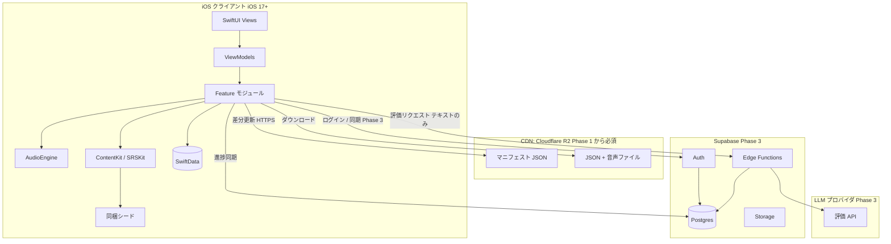
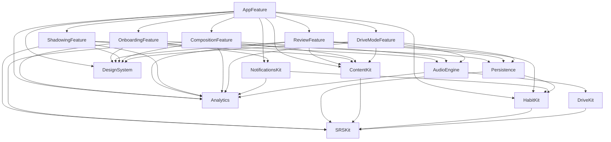
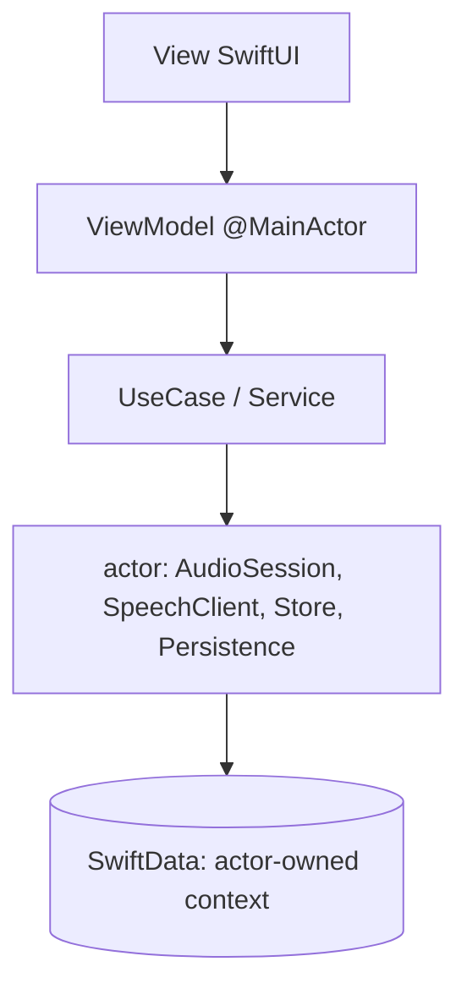
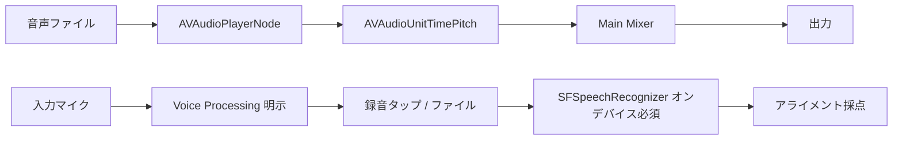
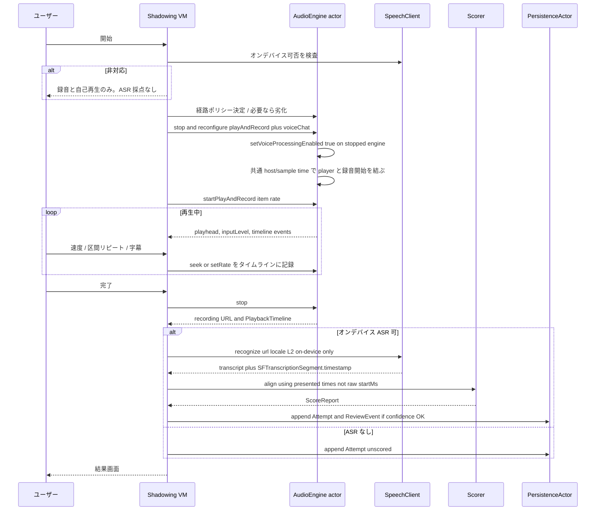
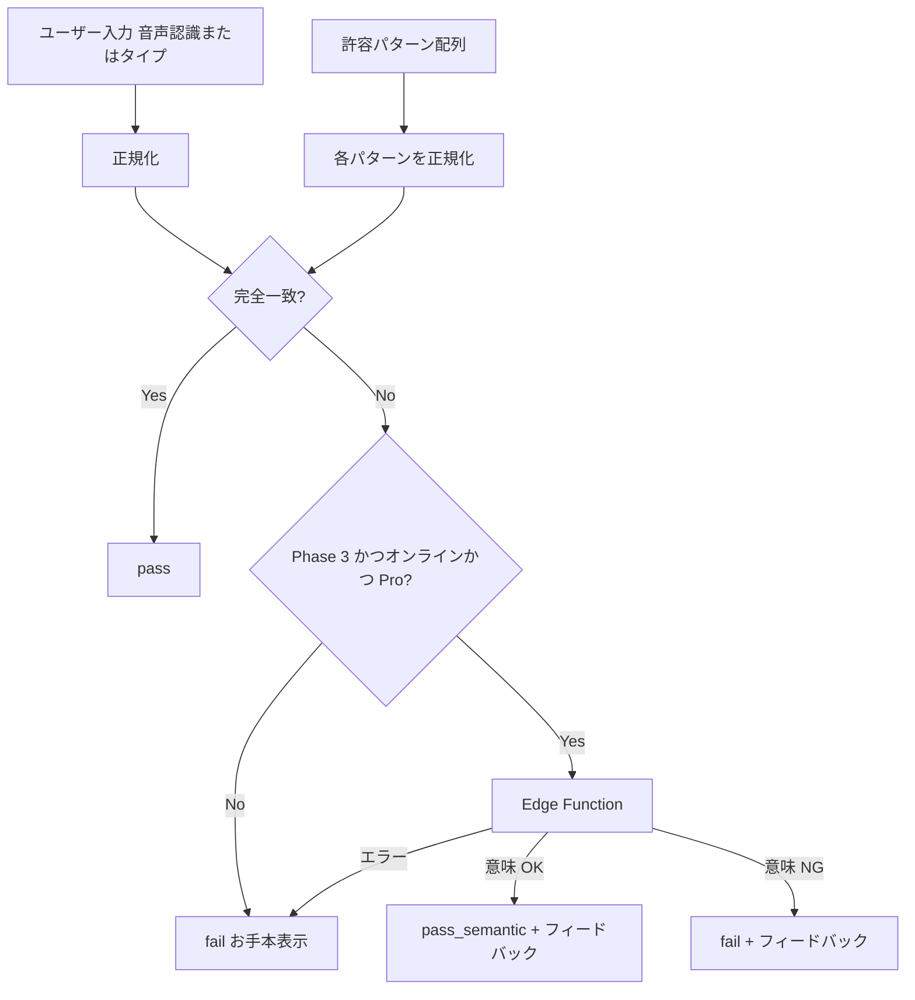
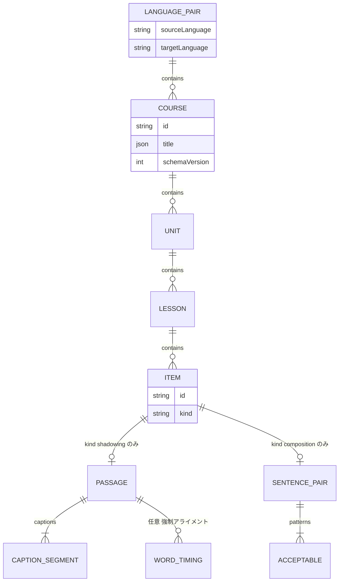
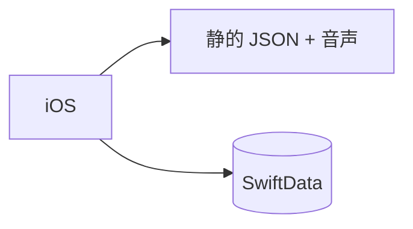

# アーキテクチャ

本書は SnapSpeak の実装方針を固定する。プロダクト意図は [product-overview.md](./product-overview.md)、**フェーズ分割は [roadmap.md](./roadmap.md) を正本**とする。ここに書いたクライアント構成・音声パイプライン・データモデル・国際化は、ロードマップの各 Phase で「後から根本変更しない」前提である。

確定判断（再掲・変更しない）:

- SwiftUI、iOS 17+、MVVM + Swift Concurrency（async/await, actor）。**TCA は採用しない**（学習コストとチーム規模）。
- ローカル永続化は SwiftData。オフラインファースト。**v1 から VersionedSchema を定義する。**
- モジュールは Swift Package 分割。
- 録音・再生は AVFoundation。音声認識は Speech framework。**オンデバイスは優先ではなく厳格な要求。** シャドーイングはサーバー認識へ暗黙フォールバックしない。
- 採点はお手本スクリプトと認識結果のトークン列アライメント（編集距離 / DP）。指標は **発音評価ではなくスクリプト一致 / 語の再現度**。
- 瞬間英作文の MVP 判定は許容パターンとの正規化マッチ。LLM は Phase 3。
- SRS は SM-2 ベースを SRSKit に独立。同期の正本は immutable な `ReviewEvent`。
- 言語ペア `(sourceLanguage, targetLanguage)` が第一級。値は正規化済み BCP-47。
- バックエンドは Phase 1 静的 CDN 配信（**Cloudflare R2** 採用。アカウントなし）→ **Phase 3 で Supabase Auth / 同期 / Edge Functions** → Phase 4 リージョン対応。Phase 2 はクライアント側の定着と StoreKit 2。

---

## 1. システム全体構成

Phase によって右側（クラウド）が増える。クライアント核は全 Phase で同じ。



### 1.1 責務分界

| 領域 | 責務 | 置かないもの |
|------|------|----------------|
| クライアント | 学習 UX、録音、オンデバイス ASR、採点、SRS 計算、オフライン学習、CDN 取得 | LLM API キー、コンテンツの正本（配信後はキャッシュ）、サーバー ASR への暗黙依存 |
| CDN（Cloudflare R2） | 公開コンテンツの静的配信、コースごとの **複数 immutable release** を含むマニフェスト | 個人学習データ |
| Supabase（Phase 3） | アカウント、進捗の正本（`ReviewEvent` 等）、Edge の秘匿プロキシ、サーバー側 entitlement、アカウント削除 | クライアントから直接叩く LLM |
| LLM（Phase 3） | 意味評価と短いフィードバック文 | 音声バイナリ、無関係な個人プロファイル |

### 1.2 通信の原則

- 学習セッション中にネットワークは **必須にしない**。採点もオンデバイスに閉じる。
- CDN は Phase 1 から「追加取得と更新」に使う。失敗時は既存ローカルおよびシードで継続。
- Phase 3 の同期と LLM は、未ログイン・オフライン・API 失敗時にコア学習を止めない。

---

## 2. クライアントのモジュール構成とレイヤリング

### 2.1 パッケージ一覧

アプリ本体（Xcode App Target）は薄く、起動・DI・Scene のみを持つ。機能は Swift Package に置く。

| モジュール | 種別 | 責務 |
|------------|------|------|
| **AppFeature** | アプリシェル | タブ/ナビ、セッション開始、依存の組み立て、ディープリンク |
| **OnboardingFeature** | 機能 | オンボーディング 2 画面と目標・リマインダーの初回保存 |
| **ReviewFeature** | 機能 | 今日のプラン組立、復習セッションのコンテナ UI（アイテム UI は注入。Feature 間 import はしない） |
| **ShadowingFeature** | 機能 | シャドーイング画面、結果、プレイヤー状態機械、劣化モード UI |
| **CompositionFeature** | 機能 | 瞬間英作文画面、入力モード、判定結果表示 |
| **AudioEngine** | インフラ | AVAudioEngine、セッション状態遷移、経路ポリシー、Voice Processing、再生速度、録音、割り込み / ルート変更 |
| **ContentKit** | ドメイン | 言語ペア、JSON スキーマ、デコーダ / マイグレーター、ダウンロード、シード、エンタイトルメント解決 |
| **HabitKit** | ドメイン | ストリーク、デイリーゴール、セッションプラン、次レッスン選定、通知予定。全て純関数。UI を持たない |
| **SRSKit** | ドメイン | SM-2 カスタム、品質算出、`ReviewEvent` からのカード再計算。UI を持たない |
| **NotificationsKit** | インフラ | `UNUserNotificationCenter` ラッパ。権限要求、予約の冪等同期、通知タップの委譲 |
| **DesignSystem** | UI | 色、タイポ、ボタン、カード、進捗リング、ストリーク表示。機能知識を持たない |
| **Analytics** | インフラ | イベント送信のプロトコルと実装。個人データ・音声を受け取らない |
| **DriveKit** | ドメイン | ドライブモードの音声スクリプト生成と進行カーソル。純関数 / 純状態機械。UI・AVFoundation を持たない |
| **DriveModeFeature** | 機能 | ドライブ開始 / グランス / ノート画面。プラン写像・未採点 Attempt 記録。`ReviewFeature` は import しない |

実装上のパッケージ分割（Phase 1）: Linux では Apple フレームワークをビルドできないため、上表のモジュールは 2 つの Swift パッケージにグルーピングする。Foundation のみの `Packages/SnapSpeakCore`（LanguageKit / ScoringKit / CompositionKit / SRSKit / ContentCore / AnalyticsCore / HabitKit / DriveKit）と、Apple 専用の `Packages/SnapSpeakiOS`（AppFeature / OnboardingFeature / ReviewFeature / ShadowingFeature / CompositionFeature / DriveModeFeature / AudioEngine / SpeechKit / ContentKit / Persistence / DesignSystem / Analytics / NotificationsKit）。各モジュールはパッケージ内の target として実現し、本節の依存方向は維持する。`ScoringKit` は採点コア（UI / Audio 非依存）。`SpeechKit` は `SFSpeechRecognizer` のオンデバイス専用ラッパである。`HabitKit` は `SRSKit`（学習日境界）のみに依存する。`DriveKit` は `SRSKit`（`Skill`）のみに依存する。

依存方向は一方向にする。



禁止:

- Feature 同士の直接 import（共有が必要なら AppFeature か小さな Domain パッケージへ上げる）。
- DesignSystem から ContentKit / SwiftData への依存。
- SRSKit から SwiftUI / AVFoundation への依存。
- AudioEngine から SwiftData への依存（録音ファイルパスは Feature が渡す）。

### 2.2 レイヤリング（各 Feature 内部）

TCA を使わない。画面は MVVM、非同期と共有可変状態は Swift Concurrency で閉じる。



| 層 | ルール |
|----|--------|
| View | 状態を持たない。バインディングと意図（Intent）の発火のみ |
| ViewModel | `@MainActor`。画面状態、ユーザー意図の解釈、UseCase 呼び出し。AVAudioEngine を直接触らない |
| UseCase | レッスン開始、採点、SRS 更新などユースケース単位。テスト可能な純関数を優先 |
| actor | オーディオグラフ、Speech 認識タスク、StoreKit キュー、永続化など「同時に一つ」の資源 |
| SwiftData | **ModelContext を actor 間で渡さない。** 専用 `@ModelActor`（または actor が所有する context）と Sendable DTO のみを境界に出す |

ViewModel のスケッチ（実装時の目安。全文ではない）:

```swift
@MainActor
final class ShadowingLessonViewModel: ObservableObject {
    enum Phase { case loading, ready, playing, scoring, scored, degradedNoASR, failed(Error) }
    @Published private(set) var phase: Phase = .loading
    @Published var captionsEnabled: Bool
    @Published var rate: Float // 0.5 ... 1.5

    func start() async { /* AudioEngine の状態遷移に従う */ }
    func stopAndScore() async { /* オンデバイス Speech → align → persist → 条件付き SRS */ }
}
```

### 2.3 ナビゲーション

- 階層は `NavigationStack`。レッスンプレイヤーはフルスクリーンカバーでもよい（録音中の誤ジェスチャ防止）。
- 画面間のデータは ID（`lessonId`, `itemId`）を渡し、大きな音声バッファは渡さない。

---

## 3. 音声処理パイプライン

シャドーイングの望ましい経路は **再生と録音の同時実行**。ただし入力タップは **デジタルミックスを避けるだけ** であり、スピーカーからマイクへの **音響回り込みは残る**。`.voiceChat` 指定だけに依存せず、経路別ポリシーと明示的な Voice Processing、劣化モードを持つ。

瞬間英作文は **録音（またはタイプ入力）と短時間のオンデバイス ASR**。

### 3.1 Audio Session の状態遷移

`.spokenAudio` は **`.playback` カテゴリ向け** であり、`.playAndRecord` と組み合わせない。

| 状態 | カテゴリ | モード | 用途 |
|------|----------|--------|------|
| `previewing` | `.playback` | `.spokenAudio` | お手本の通し聞き。高音質（有線 / A2DP を優先） |
| `shadowingLive` | `.playAndRecord` | `.voiceChat` | 同時再生・録音。Voice Processing を明示 |
| `recordOnly` | `.playAndRecord` または `.record` | `.voiceChat` または `.measurement` | 劣化モードの単独録音、瞬間英作文の発話 |
| `idle` | セッション非アクティブ | — | グラフ破棄後 |

**遷移規則:**

1. プレビュー開始前: エンジンを停止し、`.playback + .spokenAudio` で再構成する。
2. 録音（同時 / 単独）開始前: **必ず停止・再構成**して `.playAndRecord + .voiceChat` に戻す。プレビュー用グラフを使い回さない。
3. レッスン終了・割り込み確定・ルート変更: 停止して `idle` 相当まで戻す。

オプション:

- 内蔵スピーカー視聴時のみ `.defaultToSpeaker`。
- `.allowBluetoothHFP` は同時採点が必要なときだけ検討する（§3.2）。プレビューでは付けず A2DP を優先する。

サンプルレートは 48 kHz またはハードウェアネイティブ。ASR 前に 16 kHz mono へ変換してよい。

端末 TTS（`AVSpeechSynthesizer`）は補助（ヒント読み上げ、お手本欠損時のフォールバック）。MVP のお手本正本は同梱または CDN の音声ファイル。

### 3.2 経路別ポリシー

`AVAudioSession.routeChangeNotification` のたびにエンジンを **停止・再構築**する。現在の入力・出力ポートからポリシーを選ぶ。

| 経路 | 出力 | 入力 | Voice Processing | 同時再生・録音の採点 | 備考 |
|------|------|------|------------------|----------------------|------|
| 有線ヘッドセット（EarPods / USB-C 等） | ヘッドセット | ヘッドセットマイク | 有効化推奨 | 許可（既定の本線） | 回り込みが最も小さい |
| 内蔵受話口 | 受話口 | 内蔵マイク | **必須で有効** | 許可。残留エコーを実機評価 | |
| 内蔵スピーカー | スピーカー | 内蔵マイク | **必須で有効**（停止中エンジンに対して `inputNode.setVoiceProcessingEnabled(true)`） | 残留エコーを実機評価。過多なら劣化 | 入力タップだけでは混入を防げない |
| AirPods 等 Bluetooth | A2DP は高音質出力だが、HFP 入力を選ぶと **出力も HFP に落ちる** | HFP マイク | 機種依存 | **A2DP 高音質出力と AirPods マイクの同時利用は期待しない** | 同時採点が必要なら HFP 両用を受け入れ音質低下を UI に出すか、劣化モード（A2DP 再生 → 単独録音）を選ぶ |
| 他社 HFP | 窄帯域になりやすい | HFP | 機種依存 | 既定は劣化モード | 実機マトリクスで判定表を更新 |

**Voice Processing の手順（必須）:**

- 対象: 停止中の `AVAudioEngine`。動作中ノードに対して切り替えない。
- `try inputNode.setVoiceProcessingEnabled(true)` を `playAndRecord` 構成の attach 前または直後、`start` 前に呼ぶ。
- 失敗したら同時採点を無効化し、劣化モードへ。

**劣化モード（AEC 不可・混入過多・BT 制約）:**

1. お手本を最後まで（または区間を）再生する。
2. 停止してからユーザー音声だけを録音する。
3. 同時採点（再生中の重ね読み採点）は無効。遅延指標は出さないか「順次練習のため未計測」と出す。
4. オンデバイス ASR が使える場合は、単独録音に対してスクリプト一致のみ算出してよい。

### 3.3 再生速度

- 範囲 **0.5x〜1.5x**。UI は離散プリセット（0.5 / 0.75 / 1.0 / 1.25 / 1.5）。
- `AVAudioUnitTimePitch` でレート変更する。**`pitch` プロパティは 0 = 0 cents（音高を変えない）**。セミトーン単位ではない。
- 字幕ヘッドはコンテンツの原速秒ではなく、§3.6 の **再生タイムライン**（実際に端末から提示された時刻）に同期する。

### 3.4 パイプライン構成（シャドーイング）



録音はミキサー出力ではなく **入力ノード** から取る。これはお手本の **デジタル混入** を避けるためであり、音響エコーの除去ではない。エコーは Voice Processing と経路選択で扱う。

### 3.5 シーケンス（シャドーイング 1 試行）



### 3.6 再生タイムラインと遅延計算

コンテンツ JSON の `captionSegments` は字幕・区間リピート用であり、**語単位でも全文カバーでもない**ことがある。速度変更・シーク・リピート後は、原音源の `startMs` と実際の再生時刻は一致しない。したがって遅延を `startMs` の引き算で出してはならない。

**コンテンツ側（分離フィールド）:**

| フィールド | 用途 | 必須 |
|------------|------|------|
| `captionSegments[]` | 字幕ハイライト、文単位リピート境界 | シャドーイング Item は必須 |
| `wordTimings[]` / `tokenTimings[]` | 強制アライメント済みの語 / トークン境界（原速） | 精密遅延に必須。無くてもレッスン可 |

**実行時（PlaybackTimeline）:**

- 録音開始と `AVAudioPlayerNode` の再生開始を、共通の **host time / sample time** に結ぶ（`playerNode.play(at: AVAudioTime)` と録音ファイルの開始を同じ `AVAudioTime` にする）。
- 次をイベント列として記録する: 開始、一時停止、再開、速度変更、シーク、区間リピート、停止。各イベントに host time と、その瞬間の **原速位置（秒）** と **提示レート** を残す。
- 「時刻 T に端末から提示されていた原速位置」をタイムラインから復元する関数を単一実装にする。

**遅延（語タイミングがある教材）:**

1. `SFTranscriptionSegment.timestamp`（final なセグメント。部分結果は使わない）を録音開始相対の秒とする。
2. それを host time に変換し、タイムラインで「そのとき実際に鳴っていたお手本の原速位置」を求める。
3. アライメントで対応した参照トークンの `wordTimings` 原速時刻との差が遅延。

\[
\mathrm{delay}_i = t^{\mathrm{ASR}}_i - t^{\mathrm{presented}}_i
\]

ここで \( t^{\mathrm{presented}}_i \) はコンテンツの生 `startMs` ではなく、タイムライン上でそのトークンが **実際に提示された時刻**。

**語タイミングが無い教材:** 遅延機能を **文単位の概算** に落とす（当該 `captionSegment` の提示開始と、その区間に落ちた最初の ASR セグメント時刻の差）。UI に「概算」と出す。タイムラインが欠けている（劣化の順次録音など）場合は遅延指標自体を出さない。

### 3.7 Speech framework（オンデバイス必須）

`requiresOnDeviceRecognition = true` は **優先ではなく厳格な要求**。`supportsOnDeviceRecognition == false` のときにサーバー認識へ暗黙移行すると、オフライン保証とプライバシー方針が破れる。

Phase 1 開始前チェック（すべて満たさなければシャドーイング ASR はオフ）:

1. `SFSpeechRecognizer.supportedLocales()` に解決済み L2 ロケールが含まれる
2. `SFSpeechRecognizer(locale:)` が non-nil で初期化できる
3. `supportsOnDeviceRecognition == true`
4. `isAvailable == true`

**シャドーイング:** 上記を満たさない、または認識中に unavailable になった場合、**サーバーフォールバックしない**。UX は「録音・自己再生のみ、ASR 採点なし」。タイプ入力はシャドーイングの代替にしない。

**瞬間英作文:** 同様にサーバー ASR は使わない。発話判定ができないときはタイプ入力へ切り替える。

| 制約 | 方針 |
|------|------|
| 対応ロケール | Phase 1 は `en-US` を公式サポート。解決表は `SpeechLocaleResolver`。未掲載ロケールは ASR オフ |
| オンデバイス可否 | 端末 / OS / 言語で異なる。起動時とレッスン入場時に再読込 |
| 認識サービス unavailable | 採点を中止し劣化。リトライはユーザー操作 |
| キャンセル | レッスン離脱・ルート変更で `SFSpeechRecognitionTask.cancel()` |
| タイムアウト | 録音長 + 余裕秒。超過はエラー、部分結果で確定しない |
| 長さ上限 | オンデバイスでも数十秒〜約 1 分が上限近傍。**教材は 15〜45 秒を目標、50 秒超は分割**（30〜60 秒素材を上限際で入稿しない） |
| サーバー認識時の制限 | 本アプリは使わない。もし将来別判断するならネットワーク必須・時間上限・プライバシー再審査が前提 |
| 結果 | `bestTranscription` の **final** セグメントのみ。`confidence` を保存 |
| 並列 | 認識タスクは 1 レッスン 1 アクタに直列化 |

権限とできること:

| マイク | Speech | シャドーイング | 瞬間英作文 |
|--------|--------|----------------|------------|
| 拒否 | 任意 | お手本再生のみ。録音しない | タイプ入力 |
| 許可 | 拒否 | 録音・自己再生可。ASR 採点なし | タイプ入力 |
| 許可 | 許可 | 通常または経路による劣化 | 発話またはタイプ |

拒否時は設定アプリ（`UIApplication.openSettingsURLString`）への導線を出し、`scenePhase` が active に戻ったときとレッスン入場時に再判定する。

### 3.8 瞬間英作文の音声

- 短い発話。VAD 相当は「無音閾値 + 最大秒数」（上限は Speech 制約より十分短く）。
- 認識完了後に正規化マッチ。お手本音声の再生は任意（正解提示時）。
- 正解音声を鳴らす前に、録音グラフを停止し、必要なら `.playback + .spokenAudio` へ再構成してよい。

### 3.9 オーディオ復旧

`interruptionNotification` だけでは不足する。AudioEngine アクタが次を独占購読し、いずれも **停止 → 再構築**（必要ならセッション再設定）する。

| 通知 / 事象 | 動作 |
|-------------|------|
| `AVAudioSession.interruptionNotification` | 開始で pause。ended かつ `shouldResume` ならユーザー確認のうえ再開、または最初から |
| `AVAudioSession.routeChangeNotification` | エンジン停止・再構築。経路ポリシー再評価 |
| `AVAudioSession.mediaServicesWereResetNotification` | セッションとエンジンをゼロから作り直す |
| `AVAudioEngineConfigurationChange` | グラフを再 attach。動作中なら停止が先 |
| ヘッドセット抜去 | スピーカー経路へ。同時採点が不可なら劣化モードへ落とす |
| サンプルレート / バッファ長の変更 | 再構築。録音ファイルのフォーマットを混在させない |

実機確認マトリクス（Phase 1 DoD）: 内蔵スピーカー、内蔵受話口、有線ヘッドセット、AirPods（A2DP/HFP の差）、他社 HFP、着信、Siri。

---

## 4. シャドーイング採点アルゴリズム

目的は「お手本 **スクリプト** に対して、ASR が復元した語が何を覆い、何を飛ばし、どこで詰まったか」を返すこと。**発音評価（音素・韻律・ネイティブらしさ）ではない。** 音素レベル DNN は対象外。

UI・分析・SRS の主指標名は **スクリプト一致率**（内部: `scriptMatchRate`）。補助として **語の再現度**（Recall）と呼ぶ。マーケティングや結果画面で「発音スコア」と書かない。

### 4.1 前処理

1. お手本スクリプト（L2）と ASR 仮説を、言語別トークナイザに通す。
2. 正規化: 小文字化（ケースを持つ文字体系）、句読点除去、Unicode 正規化（NFC）、縮約の展開（英語）。
3. フィラーリスト（`uh`, `um` など。L2 ロケール別）は **言い淀みカウント** に回し、アライメントの参照列からは除外してもよい。

英語トークン例:

```
don't you think it's...  →  do not you think it is
```

言語別ストラテジ（Phase 3 で L2 追加時。Phase 1 は英語空白分割）:

| 言語 | トークナイザ | やってはいけないこと |
|------|--------------|----------------------|
| `en` など空白区切り | 正規化 + 空白 / 句読点分割 | |
| `ja` | 形態素または文字 N-gram（採用を入稿時に固定） | 中国語・韓国語と同一実装にしない |
| `zh-Hans` / `zh-Hant` | 文字または単語セグメンテーション（スクリプト別に辞書を分ける） | `zh` だけに潰して簡体・繁体を混ぜない |
| `ko` | 空白区切りの語節を基本とし、必要なら形態素。**中国語の文字 unigram 処理にまとめない** | 「CJK」一括ストラテジ |

```swift
protocol Tokenizer: Sendable {
    func tokenize(_ text: String, language: BCP47Language) -> [Token]
}
struct Token: Equatable, Sendable {
    var surface: String
    var normalized: String
    var startMs: Int?
    var endMs: Int?
}
```

### 4.2 アライメント（編集距離 DP）

参照トークン列 \(R = r_1..r_n\)、仮説 \(H = h_1..h_m\)。

コスト:

- 一致: \(r_i = h_j\)（正規化後）で 0
- 置換: 1
- 削除（抜け: 参照にあるが仮説に無い）: 1
- 挿入（余分: 言い直し・挿入語）: 1

標準 Levenshtein でバックトレースし、操作列を得る。

スクリプト一致率（語の再現度 / Recall 寄り）:

\[
\mathrm{scriptMatchRate} = \frac{\#\mathrm{equal}}{\max(n, 1)}
\]

補助:

- **Precision** = equal / max(m, 1)（余分な発話が多いと下がる）
- **Recall** = equal / max(n, 1)（抜けが多いと下がる。表示の主指標と同義）

Precision は「言い淀み・繰り返し」の説明に使う。

### 4.3 抜け・言い淀み

| 現象 | DP 上の定義 | UI |
|------|-------------|-----|
| 抜け | 削除操作が連続、または単発 | お手本字幕で当該トークンを警告。色に加え下線や記号を使う |
| 言い淀み | 同一正規化トークンの挿入繰り返し、またはフィラー | 「繰り返し」バッジ（テキスト） |
| 置換 | 別単語 | お手本と認識を並べて表示（認識テキストは結果画面のみ。分析には送らない） |

### 4.4 WPM

単語（またはトークン）数 / 発話時間（分）。発話時間は録音の実長から先頭末尾無音をトリム。言語別の定義は Tokenizer に合わせる。

### 4.5 遅延

§3.6 に従う。コンテンツの生 `startMs` や等間隔配置を精密遅延の正としては使わない。

### 4.6 スコアレポート（永続化用）

```swift
struct ShadowingScore: Codable, Sendable {
    var payloadSchemaVersion: Int  // 例: 1
    var scriptMatchRate: Double    // 0...1 語の再現度。発音精度ではない
    var precision: Double
    var recall: Double
    var omissions: [AlignedSpan]
    var hesitations: Int
    var substitutions: Int
    var wpm: Double
    var delayMsMedian: Int?
    var delayGranularity: DelayGranularity // word | sentenceApproximate | unavailable
    var asrOnDevice: Bool              // 常に true。false のスコアは作らない
    var meanConfidence: Double?        // SFTranscriptionSegment.confidence の平均
    var minConfidence: Double?
    var audioRoute: AudioRouteSnapshot // 入出力ポート、HFP か否か、voiceProcessing
    var playbackRate: Float
    var simultaneousPlayAndRecord: Bool
}

enum DelayGranularity: String, Codable { case word, sentenceApproximate, unavailable }
```

### 4.7 閾値校正と低 confidence

初期しきい値（§6.3）は仮置きである。次を含む **固定音声コーパス** で校正してから SRS 自動更新に使う。

- 日本人英語話者の読み上げ
- 騒音（通勤相当）
- スピーカー経路でのお手本混入残り
- 有線ヘッドセットのクリーン録音
- 意図的な抜け・言い淀み

**低 confidence:** `minConfidence` または `meanConfidence` がポリシー閾値未満のとき:

- スクリプト一致率は参考表示してよい
- **SRS を自動更新しない**
- 「聞き取りの自信が低い」と出し、ユーザーが「この結果で復習に使う / 使わない」を選べるようにする（Phase 1 は使わない＝更新しないでよい。訂正 UI は Phase 1 でも最小の確認ダイアログで可）

---

## 5. 瞬間英作文の判定フロー

MVP は **複数許容解答との正規化マッチング**。意味同等の自由判定は Phase 3 の LLM。



Phase 1 は菱形 LLM が常に No。Pro 判定は Phase 3 では **サーバー側 entitlement** でも強制する。

### 5.1 正規化規則（英語 L2、Phase 1）

順序を固定し、単体テストする。

1. `NFKC` 相当の互換正規化（全角英数を半角へ）
2. 小文字化
3. スマートクォートを ASCII へ
4. 句読点除去（アポストロフィは縮約処理の前は保持）
5. 縮約展開テーブル（例）:
   - `don't` → `do not`
   - `it's` → `it is`（`it has` は許容パターン側で別解を用意）
   - `I'm` → `i am`
   - `won't` → `will not`
   - `can't` → `cannot` および `can not` の両パターンをゴールドに置くか、正規化で `can not` に寄せる（**テーブルを一箇所に固定**）
6. 連続空白の圧縮、トリム

冠詞 `a/an/the` の欠落は **不一致**（意味が変わりうるため）。助動詞の丁寧体はゴールドパターンでカバーする。

### 5.2 照合

```swift
enum CompositionGrade {
    case pass(kind: CompositionPassKind)  // normalizedMatch（Phase 3 で semantic を追加）
    case fail
    case unscored  // Speech 拒否・ASR 不可・認識エラー・空の認識結果。「不一致」ではない
}

func grade(input: String, acceptable: [String], language: BCP47Language) -> CompositionGrade {
    let hyp = normalize(input, language: language)
    let refs = acceptable.map { normalize($0, language: language) }
    if refs.contains(hyp) { return .pass(kind: .normalizedMatch) }
    return .fail
}
```

部分一致・編集距離しきい値は MVP では入れない。近い誤答のヒントは Phase 3 の LLM に任せる。

`.unscored` は照合器ではなく UseCase 層が付与する（ASR が使えない・認識が空のとき）。`.unscored` は `LessonAttempt` のみ追記し、`.fail` の `ReviewEvent` を書かない（認識失敗を学習失敗として SRS に流さない）。

瞬間英作文の Attempt `payloadJSON` は型付き Codable。`v0.1.0` タグには旧形式（`payloadSchemaVersion` 文字列 + `passed`）が実在するため、現行は **v2**（外側の `LessonAttemptWrite.payloadSchemaVersion` も 2）。v1 は decode 互換で保持する。

```swift
struct CompositionAttemptPayload: Codable, Sendable {
    var payloadSchemaVersion: Int  // 2（現行）。v1 fixture は 1 のまま decode
    var result: String             // "pass" | "fail" | "unscored"
    var usedHint: Bool
    var latencyMs: Int
}
```

### 5.3 応答時間

- `t0`: L1 文が画面に出た時刻
- `tSpeak`: 録音開始（タイプなら初キー）
- `tEnd`: 認識確定または送信

SRS には `tEnd - t0` を使う。極端な値（アプリを裏に出した）は上限でクリップ。

### 5.4 Phase 3 LLM 評価

クライアント → Edge Function ペイロード（最小）:

```json
{
  "languagePair": { "source": "ja", "target": "en" },
  "promptL1": "会議は延期になりました。",
  "acceptable": ["The meeting has been postponed.", "The meeting was postponed."],
  "hypothesis": "The meeting postponed.",
  "idempotencyKey": "attempt-uuid"
}
```

応答:

```json
{
  "verdict": "near_pass",
  "score": 0.7,
  "feedback": "完成した文にするには has been が必要です。"
}
```

- 音声は送らない。
- キーは Edge 側。JWT 必須。レート制限。同一 `idempotencyKey` はキャッシュ。
- 失敗時は MVP 判定のまま。
- 回数制限は Edge が App Store Server Notifications / API 由来の entitlement を見て強制する。クライアントの `EntitlementCache` だけに頼らない。
- **プロバイダ方針**: 本タスクは定型の添削処理であり、軽量モデル（Gemini Flash 級）を前提にコスト・レイテンシを優先する。Edge Function 内にプロバイダ抽象を 1 枚挟んで差し替え可能にし、正式選定は Phase 3 着手時に最新の価格・品質で行う。

---

## 6. SRS 設計（SRSKit）

独立モジュール。UI・Audio・ネットワークに依存しない。アルゴリズムは SM-2 をベースにカスタム。

### 6.1 対象アイテムとキー

カードキーは衝突と教材改訂に耐えること。

```
cardKey = languagePair + ":" + courseId + ":" + itemId + ":" + skill
```

- `itemId` は **コース内一意を必須**とし、可能なら全コンテンツでグローバル一意（例: ULID）。名前空間として必ず `courseId` をキーに含める。
- `skill`: `shadowing` | `composition`
- `contentRevision` をカードとイベントに持つ。改訂時の継承: 本文・許容パターン・音声が互換なら `inheritSRS: true` で状態を引き継ぐ。非互換なら新規カード（旧イベントは残す）。

### 6.2 SM-2 の保持値（派生スナップショット）

`SRSCard` は同期の正本ではない。正本は追記専用の `ReviewEvent`（§7.3）。カードはイベント列を **サーバー revision 順（未同期は `clientSeq`）** で畳み込んだ結果である。

```swift
struct SRSState: Codable, Equatable, Sendable {
    var easiness: Double     // EF, 初期 2.5, 下限 1.3
    var intervalDays: Int
    var repetitions: Int
    var dueAt: Date          // 絶対時刻。表示は学習日境界で解釈
    var lastReviewedAt: Date?
    var lastQuality: Int?    // 0...5
    var contentRevision: Int
}
```

更新（品質 q = 0...5）は従来の SM-2 式。`dueAt` の日付解釈は §6.4。

- \(EF' = EF + (0.1 - (5-q)\times(0.08+(5-q)\times0.02))\)
- \(EF' < 1.3\) なら 1.3
- q < 3 なら `repetitions = 0`、次回は §6.4 の失敗ルール
- q ≥ 3: repetitions 0 → 1 日、1 → 6 日、else `round(interval * EF')`

### 6.3 品質 q の自動算出

ユーザーに 0-5 を選ばせない。正答（またはスクリプト一致率）と応答速度、ASR confidence から決める。

**下記秒数・ミリ秒は初期仮値であり、実データと固定コーパスで校正する。** `GradingPolicy` は言語・発話長（トークン数）・confidence 帯で分岐する。ハードコードした 4 秒 / 12 秒 / 800 ms を全言語の最終値にしない。

**瞬間英作文（英語・短文の初期ポリシー例）**

| 条件 | q |
|------|---|
| スキップ / 無回答 | 0 |
| fail | 1 |
| pass かつ応答が遅い | 3 |
| pass かつ通常 | 4 |
| pass かつ速い、かつヒント未使用 | 5 |
| ヒント使用で pass | 3 を上限 |
| ASR confidence 低 | 自動更新しない（q を書かない） |

初期仮: 英語 12 トークン未満は速い ≤ 4s、遅い ≥ 12s。校正後に差し替える。

**シャドーイング（初期ポリシー例）**

| scriptMatchRate | 遅延中央値 | q 目安 |
|-----------------|------------|--------|
| < 0.4 | any | 1 |
| 0.4..<0.6 | any | 2 |
| 0.6..<0.8 | 大きい | 3 |
| 0.6..<0.8 | 小さい | 4 |
| ≥ 0.8 | 大きい | 4 |
| ≥ 0.8 | 小さい | 5 |
| confidence 低 / 同時採点なし | — | 自動更新しない |

「大きい遅延」の初期仮は 800 ms。語タイミング無しの概算遅延は、校正が終わるまで q の入力に使わない（スクリプト一致率のみ）。

### 6.4 学習日境界・最小間隔・タイムゾーン

| 項目 | 固定値 |
|------|--------|
| 学習日の境界 | **ローカル時刻 04:00**。4:00 未満は前日の学習日。Anki と同様の「夜更かしを同日にする」ため |
| 成功時の `dueAt` | 境界合わせした「翌々…学習日の 04:00」 |
| 失敗時（q < 3） | **最小再学習間隔 10 分**（同一セッションで即再提示しない）。学習日としては **次の学習日 04:00** を `dueAt` に残す。同日再挑戦は `relearnGateAt` 到達で許可し、`dueAt` が未来でもキューに含める |
| カレンダー | 端末の現在タイムゾーン。`dueAt` は UTC 絶対時刻で保存 |
| タイムゾーン変更 | 過去の `ReviewEvent` は書き換えない。「今日」の判定だけ新タイムゾーンの 04:00 境界で行う。大きなジャンプで due が一斉到来しても 1 セッション上限 n 件で削る |
| 時計改ざん | 未来へ飛ばした `reviewedAt` は同期時にサーバー時刻でクリップ（Phase 3） |

### 6.5 キュー

Phase 1: レッスン内で、confidence が十分なときだけ `ReviewEvent` を追記しカードを再計算。専用キュー UI は任意。

Phase 2: 通常カードは `dueAt <= now`、失敗カードは `relearnGateAt <= now` を skill 混在で取り、1 セッション上限 n 件（`HabitKit.SessionPlanner`、既定 20）。新規未学習は Course 順のレッスンが担当（`HabitKit.NextLessonSelector`）。

### 6.6 純関数インタフェース

```swift
enum ReviewQuality: Int { case blackout = 0, fail = 1, hard = 2, pass = 3, good = 4, easy = 5 }

struct SRSEngine: Sendable {
    var policy: GradingPolicy

    /// tokenCount / language で GradingPolicy の速度帯を選ぶ（§6.3 の校正方針）。
    /// skipped は q=0（blackout）。confidence が帯の下限未満なら nil（自動更新しない）。
    func qualityForComposition(
        pass: Bool, latencyMs: Int, usedHint: Bool, confidence: Double?,
        tokenCount: Int, skipped: Bool, language: BCP47Language?
    ) -> ReviewQuality?

    /// 同時採点でない・confidence 欠落（空 ASR）・confidence 低は nil。
    func qualityForShadowing(score: ShadowingScoreSnapshot) -> ReviewQuality?

    func fold(events: [ReviewEventDTO], now: Date, calendar: Calendar, dayBoundaryHour: Int) -> SRSState
}
```

`qualityFor*` が `nil` のときはイベントを書かない。乱数なし。テストは固定 `now`。`ShadowingScoreSnapshot` は §4.6 の `ShadowingScore` から SRS 判定に必要な列だけを写像した core 側の Sendable 値。

### 6.7 同期モデル（Phase 3）— LWW を SRS に使わない

複数端末でカードを LWW すると、一方の復習が消える。

- **正本:** immutable な `ReviewEvent`。UUID で冪等 insert。
- **カード:** サーバーが付けた `revision`（単調）順に fold した派生スナップショット。クライアントは表示用に同じ関数で再計算してよい。
- **設定:** フィールド別に `revision` を持ち、フィールド単位で新しい方を採用する。
- **削除:** 行を物理削除せず tombstone（`deletedAt` + revision）。
- **学習履歴 (`LessonAttempt`)** も追記型。UUID 冪等。

---

## 7. データモデル

### 7.1 コンテンツ階層

Item は **どちらか一方**（JSON Schema の `oneOf`）。両方所持も両方なしも不正。



- Course > Unit > Lesson > Item
- `kind: shadowing` のとき `passage` 必須、`sentencePair` 禁止
- `kind: composition` のとき `sentencePair` 必須、`passage` 禁止
- タイトルは **ローカライズ辞書 `title`** に統一する（`titleKey` は使わない）

JSON Schema 上の排他（概念）:

```json
{
  "oneOf": [
    {
      "properties": {
        "kind": { "const": "shadowing" },
        "passage": { "$ref": "#/$defs/passage" }
      },
      "required": ["id", "kind", "passage", "audio"]
    },
    {
      "properties": {
        "kind": { "const": "composition" },
        "sentencePair": { "$ref": "#/$defs/sentencePair" }
      },
      "required": ["id", "kind", "sentencePair"]
    }
  ]
}
```

### 7.2 コンテンツ JSON スキーマ例

配信・シードともこの形。`schemaVersion` は整数。

**未知の高い `schemaVersion` は無視せず拒否する。** 既存のローカル版（前 revision）を維持し、更新 UI に「アプリの更新が必要」と出す。既知バージョン間は **明示的なデコーダ / マイグレーター** を用意する（柔軟 Decodable で将来破壊を飲み込む、とはしない）。未知のオプショナルフィールドのみ、同一 schemaVersion 内で無視してよい。

言語フィールドは正規化済み BCP-47（script を含んでよい）。`zh` 単体で簡体・繁体を表さない。

```json
{
  "schemaVersion": 1,
  "id": "course_daily_ja_en",
  "languagePair": { "sourceLanguage": "ja", "targetLanguage": "en" },
  "title": { "ja": "日常英会話", "en": "Daily English" },
  "units": [
    {
      "id": "unit_01_greetings",
      "title": { "ja": "あいさつ", "en": "Greetings" },
      "lessons": [
        {
          "id": "lesson_01_shadowing",
          "mode": "shadowing",
          "items": [
            {
              "id": "crs_daily_ja_en_item_p_001",
              "kind": "shadowing",
              "audio": {
                "relativePath": "audio/item_p_001.m4a",
                "durationMs": 28000,
                "checksumSha256": "…"
              },
              "passage": {
                "text": "Hi, I'm running a bit late. Could we start in ten minutes?",
                "captionSegments": [
                  { "startMs": 0, "endMs": 2100, "text": "Hi, I'm running a bit late." },
                  { "startMs": 2100, "endMs": 4200, "text": "Could we start in ten minutes?" }
                ],
                "wordTimings": [
                  { "startMs": 0, "endMs": 400, "text": "Hi" },
                  { "startMs": 450, "endMs": 700, "text": "I'm" }
                ]
              }
            }
          ]
        },
        {
          "id": "lesson_02_composition",
          "mode": "composition",
          "items": [
            {
              "id": "crs_daily_ja_en_item_c_001",
              "kind": "composition",
              "sentencePair": {
                "l1": "少し遅れます。10分後に始められますか。",
                "acceptable": [
                  "I'm running a bit late. Could we start in ten minutes?",
                  "I'm a little late. Can we start in ten minutes?",
                  "I am running a bit late. Could we start in 10 minutes?"
                ]
              },
              "audio": {
                "relativePath": "audio/item_c_001.m4a",
                "durationMs": 5000,
                "checksumSha256": "…"
              }
            }
          ]
        }
      ]
    }
  ]
}
```

型スケッチ:

```swift
struct BCP47Language: Codable, Hashable, Sendable {
    var raw: String // 正規化済み。例 "ja", "en", "es", "zh-Hans", "zh-Hant", "ko"
}

struct LanguagePair: Codable, Hashable, Sendable {
    var sourceLanguage: BCP47Language
    var targetLanguage: BCP47Language
}

enum ItemKind: String, Codable { case shadowing, composition }

struct CaptionSegment: Codable, Sendable {
    var startMs: Int
    var endMs: Int
    var text: String
}

struct WordTiming: Codable, Sendable {
    var startMs: Int
    var endMs: Int
    var text: String
}
```

### 7.3 マニフェスト（複数 immutable release）

1 コース 1 URL では旧アプリ向けファイルを選べない。コースは **複数の不変リリース** を並列で持ち、それぞれに `schemaVersion` / `minAppVersion` / 任意の `maxAppVersion` を付ける。

```json
{
  "manifestSchemaVersion": 1,
  "generatedAt": "2026-08-21T00:00:00Z",
  "courses": [
    {
      "id": "course_daily_ja_en",
      "languagePair": { "sourceLanguage": "ja", "targetLanguage": "en" },
      "releases": [
        {
          "releaseId": "course_daily_ja_en__r2",
          "revision": 2,
          "schemaVersion": 1,
          "minAppVersion": "1.0.0",
          "maxAppVersion": null,
          "contentUrl": "https://cdn.example.com/courses/course_daily_ja_en/r2/index.json",
          "bytes": 184320,
          "checksumSha256": "…",
          "inheritSRS": true
        },
        {
          "releaseId": "course_daily_ja_en__r3",
          "revision": 3,
          "schemaVersion": 2,
          "minAppVersion": "1.4.0",
          "maxAppVersion": null,
          "contentUrl": "https://cdn.example.com/courses/course_daily_ja_en/r3/index.json",
          "bytes": 190000,
          "checksumSha256": "…",
          "inheritSRS": false
        }
      ]
    }
  ]
}
```

クライアント選択アルゴリズム:

1. 端末のアプリバージョンと、実装済みデコーダが知る `schemaVersion` 集合を取る。
2. 各コースについて、`minAppVersion <= appVersion` かつ (`maxAppVersion` 無し or `appVersion < maxAppVersion`) かつ schema 既知の release を残す。
3. その中で `revision` 最大を選ぶ。
4. 条件に合う release が無く、ローカルに旧版があれば **それを維持**（高 schema を読んで部分無視しない）。
5. ダウンロードは temp へ **atomic staging** → チェックサム → 差し替え。失敗時は旧ディレクトリを残す。

代替運用: 対応 schema ごとにバージョン付きマニフェスト URL（`/manifest/v1.json`）を分離してもよい。クライアントは自分の世代の URL だけを見る。どちらか一方を Phase 1 で実装し、ドキュメントとコードを一致させる。**本設計の正は「1 マニフェスト内の複数 release」**とする。

差分更新: ファイル単位パッチは Phase 1 必須としない（release ディレクトリの置き換え）。

### 7.4 SwiftData スキーマ案

コンテンツ正本は JSON ファイル（シード bundle または Application Support 配下のダウンロード）。SwiftData は **ユーザー状態とキャッシュ索引**。

**v1 から `VersionedSchema` を定義する**（Phase 2 に延期しない）。

`v0.1.0` タグ以降は Attempt / ReviewEvent の `payloadJSON` 形を変えるとき、外側の `payloadSchemaVersion` と内側の版数を上げて旧版を decode（または透過保持）する。V1 ペイロードを直接拡張して互換を捨ててはならない。

SwiftData の `SnapSpeakSchemaV1`（`versionIdentifier` 1.0.0）へフィールドを直接追加してよいのは、ストアを配る前に限る（`SnapSpeakMigrationPlan` のステージは増やさない）。**ストアを配ったあとのスキーマ変更は VersionedSchema の増分と `SchemaMigrationPlan` ステージ追加を必須とする。**

```swift
enum SnapSpeakSchemaV1: VersionedSchema {
    static var versionIdentifier: Schema.Version { .init(1, 0, 0) }
    static var models: [any PersistentModel.Type] {
        [DownloadedCourse.self, LessonAttempt.self, ReviewEvent.self, SRSCard.self, UserSettings.self, EntitlementCache.self]
    }
}

@Model final class DownloadedCourse {
    @Attribute(.unique) var courseId: String
    var sourceLanguage: String
    var targetLanguage: String
    var revision: Int
    var schemaVersion: Int
    var releaseId: String
    var localPath: String
    var downloadedAt: Date
    var bytes: Int64
    var checksumSha256: String
}

@Model final class LessonAttempt {
    @Attribute(.unique) var id: UUID
    var courseId: String
    var lessonId: String
    var itemId: String
    var contentRevision: Int
    var languagePairKey: String
    var skill: String
    var createdAt: Date
    var durationMs: Int
    var payloadSchemaVersion: Int
    var payloadJSON: Data            // 追記後イミュータブル
}

@Model final class ReviewEvent {
    @Attribute(.unique) var id: UUID // 同期の冪等キー
    var cardKey: String
    var courseId: String
    var itemId: String
    var contentRevision: Int
    var skill: String
    var quality: Int
    var reviewedAt: Date
    var clientSeq: Int64
    var serverRevision: Int64?
    var payloadSchemaVersion: Int
    var payloadJSON: Data
}

@Model final class SRSCard {
    @Attribute(.unique) var cardKey: String
    var sourceLanguage: String
    var targetLanguage: String
    var courseId: String
    var itemId: String
    var skill: String
    var contentRevision: Int
    var inheritSRS: Bool
    var easiness: Double
    var intervalDays: Int
    var repetitions: Int
    var dueAt: Date
    var relearnGateAt: Date?         // 失敗後 10 分ゲート（SRSState.relearnGateAt）
    var lastReviewedAt: Date?
    var lastQuality: Int?
    var foldedThroughRevision: Int64?
}

@Model final class UserSettings {
    var sourceLanguage: String
    var targetLanguage: String
    var captionsEnabled: Bool
    var defaultRate: Float
    var reminderHour: Int?
    var reminderMinute: Int          // リマインド分。時は reminderHour。OFF でも時刻は保持
    var reminderEnabled: Bool        // 既定 false（オンボーディングで opt-in）
    var dailyGoalItems: Int          // 1 日の目標アイテム数。既定 10
    var onboardingCompletedAt: Date? // nil = 未完了
    var lastKnownStreakDays: Int     // 最後に提示したストリーク。正本ではない

    // 分析イベントの重複発火防止マーカー（学習日開始時刻で 1 日 1 回を保証。正本ではない）
    var habitStreakRecordedDayStart: Date?  // streak_day_recorded を発火済みの学習日
    var habitGoalMetDayStart: Date?         // goal_met を発火済みの学習日
    var habitBrokenRecordedDayStart: Date?  // streak_broken を記録済みの学習日

    var recoveryDismissedFromStreak: Int    // 回復カードを閉じたときのストリーク値（同一喪失で再表示しない）

    // ホームの「続きから」導線（最後に開いたレッスン）
    var lastOpenedCourseId: String?
    var lastOpenedLessonId: String?
    var lastOpenedItemId: String?
    var lastOpenedMode: String?      // "shadowing" | "composition"
    var driveSessionMinutes: Int     // 5 / 10 / 20 / 0（エンドレス）。既定 10
    var drivePausePreset: String     // "short" / "standard" / "long"。既定 "standard"
    var driveShadowingRepeats: Int   // 1...3。既定 2

    var fieldRevisionsJSON: Data     // フィールド別 revision
    var deletedAt: Date?             // tombstone（アカウント単位）
}

@Model final class EntitlementCache {
    var isPro: Bool
    var expirationDate: Date?
    var billingRetryExpired: Bool
    var inGracePeriod: Bool
    var updatedAt: Date
}
```

永続化アクセス:

- `@ModelActor`（例: `PersistenceActor`）が `ModelContext` を所有する。
- Feature には Sendable DTO だけを返す。
- `payloadJSON` には必ず `payloadSchemaVersion` を並列で持つ。`v0.1.0` タグ以降は形を変えるたびに版数を上げ、旧版の decode を維持する。外側バージョンは skill ごとの**形状 ID** である。

| skill | 外側 `payloadSchemaVersion` | 形状 |
|-------|------------------------------|------|
| shadowing | 1 | 通常レッスン（`ShadowingScore` または `{}`） |
| shadowing | 2 | `DriveAttemptPayload`（`context: "drive"`。ドライブモード。`ReviewEvent` / `foldSRSCard` は呼ばない） |
| composition | 1 | 旧形式（`v0.1.0` タグ。decode 互換のみ） |
| composition | 2 | `CompositionAttemptPayload`（通常レッスン） |
| composition | 3 | `DriveAttemptPayload`（`context: "drive"`。ドライブモード。`ReviewEvent` / `foldSRSCard` は呼ばない） |
- `save()` は `saveOrRollback` 経由。失敗時は未保存変更を巻き戻してから rethrow する（部分状態を残さない）。
- ローカル表示カタログ（seed + downloaded）は `CourseCatalog.uniquedActiveReleases` で `courseId` ごとに revision 最大を残す。同一 revision は `releaseId` 非 nil（downloaded）を優先し、双方非 nil なら辞書順で大きい方、双方 nil なら先勝ち。

学習履歴と ReviewEvent は **追記型**。SRSCard は派生。設定の同期はフィールド別 revision。削除は tombstone。

### 7.5 音声ファイルの容量・バックアップ・保持

| 対象 | 置き場 | バックアップ | 保持 | 削除 |
|------|--------|--------------|------|------|
| シードお手本 | Bundle | App 更新に従う | アンインストールまで | 不可（アプリ削除） |
| CDN お手本 | Application Support / Content | **`isExcludedFromBackup = true`**（再取得可能） | ユーザー削除または LRU | ダウンロード管理 + 空き容量不足時 |
| ユーザー録音 | Application Support / Recordings または Caches | 既定はバックアップ除外。スコア JSON は残す | **既定 14 日**。設定で短縮可 | 期限切れバッチ削除。容量圧迫時はスコアを残して音声だけ削除 |

方針:

- マニフェストの `bytes`（コース総容量）を出し、取得前に空き容量を確認する（失敗なら開始しない）。
- ダウンロードは一時ディレクトリへ書いて検証後に rename する atomic staging。
- LRU は最終学習日の古いダウンロード済みコースから（シードは対象外）。手動削除を常に提供する。
- 録音とダウンロード済みお手本は **別ポリシー**（録音は個人データ、お手本は再取得可能コンテンツ）。

---

## 8. バックエンド進化戦略

フェーズの正本は roadmap。ここでは実装境界のみ書く。

### 8.1 Phase 1 — 静的 CDN + ローカル



- アカウントなし。匿名。学習データは端末。
- **CDN 配信は必須**。採用は **Cloudflare R2**（S3 互換オブジェクトストレージ + Cloudflare CDN）。選定理由: (1) egress 無料で、同じ音声を多数ユーザーが反復ダウンロードするワークロードに強い、(2) 無料枠（ストレージ 10GB・読み取り月 1,000 万回）で Phase 1〜2 のコンテンツ量が収まる、(3) S3 互換 API のため本書の設計（immutable release / checksum / キャッシュ戦略）が無変更で載る。シードは障害時・初回オフラインの保証。
  - バケットは公開読み取り + 独自ドメイン（例 `cdn.snapspeak.app`）。パスは `manifest/index.json` と `courses/<courseId>/<releaseId>/...`（§7.3 のマニフェスト構造に対応）。release 配下は immutable として上書きしない。
  - キャッシュヘッダ: release 配下（JSON・音声）は `Cache-Control: public, max-age=31536000, immutable`。マニフェストのみ短命（例 `max-age=300`）にして更新を伝播する。
  - アップロードは S3 互換 API（aws cli / rclone）またはダッシュボード。払い出し・運用手順の確立は Phase 1 後半（phase1 計画 §6.2）。個人データ・認証情報は置かない（それらは Phase 3 でも Supabase 側）。
- DoD としてマニフェストから 1 コースを取得、チェックサム、オフライン再生、更新、削除。
- 分析を送る場合もリセット可能なインストール ID に留める。

### 8.2 Phase 2 — クラウドアカウントなし

- StoreKit 2 は端末内。サーバー検証は任意スパイクに留め、本導入の Supabase は Phase 3。
- CDN の本格運用（追加コース増）。

### 8.3 Phase 3 — Supabase（Auth / 同期 / Edge Functions）

| 機能 | 使い方 |
|------|--------|
| Auth | Sign in with Apple を第一候補。メールは任意 |
| Postgres | プロファイル、`review_event`、`lesson_attempt`、設定（フィールド revision）、entitlement ミラー、tombstone |
| Storage | ユーザー生成ファイルは原則持たない（録音は端末） |
| Edge Functions | LLM プロキシ、レート制限、キャッシュ、JWT 検証、アカウント削除、Apple トークン失効、Server Notifications 受信 |

同期:

- **ローカル優先の書き込み**（オフラインで `ReviewEvent` 追記可）。
- SRS は LWW しない。UUID 冪等のイベントを push し、サーバー revision 順でカードを fold。
- 設定はフィールド別 revision。削除は tombstone。
- 時計: `reviewedAt` の明らかな未来値はサーバー時刻でクリップ。

**セキュリティ:**

- 全テーブル RLS。行は `user_id` 所有。
- Edge Function は JWT を検証し、anon key だけではユーザーデータを返さない。
- レート制限（IP + user id）。
- セッションは Keychain。UserDefaults に refresh token を置かない。

**アカウントとローカルの分離:**

| 事象 | 規則 |
|------|------|
| 初回ログイン | 匿名ローカルの `LessonAttempt` / `ReviewEvent` を、確認 UI のうえ当該 `user_id` に統合（UUID 衝突は既存を保持）。拒否したらローカルは端末匿名ストアに残し、クラウドは空から |
| ログアウト | クラウド同期用ストアを閉じ、匿名ストアへ切替。他ユーザーのデータを画面に出さない |
| 別アカウント切替 | アカウント ID ごとの Store URL / ディレクトリ。混ぜない |
| アカウント削除 | アプリ内から実行。関連データ削除、Sign in with Apple のトークン失効、再認証、処理完了の通知。Phase 3 の同一リリースで必須 |

**アカウント削除の内訳:** Auth ユーザー、Postgres 行、Edge ログのポリシーどおり削除または匿名化、ローカルの当該アカウントストア、完了メールまたはアプリ内バナー。審査要件（Guideline 5.1.1(v)、Sign in with Apple のトークン失効）を Phase 4 に先送りしない。

### 8.4 Phase 4 — リージョンとプライバシー

- データマップ（何がどのリージョンのどの表にあるか）を文書化。
- EU 向けはリージョンと DPA、エクスポート強化、同意記録。削除 API 自体は Phase 3 で既にある。
- CDN は地域エッジ。個人データは CDN に置かない。
- LLM プロバイダへの送信は契約上の処理者として最小テキストのみ。

### 8.5 置かないもの

- 学習中のリアルタイムサーバ採点（必須にしない）
- シャドーイングのサーバー ASR 暗黙フォールバック
- クライアント埋め込みの LLM キー
- 録音のクラウド永久保存

---

## 9. 国際化設計

最重要要件。英語専用実装で「後から直す」ことを禁止する。

### 9.1 三層の言語 + 地域

| 層 | 意味 | 初期値 (Phase 1) | 正とするもの |
|----|------|------------------|--------------|
| UI 言語 | ボタン、エラー、設定 | 日本語（`ja`） | **システムのアプリ別言語設定** と `Bundle.main.preferredLocalizations`。`UserDefaults` の `AppleLanguages` は公開 API ではないので **書き換えない** |
| 地域（日付・数値） | 日付、時刻、数値 | ユーザー設定 | **`Locale.autoupdatingCurrent`**。UI 言語とも L1/L2 とも独立 |
| L1 `sourceLanguage` | 母語。瞬間英作文の提示 | `ja` | UserSettings（BCP-47） |
| L2 `targetLanguage` | 学習対象。ASR、お手本、産出 | `en` | UserSettings（BCP-47） |

ありうる例: UI=`en`, 地域=`es_ES`, L1=`es`, L2=`en`（Phase 4）。コードは常に別変数で持つ。これは [product-overview.md](./product-overview.md) の「UI ≠ L1 ≠ L2」および地域の独立と一致させる。

アプリ内で UI 言語を選ぶ必要が出た場合（任意）は、独自の `Bundle` / `LocalizedStringResource` 解決層を設計する。`AppleLanguages` を書かない。

### 9.2 UI 文字列

- すべて String Catalog（`.xcstrings`）。日本語だけでもリテラルを View に書かない。
- 用語: 「シャドーイング」「瞬間英作文」「スクリプト一致率」は glossary で固定。「一致率」単独や「発音スコア」は使わない。
- 複数形、変数（`%lld 件`）をカタログで扱う。
- Feature モジュールの文字列もカタログに集約するか、モジュールごと xcstrings を明示。

### 9.3 コンテンツ言語

- コースは必ず `languagePair` を持つ。カタログは現在ペアでフィルタ。
- `title` は辞書。欠けると `sourceLanguage` キー、さらに `en` へフォールバック。
- 字幕は L2。L1 対訳は任意フィールドとしてスキーマに予約してもよい（Phase 1 シードでは必須にしない）。

コンテンツ言語コードは **正規化済み BCP-47**（`zh-Hans` / `zh-Hant` を区別）。Speech 用地域ロケール（`zh-CN`, `zh-TW`, `ko-KR`, `en-US`）は別フィールド / `SpeechLocaleResolver` で解決する。

```swift
protocol SpeechLocaleResolver: Sendable {
    func speechLocale(for targetLanguage: BCP47Language, regionPreference: String?) -> Locale?
}
```

解決できない / オンデバイス非対応なら `nil` を返し、ASR をオフにする。

### 9.4 ロケール切替

| 用途 | 使うロケール |
|------|----------------|
| 日付・数値・相対時刻 | `Locale.autoupdatingCurrent`（地域設定） |
| UI 文字列 | `preferredLocalizations` |
| Speech 認識 | L2 から解決した Speech ロケール（コンテンツ BCP-47 そのものではない） |
| トークナイザ / 正規化 | コンテンツの L2 BCP-47（script 込み） |
| TTS 補助ボイス | Speech ロケールに近いボイス |
| キーボード | 瞬間英作文タイプ時は L2 |

### 9.5 レイアウト

- ダイナミックタイプ対応を DesignSystem の前提にする（最大サイズまで）。
- 文字列伸長（Phase 4）に備え、固定幅ボタンを避ける。
- 日本語・中国語・韓国語・Latin の改行・フォントは **言語別** に切り替える（CJK 一括にしない）。

---

## 10. 収益化と計測

### 10.1 StoreKit 2（Phase 2）

単一の `StoreActor`:

1. 起動時に `Transaction.currentEntitlements` を走査し、**verified** なものだけを採用する。未検証は無視してログ。
2. `Transaction.updates` を常時購読する。検証後に entitlement を更新し、**必ず `finish()`** する。
3. 失効、返金、Billing Retry、Grace Period を `Product.SubscriptionInfo.RenewalState` / トランザクション情報から反映し、`EntitlementCache` に持つ。Grace Period 中は Pro を維持、Retry 期限切れで落とす、など Apple の状態に従う。
4. Restore は自動に頼らず、Paywall の明示操作から `AppStore.sync()` する。
5. Phase 3 の LLM 回数などサーバー強制が必要な制限は、App Store Server Notifications v2 / App Store Server API でミラーした entitlement を Edge が見る。

Paywall 表示要素（必須）: 価格、期間、提供内容、購入の復元、利用規約リンク、プライバシーポリシーリンク。

無料範囲: シード、各コース先頭ユニット、日次 composition 上限など。プレイヤーは制限理由を知らず、ContentKit が `locked` を返す。

### 10.2 Analytics

- ファーストパーティ優先。ATT を要求しない範囲のイベント。
- 送ってよい: イベント名、言語ペアコード、レッスン ID、集計済みスコア帯（`scriptMatchRate` を 0.1 刻みに量子化）、所要時間帯、経路カテゴリ。
- 送らない: 録音、生テキスト、氏名、精密位置。

例イベント: `lesson_started`, `lesson_completed`, `download_failed`, `paywall_shown`, `purchase_succeeded`。

実装は `Analytics` モジュールの `func track(_ event: AnalyticsEvent)` のみを Feature から呼ぶ。

### 10.3 App Privacy 分類（データ種別）

マイク / Speech の Info.plist 権限は **Required Reason API ではない**。Privacy Manifest の理由コード対象（UserDefaults、ディスク容量、ファイルタイムスタンプ等）とは区別して申告する。

| データ | 収集 | 紐付け | 用途 | 保持 | 削除 |
|--------|------|--------|------|------|------|
| 録音音声 | 端末内のみ（クラウドに上げない） | アカウントなし（P1） | 学習機能 | 既定 14 日 | 期限切れ / ユーザー削除 |
| ASR テキスト | 端末内。Phase 3 LLM 時のみテキスト送信 | ログイン後は user id | 判定・任意フィードバック | LLM プロバイダ側は契約の保持。端末は Attempt に含めない方針可 | アカウント削除でクラウド分を削除 |
| 分析用インストール ID | はい（リセット可） | 個人に紐付けない | アプリ機能（改善） | アプリ削除またはリセットまで | 設定からリセット |
| Supabase 学習イベント Phase 3 | はい | user id | アプリ機能 | アカウント存続中 | アカウント削除 |
| 購入情報 | Apple 経由 | はい（Apple ID 側） | アプリ機能 | Apple の保持に従う | サブスク解約は Store。アプリ削除請求は Phase 3 手順 |

---

## 11. 非機能要件

### 11.1 オフラインファースト

| 条件 | 期待動作 |
|------|----------|
| 初回起動・機内モード | シードで学習完了、履歴保存。対応端末ではオンデバイス採点 |
| 追加コース未取得 | カタログは「要ダウンロード」。シードは使える |
| CDN から取得済み | 通信ゼロでプレイヤー・採点・SRS |
| CDN 失敗 | エラーは再試行可能。既存 release を消さない。シードで継続 |
| オンデバイス ASR 不可 | 学習は継続。シャドーイングは未採点録音。瞬間英作文はタイプ |
| 同期失敗 Phase 3 | ローカルは成功。バナーで後で同期 |

### 11.2 プライバシー（Phase 1 から）

- 権限は使用直前。目的と **録音保持期間** を画面と Info.plist の両方で書く。
  - `NSMicrophoneUsageDescription`
  - `NSSpeechRecognitionUsageDescription`
- アプリ内からプライバシーポリシーへリンクする。
- App Store Connect の App Privacy 質問を実装と一致させる。
- 録音中はシステムおよびアプリ内インジケータを出す。
- `PrivacyInfo.xcprivacy` を含め、Archive の Privacy Report を確認する。UserDefaults・ディスク空き容量など **実際に使う Required Reason API の理由コードを申告**する。マイクと Speech 権限そのものは Required Reason API ではない。
- 音声は原則端末内。LLM は Phase 3、テキストのみ、Pro かつ明示機能。
- 分析は識別最小化。インストール ID のリセット手段を設定に置く。
- アカウント削除は Phase 3 の同一リリース（§8.3）。

### 11.3 パフォーマンス

| 項目 | 目安 |
|------|------|
| レッスン開始までの音声オープン | 体感で待たせない。プリロード |
| 再生開始レイテンシ | 状態に応じたセッション構成を入場時に行う |
| 採点 | ASR は完了 overlay。メインスレッド禁止。教材長は上限近傍を避ける |
| SwiftData | PersistenceActor 経由。ダッシュボード集計もそこへ |
| メモリ | 長時間録音を全量 RAM に載せない。ファイルへストリーム |
| アプリサイズ | シードは短く。追加は CDN |
| 熱・バッテリー | 連続シャドーイングでの CPU（TimePitch + ASR + VP）。完了時にグラフを teardown |
| ディスク | 取得前の空き容量チェック。atomic staging |

### 11.4 信頼性

- オーディオ復旧は §3.9。中途半端なグラフを残さない。
- ASR タイムアウトはエラーにして再録音を促す。部分結果だけで確定しない。サーバーへ逃げない。
- コンテンツ破損（チェックサム不一致）は当該 release を使用不可にし、再ダウンロード。未知 schema は拒否して旧版維持。

### 11.5 アクセシビリティ

Phase 1 で次を満たす（DoD は roadmap）。

- 最大 Dynamic Type で主要画面が切れない / 重ならない
- VoiceOver の操作順が視覚順と合理的に一致
- 採点表示が色だけに依存しない（記号・テキスト）
- Reduce Motion で必須でないアニメを切る
- Switch Control で開始・停止・次へが届く
- タップ領域 44pt 以上
- 波形の代替として経過時間と現在キャプションのテキスト情報
- **録音中に VoiceOver がお手本再生や録音へ混入しない**（録音開始前に案内を読み終える、録音中は冗長な live region を抑制）

### 11.6 セキュリティ

- ATS。証明書ピンニングは CDN の運用コストと相談（必須にしない）。
- Edge の秘密はサーバのみ。JWT 検証と RLS（Phase 3）。
- コンテンツ改ざん: チェックサム。有料コースの DRM 相当は Phase 2 では過剰実装しない（エンタイトルメント + HTTPS）。
- Keychain にセッション。

---

## 12. テスト方針（実装時の最低ライン）

| 対象 | 方法 |
|------|------|
| Tokenizer / normalize / SM-2 fold | 純関数のユニットテスト |
| アライメント DP | 固定トークン列のフィクスチャ |
| JSON デコード | schemaVersion 1 ゴールデン。未知 schema の拒否。oneOf 違反の拒否 |
| マイグレーター | v1 → 既知 vN |
| PlaybackTimeline 遅延 | 速度変更・シーク・リピートを含む人工タイムライン |
| ASR コーパス | 日本人英語・騒音・スピーカー混入の固定音声。閾値校正 |
| Audio | 実機マトリクス（§3.9）。シミュレータのマイク限界を文書化 |
| オンデバイス | 対応機 + `en-US` + 機内モードで採点完了。非対応 / フラグ偽の劣化 UX |
| StoreKit | Configuration / サンドボックス。失効・復元・Grace |
| 同期 | ReviewEvent 冪等、二端末 fold、tombstone。SRS の LWW をテストしない（採用しない） |
| 権限 | マイクのみ / Speech のみ / 両方 / 両方拒否 |
| アクセシビリティ | 最大 Dynamic Type、VoiceOver 録音混入の無いこと |

TCA を導入しないため、ViewModel は UseCase をプロトコルにしてテストする。

---

## 13. ディレクトリイメージ（アプリ側）

```
App/                          # ターゲット。DI、SwiftData コンテナ、PrivacyInfo.xcprivacy
Packages/
  AppFeature/
  ShadowingFeature/
  CompositionFeature/
  AudioEngine/
  ContentKit/                 # schema, seed, download, entitlement, migrators
  SRSKit/
  DesignSystem/
  Analytics/
Resources/
  Localizable.xcstrings
  Seed/                       # ja-en index.json + audio
  PrivacyInfo.xcprivacy
```

実装上の置き場（Phase 1）: 上のディレクトリイメージは論理モジュール名をフラットに示している。Linux 制約により Foundation-only 集合は `Packages/SnapSpeakCore/`、Apple 専用集合は `Packages/SnapSpeakiOS/` にグルーピングし、各モジュール（`ScoringKit` と `SpeechKit` を含む）はその中の SwiftPM target として実現する。App ターゲットは `App/project.yml`（XcodeGen）から生成する。

本リポジトリの `docs/` は上記実装の設計正本である。コード追加時はスキーマとモジュール境界を本書に合わせ、逸脱する場合は先に本書を更新する。フェーズの定義が食い違うときは **roadmap.md を正**とする。
