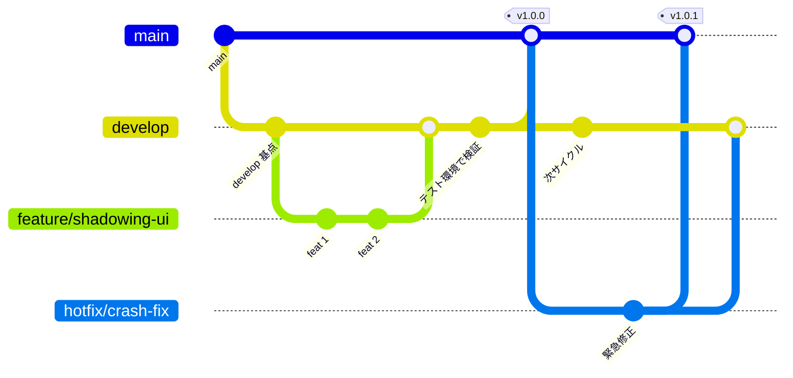
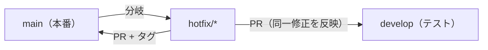

# 開発ワークフロー（ブランチ運用・PR・リリース）

SnapSpeak の **Git ブランチ運用と開発ルール**の正本。設計・フェーズ定義の正本は [architecture.md](./architecture.md) / [roadmap.md](./roadmap.md) であり、本書はそれらを壊さないプロセス文書である。**製品仕様・不変条件と食い違う場合は architecture / roadmap が勝つ。**

前提となる確定方針（本リポジトリの開発フロー）:

- `main` = **本番ブランチ**（App Store 配布相当）。常にリリース可能な状態を保つ。
- `develop` = **開発ブランチ。常にテスト環境として保持**（社内 / TestFlight 相当の検証対象）。
- **feature ブランチは `develop` から切り、`develop` へ PR マージ**する。
- **リリース時は semver タグを切って `develop` → `main` へマージ**し、GitHub Release を作成する。
- 緊急修正（hotfix）は `main` から分岐し、`main` と `develop` の両方へ反映する。

---

## 1. ブランチモデル



### 各ブランチの役割・保護方針

| ブランチ | 役割 | 分岐元 | マージ先 | 保護方針 |
|----------|------|--------|----------|----------|
| `main` | **本番**（App Store 配布相当）。常にリリース可能 | — | — | **直 push 禁止 / PR 必須 / CI 4 ジョブ green 必須 / レビュー必須**。マージはタグ付きリリースのみ |
| `develop` | **テスト環境**（TestFlight・内部配布相当。常時検証対象） | `main` | `main`（リリース時） | **直 push 禁止 / PR 必須 / CI 4 ジョブ green 必須 / レビュー必須** |
| `feature/*` | 新機能・改修の作業ブランチ（短命） | `develop` | `develop` | 保護なし。個人の作業ブランチ |
| `fix/*` | 通常のバグ修正（本番緊急ではない） | `develop` | `develop` | 保護なし |
| `hotfix/*` | **本番の緊急修正** | `main` | `main` **と** `develop` | 保護なし（マージ先が保護対象） |
| `release/*` | リリース準備（任意。版上げ・最終調整を分離したい場合） | `develop` | `main` **と** `develop` | 保護なし |

- `main` / `develop` の保護は GitHub の **Branch protection rules** で設定する（Require a pull request before merging / Require status checks to pass = `lint`・`core-linux`・`contentlint`・`ios-macos` / Require review）。
- `release/*` は必須ではない。小規模なうちは `develop` → `main` の直接 PR で足りる。版上げ作業を隔離したい・リリース候補を凍結したい場合にのみ使う。

---

## 2. ブランチ命名規則

| 種別 | パターン | 例 | 用途 |
|------|----------|-----|------|
| 機能 | `feature/<短い説明>` | `feature/shadowing-result-view` | 新機能・改修 |
| 修正 | `fix/<短い説明>` | `fix/srs-day-boundary` | 通常のバグ修正 |
| 緊急修正 | `hotfix/<短い説明>` | `hotfix/audio-session-crash` | 本番の緊急対応 |
| リリース準備 | `release/<version>` | `release/v1.1.0` | 版上げ・最終調整（任意） |

- 説明は **kebab-case**（小文字・ハイフン区切り）。issue 番号がある場合は接頭に付けてよい（例 `feature/42-download-manager`）。
- リリースタグは **semver** で `v` 接頭辞付き（例 `v1.0.0`）。ブランチ名ではなく **タグ**である点に注意。

### Cursor Cloud Agent ブランチとの対応

本リポジトリは Cursor Cloud Agent で開発するため、実ブランチ名は `cursor/<name>-<suffix>` 形式（例 `cursor/dev-workflow-rules-4b92`）を使うことがある。

| 実ブランチ | 上記モデルでの位置づけ |
|------------|------------------------|
| `cursor/<name>-<suffix>` | **実質 feature（または fix）ブランチ**。作業単位ごとに切り、レビュー後に **develop 相当へ集約**する |

- `cursor/*` ブランチは通常の `feature/*` と同じ扱い。最終的な合流先が `develop`（テスト環境）になるよう PR のベースを設定する。
- 複数の `cursor/*` がスタック（積み重ね）している場合、各 PR のベースは「直下の親ブランチ」を指定し、最終的に `develop` へ集約されるように順に解消する。

---

## 3. PR ルール

- **レビュー必須**: `main` / `develop` 宛の PR は最低 1 名のレビュー承認を必須とする。
- **CI 必須**: `lint` / `core-linux` / `contentlint` / `ios-macos` の **4 ジョブすべてが green** であることをマージ条件とする（[.github/workflows/ci.yml](../.github/workflows/ci.yml)）。`core-linux` が最速のフィードバック源（Linux ローカルと同条件）。`contentlint` はシード入稿チェック（caption 単調増加・oneOf・言語ペア・checksum）。
- **マージ方針**: `feature/*` → `develop` は **Squash and merge**（履歴を 1 コミットに集約。PR タイトルを Conventional Commits 準拠にする）。`develop` → `main`（リリース）と `hotfix/*` は **Merge commit**（マージの系譜を残す）。**保護ブランチへの force push / amend は禁止**（自分の作業ブランチのレビュー前整理は可）。
- **コンフリクト解消責任**: PR 作成者が、ベースブランチを取り込んで（`git merge origin/<base>` または rebase）コンフリクトを解消する。**保護ブランチ側を勝手に書き換えない。**
- **スコープ**: 1 PR = 1 論理変更。roadmap の不変条件（`docs/roadmap.md`「フェーズ横断の不変条件」）に反する変更を含めない。
- **PR 本文**: 目的・変更点・検証結果（どの CI ジョブ / テストで確認したか）を記載する。実機のみで確認可能な項目は [device-qa-checklist.md](./device-qa-checklist.md)（roadmap Phase 1 / Phase 2 DoD から抽出）を配布前チェックリストとして参照する。

---

## 4. コミットメッセージ規約

既存履歴（`core:` / `ios:` / `ci:` / `docs:` / `app:` / `lint:` などの接頭辞）を踏襲し、**Conventional Commits** を採用する。

```
<type>(<scope>): <要約（現在形・命令形）>
```

| type | 用途 |
|------|------|
| `feat` | 新機能 |
| `fix` | バグ修正 |
| `docs` | ドキュメントのみ |
| `ci` | CI / ワークフロー |
| `refactor` | 挙動を変えない内部改善 |
| `test` | テストの追加・修正 |
| `chore` | 雑務（依存更新・設定など） |

- `scope` は任意だが推奨。本リポジトリの慣例に合わせ `core` / `ios` / `app` / `lint` などモジュール名を使ってよい（例 `fix(core): SM-2 の EF 下限を 1.3 に補正`）。
- 要約は簡潔に。英語・日本語どちらでも可（既存履歴は英語主体）。
- リリースコミット・マージコミットは慣例的な文言で可（例 `Merge develop into main for v1.0.0`）。
- Squash merge 時は **PR タイトルをそのままコミット要約**にするため、PR タイトルも本規約に従う。

---

## 5. リリース手順（develop → main。タグ・Release は自動）

リリースは **「リリース PR をマージする」の 1 操作**に自動化されている。本番反映の判断（マージ）だけが人間の作業。

1. **リリース PR は自動で用意される**: `develop` が `main` より先行すると、[release-pr.yml](../.github/workflows/release-pr.yml) が `develop` → `main` の PR を自動作成する（既にオープンならそのまま。差分は develop への push に追随）。**初回または失敗が続くときは §5.1 のリポジトリ設定が必要。**
2. **検証とマージ判断（人間）**: PR の差分と `develop` の CI green を確認し、**Merge commit** でマージする。本番リリースはユーザーのチェック必須。
3. **タグとドラフト Release（自動）**: `main` への push を契機に [release.yml](../.github/workflows/release.yml) が走り、
   - `core-linux` 相当のビルド / テストをゲートとして実行
   - [scripts/next-version.sh](../scripts/next-version.sh) が **Conventional Commits から次の semver を計算**（`feat!:`/`BREAKING CHANGE`=MAJOR、`feat:`=MINOR、それ以外=PATCH。初回は `v0.1.0`）
   - タグ `vX.Y.Z` を自動 push し、**ドラフト GitHub Release**（リリースノート自動生成）を作成
4. **公開（人間）**: ドラフト Release の内容を確認して公開する。
5. **配布**: App Store 提出（`main`）/ TestFlight 配布（`develop`）は現状 **手動**。署名・TestFlight 自動化は将来対応（本書 §7・[infra-setup.md](./infra-setup.md) §2・release.yml のコメント参照）。

補足:

- **手動タグも引き続き有効**（hotfix の付け直し等）。`v*` タグを push すれば release.yml がドラフト Release を作成する。自動タグは HEAD が既にタグ済みならスキップするため二重作成は起きない。
- **PR タイトルがバージョン計算の入力**になる（Squash マージでコミット subject になるため）。[pr-title.yml](../.github/workflows/pr-title.yml) が全 PR のタイトルを Conventional Commits 形式で検証する。
- **版上げ（`App/project.yml`）**: `MARKETING_VERSION`（semver）と `CURRENT_PROJECT_VERSION`（ビルド番号）は **App Store / TestFlight に実配布するときに** タグと整合させて更新する（`chore(app): bump version to X.Y.Z`）。git タグの自動採番とは独立で、実配布を始めるまでは更新不要。

### バージョニング方針（semver × Conventional Commits）

| PR タイトル / コミット | 上げる桁 | 例 |
|------|----------|-----|
| `feat!:` または本文に `BREAKING CHANGE` | MAJOR | `1.0.0` → `2.0.0` |
| `feat:` / `feat(scope):` | MINOR | `1.0.0` → `1.1.0` |
| それ以外（`fix:` `docs:` `chore:` 等） | PATCH | `1.0.0` → `1.0.1` |

- 判定はリリース間（前タグ〜main HEAD）の全コミットを走査し、最も大きい桁を採用する（実装: `scripts/next-version.sh`）。
- 1.0.0 到達までは `!` / `BREAKING CHANGE` を使わない運用とする（0.x の間は MINOR までで表現する）。
- `CURRENT_PROJECT_VERSION`（ビルド番号）は App Store Connect の要件上、同一 `MARKETING_VERSION` 内でも**再提出のたびに増やす**。

### 5.1 リリース PR 自動作成に必要なリポジトリ設定（ユーザー操作）

`release-pr.yml` は `GITHUB_TOKEN` で `develop` → `main` の PR を作る。workflow の `permissions: pull-requests: write` は **必要だが十分ではない**。

GitHub は既定で、Actions の `GITHUB_TOKEN` による PR 作成を拒否する。このときジョブは次の GraphQL エラーで失敗する（2026-08-23 の run 32639562910 / コミット `f52c74e` で確認）:

```
GitHub Actions is not permitted to create or approve pull requests (createPullRequest)
```

**対処（リポジトリ管理者）:**

1. リポジトリの [Settings → Actions → General](https://github.com/Kyogo73/SnapSpeak/settings/actions) を開く。
2. **Workflow permissions** までスクロールする。
3. **Allow GitHub Actions to create and approve pull requests** にチェックを入れる。
4. **Save** する。
5. 設定後、`develop` への次の push で `open-release-pr` が PR を作成する。既存のオープンなリリース PR があれば作成はスキップされる。

組織アカウント配下でチェックがグレーアウトしている場合は、先に組織設定を有効化する。

1. `https://github.com/organizations/<ORG>/settings/actions`
2. Actions → General → Workflow permissions → 同じチェックを入れて Save。
3. その後にリポジトリ側でも同じチェックを入れる。

回避策: 設定前でも、人間が `develop` → `main` のリリース PR を手動作成してよい。タイトルは `release: develop を main へ反映`。マージは **Merge commit**（squash 禁止。履歴分岐の原因になる）。

---

## 6. hotfix 手順（本番緊急修正）

`main` に出ている本番不具合を、次の通常リリースを待たずに修正する。

1. `main` から `hotfix/<説明>` を分岐する。
   ```bash
   git checkout main && git pull origin main
   git checkout -b hotfix/audio-session-crash
   ```
2. 修正をコミットし、`App/project.yml` の `CURRENT_PROJECT_VERSION`（必要なら `MARKETING_VERSION` の PATCH）を上げる。
3. **`main` へ PR**（CI green + レビュー）→ Merge commit。マージすると release.yml が自動で PATCH タグ（例 `v1.0.1`）とドラフト Release を作成する（hotfix コミットが `fix:` であること）。
4. **同じ修正を `develop` へも反映**する（`hotfix/*` → `develop` の PR、またはリリース後の `main` → `develop` バックマージ）。**これを怠ると次回リリースで修正が巻き戻る**ため必須。



---

## 7. 環境マッピング

iOS アプリのため「サーバーデプロイ」ではなく **配布チャネル**として対応付ける。CD の完全自動化は現時点で約束しない（署名・配布は手動を基本とし、将来自動化する）。

| ブランチ | 環境 | 配布チャネル | 検証内容 |
|----------|------|--------------|----------|
| `develop` | **テスト環境（常時）** | TestFlight / 内部配布相当 | 実機での音声経路・オンデバイス ASR・権限 UX など [device-qa-checklist.md](./device-qa-checklist.md) の項目を継続検証 |
| `main` | **本番** | App Store 提出・審査・公開 | リリース候補の最終確認。タグ = リリース単位 |

- **自動化の現状**: CI（`ci.yml`）はビルド / テスト / lint / 入稿検証のゲートまで。**署名付きアーカイブ・TestFlight アップロード・App Store 提出は自動化しない**（秘密情報を扱わない）。`release.yml` は GitHub Release 作成のスケルトンで、TestFlight / 署名は将来対応としてコメントで明記している。手順と前提の一覧は [infra-setup.md](./infra-setup.md) §2。
- **将来対応（未着手・据え置き）**: App Store Connect API キーによる `xcodebuild archive` → upload の自動化。導入時は Secrets 管理（GitHub Environments / OIDC）を別途設計する。iOS 提出に Apple notary（macOS 用）は不要。

---

## 8. CI/CD ゲート（どのイベントで何が走るか）

| イベント | 走るワークフロー | ジョブ | 目的 |
|----------|------------------|--------|------|
| すべての **PR**（feature→develop, develop→main, hotfix→main/develop） | `ci.yml` | `lint` / `core-linux` / `contentlint` / `ios-macos` | マージ前ゲート（必須チェック） |
| すべての **PR**（作成・タイトル編集時） | `pr-title.yml` | `conventional-title` | PR タイトル規約の強制（バージョン計算の入力品質） |
| `develop` への **push**（マージ後） | `ci.yml` / `release-pr.yml` | CI 4 ジョブ / リリース PR 自動作成 | テスト環境の健全性確認・リリース準備 |
| `main` への **push**（= リリース PR マージ） | `ci.yml` / `release.yml` | CI 4 ジョブ / `core-linux` ゲート → **自動タグ** → ドラフト Release | 本番反映とリリース成果物の自動作成 |
| `v*` **タグ** push（手動時のみ） | `release.yml` | `core-linux` ゲート → GitHub Release（ドラフト） | hotfix 等の手動リリース |
| 週次 | Dependabot | GitHub Actions / SwiftPM の更新 PR | 依存の陳腐化防止（[.github/dependabot.yml](../.github/dependabot.yml)） |

- CI ジョブの中身（ランナー・コマンド・キャッシュ・バージョンピン）は [.github/workflows/ci.yml](../.github/workflows/ci.yml) を正とする。ジョブ構成の詳細設計は phase1 実装計画（`docs/phase1-implementation-plan.md`）§5 を参照。
- `concurrency` により同一 ref の旧実行はキャンセルする。テストは乱数・実時間・実ネットワークに依存しない設計のため、CI 内リトライは行わない。
- **実機のみで担保する DoD**（音声経路マトリクス・オンデバイス採点・アクセシビリティ・ドライブモード実車等）は CI 対象外。[device-qa-checklist.md](./device-qa-checklist.md) を配布前チェックリストとして用いる。
- CDN（Cloudflare R2）の払い出しと Cloud Agents Secrets の登録名は [infra-setup.md](./infra-setup.md)。設計は architecture §8.1。
