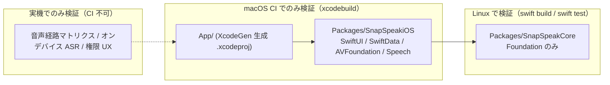
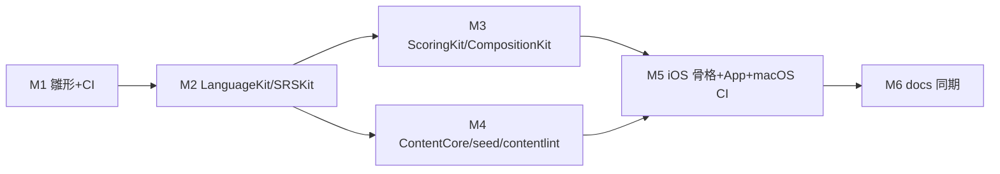

# Phase 1 初期実装計画

本書は [roadmap.md](./roadmap.md) Phase 1 の技術タスクを、初期実装 PR 群に落とすための実装計画である。設計判断の正本は [architecture.md](./architecture.md)（以下 arch）、フェーズ定義の正本は roadmap.md。本書はその下位文書であり、食い違う場合は上位 2 文書が勝つ。

## 0. 実行環境制約（本計画の出発点）

- 開発・CI 環境の一つは **Linux（Ubuntu 24.04, Swift toolchain 導入済み）**。Xcode / Apple フレームワーク（SwiftUI, SwiftData, AVFoundation, Speech, UIKit）は使えない。
- したがって中核ドメインロジックは **Foundation のみに依存する独立 Swift Package（`SnapSpeakCore`）** に切り出し、**Linux 上で `swift build` / `swift test` が完全に通る**ことを実装の実証対象とする。
- Apple フレームワーク依存モジュールは **iOS 専用パッケージ（`SnapSpeakiOS`）と App ターゲット**に分離し、**CI の macOS ランナー**でのみビルド検証する。Linux ローカルでは検証不可能（§8 リスク参照）。



---

## 1. SwiftPM レイアウト

### 1.1 リポジトリ構成

arch §13 のディレクトリイメージ（App/, Packages/, Resources/）を維持しつつ、`Packages/` 直下は「モジュールごとのフォルダ」ではなく **2 つの SwiftPM パッケージ**とし、arch §2.1 の各モジュールはその中の **target** として実現する（モジュール名・依存方向は arch §2.1 に一致させる）。

```
/
├─ App/                                  # Xcode App ターゲット（薄い。DI・SwiftData コンテナ・Scene）
│  ├─ project.yml                        # XcodeGen 定義（.xcodeproj は生成物、コミットしない）
│  └─ Sources/
│     ├─ SnapSpeakApp.swift
│     └─ AppDependencies.swift
├─ Packages/
│  ├─ SnapSpeakCore/                     # ★ Foundation-only。Linux で build/test
│  │  ├─ Package.swift
│  │  ├─ Sources/
│  │  │  ├─ LanguageKit/
│  │  │  ├─ ScoringKit/
│  │  │  ├─ CompositionKit/
│  │  │  ├─ SRSKit/
│  │  │  ├─ ContentCore/
│  │  │  ├─ AnalyticsCore/
│  │  │  └─ contentlint/                 # 実行可能ターゲット（シード/入稿 JSON 検証）
│  │  └─ Tests/
│  │     ├─ LanguageKitTests/
│  │     ├─ ScoringKitTests/
│  │     ├─ CompositionKitTests/
│  │     ├─ SRSKitTests/
│  │     ├─ ContentCoreTests/            # Fixtures/（ゴールデン JSON）同梱
│  │     └─ AnalyticsCoreTests/
│  └─ SnapSpeakiOS/                      # ★ Apple 専用。macOS CI でのみビルド
│     ├─ Package.swift                   # platforms: [.iOS(.v17)]
│     ├─ Sources/
│     │  ├─ AppFeature/
│     │  ├─ ShadowingFeature/
│     │  ├─ CompositionFeature/
│     │  ├─ AudioEngine/
│     │  ├─ SpeechKit/                   # SFSpeechRecognizer ラッパ（小さな共有 Domain）
│     │  ├─ ContentKit/                  # ContentCore + ファイル管理/DL/シード導入
│     │  ├─ Persistence/                 # SwiftData VersionedSchema v1 + @ModelActor
│     │  ├─ DesignSystem/
│     │  └─ Analytics/                   # AnalyticsCore プロトコルの実装
│     └─ Tests/
│        ├─ PersistenceTests/            # macOS CI（simulator destination）で実行
│        └─ ContentKitTests/
├─ Resources/
│  ├─ Localizable.xcstrings              # String Catalog（ja ベース）
│  ├─ PrivacyInfo.xcprivacy
│  └─ Seed/
│     └─ course_daily_ja_en/
│        ├─ index.json                   # スキーマ v1（§4）
│        └─ audio/*.m4a
├─ docs/                                 # 設計正本（既存）
├─ .github/workflows/ci.yml
├─ .swiftlint.yml
├─ .swift-version                        # 例: 6.1（CI とローカルの単一情報源）
└─ .gitignore
```

補足:

- **arch §13 との整合**: §13 は `Packages/AppFeature/` のようにフラットに書かれているが、Linux 制約により「Foundation-only 集合」と「Apple 専用集合」の 2 パッケージへグルーピングする。モジュール名（AppFeature / ShadowingFeature / … / SRSKit / DesignSystem / Analytics）と依存方向は §2.1 を維持する。実装 PR で arch §2.1 / §13 にこの分割を 1 段落追記する（「逸脱する場合は先に本書を更新する」規約に従う）。
- **ContentKit の分割**: スキーマ / デコーダ / マイグレーター / マニフェスト選択 / 検証（純ロジック）は `ContentCore`（Linux 可）へ。ダウンロード実行・atomic staging・バックアップ除外・シード導入・エンタイトルメント（iOS の FileManager / URLSession 実装依存部）は iOS 側 `ContentKit` へ。
- **採点コアの置き場**: arch §2.1 に採点専用モジュールは明記されていない（Scorer は §3.5 シーケンス上の登場人物）。本計画では `ScoringKit` を core の独立 target として新設する（SRSKit と同様に UI / Audio 非依存）。arch への追記対象。
- **外部依存**: `SnapSpeakCore` の外部依存は **swift-crypto のみ**（SHA-256 チェックサム。Apple 公式・Linux 対応）。それ以外はゼロ。`SnapSpeakiOS` の外部依存はゼロ（SwiftLint はビルドプラグインにせず CI で実行）。
- **Swift バージョン**: swift-tools-version 6.0、言語モード Swift 6（strict concurrency）。`Sendable` 境界（DTO / 純関数）をコンパイラで担保する。

### 1.2 `Package.swift`（要点）

**Packages/SnapSpeakCore/Package.swift**

| target | 種別 | 依存 | 備考 |
|--------|------|------|------|
| `LanguageKit` | library | — | BCP-47、正規化、トークナイザ、縮約テーブル |
| `ScoringKit` | library | LanguageKit | DP アライメント、指標、PlaybackTimeline、ScoreReport |
| `CompositionKit` | library | LanguageKit | 瞬間英作文の照合 |
| `SRSKit` | library | LanguageKit | SM-2 fold、q 算出、学習日境界 |
| `ContentCore` | library | LanguageKit, Crypto (swift-crypto) | スキーマ v1、明示デコーダ、マニフェスト、検証 |
| `AnalyticsCore` | library | LanguageKit | イベント定義とプロトコルのみ |
| `contentlint` | executableTarget | ContentCore | シード / 入稿 JSON の CI 検証（Phase 2 入稿 CI の受け口） |
| 各 `*Tests` | testTarget | 対応 target | ContentCoreTests は `resources: [.copy("Fixtures")]` |

- `platforms` は指定しない（Linux + macOS + iOS 17 いずれでもビルド可能に保つ。Apple API を import しないことが条件）。
- products は target ごとの library + `contentlint` 実行ファイル。

**Packages/SnapSpeakiOS/Package.swift**

| target | 依存 | 責務（arch §2.1 準拠） |
|--------|------|------------------------|
| `AppFeature` | ShadowingFeature, CompositionFeature, ContentKit, DesignSystem, Analytics | タブ/ナビ、DI、ディープリンク |
| `ShadowingFeature` | AudioEngine, SpeechKit, ContentKit, SRSKit(core), ScoringKit(core), DesignSystem, Analytics, Persistence | シャドーイング画面、状態機械、劣化 UI |
| `CompositionFeature` | AudioEngine, SpeechKit, ContentKit, SRSKit(core), CompositionKit(core), DesignSystem, Analytics, Persistence | 瞬間英作文画面 |
| `AudioEngine` | Analytics, ScoringKit(core: PlaybackTimeline 型のみ) | AVAudioEngine、セッション遷移、経路ポリシー、VP、復旧 |
| `SpeechKit` | LanguageKit(core) | SFSpeechRecognizer actor、オンデバイス可否 4 条件検査 |
| `ContentKit` | ContentCore(core), SRSKit(core) | DL、atomic staging、シード導入、エンタイトルメント |
| `Persistence` | SRSKit(core), ContentCore(core) | SwiftData VersionedSchema v1、@ModelActor、Sendable DTO |
| `DesignSystem` | — | 色・タイポ・部品。機能知識なし |
| `Analytics` | AnalyticsCore(core) | track 実装（Phase 1 はローカルログ + インストール ID） |

- `platforms: [.iOS(.v17)]`。`dependencies: [.package(path: "../SnapSpeakCore")]`。
- Feature 同士の直接 import 禁止、DesignSystem→ContentKit 禁止などの arch §2.1 の禁止事項をレビュー観点として固定（SwiftLint カスタムルールでは強制せず、CI の依存グラフはこの Package.swift 自体が正）。

### 1.3 App 本体（.app）のビルド方針

- **手書き .xcodeproj はコミットしない**。`App/project.yml`（XcodeGen）から生成する。macOS CI で `xcodegen generate` → `xcodebuild` の順。ローカル（Mac 開発者）も同じコマンドで再現する。
- `project.yml` の要点:
  - target `SnapSpeak`（iOS 17.0 deployment）。`App/Sources` + `Resources/`（`Localizable.xcstrings`、`Seed/`、`PrivacyInfo.xcprivacy`）を含める。
  - ローカルパッケージ参照: `Packages/SnapSpeakiOS`（App は `AppFeature` product のみ import）。
  - Info.plist キー: `NSMicrophoneUsageDescription` / `NSSpeechRecognitionUsageDescription`（用途 + 録音保持 14 日を明記。文言は String Catalog とは別に plist 直書きで可）、`UIBackgroundModes` は Phase 1 では追加しない。
  - 署名: CI では `CODE_SIGNING_ALLOWED=NO` のシミュレータ向けビルド。Archive / TestFlight は本計画のスコープ外。

---

## 2. モジュール別ソースファイル一覧

型名・数式・規則は arch の該当節に一致させる。以下は初期実装で作成するファイルと主要 type（1 ファイル 1 主要 type を原則）。

### 2.1 LanguageKit（core）

| パス | 主要 type / 責務 |
|------|------------------|
| `Sources/LanguageKit/BCP47Language.swift` | `BCP47Language`。正規化イニシャライザ（language 小文字 / Script 先頭大文字 / REGION 大文字。例 `ZH-hans` → `zh-Hans`）。不正タグは throw |
| `Sources/LanguageKit/LanguagePair.swift` | `LanguagePair`（source/target）。`pairKey`（例 `"ja>en"`。区切りは `:` を含む cardKey と衝突しない `>` 固定） |
| `Sources/LanguageKit/AppVersion.swift` | `AppVersion`。semver 比較（マニフェスト release 選択で使用） |
| `Sources/LanguageKit/EnglishContractions.swift` | 縮約展開テーブル（`don't`→`do not`、`can't`→`can not` へ寄せる 等）。**採点前処理と瞬間英作文正規化の唯一の共有正本**（arch §5.1「テーブルを一箇所に固定」） |
| `Sources/LanguageKit/TextNormalizer.swift` | `TextNormalizer` protocol + `EnglishNormalizer`。arch §5.1 の順序固定 6 段（NFKC 相当 → 小文字化 → スマートクォート → 句読点除去（アポストロフィは縮約前保持）→ 縮約展開 → 空白圧縮/トリム） |
| `Sources/LanguageKit/Tokenizer.swift` | `Tokenizer` protocol、`Token`（surface / normalized / startMs? / endMs?。arch §4.1 のとおり） |
| `Sources/LanguageKit/WhitespaceTokenizer.swift` | 英語等の空白区切り実装（Phase 1 唯一の実装。言語別ストラテジの差し替え点は protocol で確保） |
| `Sources/LanguageKit/FillerLexicon.swift` | L2 ロケール別フィラー（`uh`, `um` 等）。言い淀みカウント用 |
| `Sources/LanguageKit/SpeechLocaleResolver.swift` | `SpeechLocaleResolver` protocol（arch §9.3）+ `StaticSpeechLocaleResolver`（Phase 1 は `en` → `en-US` のみの解決表。未掲載は `nil` = ASR オフ） |

### 2.2 ScoringKit（core）

| パス | 主要 type / 責務 |
|------|------------------|
| `Sources/ScoringKit/ASRSegment.swift` | `ASRSegment`（text / timestamp 秒 / duration / confidence）。`SFTranscriptionSegment` を持ち込まないための Sendable DTO |
| `Sources/ScoringKit/AlignmentOp.swift` | `AlignmentOp`（equal / substitution / deletion / insertion）と `AlignedSpan` |
| `Sources/ScoringKit/Aligner.swift` | `Aligner.align(reference:hypothesis:)`。標準 Levenshtein DP（一致 0 / 置換 1 / 削除 1 / 挿入 1）+ バックトレースで操作列を返す純関数 |
| `Sources/ScoringKit/ScoreMetrics.swift` | `scriptMatchRate = #equal / max(n,1)`、`precision = #equal / max(m,1)`、`recall`（arch §4.2 の式そのまま） |
| `Sources/ScoringKit/HesitationDetector.swift` | 挿入の同一正規化トークン繰り返し + フィラー → 言い淀み数。削除の連続 → 抜けスパン（arch §4.3） |
| `Sources/ScoringKit/WPMCalculator.swift` | トークン数 / 発話分。先頭末尾無音トリム済みの発話秒を入力に取る（トリム自体は AudioEngine 側の責務。ここは純計算） |
| `Sources/ScoringKit/PlaybackTimeline.swift` | `PlaybackTimeline` と `TimelineEvent`（start / pause / resume / setRate / seek / loop / stop。各イベントに hostTime・原速位置秒・提示レート）。`presentedSourcePosition(atHostTime:)` を**単一実装**として提供（arch §3.6） |
| `Sources/ScoringKit/DelayCalculator.swift` | 語タイミングあり: `delay_i = t_ASR_i − t_presented_i`（final セグメントのみ）。なし: captionSegment 単位の文概算。タイムライン欠如: `unavailable`。中央値 `delayMsMedian` を返す |
| `Sources/ScoringKit/ShadowingScore.swift` | `ShadowingScore`（arch §4.6 の全フィールド。`payloadSchemaVersion = 1`）、`DelayGranularity`、`AudioRouteSnapshot`（入出力ポート名・HFP か・voiceProcessing の Codable。Foundation のみで表現） |
| `Sources/ScoringKit/ShadowingScorer.swift` | エントリ純関数: (お手本スクリプト, ASRSegment 列, PlaybackTimeline?, wordTimings?, 経路スナップショット, レート) → `ShadowingScore`。トークナイズ → 正規化 → DP → 指標 → 遅延 の合成 |

### 2.3 CompositionKit（core）

| パス | 主要 type / 責務 |
|------|------------------|
| `Sources/CompositionKit/CompositionGrade.swift` | `CompositionGrade`（`.pass(kind: .normalizedMatch)` / `.fail`）。Phase 3 の `pass_semantic` は case のみ予約 |
| `Sources/CompositionKit/CompositionGrader.swift` | `grade(input:acceptable:language:)`（arch §5.2 のコードそのまま。正規化は LanguageKit の `EnglishNormalizer`。部分一致・編集距離しきい値は入れない） |
| `Sources/CompositionKit/ResponseClock.swift` | `t0 / tSpeak / tEnd` から `tEnd − t0` を算出、上限クリップ（arch §5.3）。純 struct |

### 2.4 SRSKit（core）

| パス | 主要 type / 責務 |
|------|------------------|
| `Sources/SRSKit/ReviewQuality.swift` | `ReviewQuality`（0...5。arch §6.6） |
| `Sources/SRSKit/SRSState.swift` | `SRSState`（EF 初期 2.5 / 下限 1.3、intervalDays、repetitions、dueAt、lastReviewedAt、lastQuality、contentRevision。arch §6.2） |
| `Sources/SRSKit/SM2.swift` | 純関数 `SM2.apply(state:quality:reviewedAt:calendar:)`。EF 更新式 `EF' = EF + (0.1 − (5−q)×(0.08+(5−q)×0.02))`、下限 1.3、q<3 で repetitions=0、q≥3 で 1 日 / 6 日 / `round(interval×EF')` |
| `Sources/SRSKit/StudyDay.swift` | 学習日境界 **ローカル 04:00**。`studyDay(of:calendar:)`、`nextDueAt(...)`（境界合わせの 04:00）、失敗時の**最小再学習間隔 10 分** + 次学習日 04:00 の両建て（arch §6.4）。タイムゾーンは引数の `Calendar` に従い、内部で `Calendar.current` を参照しない（テスト容易性） |
| `Sources/SRSKit/CardKey.swift` | `cardKey = pairKey + ":" + courseId + ":" + itemId + ":" + skill`。`Skill` enum（shadowing / composition） |
| `Sources/SRSKit/GradingPolicy.swift` | `GradingPolicy`。言語 × トークン数帯 × confidence 帯のしきい値表。初期仮値（英語 12 トークン未満: 速い ≤4s / 遅い ≥12s、遅延大 800ms、confidence 下限）を**データで差し替え可能な設定値**として保持（ハードコード分岐にしない。arch §6.3） |
| `Sources/SRSKit/SRSEngine.swift` | `SRSEngine`（arch §6.6 のインタフェースそのまま）。`qualityForComposition`（skip=0 / fail=1 / pass 遅=3 / 通常=4 / 速+ヒント無=5 / ヒント使用は上限 3 / 低 confidence は `nil`）、`qualityForShadowing`（scriptMatchRate × 遅延中央値の表。低 confidence・同時採点なしは `nil`。概算遅延は q 入力に使わない）、`fold(events:now:calendar:dayBoundaryHour:)`（serverRevision 順、未同期は clientSeq 順に SM2.apply を畳み込み） |
| `Sources/SRSKit/ReviewEventDTO.swift` | `ReviewEventDTO`（id / cardKey / quality / reviewedAt / clientSeq / serverRevision? / contentRevision）。SwiftData モデルと分離した Sendable 値 |

### 2.5 ContentCore（core）

| パス | 主要 type / 責務 |
|------|------------------|
| `Sources/ContentCore/SchemaVersion.swift` | `KnownContentSchemaVersions = [1]`。`ContentDecodingError.unknownSchemaVersion` / `.oneOfViolation` 等のエラー型 |
| `Sources/ContentCore/Model/CourseV1.swift` | `CourseV1` / `UnitV1` / `LessonV1` / `ItemV1` / `PassageV1` / `SentencePairV1` / `CaptionSegment` / `WordTiming` / `AudioRef`（relativePath / durationMs / checksumSha256）。`title` はローカライズ辞書 `[String: String]`（`titleKey` 不使用）。`ItemV1.init(from:)` で **oneOf 排他を強制**（shadowing↔passage 必須 / composition↔sentencePair 必須。両持ち・両欠けは throw） |
| `Sources/ContentCore/Model/LocalizedTitle.swift` | `title` 辞書の解決（要求言語 → sourceLanguage → `en` フォールバック。arch §9.3） |
| `Sources/ContentCore/Decoding/ContentDecoder.swift` | エントリ。`schemaVersion` を先読み（`peek` 用の最小 Decodable）→ 既知なら明示デコーダへルーティング、**未知の高い schemaVersion は拒否**（`unknownSchemaVersion` を throw。呼び出し側がローカル維持 + 「アプリ更新が必要」表示） |
| `Sources/ContentCore/Decoding/ContentDecoderV1.swift` | schemaVersion 1 の明示デコーダ。同一バージョン内の未知オプショナルフィールドのみ無視 |
| `Sources/ContentCore/Migration/CourseMigrator.swift` | 既知 vN → 現行内部表現 `Course`（当面 v1 のみで恒等変換。v2 追加時の差し替え点を確保） |
| `Sources/ContentCore/Manifest/Manifest.swift` | `Manifest` / `ManifestCourse` / `CourseRelease`（releaseId / revision / schemaVersion / minAppVersion / maxAppVersion? / contentUrl / bytes / checksumSha256 / inheritSRS。arch §7.3） |
| `Sources/ContentCore/Manifest/ReleaseSelector.swift` | 純関数 `select(course:appVersion:knownSchemas:)`: minAppVersion ≤ app < maxAppVersion かつ schema 既知 → revision 最大。該当なしは `nil`（呼び出し側がローカル旧版維持） |
| `Sources/ContentCore/Checksum.swift` | SHA-256（swift-crypto）。`verify(data:expectedHex:)` |
| `Sources/ContentCore/Validation/ContentValidator.swift` | 入稿検証: `captionSegments` の単調増加、Item ID のコース内一意、shadowing の音声必須、尺の目安（15〜45 秒、50 秒超は error）、languagePair の BCP-47 正規化済み確認。**Phase 2 入稿 CI の受け口** |
| `Sources/contentlint/main.swift` | CLI: `contentlint <index.json>... [--manifest <manifest.json>] [--audio-root <dir>]`。デコード + Validator + （audio-root 指定時）checksum 実ファイル照合。exit code で CI 判定 |

### 2.6 AnalyticsCore（core）

| パス | 主要 type / 責務 |
|------|------------------|
| `Sources/AnalyticsCore/AnalyticsEvent.swift` | `AnalyticsEvent` enum: `lessonStarted` / `lessonCompleted` / `downloadFailed`（Phase 2 予約名 `paywallShown` / `purchaseSucceeded` はコメントで ID のみ予約）。ペイロードは languagePair コード・lessonId・スコア帯・所要時間帯・経路カテゴリのみを表現できる型に**制限**（生テキスト・音声・個人データを持つフィールドが存在しない） |
| `Sources/AnalyticsCore/AnalyticsClient.swift` | `protocol AnalyticsClient: Sendable { func track(_ event: AnalyticsEvent) }` |
| `Sources/AnalyticsCore/Quantization.swift` | `scoreBand(_:)`（scriptMatchRate を 0.1 刻み量子化）、所要時間帯 |

### 2.7 SnapSpeakiOS（Apple 専用・初期実装は「コンパイルが通る骨格 + 主要 actor の実装」）

| パス | 主要 type / 責務 |
|------|------------------|
| `Sources/Persistence/SnapSpeakSchemaV1.swift` | `SnapSpeakSchemaV1: VersionedSchema`（version 1.0.0、models 6 種。arch §7.4） |
| `Sources/Persistence/Models/*.swift` | `DownloadedCourse` / `LessonAttempt` / `ReviewEvent` / `SRSCard` / `UserSettings` / `EntitlementCache`（arch §7.4 のフィールドそのまま。1 ファイル 1 モデル） |
| `Sources/Persistence/MigrationPlan.swift` | `SnapSpeakMigrationPlan: SchemaMigrationPlan`（v1 のみ。将来 stage 追加点） |
| `Sources/Persistence/PersistenceActor.swift` | `@ModelActor actor PersistenceActor`。追記 API（appendAttempt / appendReviewEvent）、fold 済み `SRSCard` 更新、DTO 返却のみ。ModelContext を境界外に出さない |
| `Sources/Persistence/DTO.swift` | `LessonAttemptDTO` 等 Sendable DTO。`payloadJSON` + `payloadSchemaVersion` の対で保存 |
| `Sources/AudioEngine/AudioEngineActor.swift` | `actor AudioEngineActor`。状態機械（idle / previewing / shadowingLive / recordOnly。arch §3.1）、停止 → 再構成の遷移規則 |
| `Sources/AudioEngine/AudioSessionConfigurator.swift` | カテゴリ/モード設定（`.playback+.spokenAudio` / `.playAndRecord+.voiceChat`）。`.spokenAudio` を playAndRecord と組み合わせない |
| `Sources/AudioEngine/RoutePolicy.swift` | 経路別ポリシー表（arch §3.2）→ `RouteDecision`（同時採点可 / 劣化 / VP 要否） |
| `Sources/AudioEngine/PlayerGraph.swift` | `AVAudioPlayerNode` + `AVAudioUnitTimePitch`（rate 0.5–1.5、`pitch = 0` cents）。録音は inputNode タップ |
| `Sources/AudioEngine/VoiceProcessing.swift` | 停止中エンジンへ `inputNode.setVoiceProcessingEnabled(true)`。失敗 → 劣化モード通知 |
| `Sources/AudioEngine/TimelineRecorder.swift` | 共通 host/sample time で再生・録音開始を結び、`ScoringKit.PlaybackTimeline` の TimelineEvent を記録 |
| `Sources/AudioEngine/RecoveryObserver.swift` | interruption / routeChange / mediaServicesWereReset / configurationChange の独占購読 → 停止・再構築（arch §3.9） |
| `Sources/SpeechKit/SpeechAvailability.swift` | 4 条件検査（supportedLocales / init non-nil / supportsOnDeviceRecognition / isAvailable。arch §3.7）。起動時 + レッスン入場時再読込 |
| `Sources/SpeechKit/SpeechClient.swift` | `actor SpeechClient`。`requiresOnDeviceRecognition = true` 固定、final セグメントのみ → `ASRSegment` DTO、タイムアウト（録音長+余裕）、cancel。**サーバーフォールバック経路を持たない** |
| `Sources/ContentKit/SeedInstaller.swift` | Bundle の `Seed/` を初回起動時に読み出し可能にする（コピー不要のバンドル直読みを基本） |
| `Sources/ContentKit/CourseStore.swift` | ローカルコース列挙（シード + ダウンロード済み）。ContentCore のデコーダで読み、未知 schema は拒否して旧版維持 |
| `Sources/ContentKit/ManifestService.swift` | マニフェスト取得 → `ReleaseSelector` 適用 |
| `Sources/ContentKit/DownloadManager.swift` | 空き容量確認 → temp へ DL → checksum → atomic rename → `isExcludedFromBackup = true`。失敗時旧ディレクトリ保持。LRU / 手動削除 |
| `Sources/ContentKit/EntitlementResolver.swift` | Phase 1 は常に unlocked を返す resolver（Phase 2 の差し替え点） |
| `Sources/ShadowingFeature/ShadowingLessonViewModel.swift` | `@MainActor`、`Phase`（loading/ready/playing/scoring/scored/degradedNoASR/failed。arch §2.2 スケッチ準拠） |
| `Sources/ShadowingFeature/ShadowingLessonView.swift` ほか `ResultView.swift` / `DegradedBanner.swift` | プレイヤー画面・結果（スクリプト一致率の説明文言含む）・劣化バナー |
| `Sources/ShadowingFeature/ShadowingUseCase.swift` | protocol + 実装（AudioEngine → SpeechClient → ShadowingScorer → Persistence → 条件付き SRS の直列化） |
| `Sources/CompositionFeature/CompositionSessionViewModel.swift` ほか `CompositionCardView.swift` / `TypingInputView.swift` / `CompositionUseCase.swift` | L1 提示 → 発話/タイプ → CompositionGrader → q 算出 → 追記 |
| `Sources/AppFeature/RootView.swift` / `HomeView.swift` / `CatalogView.swift` / `SettingsView.swift` / `DownloadsView.swift` / `PrivacyView.swift` | 画面マップ（product-overview §5 Phase 1 の 7 画面） |
| `Sources/AppFeature/AppDependencies.swift` | DI コンテナ（actor 群の生成と注入） |
| `Sources/DesignSystem/Colors.swift` / `Typography.swift` / `Buttons.swift` / `ScoreBadge.swift` | ダイナミックタイプ前提・44pt・色以外の記号併用 |
| `Sources/Analytics/LocalAnalytics.swift` / `InstallID.swift` | `AnalyticsClient` 実装（Phase 1 はローカルログ / no-op）。リセット可能なインストール ID |

---

## 3. ユニットテスト計画（arch §12 準拠）

### 3.1 Linux で実行する core テスト（初期実装の必須ゲート）

Swift Testing（swift-testing、Swift 6 toolchain 同梱）を使用。乱数なし・`now` / `Calendar` / `TimeZone` は全テストで固定注入。

| テストファイル | 対象 | 主なケース |
|----------------|------|-----------|
| `LanguageKitTests/BCP47Tests.swift` | BCP-47 正規化 | `ZH-HANS`→`zh-Hans`、`en-us`→`en-US`、`ja` 恒等、不正タグ throw、`zh` 単体を script 必須言語として警告扱いにしない（正規化のみ）ことの確認 |
| `LanguageKitTests/NormalizerTests.swift` | 正規化 6 段の順序 | 全角→半角（NFKC）、スマートクォート、`Don't you think it's...`→`do not you think it is`、`can't`→`can not`、アポストロフィが句読点除去で先に消えないこと、空白圧縮 |
| `LanguageKitTests/TokenizerTests.swift` | 空白トークナイザ | 句読点分割、フィラー識別、空文字、多重空白 |
| `ScoringKitTests/AlignerTests.swift` | DP アライメント | 固定トークン列フィクスチャ: 完全一致 / 先頭・中間・末尾の削除連続（抜けスパン）/ 置換 / 挿入 / 空仮説（rate 0）/ 空参照。操作列のバックトレース一意性 |
| `ScoringKitTests/MetricsTests.swift` | 指標 | scriptMatchRate・precision・recall の手計算ゴールデン、`max(n,1)` の 0 除算回避 |
| `ScoringKitTests/HesitationTests.swift` | 言い淀み | 同一トークン挿入繰り返し、フィラー（`um`）、置換との区別 |
| `ScoringKitTests/PlaybackTimelineTests.swift` | 提示位置復元 | 人工タイムライン: 等速 → 0.75x 変更 → シーク → 区間リピート → pause/resume の各区間で `presentedSourcePosition` を検証（arch §12「PlaybackTimeline 遅延」の純関数部分） |
| `ScoringKitTests/DelayCalculatorTests.swift` | 遅延 | wordTimings あり: 速度変更後の `delay_i` が生 startMs 減算と一致しないことを含むゴールデン。wordTimings なし: 文単位概算 + `sentenceApproximate`。タイムラインなし: `unavailable` |
| `ScoringKitTests/ShadowingScorerTests.swift` | 統合純関数 | 台本 + ASR セグメント固定入力 → `ShadowingScore` 全フィールドのゴールデン（`asrOnDevice == true` 固定、confidence 平均/最小） |
| `CompositionKitTests/GraderTests.swift` | 照合 | 縮約揺れ pass、全角入力 pass、冠詞欠落 fail、大文字/句読点差 pass、許容パターン複数、部分一致を pass にしないこと |
| `SRSKitTests/SM2Tests.swift` | SM-2 | EF 更新式のゴールデン列（q=5 連続、q=3、q=0）、EF 下限 1.3、q<3 の repetitions リセット、間隔 1 → 6 → round(interval×EF') |
| `SRSKitTests/StudyDayTests.swift` | 学習日境界 | ローカル 03:59 は前学習日 / 04:00 は当日、成功時 dueAt が翌々学習日 04:00 に境界合わせ、失敗時 10 分 + 次学習日 04:00 の両建て、タイムゾーン変更（Asia/Tokyo→America/Los_Angeles）で過去イベント不変・「今日」判定のみ変わる |
| `SRSKitTests/FoldTests.swift` | fold | イベント列（serverRevision 混在 + 未同期 clientSeq）の順序保証、同一イベント再投入の冪等（UUID）、空列 → 初期状態 |
| `SRSKitTests/GradingPolicyTests.swift` | q 算出 | composition: skip/fail/遅/通常/速×ヒントの表どおり、ヒント使用の上限 3、低 confidence → `nil`。shadowing: scriptMatchRate×遅延の表どおり、概算遅延を q に使わない、同時採点なし → `nil` |
| `ContentCoreTests/DecodeV1Tests.swift` | JSON デコード | **Fixtures/course_v1_golden.json**（§4 のシードと同型）完全一致デコード、未知オプショナルフィールド無視 |
| `ContentCoreTests/RejectionTests.swift` | 拒否系 | `schemaVersion: 2`（未知の高い版）→ `unknownSchemaVersion`、oneOf 違反 4 種（shadowing に sentencePair / composition に passage / 両持ち / 両欠け）→ throw、languagePair 欠落 → throw |
| `ContentCoreTests/MigratorTests.swift` | マイグレーター | v1 → 現行内部表現の恒等変換（v2 追加時の回帰枠を確保） |
| `ContentCoreTests/ManifestTests.swift` | マニフェスト | デコード、`ReleaseSelector`: minAppVersion / maxAppVersion / 未知 schema 除外 / revision 最大選択 / 該当なし `nil`（ローカル維持前提） |
| `ContentCoreTests/ValidatorTests.swift` | 入稿検証 | caption 非単調 → error、50 秒超 → error、Item ID 重複 → error |
| `ContentCoreTests/ChecksumTests.swift` | SHA-256 | 既知ベクタ、hex 大文字小文字非依存 |
| `AnalyticsCoreTests/QuantizationTests.swift` | 量子化 | 0.1 刻み境界値（0.0 / 0.05 / 0.95 / 1.0） |

フィクスチャ: `Tests/ContentCoreTests/Fixtures/` に `course_v1_golden.json` / `course_v2_unknown.json` / `course_oneof_violation_*.json` / `manifest_golden.json` を置く（testTarget の resources でバンドル）。

### 3.2 macOS CI で実行するテスト（iOS 骨格）

| 対象 | 方法 |
|------|------|
| core 全テスト | macOS 上でも `swift test`（Darwin Foundation と Linux Foundation の挙動差の検出） |
| `PersistenceTests` | シミュレータ destination で `VersionedSchema v1` のコンテナ生成、追記 → DTO 取得、`SRSCard` fold 反映 |
| `ContentKitTests` | atomic staging（temp → rename、失敗時旧版保持）をローカルファイルで検証。ネットワークはモック |
| App ビルド | `xcodegen generate` + `xcodebuild build`（テストではないがコンパイルゲート） |

### 3.3 CI では担保しないテスト（Phase 1 後半・実機）

ASR コーパス校正、Audio 実機マトリクス、オンデバイス機内モード採点、権限 3 状態、アクセシビリティ実査（§6 のスコープ境界参照）。

---

## 4. シードコンテンツ（`ja→en`）

### 4.1 配置と構成

- 置き場: `Resources/Seed/course_daily_ja_en/index.json` + `audio/`。App ターゲットのリソースとしてバンドル。
- 規模（product-overview §6 の最小セット）: 1 コース / 1 ユニット。シャドーイングレッスン 1 本（15〜45 秒のパッセージ × 3 Item、`captionSegments` 必須・`wordTimings` は最低 1 Item に付与して精密遅延経路を通す）+ 瞬間英作文レッスン 1 本（8 文 × 許容 2〜5 パターン）。
- 音声: 初期実装では開発用仮音声（macOS で生成した m4a）で checksum を確定し、**リリース前に収録音声へ差し替える**（差し替え時に checksum / durationMs / captionSegments を再生成。コンテンツ制作は外部依存）。
- CI: ubuntu ジョブの `contentlint Resources/Seed/course_daily_ja_en/index.json --audio-root Resources/Seed/course_daily_ja_en` でスキーマ・oneOf・caption 単調性・checksum を常時検証（シードがゴールデンフィクスチャを兼ねる）。

### 4.2 シード `index.json`（骨子。スキーマ v1 準拠）

```json
{
  "schemaVersion": 1,
  "id": "course_daily_ja_en",
  "languagePair": { "sourceLanguage": "ja", "targetLanguage": "en" },
  "title": { "ja": "日常英会話", "en": "Daily English" },
  "units": [
    {
      "id": "unit_01_greetings",
      "title": { "ja": "あいさつと予定調整", "en": "Greetings & Scheduling" },
      "lessons": [
        {
          "id": "lesson_01_shadowing",
          "mode": "shadowing",
          "items": [
            {
              "id": "crs_daily_ja_en_item_p_001",
              "kind": "shadowing",
              "audio": { "relativePath": "audio/item_p_001.m4a", "durationMs": 21000, "checksumSha256": "<実ファイルから生成>" },
              "passage": {
                "text": "Hi, I'm running a bit late. Could we start in ten minutes?",
                "captionSegments": [
                  { "startMs": 0, "endMs": 2100, "text": "Hi, I'm running a bit late." },
                  { "startMs": 2100, "endMs": 4200, "text": "Could we start in ten minutes?" }
                ],
                "wordTimings": [
                  { "startMs": 0, "endMs": 400, "text": "Hi" }
                ]
              }
            }
          ]
        },
        {
          "id": "lesson_02_composition",
          "mode": "composition",
          "items": [
            {
              "id": "crs_daily_ja_en_item_c_001",
              "kind": "composition",
              "sentencePair": {
                "l1": "少し遅れます。10分後に始められますか。",
                "acceptable": [
                  "I'm running a bit late. Could we start in ten minutes?",
                  "I'm a little late. Can we start in ten minutes?"
                ]
              },
              "audio": { "relativePath": "audio/item_c_001.m4a", "durationMs": 5000, "checksumSha256": "<実ファイルから生成>" }
            }
          ]
        }
      ]
    }
  ]
}
```

### 4.3 マニフェスト例（CDN 側。テストフィクスチャ兼 Phase 1 後半の CDN 配置雛形）

`Packages/SnapSpeakCore/Tests/ContentCoreTests/Fixtures/manifest_golden.json`:

```json
{
  "manifestSchemaVersion": 1,
  "generatedAt": "2026-08-21T00:00:00Z",
  "courses": [
    {
      "id": "course_travel_ja_en",
      "languagePair": { "sourceLanguage": "ja", "targetLanguage": "en" },
      "releases": [
        {
          "releaseId": "course_travel_ja_en__r1",
          "revision": 1,
          "schemaVersion": 1,
          "minAppVersion": "1.0.0",
          "maxAppVersion": null,
          "contentUrl": "https://cdn.example.com/courses/course_travel_ja_en/r1/index.json",
          "bytes": 184320,
          "checksumSha256": "…",
          "inheritSRS": true
        }
      ]
    }
  ]
}
```

「1 マニフェスト内の複数 release」方式（arch §7.3 の正）で実装する。実 CDN（S3/CloudFront 相当）の払い出しとアップロード手順は Phase 1 後半（§6）。

---

## 5. CI/CD 設計（GitHub Actions）

### 5.1 ワークフロー `.github/workflows/ci.yml`

| ジョブ | ランナー | 内容 | 必須チェック |
|--------|----------|------|--------------|
| `lint` | `ubuntu-24.04`（container: `ghcr.io/realm/swiftlint:<pin>`） | `swiftlint lint --strict` | ✔ |
| `core-linux` | `ubuntu-24.04`（container: `swift:6.1-noble`） | `swift build --build-tests` → `swift test`（`Packages/SnapSpeakCore`）→ `swift run contentlint Resources/Seed/... --audio-root ...` | ✔ |
| `ios-macos` | `macos-15`（Xcode をバージョン固定で `xcode-select`） | ① core を macOS でも `swift test` ② `brew install xcodegen` → `xcodegen generate --spec App/project.yml` ③ `xcodebuild build -project App/SnapSpeak.xcodeproj -scheme SnapSpeak -destination 'platform=iOS Simulator,name=iPhone 16' CODE_SIGNING_ALLOWED=NO` ④ `xcodebuild test`（Persistence / ContentKit のテスト。シミュレータ destination） | ✔ |

スケッチ:

```yaml
name: CI
on:
  pull_request:
  push:
    branches: [main]
concurrency:
  group: ${{ github.workflow }}-${{ github.ref }}
  cancel-in-progress: true

jobs:
  lint:
    runs-on: ubuntu-24.04
    container: ghcr.io/realm/swiftlint:0.57.0   # バージョンは固定し、更新は PR で行う
    steps:
      - uses: actions/checkout@v4
      - run: swiftlint lint --strict

  core-linux:
    runs-on: ubuntu-24.04
    container: swift:6.1-noble                   # .swift-version と一致させる
    defaults: { run: { working-directory: Packages/SnapSpeakCore } }
    steps:
      - uses: actions/checkout@v4
      - uses: actions/cache@v4
        with:
          path: Packages/SnapSpeakCore/.build
          key: spm-linux-${{ hashFiles('Packages/SnapSpeakCore/Package.resolved', '.swift-version') }}
      - run: swift build --build-tests
      - run: swift test
      - run: swift run contentlint ../../Resources/Seed/course_daily_ja_en/index.json --audio-root ../../Resources/Seed/course_daily_ja_en

  ios-macos:
    runs-on: macos-15
    steps:
      - uses: actions/checkout@v4
      - run: sudo xcode-select -s /Applications/Xcode_16.4.app   # 明示ピン
      - uses: actions/cache@v4
        with:
          path: |
            Packages/SnapSpeakCore/.build
            ~/Library/Developer/Xcode/DerivedData
          key: spm-macos-${{ hashFiles('**/Package.resolved', '.swift-version') }}
      - run: swift test --package-path Packages/SnapSpeakCore
      - run: brew install xcodegen && xcodegen generate --spec App/project.yml
      - run: xcodebuild build -project App/SnapSpeak.xcodeproj -scheme SnapSpeak \
              -destination 'platform=iOS Simulator,name=iPhone 16' CODE_SIGNING_ALLOWED=NO
      - run: xcodebuild test -project App/SnapSpeak.xcodeproj -scheme SnapSpeakiOSTests \
              -destination 'platform=iOS Simulator,name=iPhone 16' CODE_SIGNING_ALLOWED=NO
```

### 5.2 トリガ・ブランチ戦略・失敗時の扱い

| 項目 | 方針 |
|------|------|
| トリガ | `pull_request`（全ブランチ）+ `push`（main）。`concurrency` で同一 ref の旧実行をキャンセル |
| ブランチ | trunk-based。`main` 保護（直 push 禁止、PR 必須）。作業ブランチは短命の feature ブランチ |
| 必須チェック | `lint` / `core-linux` / `ios-macos` の 3 つを required に設定。**core-linux が最速のフィードバック源**（Linux ローカルと完全同条件） |
| 失敗時 | required のためマージ不可。flaky 抑止のため CI 内でリトライはしない（テストは乱数・実時間・実ネットワーク非依存に設計済み） |
| キャッシュ | SwiftPM `.build` を `Package.resolved` + `.swift-version` キーで。壊れたキャッシュ疑い時はキー suffix を上げて無効化 |
| バージョン固定 | Swift toolchain（`.swift-version` / container タグ）、Xcode（`xcode-select` 明示）、SwiftLint（イメージタグ）をすべてピン。更新は独立 PR |
| Phase 2 入稿検証の受け口 | `contentlint` が既に CI に組み込まれているため、入稿リポジトリ / ディレクトリが増えた時点で対象パスを増やすだけでよい。wordTimings 検証・尺上限などのルール追加は `ContentValidator` に足す |

### 5.3 `.swiftlint.yml`（要点）

```yaml
included: [App, Packages]
excluded:
  - "**/.build"
  - "**/Fixtures"
line_length: { warning: 140, error: 200 }
opt_in_rules: [sorted_imports, empty_count, closure_spacing]
disabled_rules: [todo]          # 初期実装中は TODO を許容
custom_rules:
  no_apple_languages:           # arch §9.1: AppleLanguages 書き換え禁止
    regex: "AppleLanguages"
    message: "AppleLanguages の書き換えは禁止（システムのアプリ別言語設定を正とする）"
    severity: error
  no_hardcoded_ui_japanese:     # arch §9.2: UI 文字列ハードコード禁止（検出は近似）
    included: "Packages/SnapSpeakiOS/Sources|App/Sources"
    regex: "Text\\(\\s*\"[^\"]*[\\p{Hiragana}\\p{Katakana}\\p{Han}]"
    message: "UI 文字列は String Catalog（.xcstrings）経由にする"
    severity: error
```

### 5.4 `.gitignore`（要点）

```gitignore
.build/
.swiftpm/
DerivedData/
*.xcodeproj          # XcodeGen 生成物（App/project.yml が正本）
xcuserdata/
*.xcresult
.DS_Store
```

---

## 6. 初期実装のスコープ境界

### 6.1 今回の初期実装で作るもの（本計画の PR 群）

| # | 成果物 | 検証手段 |
|---|--------|----------|
| M1 | リポジトリ雛形: `.gitignore` / `.swiftlint.yml` / `.swift-version` / CI（lint + core-linux） | CI green |
| M2 | `SnapSpeakCore`: LanguageKit / SRSKit（実装 + テスト完備） | **Linux `swift test`** |
| M3 | `SnapSpeakCore`: ScoringKit / CompositionKit（実装 + テスト完備） | **Linux `swift test`** |
| M4 | `SnapSpeakCore`: ContentCore / AnalyticsCore / contentlint + シード JSON（仮音声）+ フィクスチャ | **Linux `swift test` + contentlint** |
| M5 | `SnapSpeakiOS` 骨格（全 target がコンパイル可・Persistence と ContentKit は実装 + テスト、Feature/AudioEngine/SpeechKit は状態機械と API 形状まで）+ `App/project.yml` + macOS CI ジョブ | macOS CI（xcodebuild build/test） |
| M6 | docs 同期: arch §2.1 / §13 に core/iOS 2 パッケージ分割と ScoringKit を追記 | レビュー |

M1→M4 は Linux のみで完結する。M5 以降は macOS CI が検証環境。

### 6.2 Phase 1 内で後回しにするもの（初期実装に含めない）

| 項目 | 理由 / 依存 |
|------|-------------|
| AudioEngine の実動作（実再生・実録音・VP・経路マトリクス） | 実機必須。骨格（状態機械・ポリシー表・API）のみ先行 |
| Speech 統合の実動作（オンデバイス ASR、機内モード採点） | 対応実機 + `en-US` モデルが必要 |
| 実 CDN（S3/CloudFront 相当）の払い出し・アップロード運用 | 外部依存。ロジック（ReleaseSelector / DownloadManager）はモックとローカルファイルで先行検証 |
| 閾値校正用の固定音声コーパス収録と `GradingPolicy` 校正 | 実録音が必要。初期仮値（4s/12s/800ms 等）を設定値として実装しておく |
| シードの本番収録音声・`wordTimings` 強制アライメント | コンテンツ制作依存。仮音声 + 手付けタイミングで先行 |
| 録音保持 14 日のバッチ削除、LRU 削除の実運用検証 | 実装は M5 骨格に含めるが検証は実機 |
| アクセシビリティ実査（VoiceOver 混入・Dynamic Type 等） | 実機 / シミュレータ手動 |
| 権限 3 状態 UX の実機確認 | 実機 |

**Phase 1 の範囲外（後フェーズ。初期実装で触らない）**: StoreKit 2 / Paywall（Phase 2）、SRS 復習キュー UI・ダッシュボード・通知（Phase 2）、Supabase / 同期 / LLM / アカウント削除（Phase 3）、UI 多言語化（Phase 4）。ただし `EntitlementResolver` の差し替え点と Analytics のイベント ID 予約は Phase 1 で置く。

### 6.3 Phase 1 DoD の検証手段マッピング

| DoD 群（roadmap Phase 1） | Linux CI | macOS CI | 実機のみ |
|---------------------------|:--------:|:--------:|:--------:|
| コンテンツ JSON: schemaVersion / languagePair / 未知拒否 / 明示デコーダ | ✔（デコード・拒否テスト） | — | — |
| VersionedSchema v1 が定義されている | — | ✔（Persistence コンパイル + テスト） | — |
| 正規化一致（縮約等）が「正解」になる判定ロジック | ✔（GraderTests） | — | 実機で E2E 確認 |
| SM-2 / 学習日境界 / 最小間隔 / 低 confidence 停止 | ✔（SRSKitTests） | — | — |
| マニフェスト release 選択・checksum・旧版維持 | ✔（ManifestTests 等） | ✔（staging テスト） | CDN E2E は実機/実網 |
| UI 文字列の String Catalog 経由（新規日本語リテラル禁止） | ✔（SwiftLint カスタムルール。近似） | ✔（ビルド） | 最終確認は目視 |
| オンデバイス採点・機内モード・劣化 UX・経路マトリクス・VP | — | — | ✔ |
| 権限・プライバシー・録音インジケータ・Privacy Report | — | 一部（plist キー存在） | ✔ |
| アクセシビリティ各項目 | — | — | ✔ |

---

## 7. 実装順・PR 分割



- 各 PR は CI green を条件にマージ。M2〜M4 は Linux だけでレビュー・検証が完結する。
- M5 は「コンパイル + Persistence/ContentKit テスト」まで。プレイヤーの実動作は Phase 1 後半のタスク（実機）として別 PR 群にする。

---

## 8. リスクと前提

| リスク / 前提 | 内容 | 対応 |
|---------------|------|------|
| Linux では Apple 依存部を検証できない | SwiftUI / SwiftData / AVFoundation / Speech / UIKit は Linux に存在しない。iOS 側のコンパイルエラーは macOS CI まで検出できない | core への切り出しを最大化。iOS 側の変更は必ず macOS CI を通す。ローカル Linux での「ビルドが通った」は core のみの保証であることを PR 説明に明記 |
| 実機依存の DoD は CI で担保できない | 音声経路マトリクス、オンデバイス ASR、VoiceOver 混入、権限 UX、機内モード採点 | §6.3 の表で明示的に「実機のみ」に分類し、Phase 1 後半の手動試験チェックリストとして roadmap DoD をそのまま使う |
| Linux Foundation と Darwin Foundation の挙動差 | `Locale` / `Calendar` / NFKC 正規化などに差異が出うる | core テストを **Linux と macOS の両方**で実行（CI 2 ジョブ）。差異が出たケースはテストに固定化 |
| シミュレータのマイク・ASR 制限 | シミュレータではオンデバイス Speech / 実マイク経路の検証が不完全（arch §12 に文書化義務） | macOS CI はビルド + 非音声テストに限定。音声は実機マトリクスへ |
| シード音声が未収録 | checksum・durationMs が本番音声で変わる | 仮音声で先行し、差し替え手順（contentlint による再検証）を M4 で確立 |
| 外部依存のバージョンドリフト | Xcode / Swift / SwiftLint / macOS ランナーの更新で CI が壊れる | すべて明示ピン。更新は独立 PR。`swift:6.1-noble` コンテナと `.swift-version` を単一情報源に |
| swift-crypto への依存 | core 唯一の外部依存 | Apple 公式・Linux サポートが明確。代替（自前 SHA-256）は採らない |
| arch との構成差分 | 2 パッケージ分割・ScoringKit 新設・SpeechKit 新設は arch §2.1/§13 に未記載 | M6 で arch に追記（「逸脱する場合は先に本書を更新する」規約に従い、実装 PR より先または同時にマージ） |
| AGENTS.md 不在 | リポジトリに AGENTS.md がまだ無い | M1 で「Linux は core のみ検証可能」「ビルド/テストコマンド」を含む AGENTS.md を新設することを推奨（任意） |

---

## 9. レビュー反映状況（GPT5.6 Sol）と据え置き事項

初期実装 PR に対しコードレビュー（GPT5.6 Sol）を実施し、CI 3 ジョブ（`lint` / `core-linux` / `ios-macos`）を全て green 化した。

### 9.1 反映済み（本 PR で修正）

| 分類 | 指摘 | 対応 |
|------|------|------|
| CI | `SnapSpeakCore` に `platforms` 未指定で macOS ビルドが swift-crypto の `SHA256`(10.15+) で失敗 | `platforms: [.macOS(.v13), .iOS(.v17)]` を指定 |
| CI | `swiftlint --strict` が様式規則で多数 error | 数値計算に不適な様式規則（`identifier_name`/`cyclomatic_complexity`/`trailing_comma`/`function_body_length` 等）を disable、i18n カスタムルールを `Text`/`Button`/`Label`/`navigationTitle` 等へ拡大、`for_where`/`force_cast` は実コード修正 |
| CI(iOS) | Swift 6 strict concurrency（`SFSpeechRecognizer` 非 Sendable、`RecoveryObserver` の `deinit` からの isolated 参照） | recognizer を actor 内に閉じる／トークンを nonisolated box に移し box の deinit で解除 |
| CI(iOS) | Xcode 16.4 に無い `.allowBluetoothHFP`、`AVAudioEngine.configurationChangeNotification` 誤り、`qualityForShadowing` のラベル欠落、`makeDependencies` の MainActor 隔離、ホストアプリ経由テストのリンク失敗、`DownloadManager` の容量照会順序 | それぞれ SDK 準拠 API・`score:` ラベル・`@MainActor`・ホストレスのロジックテスト・ディレクトリ作成順に修正 |
| core 正しさ | SM-2 失敗時に「10 分ゲート」と「次学習日 04:00 due」の両建てが崩れていた | `SRSState.relearnGateAt` + `dueAt` の両保持と `isDue`/`isPastRelearnGate` で整理（テスト追加） |
| core 正しさ | `qualityForShadowing` が confidence=nil を高品質扱いしうる | min/mean いずれか nil なら `nil`（自動更新なし）。タイプ入力経路と分離（テスト追加） |
| core 正しさ | `DelayCalculator` 文単位概算がリピート時に巨大な負の遅延 | ASR 時刻以前で最も近い提示時刻を採用（テスト追加） |
| core 正しさ | `Manifest` が `manifestSchemaVersion` を未検査 | 既知版 `[1]` 限定・未知拒否（テスト追加） |
| iOS 正しさ | `FileStaging` の多段 move が非アトミック / observer データ競合 / `inheritSRS` 固定 | `FileManager.replaceItemAt`＋残 staging 掃除 / actor 隔離 / release 値を伝播し非互換 revision を fold しない |

再レビューにより、core 正しさ修正は全て仕様（arch §6.3/§6.4/§4.5/§7.3）どおりで回帰なしと確認済み。

### 9.2 据え置き（Phase 1 後半・実機/実環境。骨格 PR では未実装）

Sol も「骨格 PR としては据え置き妥当。ただし Phase 1 完成・配布判定前に実機/実環境検証が必須」と判断。§6.2 の範囲と一致する。

- AudioEngine の実挙動（実再生・録音・Voice Processing・経路マトリクス・seek/loop/復旧の実動作）
- オンデバイス Speech の実認識・機内モード採点・degraded 音声フロー（録音+自己再生の実挙動）
- 実 CDN からの**音声ファイル本体**の取得（現状 `index.json` とメタのみ取得。音声取得は後半）
- `CourseStore` の破損/未知 schema 時の旧 revision フォールバック実行時挙動
- マイク/Speech 権限の 3 状態 UX と `scenePhase` 復帰時再評価（実機）
- 録音の 14 日保持バッチ削除の実運用
- シードの**本番収録音声**（現状は checksum 整合のためのダミーバイト。`AVAudioFile` 実再生は本番音声差し替え後）

これらは配布前チェックリストとして roadmap.md Phase 1 の DoD をそのまま用いる。
