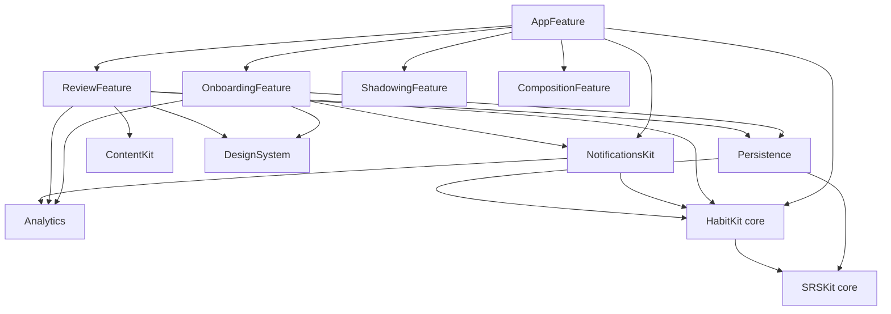

# Phase 2 前倒し — オンボーディング + 継続機能 実装計画

本書は [ux-design.md](./ux-design.md)（UX 正本）を実装 PR に落とすための計画である。設計判断の正本は [architecture.md](./architecture.md)、フェーズ定義は [roadmap.md](./roadmap.md)。roadmap Phase 2 のうち **SRS 復習キュー UI・ストリーク・デイリーゴール・ローカル通知リマインダー** を前倒しし、**オンボーディングを新規設計**する。StoreKit 2 / Paywall / ダッシュボード（グラフ類）/ コンテンツ拡充は本計画の範囲外。

## 0. スコープと前提

- **実行環境制約**: Linux VM では `Packages/SnapSpeakCore` のみ build/test 可能。iOS 側は macOS CI（`ios-macos` ジョブ）がコンパイラ。したがって **新規ロジックは純関数として core の新 target `HabitKit` に置き、Linux テストで担保**する。iOS 側は「core の呼び出し + UI + OS ラッパ」に限定する。
- **既存資産の再利用（二重実装禁止）**: `SRSKit.StudyDay`（04:00 境界）、`SRSKit.SRSEngine` / `SM2` / `GradingPolicy`、`PersistenceActor` の追記 API と fold、`AnalyticsCore`、既存の 1 Item 学習フロー（`ShadowingLessonView` / `CompositionCardView` と各 UseCase）。
- **SwiftData スキーマ方針**: アプリ未リリースのため **`SnapSpeakSchemaV1` をそのまま拡張**する（バージョン増分・マイグレーションステージなし）。根拠: 既存インストールが存在しないため後方互換が不要。**この判断はリリース後は許されない**ことを本書に明記し、リリース以降のスキーマ変更は VersionedSchema の増分 + `SchemaMigrationPlan` ステージ追加を必須とする。
- **通知**: `UserNotifications` のローカル通知のみ。サーバープッシュなし。
- **実機依存の分離**: 実録音・実 ASR・通知の実発火は実機/シミュレータ手動確認。プラン生成・ストリーク・通知の**予定計算**はすべて純関数として Linux テストで担保する（§6.3 に手動確認一覧）。
- **docs 同期**: 新モジュール（HabitKit / NotificationsKit / OnboardingFeature / ReviewFeature）と `UserSettings` 拡張は architecture.md §2.1 / §7.4 に追記する（「逸脱する場合は先に本書を更新する」規約。コミット C0）。

---

## 1. モジュール構成の変更

### 1.1 新規 target 一覧

| パッケージ | target | 種別 | 依存 | 責務 |
|-----------|--------|------|------|------|
| SnapSpeakCore | **HabitKit** | library | SRSKit（→ LanguageKit） | ストリーク計算、デイリーゴール進捗、セッションプラン生成、次レッスン選定、通知予定計算。**全て純関数・Foundation のみ** |
| SnapSpeakiOS | **NotificationsKit** | library | HabitKit(core), Analytics | `UNUserNotificationCenter` ラッパ actor。権限要求、予約の冪等同期、通知タップの委譲 |
| SnapSpeakiOS | **ReviewFeature** | library | HabitKit(core), SRSKit(core), ContentCore(core), ContentKit, Persistence, DesignSystem, Analytics | 今日のプラン組立サービス、復習セッションのコンテナ UI（アイテム UI は注入。Feature 間 import はしない） |
| SnapSpeakiOS | **OnboardingFeature** | library | HabitKit(core), Persistence, NotificationsKit, DesignSystem, Analytics | オンボーディング 2 画面と設定保存 |

既存 target の変更: `Persistence`（スキーマ拡張＋クエリ追加。**HabitKit に依存を追加**）、`AppFeature`（Home 再設計、Root 配線。**ReviewFeature / OnboardingFeature / NotificationsKit / HabitKit(core) に依存を追加**。`TodayViewModel` が `ReminderPlanner` / `StreakSnapshot` 等の HabitKit 型を直接使う）、`DesignSystem`（部品追加。依存追加なし）、`ShadowingFeature` / `CompositionFeature`（完了コールバックの追加のみ）、`AnalyticsCore`（イベント追加）。

### 1.2 依存方向（architecture §2.1 の禁止事項を維持）



- **Feature 同士の直接 import 禁止は維持**する。復習セッションはシャドーイング / 瞬間英作文の画面を必要とするが、ReviewFeature は `@ViewBuilder` によるビュー注入で受け取り、具体ビューの組立は AppFeature が行う（§4.3）。
- DesignSystem は引き続き機能知識を持たない（進捗リング・ストリーク表示は汎用部品として追加）。

---

## 2. SnapSpeakCore: HabitKit の API 設計

`Packages/SnapSpeakCore/Sources/HabitKit/` に 5 ファイル。乱数なし・`Date` / `Calendar` は全て引数注入（`Calendar.current` を内部参照しない）。全型 `Sendable`。

### 2.1 `StreakCalculator.swift`

```swift
import Foundation
import SRSKit

/// ストリーク救済ポリシー（ux-design §2.3）。
public enum StreakGracePolicy: Sendable, Equatable {
    /// 救済なし。1 学習日でも休むと途切れる。
    case none
    /// 休み 1 学習日までは橋渡しして継続（連続 2 日休むと途切れる）。休んだ日はカウントしない。
    case bridgeSingleRestDay
}

/// ストリークの導出スナップショット。正本は LessonAttempt 列（追記型）であり、本値は保存しない。
public struct StreakSnapshot: Sendable, Equatable {
    /// 現在継続中のストリーク（学習した日のみのカウント。橋渡し日は含めない）。
    public var currentStreakDays: Int
    /// 全履歴での最長ストリーク。
    public var longestStreakDays: Int
    /// 累計学習日数（ユニーク学習日）。
    public var totalStudyDays: Int
    /// 今日（現学習日）に 1 件以上の完了があるか。
    public var studiedToday: Bool
    /// currentStreakDays > 0 かつ今日未学習（通知文言の切替に使う）。
    public var isAtRisk: Bool
    /// 昨日を橋渡しして生きている状態（今日学習しないと明日途切れる）。
    public var isOnLastGraceDay: Bool

    public init(currentStreakDays: Int, longestStreakDays: Int, totalStudyDays: Int,
                studiedToday: Bool, isAtRisk: Bool, isOnLastGraceDay: Bool)
}

public enum StreakCalculator {
    /// LessonAttempt の作成時刻列からストリークを導出する純関数。
    /// - Parameters:
    ///   - activity: 全 `LessonAttempt.createdAt`（順不同・重複可。同一学習日は 1 日に潰す）
    ///   - now: 現在時刻（テストでは固定注入）
    ///   - calendar: 現在の端末タイムゾーンを持つ Calendar。過去の時刻もこの暦で再解釈する
    ///     （タイムゾーン移動でストリークが ±1 日変動しうることを仕様として許容。ux-design §2.3）
    ///   - dayBoundaryHour: 学習日境界。既定は `StudyDay.defaultBoundaryHour`（04:00）
    ///   - grace: 救済ポリシー。既定 `.bridgeSingleRestDay`
    public static func snapshot(
        activity: [Date],
        now: Date,
        calendar: Calendar,
        dayBoundaryHour: Int = StudyDay.defaultBoundaryHour,
        grace: StreakGracePolicy = .bridgeSingleRestDay
    ) -> StreakSnapshot
}
```

実装規則（テストで固定）: 学習日集合は `StudyDay.studyDay(of:calendar:dayBoundaryHour:)` の返す開始時刻を `calendar.date(byAdding: .day, ...)` で走査する（DST 安全。86400 秒加算をしない）。現在ストリークは today から逆順走査し、today 未学習は減点なしでスキップ、それ以前は休みの連続許容数（`.none` = 0、`.bridgeSingleRestDay` = 1）を超えた時点で打ち切る。

### 2.2 `DailyGoal.swift`

```swift
import Foundation

/// 1 日の学習目標（アイテム数）。UserSettings に保存される値の意味論を core に固定する。
public struct DailyGoal: Sendable, Equatable, Codable {
    /// 1 学習日に完了するアイテム数。1 未満は 1 に正規化する。
    public var itemsPerDay: Int
    public init(itemsPerDay: Int)

    public static let light = DailyGoal(itemsPerDay: 5)
    public static let standard = DailyGoal(itemsPerDay: 10)
    public static let serious = DailyGoal(itemsPerDay: 20)
    /// オンボーディングと Settings が提示する選択肢（自由入力は提供しない）。
    public static let presets: [DailyGoal] = [.light, .standard, .serious]
}

/// 今日のゴール進捗（導出値。保存しない）。
public struct GoalProgress: Sendable, Equatable {
    public var completedItems: Int
    public var goalItems: Int
    /// 0.0...1.0 にクランプ済み。
    public var fraction: Double
    public var isMet: Bool
    public init(completedItems: Int, goalItems: Int)
}

public enum GoalEvaluator {
    /// 当日完了数と目標から進捗を導出する。completedToday < 0 は 0 に正規化。
    public static func progress(completedToday: Int, goal: DailyGoal) -> GoalProgress
}
```

### 2.3 `SessionPlan.swift`

```swift
import Foundation
import SRSKit

/// SRSCardDTO から写像した、プラン生成に必要な最小情報（Persistence 非依存の Sendable 値）。
public struct DueCard: Sendable, Equatable {
    public var cardKey: String
    public var courseId: String
    public var itemId: String
    public var skill: Skill
    public var dueAt: Date
    /// 失敗後 10 分ゲート（SRSState.relearnGateAt 由来）。nil はゲートなし。
    public var relearnGateAt: Date?
    public init(cardKey: String, courseId: String, itemId: String,
                skill: Skill, dueAt: Date, relearnGateAt: Date?)
}

public struct SessionPlanPolicy: Sendable, Equatable {
    /// 1 セッションの復習上限（タイムゾーンジャンプ時の due 一斉到来もこれで削る）。
    public var maxReviews: Int
    /// 新規レッスンをプランに含めるか。
    public var includeNewLesson: Bool
    public init(maxReviews: Int, includeNewLesson: Bool)
    public static let standard = SessionPlanPolicy(maxReviews: 20, includeNewLesson: true)
}

/// 「今日の学習」1 セッションの内容（ux-design §2.4）。
public struct SessionPlan: Sendable, Equatable {
    /// 実施する復習。dueAt 昇順 → composition 優先 → itemId → courseId → cardKey（決定的）。
    public var reviews: [DueCard]
    /// 上限で切った残り due 件数（「ほか n 件はまた明日」表示用）。
    public var deferredDueCount: Int
    /// コース順で次の未完了レッスン。なければ nil。
    public var newLesson: LessonSummary?
    public var isEmpty: Bool { reviews.isEmpty && newLesson == nil }
    public init(reviews: [DueCard], deferredDueCount: Int, newLesson: LessonSummary?)
}

public enum SessionPlanner {
    /// due 判定と上限・並び順を適用してプランを組む純関数。
    /// 通常カード: dueAt <= now。失敗カード: relearnGateAt <= now（dueAt が翌学習日でも可）。
    /// architecture §6.4。Persistence.dueCards はゲート到達カードも含めて返す。
    public static func plan(
        dueCards: [DueCard],
        newLesson: LessonSummary?,
        now: Date,
        policy: SessionPlanPolicy = .standard
    ) -> SessionPlan
}
```

### 2.4 `NextLessonSelector.swift`

```swift
import Foundation

/// コース内アイテムの参照（courseId + itemId。itemId はコース内一意）。
public struct ItemRef: Hashable, Sendable {
    public var courseId: String
    public var itemId: String
    public init(courseId: String, itemId: String)
}

/// レッスンの骨格（ContentCore 非依存の写像。mode は "shadowing" | "composition" の生値）。
public struct LessonSummary: Sendable, Equatable {
    public var courseId: String
    public var lessonId: String
    public var mode: String
    public var itemIds: [String]
    public init(courseId: String, lessonId: String, mode: String, itemIds: [String])
}

public enum NextLessonSelector {
    /// カタログ順（Course → Unit → Lesson）の lessons から、
    /// 「全 Item に試行が付いていない」最初のレッスンを返す。全完了なら nil。
    /// itemIds が空のレッスンは完了扱いとしてスキップする。
    public static func next(
        lessons: [LessonSummary],
        attempted: Set<ItemRef>
    ) -> LessonSummary?
}
```

### 2.5 `ReminderPlanner.swift`

```swift
import Foundation
import SRSKit

public struct ReminderSettings: Sendable, Equatable {
    public var isEnabled: Bool
    /// 0...23 / 0...59。範囲外は plan() が空を返す（無効設定は通知しない）。
    public var hour: Int
    public var minute: Int
    public init(isEnabled: Bool, hour: Int, minute: Int)
}

public enum ReminderKind: String, Sendable, Codable, Equatable {
    case daily
    case streakRisk = "streak_risk"
}

/// 予約 1 件分の予定（OS 非依存の DTO。NotificationsKit が UNNotificationRequest に写像する）。
public struct PlannedReminder: Sendable, Equatable, Identifiable {
    /// "reminder-<yyyy-MM-dd>"（fireAt のカレンダー日。冪等な入れ替えキー）。
    public var id: String
    public var fireAt: Date
    public var kind: ReminderKind
    /// 文言整形用（streakRisk のとき現在ストリーク日数）。
    public var streakDays: Int
    public init(id: String, fireAt: Date, kind: ReminderKind, streakDays: Int)
}

public enum ReminderPlanner {
    /// 今後 horizonDays 日分の通知予定を返す純関数（ux-design §6）。
    /// 規則:
    /// - isEnabled == false または時刻が範囲外なら []
    /// - 各カレンダー日の hour:minute を候補にする（学習日境界ではなく壁時計。
    ///   深夜設定 01:00 なども尊重する）
    /// - fireAt <= now の候補は捨てる
    /// - 候補の属する学習日に既に学習済み（streak.studiedToday かつ候補が現学習日）なら捨てる
    /// - 最初の候補が現学習日で streak.isAtRisk のとき kind = .streakRisk、それ以外は .daily
    /// - 1 カレンダー日につき最大 1 件
    public static func plan(
        settings: ReminderSettings,
        streak: StreakSnapshot,
        now: Date,
        calendar: Calendar,
        dayBoundaryHour: Int = StudyDay.defaultBoundaryHour,
        horizonDays: Int = 3
    ) -> [PlannedReminder]
}
```

### 2.6 `Package.swift` 差分（SnapSpeakCore）

```swift
// products に追加
.library(name: "HabitKit", targets: ["HabitKit"]),
// targets に追加
.target(name: "HabitKit", dependencies: ["SRSKit"], swiftSettings: swift6),
.testTarget(name: "HabitKitTests", dependencies: ["HabitKit"], swiftSettings: swift6),
```

---

## 3. AnalyticsCore の追加

### 3.1 `AnalyticsEvent.swift` 追加 case

既存の制約（生テキスト・音声・個人データを表現できない型）を維持。ux-design §9 の表と 1:1。

```swift
case onboardingStarted
case onboardingCompleted(goalItems: Int, reminderEnabled: Bool, skippedGoal: Bool)
case onboardingSkipped(step: String)           // "welcome" | "goal"
case reviewSessionStarted(dueCount: Int, newCount: Int)
case reviewSessionCompleted(completedCount: Int, durationBand: String)
case goalMet(goalItems: Int)
case streakDayRecorded(streakBand: String)     // Quantization.streakBand
case streakBroken(lengthBand: String)
case reminderScheduled(kind: String)           // ReminderKind.rawValue
case reminderOpened(kind: String)
```

### 3.2 `Quantization.swift` 追加

```swift
/// ストリーク日数の帯（生値を送らない）。"1" | "2-3" | "4-6" | "7-13" | "14-29" | "30+"
public static func streakBand(days: Int) -> String
```

### 3.3 `LocalAnalytics`（iOS 側）

追加 case を snake_case のイベント ID（`onboarding_started` 等）でログ出力する switch を追加。

---

## 4. SnapSpeakiOS の変更

### 4.1 Persistence 拡張

**スキーマ方針**: `SnapSpeakSchemaV1` の `versionIdentifier` は 1.0.0 のまま、モデルにフィールドを追加する（未リリースのため許容。§0）。`SnapSpeakMigrationPlan` は変更しない。

**`Models/UserSettings.swift`** — 追加フィールド（`UserSettingsDTO` / `PersistenceMapping.settingsDTO` / `loadOrCreateSettings` / `saveSettings` にも同フィールドを追加）:

```swift
/// 1 日の目標アイテム数（DailyGoal.itemsPerDay）。既定 10。
public var dailyGoalItems: Int
/// リマインダー ON/OFF。既定 false（オンボーディングで opt-in）。
public var reminderEnabled: Bool
/// リマインド時刻の分（時は既存の reminderHour を使う。既定 0）。
public var reminderMinute: Int
/// オンボーディング完了時刻。nil = 未完了（RootView が判定に使う）。
public var onboardingCompletedAt: Date?
/// 最後に画面へ提示したストリーク日数。喪失検出（前回 > 0 かつ現在 0）と
/// streak_broken イベントの発火にのみ使う。ストリークの正本ではない。
public var lastKnownStreakDays: Int
```

- 既存 `reminderHour: Int?` は流用（nil = 時刻未設定。`reminderEnabled` と分離し、OFF にしても時刻設定を保持する）。
- `UserSettingsDTO.phase1Default` を更新: `dailyGoalItems: 10, reminderEnabled: false, reminderMinute: 0, onboardingCompletedAt: nil, lastKnownStreakDays: 0`。
- `fieldRevisionsJSON`（Phase 3 のフィールド別 revision）は本計画では触らない。

**`Models/SRSCard.swift`** — 追加フィールド:

```swift
/// 失敗後 10 分ゲート（SRSState.relearnGateAt の永続化。復習キューの due 判定に必要）。
public var relearnGateAt: Date?
```

`SRSCardDTO` にも同フィールドを追加し、`PersistenceActor.foldSRSCard` が `state.relearnGateAt` を書き込む。`PersistenceMapping.cardDTO` も更新。

**`PersistenceActor.swift`** — 追加クエリ（すべて Sendable DTO 返却。`import HabitKit` を追加）:

```swift
/// dueAt <= now のカードに加え、relearnGateAt <= now の失敗カードも含めて返す。
/// 同日再学習の最終判定は SessionPlanner（architecture §6.4）。
public func dueCards(now: Date) throws -> [SRSCardDTO]

/// 全 LessonAttempt の createdAt（ストリーク計算の入力。propertiesToFetch で軽量化）。
public func attemptActivityDates() throws -> [Date]

/// 期間内の LessonAttempt 件数（今日のゴール進捗。半開区間 [start, end)）。
public func attemptCount(from start: Date, to end: Date) throws -> Int

/// 試行が 1 件以上ある (courseId, itemId) の集合（次レッスン選定の入力）。
public func attemptedItemRefs() throws -> Set<ItemRef>

/// Attempt・habit markers・lastKnownStreakDays を単一 save で追記する。
/// 学習日は `write.createdAt`（引数 `now` は使わない。04:00 跨ぎの誤判定を防ぐ）。
public func appendAttemptEvaluatingHabit(
    _ write: LessonAttemptWrite,
    now: Date,
    timeZoneIdentifier: String
) throws -> AttemptHabitResult
```

実装注意: `#Predicate` で日付比較（`createdAt >= start && createdAt < end`、`dueAt <= now`）。`attemptedItemRefs` は fetch 後に `Set(map)` で潰す（SwiftData に distinct がないため。件数規模は年間数千行で問題ない）。`appendAttemptEvaluatingHabit` を途中 save 3 回に分けない（Attempt だけ残ると習慣イベントが永久喪失する）。

### 4.2 NotificationsKit（新規 target）

`Packages/SnapSpeakiOS/Sources/NotificationsKit/`:

```swift
// ReminderCenter.swift — UNUserNotificationCenter の抽象（hostless テスト用に OS 型を出さない）
public enum ReminderAuthorization: Sendable, Equatable {
    case notDetermined, denied, authorized
}

public struct ReminderRequest: Sendable, Equatable {
    public var id: String
    public var fireAt: Date
    public var title: String
    public var body: String
    /// analytics 用に userInfo へ入れる（reminder_opened の kind）。
    public var kindRawValue: String
}

public protocol ReminderCenter: Sendable {
    func authorization() async -> ReminderAuthorization
    func requestAuthorization() async -> Bool
    func pendingIds() async -> [String]
    func add(_ request: ReminderRequest) async
    func remove(ids: [String]) async
}

// LiveReminderCenter.swift — UNUserNotificationCenter.current() ラッパ。
// UNCalendarNotificationTrigger(dateMatching: fireAt の y/M/d/H/m, repeats: false) に写像。

// ReminderContent.swift — kind → String Catalog キー解決。
// String(localized:) を使い、日本語をハードコードしない。
public enum ReminderContent {
    public static func title(kind: ReminderKind, streakDays: Int) -> String
    public static func body(kind: ReminderKind, streakDays: Int, goalItems: Int) -> String
}

// ReminderScheduler.swift
public actor ReminderScheduler {
    public init(center: any ReminderCenter, analytics: any AnalyticsClient)

    /// 未決定のときだけ OS ダイアログを出す。拒否でも throw しない（学習を止めない）。
    public func requestAuthorizationIfNeeded() async -> Bool

    /// "reminder-" prefix の pending を全消しして plan を登録する冪等同期。
    /// 認可がない場合は何もしない。登録成功ごとに reminder_scheduled を track。
    public func sync(plan: [PlannedReminder], goalItems: Int) async
}
```

通知タップ: `UNUserNotificationCenterDelegate` 実装 `ReminderDelegate`（NotificationsKit 内、`@MainActor` class）を提供し、`App/Sources/SnapSpeakApp.swift` が起動時に `UNUserNotificationCenter.current().delegate` へ設定。タップで `reminder_opened(kind:)` を track（着地は通常起動 = ホーム。ディープリンク不要）。

### 4.3 ReviewFeature（新規 target）

`Packages/SnapSpeakiOS/Sources/ReviewFeature/`:

```swift
// TodaySnapshot.swift — ホームとセッションが共有する導出値
public struct TodaySnapshot: Sendable, Equatable {
    public var streak: StreakSnapshot
    public var goal: GoalProgress
    public var plan: SessionPlan
}

// TodayPlanService.swift — 集約サービス（純関数への入力集めと写像のみ。ロジックは HabitKit）
public struct TodayPlanService: Sendable {
    public var persistence: PersistenceActor
    public var courseStore: CourseStore

    public init(persistence: PersistenceActor, courseStore: CourseStore)

    /// dueCards / attemptActivityDates / attemptCount / attemptedItemRefs と
    /// courseStore.allCourses() を取得し、StreakCalculator / GoalEvaluator /
    /// NextLessonSelector / SessionPlanner に渡して TodaySnapshot を組む。
    public func makeToday(
        now: Date,
        timeZone: TimeZone,
        goal: DailyGoal,
        policy: SessionPlanPolicy
    ) async throws -> TodaySnapshot

    /// StoredCourse 列 → カタログ順 [LessonSummary]（ContentCore → HabitKit の写像）。
    /// static な純関数としてテスト可能に切り出す。
    public static func lessonSummaries(from courses: [StoredCourse]) -> [LessonSummary]

    /// SRSCardDTO → DueCard の写像（relearnGateAt を含む）。
    public static func dueCard(from dto: SRSCardDTO) -> DueCard?
}

// ReviewEntry.swift — セッション 1 アイテム分の解決結果
public struct ReviewEntry: Sendable, Equatable, Identifiable {
    public enum Origin: Sendable, Equatable {
        case due(cardKey: String)
        case newLesson
    }
    public var id: String            // courseId + "/" + itemId + origin 判別子
    public var courseId: String
    public var lessonId: String      // アイテムが属する実レッスン（コース走査で解決）
    public var itemId: String
    public var mode: LessonMode      // ContentCore の enum
    public var origin: Origin
}

// ReviewSessionViewModel.swift
@MainActor
public final class ReviewSessionViewModel: ObservableObject {
    public enum Phase: Equatable {
        case loading
        case running(index: Int, total: Int)
        case summary
    }
    @Published public private(set) var phase: Phase
    @Published public private(set) var entries: [ReviewEntry]
    @Published public private(set) var completedCount: Int
    @Published public private(set) var skippedCount: Int   // 欠損コンテンツ

    public init(plan: SessionPlan, courseStore: CourseStore, analytics: any AnalyticsClient)

    /// plan.reviews と plan.newLesson.itemIds を courseStore.allCourses() で
    /// ReviewEntry に解決する。解決できないものは skippedCount に積んで除外。
    /// 解決を static 純関数 `resolveEntries(plan:courses:) -> ([ReviewEntry], skipped: Int)`
    /// に切り出し、hostless テスト対象にする。
    public func load() async

    /// アイテム完了時に AppFeature 側から呼ばれる（既存 UseCase が永続化済み）。
    public func advance()

    public var current: ReviewEntry? { get }
}

// ReviewSessionView.swift — コンテナ。アイテム UI は注入（Feature 間 import 回避）
public struct ReviewSessionView<ItemContent: View>: View {
    /// itemContent は (entry, onFinished) を受け取り、既存の
    /// ShadowingLessonView / CompositionCardView を AppFeature 側で組み立てる。
    public init(
        viewModel: ReviewSessionViewModel,
        @ViewBuilder itemContent: @escaping (ReviewEntry, ReviewItemCallbacks) -> ItemContent,
        onClose: @escaping () -> Void
    )
    // 進捗ヘッダ（"%1$lld / %2$lld"）、離脱確認ダイアログ、
    // summary フェーズで ReviewSummaryView を表示。
}

// ReviewSummaryView.swift — 完了数 / ゴール前後 / ストリーク更新表示、
// 「ホームへ戻る」「続けて学習する」。
```

**既存 Feature への最小変更**: `ShadowingLessonView` と `CompositionCardView` に完了 / スキップのコールバックを分離する。

```swift
// ShadowingFeature
public var onCompleted: (() -> Void)?   // 採点または未採点完了後の「次へ」
public var onSkipped: (() -> Void)?     // マイク拒否。Attempt なし。completedCount に入れない

// CompositionFeature
public var onCompleted: (() -> Void)?
```

- 復習セッション: `onCompleted` → `advance()`、`onSkipped` → `skip()`。Item 提示時に `recordLastOpenedLesson`。
- 単発レッスン: 完了 / スキップ後に画面を閉じる（「次へ」が refresh だけで残る回帰を防ぐ）。
- `resolveEntries` は `courseId+itemId` が due と new で重なるとき new を除外する（失敗直後の 10 分ゲート迂回を防ぐ）。

### 4.4 OnboardingFeature（新規 target）

`Packages/SnapSpeakiOS/Sources/OnboardingFeature/`:

```swift
// OnboardingViewModel.swift
@MainActor
public final class OnboardingViewModel: ObservableObject {
    public enum Step: Equatable { case welcome, goal }
    @Published public private(set) var step: Step
    @Published public var selectedGoal: DailyGoal        // 既定 .standard
    @Published public var reminderEnabled: Bool          // 既定 true（UI 上の初期提示）
    @Published public var reminderTime: DateComponents   // 既定 21:00

    public init(
        persistence: PersistenceActor,
        scheduler: ReminderScheduler,
        analytics: any AnalyticsClient
    )

    public func appear()                 // onboarding_started（welcome 表示時 1 回）
    public func advanceToGoal()
    /// 設定保存 → reminderEnabled なら requestAuthorizationIfNeeded()（拒否なら
    /// reminderEnabled=false で保存し直す）→ onboardingCompletedAt = now →
    /// onboarding_completed を track。
    public func completeGoalStep() async -> Bool?  // 保存成功時のみ。失敗は nil で cover を閉じない
    /// step に応じ既定値で保存して完了扱い。onboarding_skipped(step:) を track。
    public func skip() async
    // FlowView が onFinished(startFirstLesson:) を発火する。complete 経由と
    // goal ステップからの skip は true（レッスン直行）、welcome からの skip は false（ホームへ）。
}

// OnboardingWelcomeView.swift / OnboardingGoalView.swift / OnboardingFlowView.swift
public struct OnboardingFlowView: View {
    /// onFinished(firstLesson:) — true なら呼び出し側（RootView）がシードの
    /// 最初のレッスンへ直接遷移する。
    public init(viewModel: OnboardingViewModel, onFinished: @escaping (_ startFirstLesson: Bool) -> Void)
}
```

### 4.5 AppFeature の変更

| ファイル | 変更 |
|----------|------|
| `TodayViewModel.swift`（新規） | `@MainActor final class TodayViewModel: ObservableObject`。`state: TodayState`（`loading / ready(TodaySnapshot) / empty / recovery(totalDays: Int, longest: Int)`）。`refresh(now:)` は全ての `await` 復帰点で世代確認する。`dismissRecovery()` は async。`regeneratePlanThenStart()` は plan が空なら false |
| `HomeView.swift`（再設計） | ux-design §4.3 のレイアウトに置換。主 CTA は `regeneratePlanThenStart()` が true のときだけ `.review` へ。回復カードの再開は `dismissRecovery()` 完了後に refresh/start |
| `RootView.swift` | (1) オンボーディングは保存成功時のみ cover を閉じる。(2) 単発レッスンは完了後 dismiss。セッションは `onCompleted`/`onSkipped` を分離し、Item 提示で `lastOpened` を更新。(3) `scenePhase` が `.active` に戻ったら `TodayViewModel.refresh()` |
| `SettingsView.swift` | 「継続」セクション追加（ux-design §4.6）: 目標プリセット Picker、リマインダートグル + 時刻、権限拒否時の設定アプリ導線。保存は `saveSettings` 経由、変更時にリマインダー再同期 |
| `AppDependencies.swift` | `reminderScheduler: ReminderScheduler`、`todayPlanService: TodayPlanService` を追加し `live(resourceBundle:)` で生成。`settings` は起動時ロード値を使う既存構造を維持 |

### 4.6 DesignSystem の追加（機能知識なしの汎用部品）

```swift
// ProgressRing.swift
public struct ProgressRing: View {
    /// progress: 0...1（クランプ）。達成時（>= 1.0）はチェック記号を中央に併記（色だけに依存しない）。
    public init(progress: Double, lineWidth: CGFloat = 8,
                accessibilityLabel: LocalizedStringKey, accessibilityValueText: String)
}

// StreakBadge.swift
public struct StreakBadge: View {
    /// days 日連続。isAtRisk のとき記号をアウトライン表示 + テキスト注記のスロットを持つ。
    /// 炎シンボルは accessibilityHidden。ラベルは呼び出し側がキーで渡す。
    public init(days: Int, isAtRisk: Bool, accessibilityLabel: LocalizedStringKey)
}

// CardContainer.swift
public struct CardContainer<Content: View>: View {
    /// ホームのカード群の共通枠（角丸・パディング・背景）。
    public init(@ViewBuilder content: () -> Content)
}
```

### 4.7 `Package.swift` 差分（SnapSpeakiOS）

- products 追加: `ReviewFeature` / `OnboardingFeature` / `NotificationsKit`。
- targets 追加: §1.1 の依存どおり。`Persistence` の dependencies に `.product(name: "HabitKit", package: "SnapSpeakCore")` を追加。`AppFeature` に `ReviewFeature` / `OnboardingFeature` / `NotificationsKit` と `.product(name: "HabitKit", package: "SnapSpeakCore")` を追加。

---

## 5. String Catalog 追加キー一覧（`Resources/Localizable.xcstrings`、ja 値）

既存 50 キーに以下を追加する。命名規約は ux-design §8。

| キー | ja 値 |
|------|-------|
| `onboarding.welcome.title` | 聞いて、まねて、即座に話す |
| `onboarding.welcome.subtitle` | シャドーイングと瞬間英作文を、1 日 10 分から。 |
| `onboarding.welcome.point_shadowing` | お手本に声を重ねるシャドーイング |
| `onboarding.welcome.point_composition` | 日本語を見て即座に英語で言う瞬間英作文 |
| `onboarding.welcome.start` | はじめる |
| `onboarding.skip` | あとで設定する |
| `onboarding.goal.title` | 1 日の目標を決めましょう |
| `onboarding.goal.subtitle` | 続けやすい小さな目標がおすすめです。あとから設定でいつでも変えられます。 |
| `onboarding.goal.preset_light` | かるめ（5 問/日） |
| `onboarding.goal.preset_standard` | ふつう（10 問/日） |
| `onboarding.goal.preset_serious` | しっかり（20 問/日） |
| `onboarding.goal.reminder_toggle` | 毎日リマインドする |
| `onboarding.goal.reminder_time` | リマインド時刻 |
| `onboarding.goal.start_lesson` | 最初のレッスンを始める |
| `home.today.start` | 今日の学習を始める |
| `home.today.review_count` | 復習 %lld 件 |
| `home.today.new_lesson` | 新しいレッスン |
| `home.today.deferred` | ほか %lld 件はまた明日 |
| `home.today.all_done_title` | 今日の目標を達成しました |
| `home.today.all_done_subtitle` | 明日もこの調子で続けましょう |
| `home.today.extra` | 続けて学習する |
| `home.today.empty_course` | コースがありません。コース一覧からダウンロードしてください。 |
| `home.goal.progress` | 今日 %1$lld / %2$lld 問 |
| `home.goal.ring_label` | 今日の目標の進捗 |
| `streak.days` | %lld 日連続 |
| `streak.badge_label` | %lld 日連続で学習中 |
| `streak.at_risk` | 今日まだ学習していません |
| `streak.last_grace` | 今日学習しないとストリークが途切れます |
| `streak.broken.title` | ストリークが途切れました |
| `streak.broken.subtitle` | 累計 %lld 日の学習記録は残っています。今日からまた始めましょう。 |
| `streak.broken.restart` | 今日の 1 問から再開する |
| `streak.longest` | 最長 %lld 日 |
| `streak.rule_note` | 1 日休んでもストリークは続きます。連続 2 日休むと途切れます。 |
| `review.session.title` | 復習 |
| `review.session.progress` | %1$lld / %2$lld |
| `review.session.next` | 次へ |
| `review.session.leave_title` | セッションを終了しますか？ |
| `review.session.leave_message` | 完了した分は保存されています。 |
| `review.session.leave_confirm` | 終了する |
| `review.session.new_lesson_divider` | ここから新しいレッスン |
| `review.summary.title` | セッション完了 |
| `review.summary.completed` | %lld 問 完了 |
| `review.summary.skipped` | 教材が見つからないため %lld 問スキップしました |
| `review.summary.goal_met` | 今日の目標を達成しました！ |
| `review.summary.streak_extended` | %1$lld → %2$lld 日連続 |
| `review.summary.back_home` | ホームへ戻る |
| `notification.daily.title` | 今日の英語、始めましょう |
| `notification.daily.body` | 1 日 %lld 問の目標が待っています。すきま時間にどうぞ。 |
| `notification.streak_risk.title` | ストリークが途切れそうです |
| `notification.streak_risk.body` | %lld 日連続の記録を、今日の 1 問でつなげましょう。 |
| `settings.section_habit` | 継続 |
| `settings.goal` | 1 日の目標 |
| `settings.reminder` | リマインダー |
| `settings.reminder_time` | 時刻 |
| `settings.reminder_denied` | 通知が許可されていません。システム設定から変更できます。 |
| `settings.open_notification_settings` | 通知設定を開く |

注意: 件数系キー（`%lld`）は将来の英語 UI で plural variation を付けられるよう、必ず変数のまま保持する（「8件」を値へ焼き込まない）。`home.title`（今日の学習）と `home.continue`（続きから始める）は既存キーを再利用する。

---

## 6. テスト計画

### 6.1 Linux で走る core テスト（`Packages/SnapSpeakCore/Tests/HabitKitTests/` ほか）

Swift Testing。`now` / `Calendar` / `TimeZone` は全ケース固定注入。乱数なし。

| テストファイル | ケース |
|----------------|--------|
| `StreakCalculatorTests.swift` | 空 activity → 全ゼロ / 今日 1 件のみ → current=1, studiedToday / **03:59 完了が前学習日、04:00 が当学習日**に入る / 連続 3 日 → 3 / 今日未学習・昨日学習 → current 維持 + isAtRisk / 昨日休み・一昨日学習 → 橋渡し維持 + isOnLastGraceDay / 昨日・一昨日休み → current=0 / `.none` ポリシーでは 1 日休みで 0 / 橋渡し日がカウントに入らない（学習 5 日 + 休み 2 回交互 → current=5）/ 同一学習日の複数完了が 1 日 / **タイムゾーン変更**（Asia/Tokyo で積んだ activity を America/Los_Angeles の Calendar で再解釈して破綻しない・イベント自体は不変）/ longest と total の独立性 / activity 順不同入力 |
| `GoalEvaluatorTests.swift` | goal 0 以下 → 1 に正規化 / ちょうど達成 / 超過時 fraction=1.0 クランプ / 負の completed → 0 / isMet 境界（9/10 は false、10/10 は true） |
| `SessionPlannerTests.swift` | 空 due + 新規なし → isEmpty / **dueAt == now ちょうど**は含む / relearnGateAt 未来 → 除外・ゲートちょうど now → 含む / **失敗カードは dueAt が翌学習日でもゲート到達で含む** / 上限 20 で切って deferredDueCount が正しい / 並び: dueAt 昇順 → 同時刻 composition 優先 → itemId → courseId → cardKey（入力逆順でも一致）/ includeNewLesson=false で newLesson が落ちる / due 21 件 + 新規ありの合成 |
| `NextLessonSelectorTests.swift` | 未着手コース → 先頭レッスン / 一部 Item のみ試行済み → 同レッスンが返る / 全 Item 試行済み → 次レッスン / 全コース完了 → nil / itemIds 空レッスンをスキップ / 複数コースでカタログ順を維持 |
| `ReminderPlannerTests.swift` | disabled → [] / hour=24 等の範囲外 → [] / 今日の時刻が未来かつ未学習 → 今日分あり・**streak>0 なら kind=streakRisk** / streak=0 なら daily / **今日学習済み → 今日分スキップ**、翌日から horizon 分 / 今日の時刻が過去 → 明日から / horizonDays=3 で件数上限 / id が "reminder-yyyy-MM-dd" 形式で日毎に一意 / **深夜設定の学習日跨ぎ**: now=0:30・設定 1:00・現学習日（昨日 04:00 開始）に学習済み → 1:00 の候補は現学習日に属するためスキップ / DST 切替日でも 1 日 1 件 |
| `QuantizationTests.swift`（追記） | streakBand 境界（1 / 2 / 3 / 4 / 6 / 7 / 13 / 14 / 29 / 30 / 100） |

既存の `SRSKitTests` / ほかは無変更で green を維持すること（HabitKit は SRSKit の公開 API のみ使用）。

### 6.2 macOS CI の hostless ロジックテスト（`App/project.yml` の test target 経由）

| 対象 | ケース |
|------|--------|
| `PersistenceTests` 追記 | UserSettings 新フィールドの既定値と roundtrip / `SRSCard.relearnGateAt` が fold で書かれる（q<3 のイベントで非 nil、q>=3 で nil）/ `dueCards(now:)` のフィルタと昇順 / `attemptCount(from:to:)` の半開区間境界 / `attemptActivityDates` / `attemptedItemRefs` の distinct / `appendAttemptEvaluatingHabit` の原子性と `write.createdAt` 学習日（04:00 跨ぎ） |
| `ReviewFeature` の純関数（新規 `ReviewFeatureTests` を PersistenceTests と同方式の hostless target として追加） | `TodayPlanService.lessonSummaries(from:)` がカタログ順 / `dueCard(from:)` の写像 / `ReviewSessionViewModel.resolveEntries(plan:courses:)` の欠損スキップ・due/new 重複除外 / intro 二重タップ / skip は completedCount に入れない |
| コンパイルゲート | `xcodegen generate` + `xcodebuild build`（OnboardingFeature / NotificationsKit / ReviewFeature を含む全体） |

### 6.3 CI で担保しない（実機 / シミュレータ手動）

- 通知の実発火・タップ起動・権限ダイアログの 3 状態（未決定 / 許可 / 拒否）
- オンボーディング → 最初のレッスン直行の 60 秒計測
- 復習セッション内の実録音・実 ASR（既存 Phase 1 の実機マトリクスに含まれる）
- Dynamic Type 最大 / VoiceOver 操作順 / Reduce Motion の実査（ux-design §7 をチェックリストとして使う）

---

## 7. 実装順序（PR 1 本・コミット順）

各コミットで CI（lint / core-linux / ios-macos）green を維持する。C1〜C2 は Linux のみで完結する。

| # | コミット | 内容 | 検証 |
|---|----------|------|------|
| C0 | docs 同期 | architecture.md §2.1 のモジュール表に HabitKit / NotificationsKit / OnboardingFeature / ReviewFeature を追記、§7.4 の UserSettings / SRSCard スキーマに §4.1 のフィールドを追記（「先に本書を更新する」規約） | レビュー |
| C1 | HabitKit | core 新 target + §2 の 5 ファイル + `HabitKitTests` 全ケース | **Linux `swift test`** |
| C2 | AnalyticsCore | 追加イベント case + `streakBand` + テスト追記 | **Linux `swift test`** |
| C3 | Persistence | スキーマフィールド追加、DTO / mapping / 既定値、追加クエリ、`LocalAnalytics` の新イベント出力、hostless テスト追記 | macOS CI |
| C4 | DesignSystem + NotificationsKit | `ProgressRing` / `StreakBadge` / `CardContainer`、`ReminderCenter` 抽象 + Live 実装 + `ReminderScheduler` + `ReminderContent`、String Catalog に `notification.*` キー | macOS CI |
| C5 | ReviewFeature | `TodayPlanService` / `ReviewEntry` / `ReviewSessionViewModel` / セッション UI、`ShadowingLessonView` / `CompositionCardView` への `onCompleted` 追加、`review.*` キー、hostless テスト | macOS CI |
| C6 | OnboardingFeature | 2 画面 + ViewModel + `onboarding.*` キー | macOS CI |
| C7 | AppFeature 統合 | `TodayViewModel`、`HomeView` 再設計、`RootView` 配線（オンボーディング分岐・セッション遷移・scenePhase 再計算）、`SettingsView` 継続セクション、`AppDependencies` 拡張、残りの String Catalog キー、App の delegate 配線 | macOS CI |
| C8 | 仕上げ | ux-design §5 状態マトリクスの目視確認メモ、README / AGENTS.md のモジュール一覧更新 | レビュー |

---

## 8. `App/project.yml` / `.swiftlint.yml` / CI への影響

| 対象 | 影響 |
|------|------|
| `App/project.yml` | (1) `PersistenceTests` target の dependencies に `package: SnapSpeakCore, product: HabitKit` を追加（Persistence が HabitKit を import するため直接リンクが必要。既存の SRSKit / ContentCore と同じ理由）。(2) hostless の `ReviewFeatureTests` target を追加する場合は `PersistenceTests` と同型で定義し、scheme `SnapSpeakiOSTests` の test targets に追加。(3) App 本体 target は変更不要（`AppFeature` product 経由で推移的に解決） |
| `.swiftlint.yml` | 変更不要。注意 1 点: `ReminderContent` の通知文言は `Text()` 系でないためカスタムルール `no_hardcoded_ui_japanese` に**掛からない**。`String(localized:)` 経由を必須とし、レビュー観点に明記する（ルール拡張は正規表現の誤検知リスクが高いため今回は見送り） |
| `.github/workflows/ci.yml` | 変更不要。`core-linux` は `HabitKitTests` を自動検出、`ios-macos` は xcodegen 経由で新 target を包含。`contentlint` 対象も不変 |
| `Resources/Localizable.xcstrings` | §5 のキー追加のみ（既存キーの変更なし） |
| `Info.plist`（`App/project.yml` 内） | 変更不要（ローカル通知に Usage Description は不要。バックグラウンドモードも追加しない） |
| `PrivacyInfo.xcprivacy` | 変更不要（通知はトラッキングに該当せず、新たな Required Reason API を使わない。`UserDefaults` は申告済み） |

---

## 9. リスクと対応

| リスク | 影響 | 対応 |
|--------|------|------|
| iOS 側のコンパイルエラーを Linux で検出できない | C3 以降の手戻り | ロジックを C1〜C2（core）へ最大限寄せた。iOS 側コミットは 1 コミットごとに `ios-macos` CI を回す（CI をコンパイラとして使う既存運用） |
| スキーマ V1 直接拡張の前例化 | リリース後に同じ手を使うと既存ユーザーのデータ破損 | §0 と architecture 追記に「未リリース限定の判断」と明記。リリース判定チェックリストに「以後のスキーマ変更は VersionedSchema 増分」を含める |
| `attemptActivityDates` の全件フェッチ | 履歴数万件で遅延 | 年間想定 1 万件未満で実測問題なし見込み。`propertiesToFetch: [\.createdAt]` で列を絞る。将来遅くなったら「学習日サマリのキャッシュ行」を導出テーブルとして追加（正本は Attempt のまま） |
| 復習セッションでの音声セッション切替頻発（shadowing ↔ composition 混在） | 遅延・グリッチ | 既存 AudioEngine が Item ごとに停止→再構成する設計のため機能上は安全。体感が悪ければ並び順ポリシー（§2.3 の tie-break）を skill ブロック化に変える余地を `SessionPlanPolicy` に残す（現時点では追加しない） |
| 通知の実発火は CI で検証不能 | リマインダー不具合の見逃し | 予定計算（純関数）を Linux テストで固定し、`ReminderScheduler.sync` の冪等性は `ReminderCenter` のフェイクで hostless テスト。実発火はシミュレータ手動（§6.3） |
| `lastKnownStreakDays` と導出値の不整合 | 喪失カードの誤表示 | この値は「最後に見せた値」であり正本ではない（§4.1 コメント）。表示のたびに導出値で上書きし、比較にのみ使う |
| 既存 View への `onCompleted` 追加が単発レッスン導線を壊す | 回帰 | 単発は完了後 dismiss。セッションだけ `advance()`。`onSkipped` は完了数に入れない |
| オンボーディングの通知権限が拒否された後の再要求不可 | リマインダー導線の行き止まり | OS 仕様どおり再ダイアログは出さず、Settings に `openSettingsURLString` 導線を常設（ux-design §4.6） |
| due 一斉到来（タイムゾーンジャンプ） | セッション肥大 | `SessionPlanPolicy.maxReviews = 20` で削り、`deferredDueCount` を UI に明示（architecture §6.4 と整合） |
