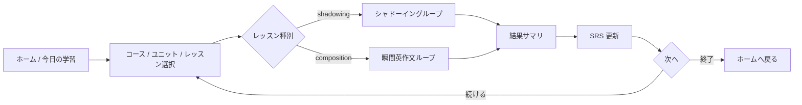
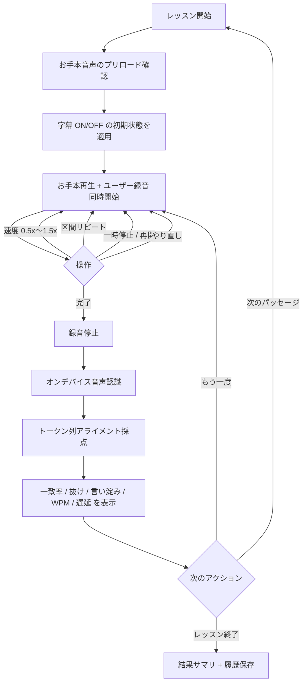
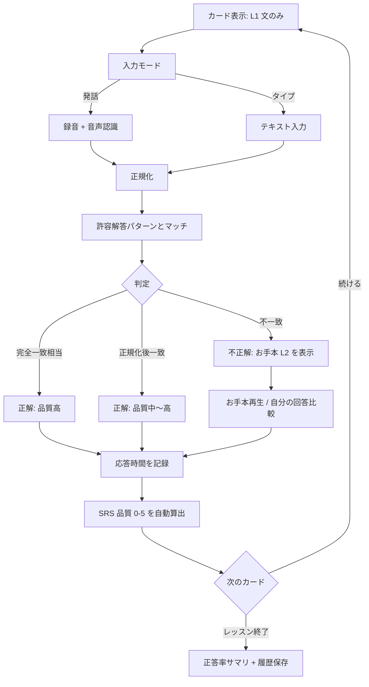
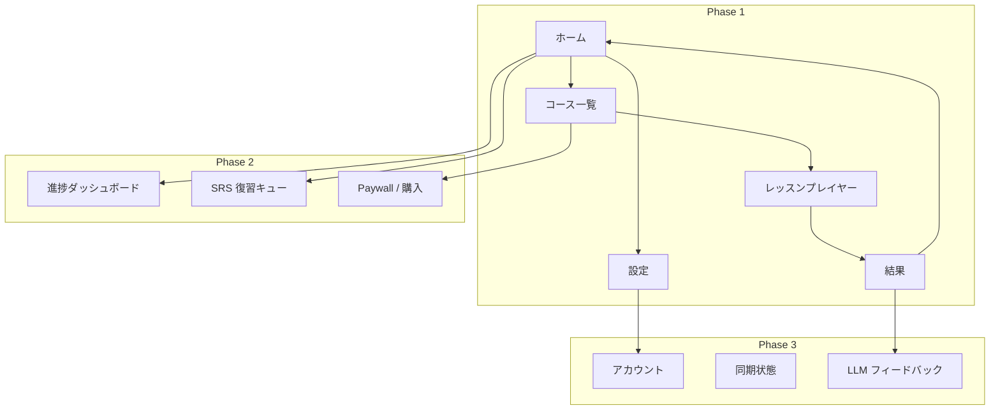

# プロダクト概要

SnapSpeak は、iPhone 上で「聞いて真似る（シャドーイング）」と「見て即座に言う（瞬間英作文）」を繰り返す語学学習アプリです。発音・リズム・即時産出を一つの学習ループにまとめ、通勤・隙間時間でも完結する体験を提供します。

最初の市場は **日本人向け英語学習**（UI 言語は日本語、L1=日本語、L2=英語）です。設計上は言語ペア `(sourceLanguage L1, targetLanguage L2)` を第一級概念とし、後続の L2 拡張および海外展開（UI 多言語化・L1 追加）を最初から許容します。

---

## 1. プロダクトビジョン

> 「耳と口を同時に鍛え、使える英語（将来は任意の L2）を、オフラインでも毎日続けられる形にする。」

- **聞く・真似る**: お手本音声にわずかに遅れて重ねるシャドーイング。一致率・抜け・言い淀み・遅延を可視化する。
- **見て・即座に言う**: L1 文を見て L2 で発話（またはタイプ）する瞬間英作文。正規化マッチングと SRS で定着させる。
- **どこでも完結**: コンテンツはダウンロード後に端末内で学習可能。アカウントなしでも MVP を使える。
- **言語を差し替え可能**: UI 言語・L1・L2 を独立に扱う。コンテンツスキーマと音声認識ロケールを言語ペア単位で切り替える。

---

## 2. ターゲットユーザーとペルソナ

### 2.1 市場セグメント（初期）

| セグメント | 優先度 | 説明 |
|------------|--------|------|
| 社会人の英語やり直し層 | P0 | TOEIC 中級前後、会話に苦手意識。通勤・昼休みの 10〜15 分を使いたい |
| 受験・資格のスピーキング補強層 | P1 | リーディングはできるが口が動かない。瞬間英作文の反復需要 |
| 海外赴任・出張前の短期集中層 | P1 | 実用フレーズを声に出して定着させたい |
| 語学学習ヘビーユーザー | P2 | 複数言語を学びたい。Phase 3 以降の L2 拡張の先行指標 |

初期は P0 に全機能を最適化する。P1 はコンテンツ選定（ビジネス／旅行／日常）で吸収する。

### 2.2 ペルソナ

#### ペルソナ A: やり直し社会人「佐藤 めぐみ」（32）

- **状況**: メーカー営業。TOEIC 680。会議で英語が出てこない。
- **制約**: 平日の可処分時間は通勤の往復 40 分。イヤホン必須。オフラインの電車内でも使いたい。
- **学習歴**: 単語アプリは続かない。発音矯正教室は高い。YouTube のシャドーイング動画は進捗が残らない。
- **ジョブ**: 「正しい音の型を体に入れつつ、よく使う文を即座に口から出せるようにしたい。」
- **成功条件**: 2 週間後に、よく使う 50 文を詰まらず言える。週 5 日・1 日 10 分が続く。

#### ペルソナ B: 資格補強の大学生「田中 海斗」（21）

- **状況**: 英検準1級対策。リーディングは安定、スピーキング模試で詰まる。
- **制約**: 寮の Wi-Fi が不安定。通知に弱い。無料範囲で価値を判断してから課金する。
- **ジョブ**: 「お手本に重ねる練習と、和文英訳の瞬間出力を同じアプリで回したい。」
- **成功条件**: レッスン完了が可視化され、弱点（抜け・遅延・語順）が次の復習に繋がる。

#### ペルソナ C（将来）: L2 拡張ユーザー「李 娜」（28）— Phase 3 以降

- **状況**: 日本語 UI のまま中国語（L2）を学びたい日本人、またはその逆の需要の先行指標。
- **含意**: コンテンツは言語ペア単位。UI 言語を日本語に固定したまま L2 だけ差し替えられること。

#### ペルソナ D（将来）: 海外ユーザー「Elena」（35）— Phase 4

- **状況**: スペイン語母語話者が英語を学ぶ（`es→en`）。UI はスペイン語または英語。
- **含意**: UI ≠ L1 ≠ L2。音声認識ロケール、日付・数値、ストア掲載文が独立に切り替わること。

### 2.3 非対象（初期にやらないこと）

- 子供向けゲーミフィケーション特化（幼児・小学校低学年のカリキュラム）
- 教師向けクラス管理・宿題配信（B2B LMS）
- ライブ講師とのビデオ通話
- 文法解説を主目的としたテキスト教材アプリ

---

## 3. 課題と提供価値

### 3.1 現状の課題

| 課題 | ユーザーが今やっていること | なぜ足りないか |
|------|----------------------------|----------------|
| 口が動かない | 聞き流し、字幕付き動画 | 産出（発話）がなく、定着しない |
| 進捗が見えない | YouTube / ポッドキャスト | 何を何回やったか、どこで詰まったかが残らない |
| オフラインで続かない | オンライン専用アプリ | 通勤のトンネル・機内・通信制限で中断する |
| 教材と練習が分断 | 参考書 + 録音アプリ | お手本・字幕・採点・復習間隔が一つのループになっていない |
| 瞬間英作文が手作業 | 問題集を見て口に出す | 許容解答の揺れ（縮約・冠詞）を自分で判定できない |
| 多言語への拡張が後付け | 英語専用アプリ | L2 追加のたびに UI・音声認識・SRS が崩壊する |

### 3.2 提供価値（バリュープロポジション）

1. **産出中心の短いループ**: 1 レッスン 5〜10 分。聞く → 重ねる / 見て言う → スコア → 次へ。
2. **端末内で完結する採点**: オンデバイス音声認識とトークン列アライメント。通信なしでフィードバック。
3. **弱点が次の復習になる**: 一致率・抜け・遅延・応答速度から SRS 品質を自動算出し、間隔反復する。
4. **言語ペアを第一級にする**: 同じエンジンで `ja→en` も将来の `ja→zh` / `es→en` も載せる。
5. **無料でコア体験、Pro で解放**: Phase 1 は無料で価値を証明。Phase 2 でフリーミアム課金。

### 3.3 価値仮説（検証したいこと）

- H1: シャドーイングの「お手本重ね + 一致率表示」は、聞き流しより継続率が高い。
- H2: 瞬間英作文の正規化マッチングは、厳密一致より不満が少なく、かつ「できた感」がある。
- H3: オフライン完結は通勤ユーザーのセッション中断を減らし、週あたり完了レッスン数を上げる。
- H4: ストリークとリマインダー（Phase 2）は、学習習慣の定着に寄与する（過剰通知は逆効果になりうる）。

---

## 4. コア学習ループ

アプリの基本単位は **レッスン (Lesson)** です。レッスンは複数の **アイテム (Item)** を持ち、Item はシャドーイング用パッセージ、または瞬間英作文用の文ペアです。

ホームの「今日の学習」は、未完了レッスンと SRS 期限到来アイテムを混ぜて提示する（Phase 1 は未完了レッスン優先の簡易キュー。Phase 2 で本格 SRS キュー）。

### 4.1 シャドーイング — UX フロー

目的: お手本の音韻・リズム・チャンクに、わずかな遅延で声を重ね、自己モニタリングできるようにする。

#### 画面要素（実装粒度）

| 要素 | 仕様 |
|------|------|
| 再生ヘッド | 波形または進捗バー。文単位タイムスタンプに沿って現在文をハイライト |
| 字幕 | デフォルト ON（設定で永続化）。L2 テキスト。将来 L1 対訳をトグル可能にする拡張点を持つ |
| 速度 | 0.5 / 0.75 / 1.0 / 1.25 / 1.5。ピッチ維持（`AVAudioUnitTimePitch`） |
| 区間リピート | 文単位（タイムスタンプ境界）をデフォルト。任意 A-B は Phase 2 候補 |
| 録音インジケータ | 入力レベルメーター。無音が続く場合は「マイク権限 / 無音」を案内 |
| 結果パネル | 総合一致率、抜け箇所のハイライト、言い淀み（繰り返し・フィラー）、WPM、平均遅延 ms |

#### 1 セッションの標準ステップ

1. お手本を一度通して聞く（任意。初回レッスンでは推奨バナー）。
2. 字幕 ON で重ね読み（音と文字の対応づけ）。
3. 字幕 OFF で重ね読み（聴覚依存）。
4. 結果を見て、抜けの多い文だけ区間リピート。
5. レッスン完了。履歴と SRS 用の品質スコアをローカル保存。

MVP では 2〜4 をユーザー操作に委ね、強制ウィザードにはしない。完了条件は「対象パッセージを 1 回以上録音し、採点結果を保存したこと」。

### 4.2 瞬間英作文 — UX フロー

目的: L1 の意味を保持したまま、L2 の文を **遅延なく** 産出する。文法解説よりも「出る口」を作る。

#### 画面要素（実装粒度）

| 要素 | 仕様 |
|------|------|
| 表面 | L1 文のみ。L2 は隠す |
| 入力切替 | マイク（デフォルト） / キーボード。前回選択を記憶 |
| タイマー | 応答開始までの時間と発話（入力）完了までの時間。UI は控えめ（数字の常時表示は圧迫感があるため、結果画面で見せる） |
| 判定演出 | 正解 / 不正解の短いフィードバック。不正解時のみ模範解答と許容パターンを展開 |
| ヒント | MVP は「最初の1語を表示」を 1 レッスンあたり制限付きで提供（無料制限のフックにもなる） |

#### 判定のユーザー向け説明（透明性）

- 「大文字・句読点・don't / do not などの揺れは同一視します」
- 冠詞・単複など意味が変わりうる差は MVP では不一致（厳密寄り）。Phase 3 の LLM 評価で意味同等を救う、と明記する

### 4.3 レッスン完了後の共通体験

- **結果サマリ**: 所要時間、完了アイテム数、平均スコア、弱点トピック（将来タグがあれば）。
- **履歴**: 端末内に追記。クラウド同期は Phase 3。
- **次のおすすめ**: 同一ユニットの次レッスン。期限到来の SRS カードがあれば「復習 n 件」を優先表示（Phase 2）。

---

## 5. 情報設計（画面マップ）

Phase 1 で必須の画面と、後続フェーズの拡張点。

| 画面 | Phase | 役割 |
|------|-------|------|
| ホーム | 1 | 今日の学習、続きから、シードコースへの導線 |
| コース一覧 / ユニット | 1 | Course > Unit > Lesson の階層ナビ |
| シャドーイングプレイヤー | 1 | 再生・録音・字幕・速度・区間リピート |
| 瞬間英作文プレイヤー | 1 | L1 提示、発話/タイプ、判定 |
| 結果 | 1 | 指標表示、再挑戦、次へ |
| 設定 | 1 | UI 言語（将来）、L1/L2、字幕既定、マイク、ダウンロード管理 |
| ダウンロード管理 | 1 | シード以外のユニットを取得 / 削除（MVP はコース単位） |
| ダッシュボード | 2 | 連続学習日、完了率、弱点 |
| SRS 復習 | 2 | 期限到来キュー |
| Paywall | 2 | StoreKit 2 サブスクリプション |
| アカウント / 同期 | 3 | Auth、進捗同期、競合の最終書き込み表示 |

---

## 6. コンテンツ方針（プロダクト視点）

技術スキーマは [architecture.md](./architecture.md) を正とする。ここでは学習体験上の方針のみ記す。

- **言語ペアがコースの所属先**: 「英語コース」ではなく `ja→en` のコース、と扱う。
- **1 レッスン = 1 つの主モード**: シャドーイング中心か瞬間英作文中心か。同じトピックのペアレッスンは Unit 内で隣接配置する。
- **文単位タイムスタンプ必須**: 字幕ハイライトと区間リピートの前提。無い音声は入稿しない。
- **瞬間英作文は許容パターンを先に書く**: 縮約、丁寧/カジュアル、助動詞の揺れを入稿時点で列挙する。
- **シードコンテンツ**: 初回起動で通信なしに 1 コース分（日常会話）を学習可能にする。これがオンボーディングそのもの。

初期シードの目安（分量の日数見積りではない。体験として必要な最小セット）:

- シャドーイング: 短いパッセージ（30〜60 秒相当）を複数レッスン
- 瞬間英作文: 1 レッスン 8〜12 文、許容解答 2〜5 パターン/文
- テーマ: 自己紹介、買い物、予定調整など、産出頻度の高い文

---

## 7. 競合との差別化

比較対象は「聞き流し」「単語 SRS」「オンライン英会話」「シャドーイング特化」の4類型。SnapSpeak は **産出の二刀流（重ね読み + 瞬間出力）をオフライン完結で回し、言語ペアを最初からデータモデルの中心に置く** 点で切る。

| 観点 | 聞き流し / ポッドキャスト学習 | 単語 SRS アプリ | オンライン英会話 | シャドーイング特化動画・アプリ | **SnapSpeak** |
|------|-------------------------------|-----------------|------------------|--------------------------------|---------------|
| 産出 | ほぼ無し | 単語単位 | 会話（高コスト） | 重ね読み中心 | パッセージ + 文単位産出 |
| 採点 | 無し | 自己申告が多い | 講師依存 | 録音再生のみ、またはクラウド ASR | オンデバイス ASR + アライメント |
| 瞬間英作文 | 無し | 単語・短句が中心 | 即興会話 | 弱い | コア機能。許容パターン + 将来 LLM |
| オフライン | ダウンロード次第 | 強いことが多い | 不可 | まちまち | 設計原則（ローカル完結） |
| 習慣化 | 再生位置のみ | SRS が強い | 予約が習慣 | 弱い | Phase 2 で SRS + ストリーク |
| 多言語 | コンテンツ追加 | 言語パック | 講師言語 | 英語偏重が多い | 言語ペア第一級 |
| 価格 | 無料〜サブスク | サブスク | 高単価 | 無料〜サブスク | フリーミアム（Phase 2） |

差別化を一文で表すと:

> 「お手本に重ねる」と「和文を見て即座に言う」を、通信なしの採点と間隔反復で一つの習慣に接続する。英語専用に閉じない。

意図的に戦わない領域: ライブ講師、書き言葉の本格添削、子供向けキャラクター学習、大規模オープンワールドの単語コレクション。

---

## 8. KPI 案

計測の原則は [architecture.md の分析設計](./architecture.md) に従う。ここではプロダクト指標の定義のみ固定する。ATT を要求しないファーストパーティ分析を優先し、個人を特定しないイベント名と属性だけを送る。

### 8.1 北極星指標

**週あたり「完了レッスン数 × ユニーク学習日数」の合成（Weekly Active Learning Intensity）**

- 単なる DAU ではなく、産出セッションが完了しているかを見る。
- 補助として **W1/W2 継続率**（初回レッスン完了者のうち、8 日後・15 日後にも 1 レッスン完了した割合）。

### 8.2 ファネル KPI

| 段階 | 指標 | 定義 |
|------|------|------|
| 獲得 | インストール → 初回レッスン開始 | シードを開いたユーザー / インストール |
| 活性化 | 初回レッスン完了 | 採点結果が 1 件以上保存された |
| 価値実感 | 3 レッスン完了 | シャドーイングと瞬間英作文を両方 1 回以上含むことが望ましい |
| 継続 | D7 / D30 学習継続 | 当該期間内に 1 レッスン以上完了 |
| 習慣 | 週 4 日以上学習 | ストリークではなく実日数 |
| 収益（Phase 2） | 無料制限到達率、トライアル開始、有料転換、解約 | StoreKit 2 トランザクションに紐づけ |

### 8.3 学習品質 KPI（機能別）

**シャドーイング**

| 指標 | 定義 | 使い方 |
|------|------|--------|
| 平均一致率 | トークンアライメントの一致率 | コンテンツ難易度と ASR 誤りの切り分け |
| 平均遅延 | お手本トークンに対する発話遅延 | 速度プリセットの妥当性 |
| 字幕 OFF 完了率 | 字幕 OFF で完了した試行の割合 | 「耳だけ」への移行 |
| 再挑戦率 | 同一 Item の再録音割合 | 高すぎると挫折、低すぎると形骸化 |

**瞬間英作文**

| 指標 | 定義 | 使い方 |
|------|------|--------|
| 初回正答率 | ヒントなしの初回一致 | 許容パターン不足 vs 難易度 |
| 正規化救済率 | 生テキスト不一致 → 正規化後一致 | 正規化規則の効果 |
| 発話利用率 | マイク入力 / 全回答 | ASR 品質と UX |
| 平均応答時間 | 表示から回答確定まで | SRS 品質算出の入力 |

**共通**

| 指標 | 定義 |
|------|------|
| レッスン完了率 | 開始 / 完了 |
| セッション中断率 | 開始後 N 秒以内にバックグラウンドへ（閾値は実装時にイベント設計で固定） |
| オフラインセッション比率 | ネットワーク非接続時に完了した学習の割合 |
| ダウンロード成功率 | マニフェスト適用の成功 / 失敗 |

### 8.4 国際化・拡張の先行指標（Phase 3〜4）

- L2 切替後の初回レッスン完了（言語ペア別）
- UI 言語 ≠ L1 のユーザー比率（海外展開後）
- コンテンツスキーマのバージョン不整合エラー率

### 8.5 使わない・慎重に扱う指標

- 生の録音音声、認識テキスト全文を分析基盤に送らない（プライバシー。必要なら端末内集計値のみ）。
- 一致率の絶対値をマーケティング数値にしない（ASR 誤認識で歪む）。
- ストリーク日数だけを成功指標にしない（通知疲れと形式的起動を招く）。

---

## 9. オンボーディング（プロダクト）

1. マイク権限の理由を先に説明し、最初のシードレッスンの直前に要求する（起動直後の連続ダイアログを避ける）。
2. 言語ペアは初期値 `ja→en`。設定から変更できることを示すが、Phase 1 では他ペアは非表示または「準備中」。
3. 最初の 1 レッスンはチュートリアル兼シード。完了までを活性化の定義とする。
4. アカウント作成は求めない（Phase 1）。Phase 3 で「端末を替えても続きから」として導入する。

---

## 10. 収益化のプロダクト方針（Phase 2 以降）

フリーミアム。

- **無料**: シードコース、各コースの先頭ユニット、1 日あたりの瞬間英作文回答数またはヒント数に上限。
- **Pro**: 全コース、ダウンロード上限撤廃、詳細ダッシュボード、将来の LLM フィードバック。
- Paywall は「制限に当たった瞬間」と「コース詳細のロック」の2箇所。初回起動では出さない。

価格・商品 ID・トライアル日数はストア申請時に別紙で決める。本ドキュメントでは StoreKit 2 サブスクリプションであることと、制限の種類だけを固定する。

---

## 11. 成功の定義（プロダクト）

Phase 1 のプロダクトとしての成功は、次をすべて満たすこととする（技術 DoD は [roadmap.md](./roadmap.md)）。

- シードだけで、シャドーイングと瞬間英作文の両方をオフライン完了できる。
- ユーザーが「今の自分の口の動き」と「お手本」の差を、一致率とハイライトで理解できる。
- 言語ペアと String Catalog がコード上に存在し、英語専用ハードコードに依存していない。
- 無料のコア体験が、Phase 2 の制限・課金の説明材料になる（何が Pro なのかを実体験との差分で語れる）。
