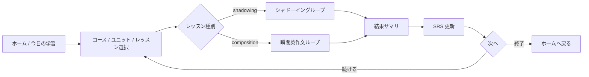
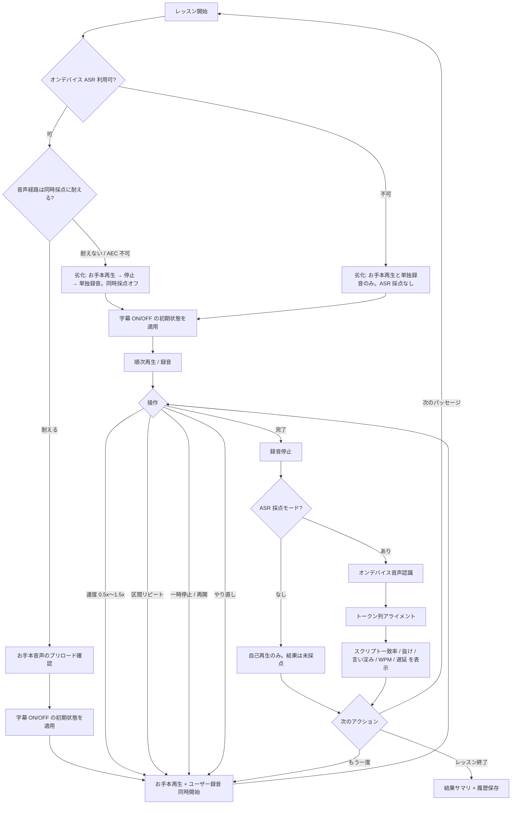
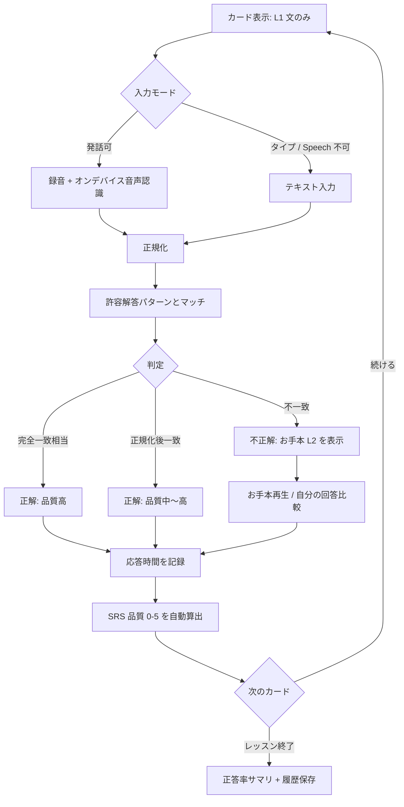
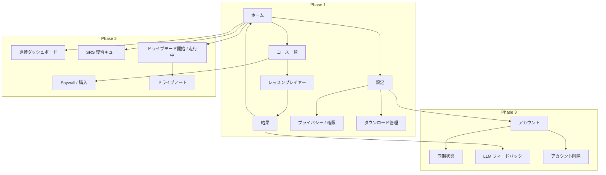

# プロダクト概要

SnapSpeak は、iPhone 上で「聞いて真似る（シャドーイング）」と「見て即座に言う（瞬間英作文）」を繰り返す語学学習アプリです。発音・リズム・即時産出を一つの学習ループにまとめ、通勤・隙間時間でも完結する体験を提供します。

主要ユースケースの第一級は **運転中の語学学習**（車内・ハンズフリー・アイズフリー）です。画面と手が使えない運転時間を、音声のみで自動進行する **ドライブモード**（UX 正本は [ux-design.md §10](./ux-design.md)）で産出練習に変えます。既存のコア体験（画面ありのレッスン・SRS・習慣化）は維持したまま、ドライブモードをその上に載せます。

最初の市場は **日本人向け英語学習**（UI 言語は日本語、L1=日本語、L2=英語）です。設計上は言語ペア `(sourceLanguage L1, targetLanguage L2)` を第一級概念とし、後続の L2 拡張および海外展開（UI 多言語化・L1 追加）を最初から許容します。

フェーズ分割の正本は [roadmap.md](./roadmap.md)、実装方針の正本は [architecture.md](./architecture.md) です。

---

## 1. プロダクトビジョン

> 「耳と口を同時に鍛え、使える英語（将来は任意の L2）を、オフラインでも毎日続けられる形にする。」

- **聞く・真似る**: お手本音声にわずかに遅れて重ねるシャドーイング。**スクリプト一致率（語の再現度）**・抜け・言い淀み・遅延を可視化する。これは発音の美しさの採点ではなく、ASR が復元した語がお手本スクリプトをどれだけ覆ったかの指標である。
- **見て・即座に言う**: L1 文を見て L2 で発話（またはタイプ）する瞬間英作文。正規化マッチングと SRS で定着させる。
- **運転中でも完結**: 乗車前のワンタップだけで、視線ゼロ・操作ゼロの音声セッション（ドライブモード）が自動進行する。「日本語 → ポーズ → 英語正解」「お手本 → 重ねて発話」を車内で回し、未採点でも学習完了として習慣に積む。
- **どこでも完結**: コンテンツは CDN からダウンロード後に端末内で学習可能。シード同梱によりアカウントなし・通信なしでも MVP を使える。
- **言語を差し替え可能**: UI 言語・L1・L2 を独立に扱う。日付・数値はユーザーの地域設定（`Locale.autoupdatingCurrent`）に従い、UI 言語とも L1/L2 とも独立させる。コンテンツ言語は正規化済み BCP-47（例: `zh-Hans`）で持つ。

---

## 2. ターゲットユーザーとペルソナ

### 2.1 市場セグメント（初期）

| セグメント | 優先度 | 説明 |
|------------|--------|------|
| 車通勤・長距離運転層 | P0 | 毎日 20 分〜1 時間超の運転時間を学習に使いたい。画面と手が使えないため音声完結・自動進行が必須。車載 Bluetooth 前提 |
| 社会人の英語やり直し層 | P0 | TOEIC 中級前後、会話に苦手意識。通勤・昼休みの 10〜15 分を使いたい |
| 受験・資格のスピーキング補強層 | P1 | リーディングはできるが口が動かない。瞬間英作文の反復需要 |
| 海外赴任・出張前の短期集中層 | P1 | 実用フレーズを声に出して定着させたい |
| 語学学習ヘビーユーザー | P2 | 複数言語を学びたい。Phase 3 以降の L2 拡張の先行指標 |

初期は P0 に全機能を最適化する（車通勤層はドライブモード、やり直し層は画面ありのコアループが主接点で、コンテンツ・SRS・習慣化は共通）。P1 はコンテンツ選定（ビジネス／旅行／日常）で吸収する。

### 2.2 ペルソナ

#### ペルソナ A: やり直し社会人「佐藤 めぐみ」（32）

- **状況**: メーカー営業。TOEIC 680。会議で英語が出てこない。
- **制約**: 平日の可処分時間は通勤の往復 40 分。イヤホン必須。オフラインの電車内でも使いたい。
- **学習歴**: 単語アプリは続かない。発音矯正教室は高い。YouTube のシャドーイング動画は進捗が残らない。
- **ジョブ**: 「正しい音の型を体に入れつつ、よく使う文を即座に口から出せるようにしたい。」
- **成功条件**: 2 週間後に、よく使う 50 文を詰まらず言える。週 5 日・1 日 10 分が続く。

#### ペルソナ B: 資格補強の大学生「田中 海斗」（21）

- **状況**: 英検準1級対策。リーディングは安定、スピーキング模試で詰まる。
- **制約**: 寮の Wi-Fi が不安定。通知に弱い。無料範囲で価値を判断してから課金する。
- **ジョブ**: 「お手本に重ねる練習と、和文英訳の瞬間出力を同じアプリで回したい。」
- **成功条件**: レッスン完了が可視化され、弱点（抜け・遅延・語順）が次の復習に繋がる。

#### ペルソナ E: 車通勤の営業「高橋 誠」（41）

- **状況**: 地方在住メーカー営業。海外取引先が増え英語が必要。片道 35 分の車通勤。
- **制約**: 運転中は画面を見られず手も使えない。イヤホンは使わず車載 Bluetooth（A2DP）。信号・ナビ・電話の割り込みが日常的にある。
- **学習歴**: ポッドキャストの聞き流しは続いたが、口を動かさないので話せるようにならなかった。画面前提の学習アプリは車内で使えず離脱。
- **ジョブ**: 「エンジンをかける前にワンタップして、あとはハンドルから手を離さずに、日本語を聞いて英語を口に出す練習を往復分やりたい。」
- **成功条件**: 通勤で毎日 1 ドライブセッションが完走し、ゴールとストリークに積まれる。ナビや着信で壊れない。帰宅後にドライブノートで今日の表現を見返せる。

#### ペルソナ C（将来）: L2 拡張ユーザー「李 娜」（28）— Phase 3 以降

- **状況**: 日本語 UI のまま中国語（簡体字、`zh-Hans`）を学びたい日本人、またはその逆の需要の先行指標。
- **含意**: コンテンツは言語ペア単位。UI 言語を日本語に固定したまま L2 だけ差し替えられること。中国語と韓国語は別ストラテジ（同じ「CJK」処理にまとめない）。

#### ペルソナ D（将来）: 海外ユーザー「Elena」（35）— Phase 4

- **状況**: スペイン語母語話者が英語を学ぶ（`es→en`）。UI はスペイン語または英語。
- **含意**: **UI ≠ L1 ≠ L2**。さらに **日付・数値の地域 ≠ UI 言語** がありうる（例: UI 英語、地域スペイン、L1 スペイン語、L2 英語）。音声認識ロケールとストア掲載文も独立に切り替わる。

### 2.3 非対象（初期にやらないこと）

- 子供向けゲーミフィケーション特化（幼児・小学校低学年のカリキュラム）
- 教師向けクラス管理・宿題配信（B2B LMS）
- ライブ講師とのビデオ通話
- 文法解説を主目的としたテキスト教材アプリ
- 発音クリニック（音素・韻律の専門的診断）。本アプリの採点は **スクリプト一致 / 語の再現度** であり、発音精度そのものではない

---

## 3. 課題と提供価値

### 3.1 現状の課題

| 課題 | ユーザーが今やっていること | なぜ足りないか |
|------|----------------------------|----------------|
| 口が動かない | 聞き流し、字幕付き動画 | 産出（発話）がなく、定着しない |
| 運転時間を学習に使えない | ポッドキャスト・ラジオの聞き流し | 産出がない。既存学習アプリは画面注視・手操作前提で、運転中は安全上使えない |
| 進捗が見えない | YouTube / ポッドキャスト | 何を何回やったか、どこで詰まったかが残らない |
| オフラインで続かない | オンライン専用アプリ | 通勤のトンネル・機内・通信制限で中断する |
| 教材と練習が分断 | 参考書 + 録音アプリ | お手本・字幕・採点・復習間隔が一つのループになっていない |
| 瞬間英作文が手作業 | 問題集を見て口に出す | 許容解答の揺れ（縮約・冠詞）を自分で判定できない |
| 多言語への拡張が後付け | 英語専用アプリ | L2 追加のたびに UI・音声認識・SRS が崩壊する |

### 3.2 提供価値（バリュープロポジション）

1. **産出中心の短いループ**: 1 レッスン 5〜10 分。聞く → 重ねる / 見て言う → スコア → 次へ。
2. **端末内で完結する採点**: オンデバイス音声認識とトークン列アライメント。通信なしでフィードバック。サーバー認識へは暗黙移行しない。
3. **弱点が次の復習になる**: スクリプト一致率・抜け・遅延・応答速度から SRS 品質を自動算出し、間隔反復する。
4. **言語ペアを第一級にする**: 同じエンジンで `ja→en` も将来の `ja→zh-Hans` / `es→en` も載せる。
5. **無料でコア体験、Pro で解放**: Phase 1 は無料で価値を証明。Phase 2 でフリーミアム課金。
6. **運転中の産出練習**: 音声のみで自動進行するドライブモード。乗車前ワンタップ → 視線ゼロ・操作ゼロ → 停車後にドライブノート。未採点でも学習完了として習慣（ストリーク / ゴール）に積む。

### 3.3 価値仮説（検証したいこと）

- H1: シャドーイングの「お手本重ね + スクリプト一致率表示」は、聞き流しより継続率が高い。
- H2: 瞬間英作文の正規化マッチングは、厳密一致より不満が少なく、かつ「できた感」がある。
- H3: オフライン完結は通勤ユーザーのセッション中断を減らし、週あたり完了レッスン数を上げる。
- H4: ストリークとリマインダー（Phase 2）は、学習習慣の定着に寄与する（過剰通知は逆効果になりうる）。
- H5: 運転中の音声完結セッション（ドライブモード）は、画面前提では学習に使えなかった時間を取り込み、週あたり完了アイテム数と学習日数を上積みする（聞き流しに対しては「発話ポーズがある」ことが定着差になる）。

---

## 4. コア学習ループ

アプリの基本単位は **レッスン (Lesson)** です。レッスンは複数の **アイテム (Item)** を持ち、Item はシャドーイング用パッセージ、または瞬間英作文用の文ペアです（同一 Item が両方を兼ねることはない）。

ホームの「今日の学習」は、未完了レッスンと SRS 期限到来アイテムを混ぜて提示する（Phase 1 は未完了レッスン優先の簡易キュー。Phase 2 で本格 SRS キュー）。

### 4.1 シャドーイング — UX フロー

目的: お手本の音韻・リズム・チャンクに、わずかな遅延で声を重ね、自己モニタリングできるようにする。

採点の約束（画面上でも短く出す）:

> 表示する **スクリプト一致率** は、音声認識が拾った語がお手本台本をどれだけ再現したかです。発音の上手さそのものではありません。認識の自信が低いときは、復習間隔を自動では進めません。

#### 画面要素（実装粒度）

| 要素 | 仕様 |
|------|------|
| 再生ヘッド | 波形または進捗バー。**字幕用**の文・フレーズ境界（`captionSegments`）に沿って現在区間をハイライト。波形が使えない環境では経過秒と現在テキストで代替する |
| 字幕 | デフォルト ON（設定で永続化）。L2 テキスト。将来 L1 対訳をトグル可能にする拡張点を持つ |
| 速度 | 0.5 / 0.75 / 1.0 / 1.25 / 1.5。ピッチ維持（`AVAudioUnitTimePitch.pitch = 0` = 0 cents） |
| 区間リピート | 文単位（`captionSegments` 境界）をデフォルト。任意 A-B は Phase 2 候補 |
| 録音インジケータ | システムおよびアプリ内の録音中表示。入力レベルメーター。無音が続く場合は「マイク権限 / 無音」を案内 |
| 結果パネル | **スクリプト一致率（語の再現度）**、抜け箇所のハイライト（色だけに依存しない記号も併用）、言い淀み、WPM、遅延。遅延は語タイミング付き教材のみ精密。無い教材は文単位の概算と明記 |
| 劣化バナー | ASR 不可・同時採点が無効・権限不足を隠さず出す |

#### 権限とできること（ユーザー向け）

| マイク | 音声認識 | シャドーイング | 瞬間英作文 |
|--------|----------|----------------|------------|
| 拒否 | 任意 | お手本再生のみ（録音不可） | タイプ入力 |
| 許可 | 拒否 | 録音・自己再生可。ASR 採点なし | タイプ入力（発話判定なし） |
| 許可 | 許可 | 通常（経路が許せば同時採点） | 発話またはタイプ |

拒否時は設定アプリへの導線を出し、フォアグラウンド復帰で再判定する。タイプ入力は **瞬間英作文の代替** であり、シャドーイングの代替にはしない。

#### 1 セッションの標準ステップ

1. お手本を一度通して聞く（任意。初回レッスンでは推奨バナー）。プレビュー再生は高音質経路（`.playback`）。
2. 字幕 ON で重ね読み（音と文字の対応づけ）。
3. 字幕 OFF で重ね読み（聴覚依存）。
4. 結果を見て、抜けの多い文だけ区間リピート。
5. レッスン完了。履歴と（信頼できる採点がある場合のみ）SRS 用の品質をローカル保存。

MVP では 2〜4 をユーザー操作に委ね、強制ウィザードにはしない。完了条件は「対象パッセージを 1 回以上録音したこと」。ASR 採点は対応端末でのみ付く。

### 4.2 瞬間英作文 — UX フロー

目的: L1 の意味を保持したまま、L2 の文を **遅延なく** 産出する。文法解説よりも「出る口」を作る。

#### 画面要素（実装粒度）

| 要素 | 仕様 |
|------|------|
| 表面 | L1 文のみ。L2 は隠す |
| 入力切替 | マイク（デフォルト、権限があるとき） / キーボード。前回選択を記憶 |
| タイマー | 応答開始までの時間と発話（入力）完了までの時間。UI は控えめ（数字の常時表示は圧迫感があるため、結果画面で見せる） |
| 判定演出 | 正解 / 不正解の短いフィードバック。不正解時のみ模範解答と許容パターンを展開。色だけに依存しない |
| ヒント | MVP は「最初の1語を表示」を 1 レッスンあたり制限付きで提供（無料制限のフックにもなる） |

#### 判定のユーザー向け説明（透明性）

- 「大文字・句読点・don't / do not などの揺れは同一視します」
- 冠詞・単複など意味が変わりうる差は MVP では不一致（厳密寄り）。Phase 3 の LLM 評価で意味同等を救う、と明記する

### 4.3 レッスン完了後の共通体験

- **結果サマリ**: 所要時間、完了アイテム数、平均スクリプト一致率（該当時）、弱点トピック（将来タグがあれば）。
- **履歴**: 端末内に追記。クラウド同期は Phase 3。
- **次のおすすめ**: 同一ユニットの次レッスン。期限到来の SRS カードがあれば「復習 n 件」を優先表示（Phase 2）。

### 4.4 ドライブモード（音声完結ループ・Phase 2）

同じコンテンツ・同じプラン（due 復習 + 新規）を、**音声のみ・自動進行** で提示する別形態。乗車前ワンタップ → 開始アナウンス → 「日本語 → 発話ポーズ → 英語正解」（瞬間英作文）/「お手本 × N 回で重ねて発話」（シャドーイング）→ 終了アナウンス → 停車後ドライブノート。走行中はマイクを使わず、完了は未採点 Attempt として習慣に積む（採点つきの定着は通常レッスンの役割）。仕様の正本は [ux-design.md §10](./ux-design.md)。

---

## 5. 情報設計（画面マップ）

Phase 1 で必須の画面と、後続フェーズの拡張点。

| 画面 | Phase | 役割 |
|------|-------|------|
| ホーム | 1 | 今日の学習、続きから、シードコースへの導線 |
| コース一覧 / ユニット | 1 | Course > Unit > Lesson の階層ナビ。CDN 未取得はダウンロード導線 |
| シャドーイングプレイヤー | 1 | 再生・録音・字幕・速度・区間リピート。劣化モードの明示 |
| 瞬間英作文プレイヤー | 1 | L1 提示、発話/タイプ、判定 |
| 結果 | 1 | スクリプト一致率などの指標、再挑戦、次へ |
| 設定 | 1 | L1/L2、字幕既定、ダウンロード管理。**UI 言語はシステム（設定アプリのアプリ別言語）を正とし、アプリ内で `AppleLanguages` を書き換えない** |
| プライバシー | 1 | ポリシーリンク、権限の用途、録音の保持期間、設定アプリへの導線 |
| ダウンロード管理 | 1 | CDN コースの取得 / 更新 / 削除、容量表示（MVP はコース単位） |
| ダッシュボード | 2 | 連続学習日、完了率、弱点 |
| SRS 復習 | 2 | 期限到来キュー |
| ドライブモード開始 / 走行中 | 2 | 乗車前ワンタップ開始、セッション長選択、走行中グランスビュー（大文字・1 情報）。仕様は ux-design §10 |
| ドライブノート | 2 | 停車後の振り返り。やった表現一覧・聞き直し・通常レッスンへの導線 |
| Paywall | 2 | StoreKit 2。価格・期間・提供内容・復元・規約・プライバシーリンク |
| アカウント / 同期 | 3 | Auth、進捗同期、アカウント削除（同一リリースで必須） |

---

## 6. コンテンツ方針（プロダクト視点）

技術スキーマは [architecture.md](./architecture.md) を正とする。ここでは学習体験上の方針のみ記す。

- **言語ペアがコースの所属先**: 「英語コース」ではなく `ja→en` のコース、と扱う。言語タグは正規化済み BCP-47（必要なら script を含む）。
- **1 レッスン = 1 つの主モード**: シャドーイング中心か瞬間英作文中心か。同じトピックのペアレッスンは Unit 内で隣接配置する。
- **字幕と語タイミングは別データ**: 字幕ハイライト・区間リピートは `captionSegments`。遅延の精密計算は強制アライメント済みの `wordTimings` / `tokenTimings`。後者が無い教材では遅延を文単位概算に落とす。無い音声は入稿しない。
- **瞬間英作文は許容パターンを先に書く**: 縮約、丁寧/カジュアル、助動詞の揺れを入稿時点で列挙する。
- **シードコンテンツ**: 初回起動で通信なしに 1 コース分（日常会話）を学習可能にする。CDN 障害時の保証でもある。
- **CDN**: Phase 1 からマニフェスト経由で追加 1 コース以上を取得・検証・オフライン再生・更新・削除できる。
- **長さ**: Speech のオンデバイス認識上限近傍を避ける。シャドーイング 1 Item は目安 15〜45 秒（30〜60 秒の上限際は分割する）。

初期シードの目安（分量の日数見積りではない。体験として必要な最小セット）:

- シャドーイング: 短いパッセージ（15〜45 秒）を複数レッスン
- 瞬間英作文: 1 レッスン 8〜12 文、許容解答 2〜5 パターン/文
- テーマ: 自己紹介、買い物、予定調整など、産出頻度の高い文

---

## 7. 競合との差別化

比較対象は「聞き流し」「単語 SRS」「オンライン英会話」「シャドーイング特化」の4類型。SnapSpeak は **産出の二刀流（重ね読み + 瞬間出力）をオフライン完結で回し、言語ペアを最初からデータモデルの中心に置く** 点で切る。

| 観点 | 聞き流し / ポッドキャスト学習 | 単語 SRS アプリ | オンライン英会話 | シャドーイング特化動画・アプリ | **SnapSpeak** |
|------|-------------------------------|-----------------|------------------|--------------------------------|---------------|
| 産出 | ほぼ無し | 単語単位 | 会話（高コスト） | 重ね読み中心 | パッセージ + 文単位産出 |
| 採点 | 無し | 自己申告が多い | 講師依存 | 録音再生のみ、またはクラウド ASR | オンデバイス ASR による **スクリプト一致 / 語の再現度**（発音診断ではない） |
| 瞬間英作文 | 無し | 単語・短句が中心 | 即興会話 | 弱い | コア機能。許容パターン + 将来 LLM |
| **運転中学習** | 再生は可だが産出なし | 不可（画面前提） | 不可 | まちまち（画面前提が多い） | **ドライブモード**（音声のみ・自動進行・発話ポーズつき・未採点でも習慣に積む） |
| オフライン | ダウンロード次第 | 強いことが多い | 不可 | まちまち | 設計原則（ローカル完結。サーバー ASR に依存しない） |
| 習慣化 | 再生位置のみ | SRS が強い | 予約が習慣 | 弱い | Phase 2 で SRS + ストリーク |
| 多言語 | コンテンツ追加 | 言語パック | 講師言語 | 英語偏重が多い | 言語ペア第一級 |
| 価格 | 無料〜サブスク | サブスク | 高単価 | 無料〜サブスク | フリーミアム（Phase 2） |

第 5 の類型として **AI 会話アプリ（例: Inko）** がある。「毎日 60 秒話すだけ」の低フリクション設計と会話直後の自動ノートで先行するが、リアルタイム AI 会話はオンライン・サーバー前提であり、画面と発話のやり取りを要するため運転中の安全設計でもない。SnapSpeak は Inko の学び（低フリクション開始・直後に届く価値・復習音声の自動生成）をドライブモードに翻訳しつつ（ux-design §10.2）、**オフライン完結・運転特化・SRS 接続** で差別化する。

差別化を一文で表すと:

> 「お手本に重ねる」と「和文を見て即座に言う」を、通信なしの採点と間隔反復で一つの習慣に接続する。運転中は音声だけでその習慣が回る。英語専用に閉じない。

意図的に戦わない領域: ライブ講師、書き言葉の本格添削、子供向けキャラクター学習、大規模オープンワールドの単語コレクション、音素単位の発音矯正。

---

## 8. KPI 案

計測の原則は [architecture.md の分析設計](./architecture.md) に従う。ここではプロダクト指標の定義のみ固定する。ATT を要求しないファーストパーティ分析を優先し、個人を特定しないイベント名と属性だけを送る。

### 8.1 北極星指標

**週あたり「完了レッスン数 × ユニーク学習日数」の合成（Weekly Active Learning Intensity）**

- 単なる DAU ではなく、産出セッションが完了しているかを見る。
- 補助として **W1/W2 継続率**（初回レッスン完了者のうち、8 日後・15 日後にも 1 レッスン完了した割合）。

### 8.2 ファネル KPI

| 段階 | 指標 | 定義 |
|------|------|------|
| 獲得 | インストール → 初回レッスン開始 | シードを開いたユーザー / インストール |
| 活性化 | 初回レッスン完了 | 録音または判定が 1 件以上保存された（ASR 非対応端末は録音完了で可） |
| 価値実感 | 3 レッスン完了 | シャドーイングと瞬間英作文を両方 1 回以上含むことが望ましい |
| 継続 | D7 / D30 学習継続 | 当該期間内に 1 レッスン以上完了 |
| 習慣 | 週 4 日以上学習 | ストリークではなく実日数 |
| 収益（Phase 2） | 無料制限到達率、トライアル開始、有料転換、解約 | StoreKit 2 トランザクションに紐づけ |

### 8.3 学習品質 KPI（機能別）

**シャドーイング**

| 指標 | 定義 | 使い方 |
|------|------|--------|
| 平均スクリプト一致率 | トークンアライメントの語の再現度 | コンテンツ難易度と ASR 誤りの切り分け。発音精度として解釈しない |
| 平均遅延 | 実際に提示されたお手本時刻に対する発話遅延 | 速度プリセットの妥当性。語タイミング無し教材は集計から除外または概算フラグ付き |
| 字幕 OFF 完了率 | 字幕 OFF で完了した試行の割合 | 「耳だけ」への移行 |
| 再挑戦率 | 同一 Item の再録音割合 | 高すぎると挫折、低すぎると形骸化 |
| 低 confidence 率 | ASR confidence が閾値未満で SRS を止めた割合 | 閾値校正 |

**瞬間英作文**

| 指標 | 定義 | 使い方 |
|------|------|--------|
| 初回正答率 | ヒントなしの初回一致 | 許容パターン不足 vs 難易度 |
| 正規化救済率 | 生テキスト不一致 → 正規化後一致 | 正規化規則の効果 |
| 発話利用率 | マイク入力 / 全回答 | ASR 品質と UX |
| 平均応答時間 | 表示から回答確定まで | SRS 品質算出の入力 |

**共通**

| 指標 | 定義 |
|------|------|
| レッスン完了率 | 開始 / 完了 |
| セッション中断率 | 開始後 N 秒以内にバックグラウンドへ（閾値は実装時にイベント設計で固定） |
| オフラインセッション比率 | ネットワーク非接続時に完了した学習の割合 |
| ダウンロード成功率 | マニフェスト適用の成功 / 失敗 |
| ドライブセッション比率 | 完了アイテムのうちドライブモード由来の割合（運転特化ポジションの検証。`drive_session_*` と Attempt payload の drive 判別で算出） |
| ドライブ完走率 | `drive_session_completed(endReason: finished)` / `drive_session_started`（割り込み・音声設計の頑健性） |

### 8.4 国際化・拡張の先行指標（Phase 3〜4）

- L2 切替後の初回レッスン完了（言語ペア別、BCP-47）
- UI 言語 ≠ L1 のユーザー比率（海外展開後）
- コンテンツスキーマのバージョン不整合（未知 schema の拒否と、既存ローカル維持）の発生率

### 8.5 使わない・慎重に扱う指標

- 生の録音音声、認識テキスト全文を分析基盤に送らない（プライバシー。必要なら端末内集計値のみ）。
- **スクリプト一致率の絶対値を「発音スコア」としてマーケティング数値にしない**（ASR 誤認識で歪む）。
- ストリーク日数だけを成功指標にしない（通知疲れと形式的起動を招く）。

---

## 9. オンボーディング（プロダクト）

1. マイクおよび音声認識の権限の理由（用途と録音保持期間）を先に説明し、最初のシードレッスンの直前に要求する（起動直後の連続ダイアログを避ける）。
2. 言語ペアは初期値 `ja→en`。設定から L1/L2 を見せるが、Phase 1 では他ペアは非表示または「準備中」。UI 言語の切替はシステムのアプリ別言語設定へ案内する。
3. 最初の 1 レッスンはチュートリアル兼シード。完了までを活性化の定義とする。
4. アカウント作成は求めない（Phase 1）。Phase 3 で「端末を替えても続きから」として導入し、**同じリリースでアカウント削除を提供する**。
5. 設定および所定の画面からプライバシーポリシーへリンクする。

---

## 10. 収益化のプロダクト方針（Phase 2 以降）

フリーミアム。

- **無料**: シードコース、各コースの先頭ユニット、1 日あたりの瞬間英作文回答数またはヒント数に上限。
- **Pro**: 全コース、ダウンロード上限撤廃、詳細ダッシュボード、将来の LLM フィードバック。
- Paywall は「制限に当たった瞬間」と「コース詳細のロック」の2箇所。初回起動では出さない。Paywall には価格・期間・提供内容・購入の復元・利用規約・プライバシーポリシーのリンクを置く。
- Phase 3 の LLM 回数制限は、クライアントのキャッシュだけでなく **サーバー側エンタイトルメント** で強制する。

価格・商品 ID・トライアル日数はストア申請時に別紙で決める。本ドキュメントでは StoreKit 2 サブスクリプションであることと、制限の種類だけを固定する。

---

## 11. 成功の定義（プロダクト）

Phase 1 のプロダクトとしての成功は、次をすべて満たすこととする（技術 DoD は [roadmap.md](./roadmap.md)）。

- シードだけで、シャドーイングと瞬間英作文の両方をオフライン完了できる。
- CDN から追加コースを 1 本取得し、通信オフで再生できる。障害時はシードに戻れる。
- 対応実機では、ユーザーが「今の自分の口の動き」と「お手本台本」の差を、**スクリプト一致率** とハイライトで理解できる。非対応時は録音練習に落ちても学習を止めない。
- 言語ペアと String Catalog がコード上に存在し、英語専用ハードコードに依存していない。UI 言語はシステム、日付は地域設定、コンテンツは BCP-47 で分離している。
- 無料のコア体験が、Phase 2 の制限・課金の説明材料になる（何が Pro なのかを実体験との差分で語れる）。
