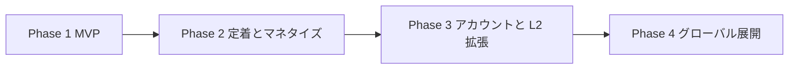
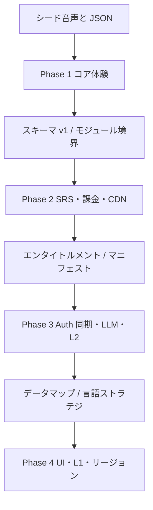

# ロードマップ

SnapSpeak の開発は 4 フェーズで進める。各フェーズは **目的 / 主要機能 / 技術タスク / 完了基準 (Definition of Done) / リスクと依存関係** で定義する。工数の日数・週数は扱わない。スコープと依存のみを固定する。

前提となる確定方針（変更しない）:

- クライアントは SwiftUI / iOS 17+ / MVVM + Swift Concurrency。TCA は採用しない。
- 永続化は SwiftData。オフラインファースト。
- 音声は AVFoundation + Speech（オンデバイス優先）。採点はトークン列アライメント。
- 瞬間英作文の LLM 評価は Phase 3。課金は Phase 2。アカウント同期は Phase 3。
- コンテンツは言語ペア第一級。UI 文字列は最初から String Catalog。

後続フェーズは前フェーズの DoD を満たしてから開始する。例外的な先行スパイク（例: 課金サンドボックス検証）は「本導入」ではなく技術タスク内の検証として明記する。

---

## Phase 1 — MVP

日本人向け英語。シャドーイングと瞬間英作文のコア体験、シードコンテンツ、ローカル完結、無料。

### 目的

- 「聞いて重ねる」「見て即座に言う」が iPhone 上でオフライン完結することを証明する。
- 言語ペア・コンテンツスキーマ・String Catalog を最初から実装し、英語ハードコードで逃げない。
- アカウント・課金・LLM なしで、シードだけで価値を体感できるようにする。

### 主要機能

- ホーム、コース / ユニット / レッスン階層、設定（字幕既定、再生速度既定、ダウンロード管理）
- シャドーイングプレイヤー: 再生と録音の同時処理、速度 0.5x〜1.5x（ピッチ維持）、文単位リピート、字幕 ON/OFF、結果（一致率・抜け・言い淀み・WPM・遅延）
- 瞬間英作文: L1 提示、発話またはタイプ、許容パターンとの正規化マッチング、お手本表示
- 学習履歴・SRS 状態（SM-2 カスタムの最小実装）の SwiftData 保存
- アプリ内シードコンテンツ（`ja→en`、音声 + JSON）で初回起動から学習可能
- 任意: CDN からの追加コンテンツ取得（失敗してもシードで学習継続）。無くても DoD は満たせるが、マニフェスト設計は本 Phase で固める

### 技術タスク

- Xcode プロジェクト + Swift Package マルチモジュール骨格（AppFeature / ShadowingFeature / CompositionFeature / AudioEngine / ContentKit / SRSKit / DesignSystem / Analytics）
- SwiftData スキーマ（学習履歴、SRS、ダウンロード済みコンテンツ）とマイグレーション方針の初期版
- コンテンツ JSON スキーマ v1 とデコーダ、バージョンフィールドによる後方互換フック
- AVAudioEngine による再生・録音、エコーキャンセル、`AVAudioUnitTimePitch`、Audio Session カテゴリ設計
- Speech framework（オンデバイス優先）とロケール `en-US`（初期 L2）
- トークン化・正規化・編集距離 DP によるアライメント採点
- 瞬間英作文の正規化器（大小文字、句読点、縮約）とパターン照合
- SRSKit: SM-2 の品質 0-5 を正答率・応答速度から自動算出
- String Catalog（`.xcstrings`）。日本語のみでもハードコード禁止
- 言語ペア設定オブジェクト（UI 言語 / L1 / L2 を独立して保持。Phase 1 の実データは `ja` / `en`）
- シード同梱と、CDN マニフェストのクライアント実装（差分更新の受信口）
- Analytics のイベント定義（レッスン開始/完了、採点サマリの集計値のみ）
- マイク権限・Speech 権限の説明文と拒否時フォールバック（タイプ入力へ誘導）

### 完了基準 (Definition of Done)

- [ ] iOS 17+ 実機で、通信オフにしてシードのシャドーイングレッスンを 1 本完了し、採点結果が SwiftData に残る
- [ ] 同条件で瞬間英作文レッスンを 1 本完了し、縮約形などの正規化一致がユーザーに正しく「正解」と出る
- [ ] 再生速度変更時にピッチが不自然に変わらない（聴感で確認。タイムストレッチは TimePitch 経由）
- [ ] 字幕トグル、文単位リピートがタイムスタンプに追従する
- [ ] UI 文字列が String Catalog 経由であり、コードに日本語リテラルを新規追加していない（レビュー観点）
- [ ] コンテンツ JSON に `schemaVersion` と `languagePair` がある。アプリは未知の将来フィールドを無視してデコードできる
- [ ] マイク拒否時に瞬間英作文がタイプ入力で完了できる
- [ ] クラッシュなくバックグラウンド→フォアグラウンドで Audio Session が復旧する（再生中断からの再開または明示的リセット）
- [ ] README および本 docs の Phase 1 範囲と実装が食い違っていない

### リスク

| リスク | 影響 | 緩和 |
|--------|------|------|
| 再生と録音の同時処理でエコー・ハウリング | シャドーイング不能 | `voiceChat` / `playAndRecord` + エコーキャンセル。実機（EarPods / 内蔵マイク）で早期検証 |
| オンデバイス ASR の認識精度不足 | 一致率が学習実態と乖離し信頼を失う | トークン正規化、フィラー除去、スコアの説明文。「ASR 誤りがありうる」を結果画面に短く出す |
| 日本語話者の英語発音が ASR に落ちる | 不正解ばかりで離脱 | 採点は完全一致を求めすぎない。アライメントの一致率を主指標にし、ゼロ点を出さない UI |
| Audio Interruptions（通話、Siri） | セッション破損 | 中断・再開の単一ポリシーを AudioEngine に閉じる |
| シード容量肥大 | アプリサイズ | 短めパッセージ、圧縮音声。追加分は CDN |
| スコープ膨張（ダッシュボード、課金、LLM） | MVP 未完 | 本 Phase の DoD 以外は入れない |

### 依存関係

- **外部**: Apple Developer プログラム、実機、Speech / マイク権限、（任意）S3/CloudFront 相当のバケット
- **成果物依存**: シード用お手本音声（プロ音声または高品質 TTS）と文単位タイムスタンプ。これが無いとプレイヤーは完成してもレッスンが成立しない
- **後続への引き渡し**: コンテンツスキーマ v1、モジュール境界、Analytics イベント名、SRS の品質算出式。Phase 2 はこれらを壊さない

---

## Phase 2 — 定着とマネタイズ

SRS 本格化、進捗ダッシュボード、ストリーク / リマインダー通知、サブスクリプション、コンテンツ拡充と CDN 配信。

### 目的

- 毎日戻る理由（復習キュー、可視化、通知）を足し、習慣化する。
- 無料の価値を維持したまま Pro で全解放するフリーミアムを導入する。
- シード以外のコンテンツを CDN + マニフェスト差分更新で増やせる状態にする。

### 主要機能

- SRS 復習キュー（期限到来アイテムをホームから開始）。品質 0-5 の自動算出を学習ループに正式接続
- 進捗ダッシュボード: 連続学習日、週間完了、モード別平均スコア（個人データはローカル）
- ストリーク表示。欠かした日の扱い（タイムゾーンは端末設定。深夜跨ぎの定義を固定）
- ローカル通知リマインダー（学習時刻のユーザー設定。過剰通知を避ける既定オフまたは控えめ）
- StoreKit 2 サブスクリプション。無料制限（コース先頭以外ロック、日次上限など）と Paywall
- コンテンツ拡充: 追加 Course/Unit を CDN 配信。ダウンロード済みはオフライン学習
- ダウンロード管理 UI の強化（容量、削除、更新ありバッジ）
- 区間リピートの任意 A-B（Phase 1 が文単位のみだった場合の拡張）は本 Phase で優先度中。DoD 必須ではない

### 技術タスク

- SRSKit のスケジュール計算をキュー UI と接続。レビューログの追記型保存
- 通知: `UserNotifications`、権限リクエストのタイミング（価値理解後）、タイムゾーン変更への耐性
- StoreKit 2: Product ID、 entitlements のローカル検証、Restore、Family Sharing 方針の決定と実装
- 無料制限エンタイトルメントを ContentKit の解決レイヤに置き、プレイヤーは「開ける/開けない」だけを見る
- CDN マニフェストの差分適用、ファイル完全性（チェックサム）、部分失敗時のロールバック
- Analytics: 制限到達、Paywall 表示、購入成功/失敗、解約は StoreKit 側を正として最小イベント
- ダッシュボード用の集計クエリ（SwiftData）。メインスレッドを塞がない
- コンテンツ制作の入稿チェック（タイムスタンプ単調増加、許容パターン非空、言語ペア整合）をスクリプトまたは CI 相当で開始

### 完了基準 (Definition of Done)

- [ ] 期限到来の瞬間英作文 / シャドーイング項目が「今日の復習」から完了でき、次回間隔が更新される
- [ ] ダッシュボードがローカル履歴のみで描画され、オフラインで開く
- [ ] 通知許可が拒否でも学習機能が劣化しない
- [ ] サンドボックスで購入・復元・期限切れがエンタイトルメントに反映される
- [ ] 無料ユーザーがロックコンテンツに入れず、Pro で解除される。シードと明示的無料ユニットは課金なしで学習できる
- [ ] 追加コースをマニフェスト更新だけで配信でき、旧バージョン JSON をアプリが読み続けられる
- [ ] ダウンロード途中のキル、ディスク不足でデータ破損せず、再試行できる
- [ ] ファーストパーティ分析に購入の生レシートや音声を送っていない

### リスク

| リスク | 影響 | 緩和 |
|--------|------|------|
| 通知がウザい / 拒否される | 習慣化施策が無効。レビュー悪化 | 既定を控えめに。学習完了後に「明日のリマインダー」をオプトイン |
| ストリーク強制が不正利用・ストレスを生む | 形だけの起動 | ストリークは主 KPI にしない。実学習完了のみカウント |
| StoreKit のエッジ（地域、税、復元） | 課金トラブル | 公式 Transaction.updates を単一の Store アクタで処理 |
| 無料制限が厳しすぎる | 転換前離脱 | シード + 先頭ユニットでコアループを完遂できるようにする |
| コンテンツ更新でスキーマ破壊 | 旧アプリが読めない | `schemaVersion` と後方互換。破壊的変更は新バージョン併記 |
| CDN 障害 | 追加学習不可 | ダウンロード済みとシードで学習継続。エラーは再試行可能にする |

### 依存関係

- **前提**: Phase 1 DoD（特にスキーマ、AudioEngine、正規化判定、SwiftData）
- **外部**: App Store 課金契約、銀行・税務情報、CDN 本番、通知用の文言（String Catalog）
- **法務 / プロダクト**: サブスクの自動更新説明、プライバシーポリシー更新（購入・通知）
- **後続**: エンタイトルメントモデルは Phase 3 のクラウド同期対象。LLM フィードバックは Pro 特典候補として ID だけ予約し、本 Phase では実装しない

---

## Phase 3 — アカウントと学習言語拡張

Supabase 同期、LLM 評価フィードバック、L2 追加（例: 中国語・韓国語）、コンテンツ制作パイプライン整備。

### 目的

- 端末変更・複数端末でも学習を継続できるようにする（ローカル優先同期）。
- 瞬間英作文の「意味は合っているが正規化では落とす」ケースを LLM で救済し、短いフィードバック文を返す。
- 同じアプリ核で L2 を増やし、言語ペア設計が机上でないことを示す。
- お手本音声の生成を、将来のニューラル TTS（サーバーサイド）に繋げる入稿パイプラインにする。

### 主要機能

- アカウント（Supabase Auth）。未ログインのまま Phase 1-2 機能は維持。ログインは任意のアップグレード
- 学習進捗のクラウド同期: ローカル優先、コンフリクトは last-write-wins。学習履歴は追記型（削除しない）
- 同期状態 UI（最終同期時刻、失敗の再試行）
- 瞬間英作文の LLM 評価 API（意味的正誤 + フィードバック文）。Edge Functions 経由。API キー秘匿、レート制限、キャッシュ
- L2 追加の例: 中国語、韓国語（`ja→zh`, `ja→ko`）。音声認識ロケール、トークナイザ、フォント・改行の検証
- コンテンツ制作パイプライン: JSON 検証、音声アライメント、（将来）サーバー TTS 生成ジョブの受け口
- Pro 特典としての LLM フィードバック回数制限

### 技術タスク

- Supabase: Auth、Postgres スキーマ（ユーザー、エンタイトルメントミラー、SRS スナップショット、履歴イベント）、Storage（必要ならユーザー非コンテンツ）
- 同期プロトコル: エンティティごとの `updatedAt`、クライアント時計は信頼しすぎない（サーバー時刻または単調な revision）
- last-write-wins の対象（SRS カード状態、設定）と追記専用（lesson_attempt, review_log）の分割
- Edge Function: 入力は L1、ユーザー発話テキスト、許容パターン、L2。出力は pass/fail/near と短いフィードバック。音声バイナリは送らない（テキストのみ）
- レート制限、冪等キー、同一文の評価キャッシュ
- Speech / トークナイザの言語別ストラテジ（空白区切り言語 vs CJK）
- コンテンツパイプライン: schema lint、音素/文アライメント検証、マニフェスト発行
- 端末 TTS（`AVSpeechSynthesizer`）は補助のまま。本採用のお手本は配信音声。サーバー TTS は制作側
- 分析: 同期失敗率、LLM レイテンシ、L2 別完了率（言語コードのみ）

### 完了基準 (Definition of Done)

- [ ] ログアウトしてもローカル学習は継続し、再ログインで追記履歴が欠落しない（LWW 対象は新しい方を採用）
- [ ] オフライン中の学習が、オンライン復帰後にアップロードされる
- [ ] LLM 評価が失敗・タイムアウトしても正規化マッチングの判定で完了できる（必須フォールバック）
- [ ] API キーがクライアントバイナリに含まれない
- [ ] `ja→zh` または `ja→ko` のシードまたは CDN コースが、対応 ASR ロケールで学習完了できる
- [ ] CJK トークナイザがアライメントと瞬間英作文照合で破綻しない（最低限の自動テストまたは固定フィクスチャ）
- [ ] 入稿パイプラインが `schemaVersion` と languagePair を強制し、不正 JSON をマニフェストに載せない
- [ ] プライバシーポリシーにクラウド同期と LLM 送信（テキスト）を反映

### リスク

| リスク | 影響 | 緩和 |
|--------|------|------|
| 同期コンフリクトで SRS が巻き戻る | 信頼失墜 | 履歴は追記。カード状態は LWW をユーザーに説明。可能なら revision 比較 |
| LLM の不安定・高コスト・遅延 | UX 悪化、原価 | キャッシュ、レート制限、Pro 限定、正規化フォールバック |
| LLM が誤って正解にする / 厳しすぎる | 学習誤り | 許容パターンをプロンプトに必ず含める。評価は補助表示と明記 |
| 中国語・韓国語の ASR / フォント / 改行 | 特定 L2 だけ体験崩壊 | 言語ストラテジのインタフェースを ContentKit / AudioEngine に先に切る |
| Auth 導入でオンボーディングが重い | 活性化低下 | ログイン必須にしない |
| 個人情報・学習テキストの域外移転 | コンプライアンス | Phase 4 のリージョン設計を先読みし、送信データ最小化 |

### 依存関係

- **前提**: Phase 2 のエンタイトルメント、CDN、SRS キューが安定していること
- **外部**: Supabase プロジェクト、LLM プロバイダ契約、追加 L2 の音声・脚本・ネイティブチェック
- **法務**: 利用規約（生成フィードバックの免責）、データ処理契約
- **後続**: Phase 4 の GDPR / リージョンは、本 Phase で「どこに何を置くか」のメモを残す。実装の分割は Phase 4

---

## Phase 4 — グローバル展開

UI 多言語化、L1 追加（英語・スペイン語話者向け等）、ASO / ローカライズ、リージョン・プライバシー対応。

### 目的

- UI 言語、L1、L2 が独立に選べる状態を、実際のストア展開で使う。
- `es→en` など、日本語 UI 以外の初回体験を成立させる。
- GDPR 等に耐えるデータ所在・削除・同意の設計を実装する。

### 主要機能

- UI の追加言語（英語、スペイン語を第一候補）。String Catalog の翻訳、レイアウト（文字伸び）
- L1 追加: 英語話者・スペイン語話者向けコース（例: `en→es` は範囲外でもよく、まずは `es→en`, `en→ja` などプロダクトが選んだペア）
- ロケール: 日付・数値・音声認識ロケール・TTS ボイスの組合せマトリクス
- ASO: ストア説明、スクリーンショット、キーワードの言語別
- リージョン: データレジデンシー、削除請求、同意記録。分析の域外送信最小化
- サポート: 言語別 FAQ、課金問い合わせ導線

### 技術タスク

- String Catalog の翻訳ワークフロー（翻訳対象キーの凍結、用語集、Plural / 変数）
- L1 切替時のコンテンツフィルタ、キーボード、ASR ロケール（瞬間英作文の入力言語は L2）
- レイアウト: ダイナミックタイプ、長いドイツ語等を見据えた制約（本 Phase の必須言語は英・西）
- Supabase / Edge のリージョン、データエクスポート・アカウント削除
- プライバシー: 同意バナーが必要かの法務判断に従った実装。ATT は原則使わない方針を維持できるか再確認
- 価格: StoreKit の各国価格、税表示
- コンテンツスキーマが L1 追加で破綻しないことの回帰（対訳フィールド、許容パターンの言語）

### 完了基準 (Definition of Done)

- [ ] UI を英語またはスペイン語にしても、`ja→en` コンテンツで学習できる（UI ≠ L1 ≠ L2 の実例）
- [ ] 新しい L1 ペアのコースがカタログに現れ、該当ユーザーのホーム既定ペアになる
- [ ] 日付・数値が Locale に従う。音声認識ロケールが L2（および必要なら L1 ヒント）に追従する
- [ ] アカウント削除が学習データ・同期データ・Auth を対象ポリシーどおり消す（または匿名化する）
- [ ] 対象地域のプライバシー文書と実装が一致し、レビュー観点のチェックリストがある
- [ ] 主要画面のスクリーンショットとストア文面が言語別に用意されている
- [ ] オフラインファーストが、海外 CDN 遅延下でもシード学習で起動できる

### リスク

| リスク | 影響 | 緩和 |
|--------|------|------|
| 翻訳漏れ・用語不統一 | 品質低下、レビュー | カタログ CI（未翻訳キー検出）、用語集 |
| 言語マトリクス爆発（UI × L1 × L2） | QA 不能 | サポートする組を明示的にホワイトリスト化 |
| GDPR / 各国法の解釈差 | リリース遅延 | 法務と「データマップ」を先に固定。実装はその表に従う |
| 地域 CDN / ASR の精度差 | 特定国だけ体験悪化 | 言語別フィクスチャと実機ロケール試験 |
| ASO とプロダクト実態の乖離 | リジェクト・低評価 | スクリーンショットは実在機能のみ |

### 依存関係

- **前提**: Phase 3 の同期とコンテンツパイプライン。String Catalog が Phase 1 から埋まっていること（本 Phase は翻訳であって、文字列の外部化そのものではない）
- **外部**: 翻訳者 / ネイティブチェック、弁護士またはプライバシー専門家、各国ストア掲載、地域別 CDN
- **プロダクト**: どの言語ペアを公式サポートするかのホワイトリスト。ホワイトリスト外は UI で出さない

---

## フェーズ横断の不変条件

どのフェーズでも壊してはならないこと。

1. **オフラインで、ダウンロード済み（またはシード）コンテンツの学習が完了できる。** クラウド機能は劣化モードを持つ。
2. **UI 文字列をコードにハードコードしない。**
3. **コンテンツは言語ペアを必須フィールドに持つ。**
4. **学習履歴は追記型。** 同期導入後も「消して上書き」しない。
5. **音声と認識テキスト全文を分析や LLM に無断で永久保存する設計にしない。** LLM はテキスト・最小ペイロード・明示的な機能としてのみ。
6. **TCA を導入しない。** 状態管理は MVVM + Swift Concurrency のまま。
7. **工数見積りでスコープを偽らない。** 未完了の DoD がある状態で次フェーズの本導入を開始しない。

---

## 依存関係の要約

| 本フェーズ | 開始前に揃っているべきもの | 本フェーズが次に渡すもの |
|------------|----------------------------|--------------------------|
| 1 | お手本音声、文タイムスタンプ、許容パターン、開発者アカウント | 動くコアループ、スキーマ、パッケージ境界 |
| 2 | Phase 1 DoD、ストア課金契約、CDN | 習慣化機能、Pro フラグ、配信パイプライン |
| 3 | Phase 2 DoD、Supabase、LLM 契約、追加 L2 教材 | 同期、評価プロキシ、言語ストラテジ、入稿 CI |
| 4 | Phase 3 DoD、翻訳、法務データマップ、対象ペアのホワイトリスト | グローバル製品としての運用面 |

---

## 意図的にロードマップへ載せないもの

次は本ロードマップの対象外とする（将来別文書で判断）。

- Android / Web クライアント
- 教師ダッシュボード、学校導入
- ライブ通話、コミュニティ
- TCA への移行
- オンデバイス以外を必須とするクラウド ASR（オンデバイス優先は維持。フォールバックとしてのサーバ ASR は要否を別判断）
- 子供向け安全設計の本格対応（13 歳未満を対象にしない前提。対象を広げる場合は別 Phase）
