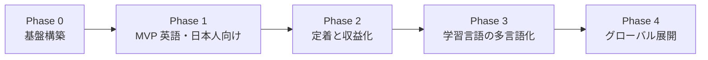

# SnapSpeak 機能ロードマップ

本文書は、SnapSpeak を「英語・日本人向け MVP」から「学習言語の拡張」「グローバル展開」まで進める順序を定義する。期間の見積もりは書かない。各フェーズは完了条件を満たした時点で閉じる。

設計の前提（UI 言語と L1 / L2 の分離、同一 Sentence の両モード利用、音声 pipeline の protocol 化）は [アーキテクチャ設計書](./architecture.md) に従う。

## 全体像

後のフェーズの機能を先に「仮実装」で Feature に埋め込まない。ただし Domain の `LanguagePair`、`SentenceTranslation`、`SpeechRecognizing` など **データ形状と protocol は Phase 0 で固定** し、拡張時に破壊的変更を出さない。

---

## Phase 0: 基盤構築

### 目的

アプリ本体の機能を積む前に、モジュール境界・品質ゲート・音声の同時再生／録音が実機で成立することを確認する。ここで崩れると Phase 1 のシャドーイングが成立しない。

### 主要機能

- [ ] SPM マルチモジュール雛形（App / Feature×5 / Domain / Core）を作成し、Feature 間依存が無いことを Package 定義で強制する
- [ ] GitHub Actions で Simulator 向け `xcodebuild test` と SwiftLint を PR 必須にする
- [ ] `DesignSystem` に色・タイポ・学習用ボタン（再生、録音、次へ）・タイマー表示を入れる
- [ ] String Catalog（`.xcstrings`）を導入し、UI 文言のハードコードを lint で検出する
- [ ] SwiftData のスキーマ（UserProfile、Course 配下、ReviewState、StudySession）を Domain モデルから生成できる形で置く
- [ ] 音声スパイク: 同一 `AVAudioEngine` でお手本再生とマイク録音を同時実行し、ファイル書き出しまで通す
- [ ] スパイクで再生速度 0.5x〜1.5x（ピッチ維持）と割り込み／ルート変更時の停止を確認する
- [ ] `SpeechRecognizing` / `TextSpeaking` / `PronunciationAssessing` の protocol と、Speech framework / `AVSpeechSynthesizer` の仮実装を Core に置く
- [ ] イヤホン推奨の判定（内蔵スピーカー検出）を AudioEngine から Settings が読めるようにする

### 完了条件

- 実機で「お手本を流しながら自分の声を録音し、続けて両方を再生する」が安定して成功する（スピーカーとイヤホンの両方で手順書がある）。
- 空の Feature 画面がタブで表示され、DI でモック STT を差し替えられる。
- CI が main / PR で赤／緑を返し、モジュール境界を破る import がビルド不能である。
- スキーマと protocol が [アーキテクチャ設計書](./architecture.md) のエンティティと一致している。

---

## Phase 1: MVP（英語・日本人向け）

### 目的

L1=`ja`、L2=`en`、UI=`ja` に限定した状態で、シャドーイングと瞬間英作文を App Store で提供する。バックエンド・課金・高精度発音スコアは入れない。学習はオフラインで完結する。

### 主要機能

**シャドーイング**

- [ ] 教材お手本の再生、0.5x〜1.5x 変速、文単位の区間リピート
- [ ] 同時録音、お手本と自分の声の聞き比べ
- [ ] STT に基づく一致度スコア（目安表示。合否には使わない）
- [ ] スピーカー利用時のエコー注意とイヤホン推奨 UI

**瞬間英作文**

- [ ] SRS（SM-2）による出題キュー
- [ ] L1 テキスト＋音声提示 → 制限時間内の口頭回答 → 文字起こし
- [ ] 複数正解例との正規化マッチ ＋ 自己判定（できた / あやしい / できなかった）
- [ ] STT 失敗時は自己判定のみでカードを進められる

**教材・記録・UI**

- [ ] バンドル内蔵の英語教材（Course > Unit > Sentence、日本語訳つき）
- [ ] 同一 Sentence を両モードで利用
- [ ] 学習記録のローカル保存（セッション、ReviewState）
- [ ] 日本語 UI（String Catalog）。日付・数値は Locale `ja_JP`
- [ ] マイク／音声認識の権限フローと拒否時の代替説明
- [ ] プライバシー既定: 録音は端末内のみ

**リリース**

- [ ] App Store スクリーンショット・説明文（日本語）
- [ ] TestFlight 内部テストを経て 1.0 提出

### 完了条件

- ネットワークを切った実機で、内蔵教材のシャドーイング 1 Unit と瞬間英作文 10 問が最後まで完走できる。
- 翌日以降、SRS の due に従い再出題される。
- UI が日本語で、コード上の学習言語が `LanguagePair` 経由であり `en` 直書きの分岐が Feature に無い。
- App Store で公開されている（または審査通過済みでリリース待ちである）。

---

## Phase 2: 定着と収益化

### 目的

MVP 利用者の継続を可視化・促進し、有料 Course で収益化する。アカウントとクラウド同期により機種変更後も SRS を継続できるようにする。教材はバンドル以外からも追加できる。

### 主要機能

**学習体験の精度**

- [ ] `PronunciationAssessing` の本実装（Azure Pronunciation Assessment 等）。失敗時は v1 の文字起こしマッチにフォールバック
- [ ] 瞬間作文の自動判定強化（variant 拡充、必要ならサーバ側の意味判定アダプタ）。自己判定は残し、自動判定を補助にする
- [ ] 一致度・発音スコアの文ごとの履歴

**定着**

- [ ] 学習統計ダッシュボード（日次分数、モード別完了数、due 件数）
- [ ] ローカル通知による学習リマインダー（権限はここで取得）
- [ ] ストリーク（連続学習日）。タイムゾーンは端末設定に従う
- [ ] 目標（1 日 N 文）と達成表示

**収益化**

- [ ] StoreKit 2 サブスクリプション（月額・年額）
- [ ] フリーミアム: スターター Course のみ無料、追加 Course は購読
- [ ] 購入・リストア・猶予期間の Settings UI

**基盤**

- [ ] Sign in with Apple + Firebase Auth（匿名からのアップグレードを含む）
- [ ] Firestore による ReviewState / StudySession / UserProfile の同期
- [ ] コンテンツ配信: マニフェスト＋音声の CDN、`contentVersion` による差分取得
- [ ] リモート教材の追加（購読者向け Course をバンドルなしで配る）
- [ ] 分析イベント（文面・録音を送らない）と ATT ダイアログ

### 完了条件

- 無料ユーザーがスターター Course を完走でき、有料 Course 開始時に StoreKit の購入フローが完了する。
- 別端末で同じ Apple ID にサインインすると、24 時間以内に SRS の due が復元される。
- オフラインでも既存キャッシュ教材の学習は可能で、オンライン復帰時に進捗が同期される。
- リマインダーを許可したユーザーに、指定時刻の通知が届く。
- 発音スコア API が使えない場合でも Phase 1 と同等の学習が継続できる。

---

## Phase 3: 学習言語の多言語化

### 目的

UI は日本語のまま、L2 を英語以外に拡張する。コンテンツ制作と STT/TTS の言語切り替えを「言語を足す作業」に落とす。対象の第 1 候補は韓国語と中国語（Mandarin）とする。英語 Course は維持する。

### 主要機能

- [ ] 言語選択 UI（L2 の選択。L1 は `ja` 固定のまま）
- [ ] 韓国語・中国語の Course / 訳 / お手本音声
- [ ] 言語コード → BCP-47 のマッピング（STT / TTS / Speech 権限のロケール）
- [ ] オンデバイス STT が弱い言語でのフォールバック方針（当該 L2 のみサーバ STT を許可、同意 UI つき）
- [ ] 言語別の再生速度既定値・制限時間係数（必要なら Content JSON のメタデータ）
- [ ] コンテンツパイプラインの正式運用: スキーマ検証、欠落言語の CI 失敗、AAC 化、CDN 配置
- [ ] 既存英語ユーザーの ReviewState が L2 切替後も壊れないこと（キーは user × sentence × pair）

### 完了条件

- 設定で L2 を `en` / `ko` / `zh` から選べ、選んだ言語の Unit だけが一覧に出る。
- 各 L2 でシャドーイング（お手本再生・録音・聞き比べ）と瞬間作文（L1=`ja` 提示、L2 で回答）が実機で完走する。
- 新しい L2 を足す手順がドキュメント化され、アプリコードの変更が Locale マッピングと教材投入に限られる（Feature の分岐追加が不要）。
- パイプラインが main への教材 PR を自動で検証・成果物化できる。

---

## Phase 4: グローバル展開

### 目的

UI 言語と L1 を日本語以外に開き、英語 UI のユーザーや「英語話者が日本語を学ぶ」逆方向ペアを成立させる。ストア掲載と価格もリージョンに合わせる。

### 主要機能

- [ ] UI 多言語化。最優先は英語。String Catalog の翻訳をリリース必須にする
- [ ] L1 の多様化。少なくとも `LanguagePair(l1: "en", l2: "ja")` を提供する
- [ ] 起動時またはオンボーディングでの UI 言語 / L1 / L2 の明示的選択（システムの言語から推定し、確認させる）
- [ ] 逆方向ペア用教材（日本語お手本、英語プロンプト）
- [ ] ASO: 各ストア言語のスクリーンショット・キーワード・説明
- [ ] ローカライズ価格（StoreKit の地域価格）、税・表記の確認
- [ ] リージョン対応: 音声認識のネットワーク利用が制限される地域ではオンデバイスまたは当該機能オフのポリシー
- [ ] サポート導線（ヘルプ、プライバシーポリシー、問い合わせ）の多言語化

### 完了条件

- 端末言語が英語の新規ユーザーが、日本語を学ばずに英語 UI で英語以外（少なくとも日本語）の学習を開始できる。
- 同一バイナリで `ja→en` と `en→ja` の学習が共存し、ReviewState がペア単位で分離されている。
- 対象リージョンの App Store でメタデータと価格が現地向けに設定され、審査ポリシー（録音・アカウント削除・プライバシー）を満たす。
- UI 文言の追加が String Catalog のキー追加で完結し、教材追加が Phase 3 のパイプラインのままである。

---

## フェーズを跨ぐ制約

- Phase 1 のリリース後も、`Sentence` を言語ペアに紐づけ直すようなスキーマ破壊は行わない。マイグレーションが必要な場合は SwiftData のバージョンを上げ、同期側（Firestore）にも同名フィールドを足すだけにする。
- サーバ STT・発音評価・LLM 判定はすべて protocol の裏に置き、オフライン時はローカル実装へ落とす。
- 完了条件を満たさないまま次フェーズの UI（例: Phase 1 での言語ピッカー本実装）を出さない。オンボーディングに将来の言語を「近日」と書く場合も、選択不能でよい。
