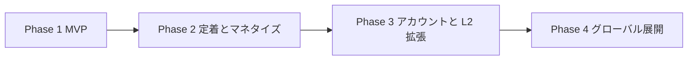
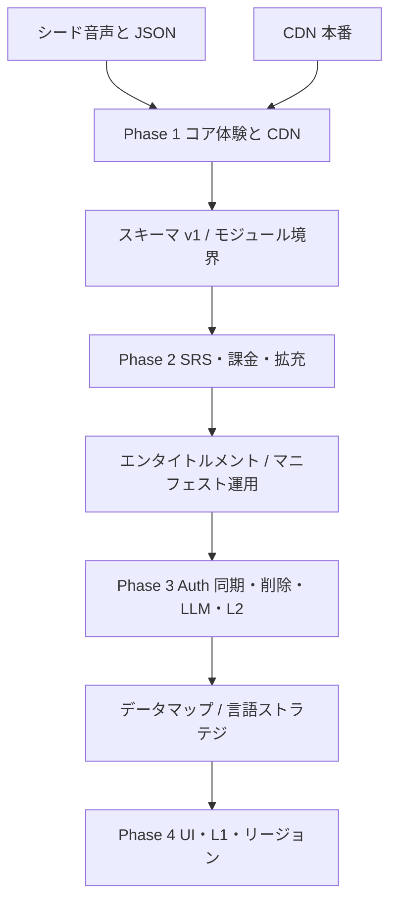

# ロードマップ

SnapSpeak の開発は 4 フェーズで進める。各フェーズは **目的 / 主要機能 / 技術タスク / 完了基準 (Definition of Done) / リスクと依存関係** で定義する。工数の日数・週数は扱わない。スコープと依存のみを固定する。

**本書がフェーズ分割の正本である。** README および architecture.md の「いつ何を入れるか」はここに合わせる。

前提となる確定方針（変更しない）:

- クライアントは SwiftUI / iOS 17+ / MVVM + Swift Concurrency。TCA は採用しない。
- 永続化は SwiftData。オフラインファースト。VersionedSchema は v1 から定義する。
- 音声は AVFoundation + Speech。**オンデバイス認識は厳格な要求**（シャドーイングはサーバー ASR へ暗黙フォールバックしない）。採点はトークン列アライメントによる **スクリプト一致 / 語の再現度**。
- 瞬間英作文の LLM 評価は Phase 3。課金は Phase 2。**Supabase（Auth / 進捗同期 / Edge Functions）は Phase 3。**
- コンテンツは言語ペア第一級（正規化済み BCP-47）。UI 文字列は最初から String Catalog。
- **Phase 1 から CDN 配信は必須**（採用: **Cloudflare R2**。構成は architecture §8.1）。シードは初回オフラインと CDN 障害時の保証。

後続フェーズは前フェーズの DoD を満たしてから開始する。例外的な先行スパイク（例: 課金サンドボックス検証）は「本導入」ではなく技術タスク内の検証として明記する。

---

## Phase 1 — MVP

日本人向け英語。シャドーイングと瞬間英作文のコア体験、シードコンテンツ、CDN 配信、ローカル完結、無料。アカウントなし。

> **実装状況**: Phase 1 のコア実装（[phase1-implementation-plan.md](./phase1-implementation-plan.md)）は develop に反映済み。さらに Phase 2 のオンボーディング / 継続機能を前倒しで実装済み（Phase 2 冒頭の注記を参照）。DoD のうち実機・実音声を要する項目は未確認のため未チェックのまま残す。

### 目的

- 「聞いて重ねる」「見て即座に言う」が iPhone 上でオフライン完結することを証明する。
- 言語ペア・コンテンツスキーマ・String Catalog を最初から実装し、英語ハードコードで逃げない。
- アカウント・課金・LLM なしで、シードおよび CDN 取得済みコースで価値を体感できるようにする。

### 主要機能

- ホーム、コース / ユニット / レッスン階層、設定（字幕既定、再生速度既定、ダウンロード管理、プライバシー導線）
- シャドーイングプレイヤー: 経路ポリシーに従う再生と録音、速度 0.5x〜1.5x（`pitch = 0` cents）、文単位リピート（`captionSegments`）、字幕 ON/OFF、結果（**スクリプト一致率**・抜け・言い淀み・WPM・遅延）。AEC 不可時はお手本再生→単独録音の劣化。オンデバイス ASR 不可時は録音・自己再生のみ
- 瞬間英作文: L1 提示、発話またはタイプ、許容パターンとの正規化マッチング、お手本表示。Speech 不可時はタイプ入力
- 学習履歴・`ReviewEvent`・SRS 派生状態（SM-2 カスタムの最小実装）の SwiftData 保存
- アプリ内シードコンテンツ（`ja→en`、音声 + JSON）で初回起動から学習可能
- **CDN マニフェストからコースを取得**（チェックサム、オフライン再生、更新、削除）。障害時はシードで継続
- 権限の状態分けと設定アプリへの導線、録音保持期間の説明、アプリ内プライバシーポリシーリンク

### 技術タスク

- Xcode プロジェクト + Swift Package マルチモジュール骨格（AppFeature / ShadowingFeature / CompositionFeature / AudioEngine / ContentKit / SRSKit / DesignSystem / Analytics）
- SwiftData **VersionedSchema v1**、`@ModelActor` と Sendable DTO、`payloadSchemaVersion`
- コンテンツ JSON スキーマ v1（`captionSegments` と `wordTimings` の分離、`title` 辞書、`oneOf` 排他、BCP-47）。既知バージョンの明示デコーダ。未知 schemaVersion は拒否してローカル維持
- マニフェストの **複数 immutable release**（`schemaVersion` / `minAppVersion` / 任意 `maxAppVersion`）
- AVAudioEngine: プレビューは `.playback + .spokenAudio`、録音前に停止再構成して `.playAndRecord + .voiceChat`。停止中エンジンへ `inputNode.setVoiceProcessingEnabled(true)`。経路別ポリシー。`routeChange` / interruption / mediaServicesWereReset / configurationChange で再構築
- PlaybackTimeline（共通 host/sample time、速度・シーク・一時停止の記録）。遅延は提示時刻と final な `SFTranscriptionSegment.timestamp` の差
- Speech: `supportedLocales`・初期化・`supportsOnDeviceRecognition`・`isAvailable` を検査。シャドーイングはサーバーフォールバックなし
- トークン化・正規化・編集距離 DP。指標名はスクリプト一致率。confidence・経路・速度を保存。固定音声コーパスで閾値の初期校正
- 瞬間英作文の正規化器とパターン照合
- SRSKit: SM-2。学習日境界 04:00、最小再学習間隔 10 分。低 confidence では自動更新しない。キーに `courseId`
- String Catalog（`.xcstrings`）。UI 言語は `preferredLocalizations`。日付・数値は `Locale.autoupdatingCurrent`。`AppleLanguages` を書き換えない
- シード同梱と CDN クライアント（空き容量確認、atomic staging、バックアップ除外、LRU / 手動削除）
- Analytics のイベント定義（レッスン開始/完了、採点サマリの集計値のみ）
- Info.plist のマイク / Speech 説明、`PrivacyInfo.xcprivacy`、録音中インジケータ
- 権限拒否の 3 状態 UX

### 完了基準 (Definition of Done)

**コア学習**

- [ ] **対応実機・ロケール `en-US`・機内モード**で、シードのシャドーイングレッスンを 1 本完了し、オンデバイス採点が SwiftData に残る
- [ ] 同条件で瞬間英作文レッスンを 1 本完了し、縮約形などの正規化一致がユーザーに正しく「正解」と出る
- [ ] **オンデバイス非対応**（または `supportsOnDeviceRecognition == false` 相当）の劣化 UX を試験する。シャドーイングは録音・自己再生のみで完了でき、サーバー認識に遷移しない。瞬間英作文はタイプ入力で完了できる
- [ ] 再生速度変更時にピッチが不自然に変わらない（`AVAudioUnitTimePitch.pitch = 0` cents。聴感で確認）
- [ ] 字幕トグル、文単位リピートが `captionSegments` に追従する。語タイミング無し教材では遅延が「文単位概算」または非表示になる
- [ ] 結果画面の主指標が **スクリプト一致率（語の再現度）** と案内され、発音精度と誤認されない

**CDN（必須）**

- [ ] マニフェストから **1 コースを取得**し、チェックサム検証に成功する
- [ ] 取得後に通信オフで当該コースを再生・学習できる
- [ ] 更新（新しい immutable release の選択）と削除ができる。失敗時に旧ローカルを消さない
- [ ] CDN 障害時にシードで学習を継続できる

**音声経路・復旧**

- [ ] 実機マトリクス: **内蔵スピーカー / 内蔵受話口 / 有線ヘッドセット / AirPods / 他社 HFP / 着信 / Siri** でクラッシュなく停止・再構築できる
- [ ] スピーカー経路で Voice Processing が有効。残留エコー過多なら同時採点を止め、お手本再生→単独録音に劣化することを確認する
- [ ] AirPods で A2DP+マイク同時を前提にしない（HFP 音質低下の明示、または順次劣化）

**権限・プライバシー・ストア**

- [ ] `NSMicrophoneUsageDescription` と `NSSpeechRecognitionUsageDescription` が用途を説明する
- [ ] アプリ内にプライバシーポリシーへのリンクがある
- [ ] App Store Connect の App Privacy 回答が実装と一致する
- [ ] 録音中インジケータが出る。権限用途と録音保持期間（既定 14 日）が説明される
- [ ] `PrivacyInfo.xcprivacy` を含め、Archive の Privacy Report を確認する。使う Required Reason API（UserDefaults、ディスク容量等）の理由を申告する。マイク / Speech 権限は Required Reason API ではないことを区別する
- [ ] マイク拒否 / Speech 拒否 / 両方許可の 3 状態と、設定アプリ導線・復帰後再判定が動く

**国際化・スキーマ・品質**

- [ ] UI 文字列が String Catalog 経由であり、コードに日本語リテラルを新規追加していない
- [ ] コンテンツ JSON に `schemaVersion` と `languagePair`（BCP-47）がある。未知の高い schemaVersion は拒否し既存ローカルを維持する。既知バージョンは明示デコーダで読む
- [ ] VersionedSchema v1 が定義されている
- [ ] アクセシビリティ: 最大 Dynamic Type、VoiceOver 操作順、色だけに依存しない採点表示、Reduce Motion、Switch Control、44pt タップ領域、波形の代替テキスト。**録音中の VoiceOver がお手本 / 録音へ混入しない**
- [ ] README および本 docs の Phase 1 範囲と実装が食い違っていない

### リスク

| リスク | 影響 | 緩和 |
|--------|------|------|
| スピーカー経路の音響回り込み | スクリプト一致率がお手本混入で歪む | 明示的 Voice Processing、経路ポリシー、劣化モード、実機評価 |
| AirPods の HFP によりお手本音質低下 | 体験悪化 | 同時入力を期待しない。プレビューは A2DP、採点は順次または HFP 明示 |
| オンデバイス ASR 非対応・精度不足 | 採点なし、または語の再現度が実態と乖離 | 厳格にサーバーへ逃げない。コーパス校正。低 confidence では SRS 停止。説明文 |
| Speech 長さ上限 | 長いパッセージが認識失敗 | 15〜45 秒に分割。30〜60 秒素材を上限際で入稿しない |
| Audio ルート変更・media reset | セッション破損 | 通知一式で停止再構築。マトリクス試験 |
| シード / ダウンロード容量 | アプリサイズ・ディスク不足 | 短いシード、CDN、空き容量確認、バックアップ除外 |
| スコープ膨張 | MVP 未完 | 本 Phase の DoD 以外は入れない |

### 依存関係

- **外部**: Apple Developer プログラム、**実機（オンデバイス Speech 対応）**、Speech / マイク権限、**CDN: Cloudflare R2（必須）**、プライバシーポリシーの公開 URL
- **成果物依存**: シードおよび CDN 用お手本音声、`captionSegments`、可能な範囲で `wordTimings`、許容パターン
- **後続への引き渡し**: コンテンツスキーマ v1、複数 release マニフェスト、モジュール境界、Analytics イベント名、`ReviewEvent`、経路ポリシー。Phase 2 はこれらを壊さない

---

## Phase 2 — 定着とマネタイズ

SRS 本格化、進捗ダッシュボード、ストリーク / リマインダー通知、**ドライブモード MVP（運転中の音声完結学習）**、サブスクリプション、コンテンツ拡充（Phase 1 の CDN パイプラインを本格運用）。**アカウント基盤（Supabase）は入れない。**

> **実装状況（前倒し）**: 本 Phase のうち **SRS 復習キュー UI・ストリーク・デイリーゴール・ローカル通知リマインダー**、およびオンボーディング（新規設計）は Phase 1 実装直後に **前倒しで実装済み**（develop に反映済み）。UX 正本は [ux-design.md](./ux-design.md)、実装の記録は [phase2-retention-implementation-plan.md](./phase2-retention-implementation-plan.md)。DoD のチェックは実機確認を含むため未チェックのまま残す（実装完了 ≠ DoD 達成）。進捗ダッシュボードは実装済み（DoD の実機確認は未）。
>
> **前倒し追加（方針更新）**: プロダクトポジショニングを「運転中の語学学習を主要ユースケースの第一級とする」に更新した（product-overview 冒頭・§1）。これに伴い **ドライブモード MVP を本 Phase の前倒し項目として最優先で組み込む**（StoreKit より先に着手する。習慣の供給源が増えるほど課金の説得材料も増えるため）。UX 正本は [ux-design.md §10](./ux-design.md)、実装計画は [drive-mode-implementation-plan.md](./drive-mode-implementation-plan.md)。
>
> **ドライブモード MVP 実装状況**: クライアント実装（`DriveKit` / `DriveModeFeature` / `DriveSequencer` / Settings / `UIBackgroundModes`）は完了。記録は [drive-mode-implementation-plan.md](./drive-mode-implementation-plan.md)。DoD のチェックは実車 / 車載 Bluetooth 確認を含むため未チェックのまま残す（実装完了 ≠ DoD 達成）。
>
> **StoreKit 2 / Paywall 実装状況**: クライアント実装（`EntitlementResolver` 無料制限・`StoreActor`・Paywall・ゲート）は完了。記録は [storekit-implementation-plan.md](./storekit-implementation-plan.md)。サンドボックス DoD は未確認。
>
> 本 Phase の**残スコープ**は、ドライブモードの実機 DoD、StoreKit サンドボックス DoD、コンテンツ拡充の本格運用、品質閾値の再校正、ダウンロード更新バッジ / LRU 説明である。

### 目的

- 毎日戻る理由（復習キュー、可視化、通知）を足し、習慣化する。
- **運転中（車内・ハンズフリー・アイズフリー）でも学習が完結する**ようにし、画面が使えない時間を習慣の供給源にする（ドライブモード）。
- 無料の価値を維持したまま Pro で全解放するフリーミアムを導入する。
- シード以外のコンテンツを CDN の immutable release で増やせる状態を運用する。

### 主要機能

- SRS 復習キュー（期限到来アイテムをホームから開始）。品質 0-5 の自動算出を学習ループに正式接続。低 confidence は自動更新しない — **前倒し実装済み**
- **ドライブモード MVP**（本 Phase の前倒し最優先項目）: 乗車前ワンタップ開始 → 音声のみで自動進行（瞬間英作文: 日本語 → 発話ポーズ → 英語正解 / シャドーイング: お手本 × N 回で重ねて発話）→ 停車後ドライブノート。セッション長 5 / 10 / 20 分 / エンドレス。走行中はマイク・採点なし（未採点 Attempt でストリーク / ゴールに算入）。バックグラウンド再生・ロック画面 / ステアリングリモコン（`MPRemoteCommandCenter`）・割り込み自動復帰・お手本欠損時の TTS フォールバック。**CarPlay は対象外**（ux-design §10.10）。UX 正本は ux-design §10 — **クライアント実装済み**（実機 DoD は未確認）
- 進捗ダッシュボード: 連続学習日（学習日境界 04:00）、週間完了、モード別平均スクリプト一致率（個人データはローカル）— **実装済み**（ホーム表示に加えグラフ類ダッシュボードも実装。実機確認は未）
- ストリーク表示。欠かした日の扱い（端末タイムゾーン、04:00 境界）— **前倒し実装済み**（休み 1 日の橋渡し救済を含む。ux-design §2.3）
- ローカル通知リマインダー（学習時刻のユーザー設定。過剰通知を避ける既定オフまたは控えめ）— **前倒し実装済み**（1 日 1 本・3 日先読み・冪等同期。ux-design §6）
- StoreKit 2 サブスクリプション。無料制限と Paywall（価格・期間・提供内容・復元・規約・プライバシーリンク）— **クライアント実装済み**（商品未設定時は全 unlock。サンドボックス DoD は未）
- コンテンツ拡充: 追加 Course/Unit を CDN 配信。ダウンロード済みはオフライン学習
- ダウンロード管理 UI の強化（容量、削除、更新ありバッジ、LRU 説明）— **容量・タイトル・削除確認は実装済み**（更新バッジ / LRU は未）
- 区間リピートの任意 A-B は優先度中。DoD 必須ではない

### 技術タスク

- SRSKit のスケジュールをキュー UI と接続。`ReviewEvent` 追記と fold。タイムゾーン変更耐性 — **前倒し実装済み**（`HabitKit.SessionPlanner` + `ReviewFeature`）
- 通知: `UserNotifications`、権限リクエストのタイミング（価値理解後）— **前倒し実装済み**（`NotificationsKit`。オンボーディングとリマインダー ON 操作の just-in-time 要求）
- ドライブモード: core 新モジュール `DriveKit`（音声スクリプト生成とカーソル状態機械の純関数。Linux テスト）、iOS 新モジュール `DriveModeFeature`（開始 / グランスビュー / ドライブノート）、`AudioEngine` 拡張（連続再生シーケンサ・`AVSpeechSynthesizer` TTS フォールバック・割り込み自動再開・`MPRemoteCommandCenter` / NowPlaying）、`UserSettings` のドライブ設定フィールド、`UIBackgroundModes: audio`。実装分解は [drive-mode-implementation-plan.md](./drive-mode-implementation-plan.md)。既存 `SessionPlanner` / `appendAttemptEvaluatingHabit` / unscored 設計を再利用し二重実装しない — **実装済み**
- StoreKit 2: 起動時に verified な `Transaction.currentEntitlements` を走査、`Transaction.updates` を常時購読し検証後 `finish()`、失効・返金・Billing Retry / Grace Period、Restore は明示操作から `AppStore.sync()` — **実装済み**
- 無料制限エンタイトルメントを ContentKit の解決レイヤに置き、プレイヤーは「開ける/開けない」だけを見る — **実装済み**
- 品質閾値をコーパスと実データで再校正（言語・長さ・confidence 別 `GradingPolicy`）
- Analytics: 制限到達、Paywall 表示、購入成功/失敗。生レシートや音声は送らない
- ダッシュボード集計は PersistenceActor 経由
- 入稿チェック（caption 単調増加、oneOf、言語ペア、尺の上限）を CI 相当で開始

### 完了基準 (Definition of Done)

- [ ] 期限到来の瞬間英作文 / シャドーイング項目が「今日の復習」から完了でき、`ReviewEvent` が追記され次回間隔が fold される
- [ ] ダッシュボードがローカル履歴のみで描画され、オフラインで開く
- [ ] 通知許可が拒否でも学習機能が劣化しない
- [ ] **ドライブモード**: 実機 + 車載 Bluetooth（または同等の BT オーディオ）で 10 分セッションが画面操作なしで完走し、各 Item の未採点 `LessonAttempt` が追記され、当日のゴール / ストリークに算入される
- [ ] **ドライブモード**: 電話着信で自動一時停止 → 通話終了で自動再開（現在 Item の頭から）。Bluetooth 切断で即時一時停止し、内蔵スピーカーで鳴らし続けない
- [ ] **ドライブモード**: ロック画面 / リモコンの再生・一時停止・次へ・前へが ux-design §10.7 のとおり動き、NowPlaying に学習テキストが表示されない
- [ ] **ドライブモード**: お手本音声が欠損・破損（ダミーバイト）でも TTS フォールバックでセッションが継続する
- [ ] **ドライブモード**: `drive_session_started` / `drive_session_completed` / `drive_note_opened` が発火し、ペイロードが件数・コードのみである
- [ ] サンドボックスで購入・復元・期限切れ・Grace Period / Billing Retry の扱いがエンタイトルメントに反映される
- [ ] 無料ユーザーがロックコンテンツに入れず、Pro で解除される。シードと明示的無料ユニットは課金なしで学習できる
- [ ] Paywall に価格・期間・提供内容・復元・規約・プライバシーリンクがある
- [ ] 追加コースをマニフェストの新 release だけで配信でき、旧アプリは自分の `minAppVersion` / 既知 schema に合う release を読み続けられる
- [ ] ダウンロード途中のキル、ディスク不足でデータ破損せず、再試行できる
- [ ] ファーストパーティ分析に購入の生レシートや音声を送っていない

### リスク

| リスク | 影響 | 緩和 |
|--------|------|------|
| 通知がウザい / 拒否される | 習慣化施策が無効。レビュー悪化 | 既定を控えめに。学習完了後に「明日のリマインダー」をオプトイン |
| ストリーク強制が不正利用・ストレスを生む | 形だけの起動 | ストリークは主 KPI にしない。実学習完了のみカウント |
| ドライブの自動再生がストリークを形骸化させる（P6） | 「流しっぱなし」が完了に積まれる | 完了定義を「発話ポーズ含む全フェーズ再生・一時停止で停止・明示開始のみ」に固定（ux-design §10.1）し、DriveKit カーソルのテストで固定 |
| TTS 品質が学習素材として不十分 | 体験悪化・発音の型の学習に不適 | TTS はフォールバック位置づけ（本採用は配信音声）。使用有無を payload / 分析で観測し、本番収録音声の差し替えを優先度判断に使う |
| 車載 BT・リモコンの機種差 | 特定車種で操作不能・音切れ | `MPRemoteCommandCenter` の標準 4 コマンドに限定。実車チェックリスト（実装計画 §4.4）で機種差を記録 |
| バックグラウンドオーディオの審査 | リジェクト | `UIBackgroundModes: audio` は連続再生の実体（ドライブセッション）を持つ。無音再生でのバックグラウンド延命はしない |
| 運転中の安全配慮不足（画面注視誘発） | 事故リスク・ブランド毀損 | P8 / ux-design §10.1 を DoD に含める。走行中画面に学習テキストを出さない。開始画面に安全注意を明記 |
| StoreKit のエッジ（地域、税、復元、Grace） | 課金トラブル | 単一 StoreActor。verified のみ。明示 Restore |
| 無料制限が厳しすぎる | 転換前離脱 | シード + 先頭ユニットでコアループを完遂できるようにする |
| コンテンツ更新でスキーマ破壊 | 旧アプリが読めない | 複数 immutable release。未知 schema は拒否 |
| CDN 障害 | 追加学習不可 | ダウンロード済みとシードで学習継続 |

### 依存関係

- **前提**: Phase 1 DoD（特にスキーマ、AudioEngine、CDN、SwiftData v1、ReviewEvent）。ドライブモードは既存の `SessionPlanner` / `LessonAttempt`（unscored）/ 習慣評価に依存する（前倒し実装済み）
- **外部**: App Store 課金契約、銀行・税務情報、CDN 本番、通知用の文言（String Catalog）、**実車または車載相当の Bluetooth 環境（ドライブモードの実機 DoD 用）**
- **成果物依存**: ドライブモードの初期経路は端末 TTS（シード音声がダミーバイトのため）。本番収録音声への差し替えで配信音声経路が有効になる（差し替えは本 Phase のコンテンツ拡充と同時進行でよい）
- **法務 / プロダクト**: サブスクの自動更新説明、プライバシーポリシー更新（購入・通知）
- **後続**: エンタイトルメントモデルは Phase 3 でサーバー強制する。LLM フィードバックは Pro 特典候補として ID だけ予約し、本 Phase では実装しない。**Supabase は本 Phase の範囲外**。CarPlay はロードマップ外（別判断。ux-design §10.10 に境界を固定済み）

---

## Phase 3 — アカウントと学習言語拡張

**Supabase（Auth / Postgres / Edge Functions）**、学習進捗のクラウド同期、LLM 評価フィードバック、L2 追加（例: 中国語・韓国語）、コンテンツ制作パイプライン整備。**アカウント削除と Sign in with Apple トークン失効を同一リリースで提供する。**

### 目的

- 端末変更・複数端末でも学習を継続できるようにする（ローカル優先。SRS はイベント sourcing）。
- 瞬間英作文の「意味は合っているが正規化では落とす」ケースを LLM で救済し、短いフィードバック文を返す。
- 同じアプリ核で L2 を増やし、言語ペア設計が机上でないことを示す。
- お手本音声の生成を、将来のニューラル TTS（サーバーサイド）に繋げる入稿パイプラインにする。
- アカウントを提供する以上、審査要件どおりアプリ内削除を同時に満たす。

### 主要機能

- アカウント（Supabase Auth、Sign in with Apple 第一候補）。未ログインのまま Phase 1-2 機能は維持。ログインは任意のアップグレード
- 学習進捗のクラウド同期: ローカル優先。**正本は UUID 冪等の `ReviewEvent` / `LessonAttempt`。** カードはサーバー revision 順の fold。設定はフィールド別 revision。削除は tombstone。SRS カードの LWW はしない
- 同期状態 UI（最終同期時刻、失敗の再試行）
- **アカウント削除**: 関連データの削除、Sign in with Apple トークン失効、再認証、処理完了の通知
- 瞬間英作文の LLM 評価 API（意味的正誤 + フィードバック文）。Edge Functions 経由。API キー秘匿、JWT、レート制限、キャッシュ。回数制限は **サーバー側 entitlement**（App Store Server Notifications / API）で強制
- L2 追加の例: 中国語（`zh-Hans` / 必要なら `zh-Hant`）、韓国語（`ko`）。Speech 用地域ロケールは別解決。トークナイザは言語別（韓国語を中国語の文字 unigram にまとめない）
- コンテンツ制作パイプライン: JSON 検証、音声アライメント、（将来）サーバー TTS 生成ジョブの受け口
- 匿名ローカル履歴の初回ログイン時統合規則、ログアウト / 別アカウント切替時のローカル分離

### 技術タスク

- Supabase: Auth、Postgres（RLS、`user_id` 所有）、Edge Functions（JWT 検証、レート制限）、Keychain セッション
- 同期プロトコル: イベント insert の冪等、サーバー revision、tombstone
- Edge Function: 入力は L1、ユーザー発話テキスト、許容パターン、L2。音声バイナリは送らない
- LLM Pro 制限のサーバー強制
- LLM プロバイダは**軽量モデル前提**（Gemini Flash 級。定型添削にフラッグシップは不要）。Edge Function 内に差し替え可能なプロバイダ抽象を置き、正式選定は本 Phase 着手時に最新の価格・品質で再評価する
- Speech / トークナイザの言語別ストラテジ（空白区切り、日本語、中国語 script 別、韓国語）
- コンテンツパイプライン: schema lint、wordTimings 検証、マニフェストの複数 release 発行
- 端末 TTS は補助のまま。本採用のお手本は配信音声
- アカウント削除フローと Apple の `revoke` 相当処理
- 分析: 同期失敗率、LLM レイテンシ、L2 別完了率（BCP-47 のみ）
- プライバシーポリシーにクラウド同期・LLM テキスト・削除権を反映。App Privacy の分類を更新

### 完了基準 (Definition of Done)

- [ ] ログアウトしても匿名ローカル学習は継続し、アカウント Store と混ざらない
- [ ] 初回ログイン時の統合規則（統合 / 拒否）が文書どおり動き、UUID が冪等である
- [ ] オフライン中の `ReviewEvent` が、オンライン復帰後にアップロードされ、二端末でも fold 結果が一致する（後勝ちで復習が消えない）
- [ ] LLM 評価が失敗・タイムアウトしても正規化マッチングの判定で完了できる
- [ ] API キーがクライアントバイナリに含まれない。Edge は JWT 必須。全テーブル RLS
- [ ] Pro 期限切れユーザーが LLM をサーバー側で拒否される（クライアント改ざんでは通らない）
- [ ] **アカウント削除**が、関連クラウドデータ削除、ローカル当該ストア削除、Sign in with Apple トークン失効、再認証、完了通知まで通る
- [ ] `ja→zh-Hans` または `ja→ko` のシードまたは CDN コースが、対応オンデバイス ASR ロケールで学習完了できる。非対応なら Phase 1 と同じ劣化
- [ ] 韓国語トークナイザが中国語実装の流用でないことがテストで分かる
- [ ] 入稿パイプラインが `schemaVersion` と languagePair を強制し、不正 JSON をマニフェストに載せない
- [ ] プライバシーポリシーと App Privacy にクラウド同期と LLM 送信（テキスト）と保持・削除期間が反映されている

### リスク

| リスク | 影響 | 緩和 |
|--------|------|------|
| SRS を LWW してしまう | 他端末の復習が消える | イベント正本。カードは派生。実装レビューで LWW を禁止 |
| LLM の不安定・高コスト・遅延 | UX 悪化、原価 | キャッシュ、レート制限、サーバー側 Pro 限定、正規化フォールバック |
| LLM が誤って正解にする / 厳しすぎる | 学習誤り | 許容パターンをプロンプトに含める。評価は補助と明記 |
| 中国語・韓国語の ASR / フォント | 特定 L2 だけ体験崩壊 | 言語ストラテジを分ける。オンデバイス不可なら劣化 |
| Auth 導入でオンボーディングが重い | 活性化低下 | ログイン必須にしない |
| 削除漏れ | リジェクト、法令 | 削除チェックリスト。SIWA revoke を同一リリース |
| 個人情報・学習テキストの域外移転 | コンプライアンス | 送信最小化。Phase 4 リージョンのメモを残す |

### 依存関係

- **前提**: Phase 2 のエンタイトルメント、CDN、SRS キューが安定していること
- **外部**: Supabase プロジェクト、LLM プロバイダ契約、App Store Server API / Notifications、追加 L2 の音声・脚本・ネイティブチェック
- **法務**: 利用規約（生成フィードバックの免責）、データ処理契約、削除・保持期間
- **後続**: Phase 4 の GDPR / リージョンは、本 Phase でデータマップ草案を残す。削除機能そのものは本 Phase で完了済みとする

---

## Phase 4 — グローバル展開

UI 多言語化、L1 追加（英語・スペイン語話者向け等）、ASO / ローカライズ、リージョン対応。アカウント削除は Phase 3 済みのため、本 Phase は地域法に合わせた所在・同意・エクスポート強化が中心。

### 目的

- UI 言語、地域（日付・数値）、L1、L2 が独立に選べる状態を、実際のストア展開で使う。
- `es→en` など、日本語 UI 以外の初回体験を成立させる。
- GDPR 等に耐えるデータ所在と同意の設計を実装する。

### 主要機能

- UI の追加言語（英語、スペイン語を第一候補）。String Catalog の翻訳、レイアウト（文字伸び）。切替はシステムアプリ別言語が正。アプリ内切替が必要なら独自 Bundle 解決（`AppleLanguages` 禁止）
- L1 追加: 英語話者・スペイン語話者向けコース（プロダクトが選んだペアのホワイトリスト）
- ロケール: 日付・数値は `Locale.autoupdatingCurrent`、音声認識ロケール、TTS ボイスの組合せマトリクス
- ASO: ストア説明、スクリーンショット、キーワードの言語別
- リージョン: データレジデンシー、同意記録、分析の域外送信最小化。削除は Phase 3 の延長
- サポート: 言語別 FAQ、課金問い合わせ導線

### 技術タスク

- String Catalog の翻訳ワークフロー（翻訳対象キーの凍結、用語集、Plural / 変数）
- L1 切替時のコンテンツフィルタ、キーボード、ASR ロケール（瞬間英作文の入力言語は L2）
- レイアウト: ダイナミックタイプ、長いドイツ語等を見据えた制約（本 Phase の必須言語は英・西）
- Supabase / Edge のリージョン、データエクスポート強化
- プライバシー: 同意バナーが必要かの法務判断に従った実装。ATT は原則使わない方針を維持できるか再確認
- 価格: StoreKit の各国価格、税表示
- コンテンツスキーマが L1 追加で破綻しないことの回帰（対訳フィールド、許容パターンの言語）

### 完了基準 (Definition of Done)

- [ ] UI を英語またはスペイン語にしても、`ja→en` コンテンツで学習できる（UI ≠ L1 ≠ L2 の実例）
- [ ] 日付・数値が地域設定に従い、UI 言語と独立している
- [ ] 新しい L1 ペアのコースがカタログに現れ、該当ユーザーのホーム既定ペアになる
- [ ] 音声認識ロケールが L2 の Speech 解決表に追従する。オンデバイス不可なら既存劣化
- [ ] 対象地域のプライバシー文書と実装が一致し、レビュー観点のチェックリストがある（削除は Phase 3 の回帰試験を含む）
- [ ] 主要画面のスクリーンショットとストア文面が言語別に用意されている
- [ ] オフラインファーストが、海外 CDN 遅延下でもシード学習で起動できる

### リスク

| リスク | 影響 | 緩和 |
|--------|------|------|
| 翻訳漏れ・用語不統一 | 品質低下、レビュー | カタログ CI（未翻訳キー検出）、用語集（スクリプト一致率など） |
| 言語マトリクス爆発（UI × 地域 × L1 × L2） | QA 不能 | サポートする組を明示的にホワイトリスト化 |
| GDPR / 各国法の解釈差 | リリース遅延 | 法務とデータマップを先に固定 |
| 地域 CDN / ASR の精度差 | 特定国だけ体験悪化 | 言語別フィクスチャと実機ロケール試験 |
| ASO とプロダクト実態の乖離 | リジェクト・低評価 | スクリーンショットは実在機能のみ。発音スコアと謳わない |

### 依存関係

- **前提**: Phase 3 の同期・削除・コンテンツパイプライン。String Catalog が Phase 1 から埋まっていること（本 Phase は翻訳であって、文字列の外部化そのものではない）
- **外部**: 翻訳者 / ネイティブチェック、弁護士またはプライバシー専門家、各国ストア掲載、地域別 CDN
- **プロダクト**: どの言語ペアを公式サポートするかのホワイトリスト。ホワイトリスト外は UI で出さない

---

## フェーズ横断の不変条件

どのフェーズでも壊してはならないこと。

1. **オフラインで、ダウンロード済み（またはシード）コンテンツの学習が完了できる。** クラウド機能は劣化モードを持つ。
2. **シャドーイング採点はオンデバイスに閉じる。** サーバー ASR へ暗黙移行しない。
3. **UI 文字列をコードにハードコードしない。** `AppleLanguages` を書き換えない。
4. **コンテンツは言語ペア（BCP-47）を必須フィールドに持つ。** 未知の高い schemaVersion は拒否する。
5. **学習履歴と ReviewEvent は追記型。** SRS カードを LWW しない。
6. **音声と認識テキスト全文を分析や LLM に無断で永久保存する設計にしない。** LLM はテキスト・最小ペイロード・明示的な機能としてのみ。
7. **TCA を導入しない。** 状態管理は MVVM + Swift Concurrency のまま。
8. **採点を発音精度として謳わない。** 指標名はスクリプト一致 / 語の再現度。
9. **工数見積りでスコープを偽らない。** 未完了の DoD がある状態で次フェーズの本導入を開始しない。

---

## 依存関係の要約

| 本フェーズ | 開始前に揃っているべきもの | 本フェーズが次に渡すもの |
|------------|----------------------------|--------------------------|
| 1 | お手本音声、captionSegments、許容パターン、開発者アカウント、CDN、プライバシーポリシー URL | 動くコアループ、スキーマ、複数 release、経路ポリシー、ReviewEvent |
| 2 | Phase 1 DoD、ストア課金契約 | 習慣化機能、Pro フラグ（端末）、配信の本格運用 |
| 3 | Phase 2 DoD、Supabase、LLM 契約、Server Notifications、追加 L2 教材 | 同期、削除、評価プロキシ、言語ストラテジ、入稿 CI |
| 4 | Phase 3 DoD、翻訳、法務データマップ、対象ペアのホワイトリスト | グローバル製品としての運用面 |

---

## 意図的にロードマップへ載せないもの

次は本ロードマップの対象外とする（将来別文書で判断）。

- Android / Web クライアント
- 教師ダッシュボード、学校導入
- ライブ通話、コミュニティ
- **CarPlay 対応**（ドライブモードは BT + NowPlaying + リモコンで成立させる。entitlement 取得と価値検証後に別判断。境界は ux-design §10.10）
- 運転中のマイク採点（車内騒音・安全の観点で導入しない。停車中の採点モードは将来別判断）
- TCA への移行
- **シャドーイングのクラウド ASR**（オンデバイス必須を維持。サーバー認識は別判断がない限り採用しない）
- 音素単位の発音矯正
- 子供向け安全設計の本格対応（13 歳未満を対象にしない前提。対象を広げる場合は別 Phase）
