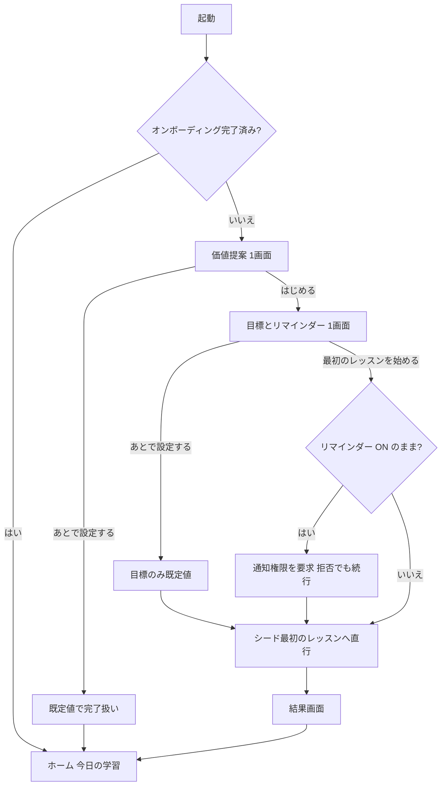
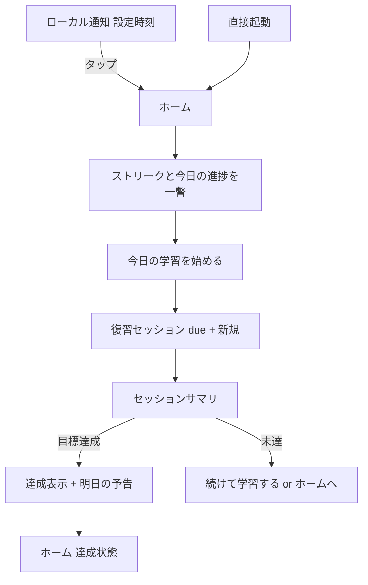
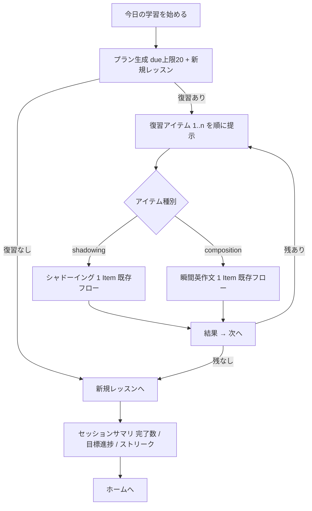
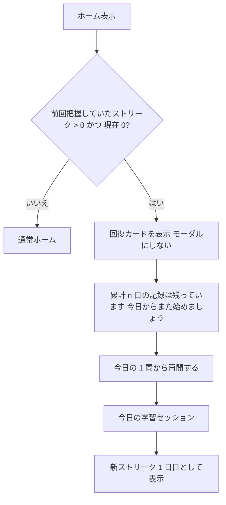
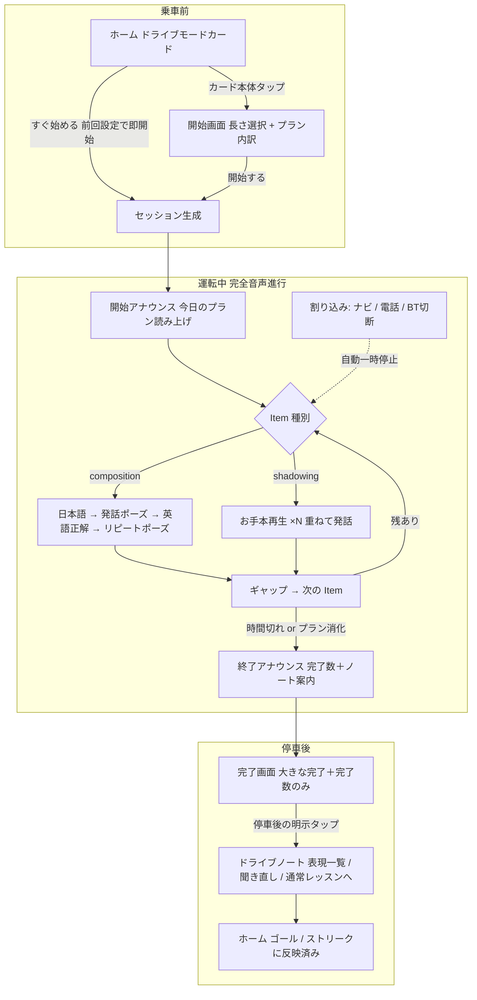

# UX 設計 — オンボーディングと継続体験

本書は SnapSpeak の **UX 設計正本** である。対象は「簡単に始められる（オンボーディング）」「継続し続けられる（リテンション）」「運転中でも学べる（ドライブモード）」の体験全体。プロダクト意図は [product-overview.md](./product-overview.md)、実装方針は [architecture.md](./architecture.md)、フェーズ分割は [roadmap.md](./roadmap.md) を正とし、食い違う場合は上位 3 文書が勝つ。実装の詳細分解は [phase2-retention-implementation-plan.md](./phase2-retention-implementation-plan.md) と [drive-mode-implementation-plan.md](./drive-mode-implementation-plan.md)（いずれも本書の下位文書）。

本書が固定するもの:

- デザイン原則（§1）
- ストリーク / デイリーゴール / 今日の学習プランの **ルール仕様**（§2。境界条件含む。実装はこの仕様のテスト可能な写像であること）
- 主要ユーザーフロー（§3）と画面仕様（§4）
- 状態マトリクス（§5）、通知戦略（§6）、アクセシビリティ（§7）、i18n キー方針（§8）、計測（§9）
- ドライブモード（§10。安全原則・Inko からの採用判断・音声シーケンス・割り込み設計・リモコン / NowPlaying）

---

## 1. デザイン原則

| # | 原則 | 意味 | やらないこと |
|---|------|------|--------------|
| P1 | 教えるより即体験 | 初回起動から最初のレッスン開始まで **60 秒以内・タップ 2 回**。説明はレッスンの中で最小限に出す | チュートリアル画面の連打、機能ツアー、初回のアカウント登録 |
| P2 | ホームは「今日やること」 | 開いた瞬間に「今日何をどれだけやるか」「どこまで進んだか」が 1 画面で分かる | コース階層をホームの一等地に置く、意思決定を毎回ユーザーに委ねる |
| P3 | 罰よりも回復しやすさ | ストリークは壊れにくく設計し、壊れたときは喪失感より「積み上げは消えていない」を先に見せる | 喪失を煽る文言、課金による復活（Phase 2 では導入しない）、ギルトトリップ通知 |
| P4 | 通知は静かに | ユーザーが設定した 1 日 1 回のみ。文言はストリーク状態で変わるが **本数は増えない** | 未設定ユーザーへの勝手な通知、バッジの常時点灯、1 日複数回のリマインド |
| P5 | 劣化を隠さない | ASR 不可・権限拒否・オフラインでも学習は継続できる。制限は明示し、責めない | 劣化状態での機能の黙殺、権限取得のための行き止まり画面 |
| P6 | 数字は正直に | ストリークは実学習完了のみカウント（起動だけでは進まない）。採点は「スクリプト一致率」であり発音評価と誤認させない | 形だけの起動をカウントする、ストリークを主 KPI にする |
| P7 | 最初から国際化・アクセシブル | 文字列は String Catalog、日付・数値は地域設定、Dynamic Type / VoiceOver は初期実装から前提 | 日本語ハードコード、色だけに依存した状態表示 |
| P8 | 運転中は操作ゼロ・視線ゼロ | ドライブモードは乗車前のワンタップ以降、画面注視も手操作も要求せず音声だけで完結する。画面表示は補助（グランスビュー: 大文字・1 情報）に留める | 走行中の画面操作要求、視認しないと進められない情報提示、運転中のマイク採点 |

---

## 2. ルール仕様（ストリーク / デイリーゴール / 今日の学習）

### 2.1 学習アクティビティの定義

| 用語 | 定義 |
|------|------|
| アイテム完了 | 1 Item の試行が完了し `LessonAttempt` が追記されたこと。**未採点（ASR 不可の劣化・タイプ入力・低 confidence）も 1 完了として数える** |
| 学習日 (StudyDay) | ローカル時刻 **04:00 境界**（SRSKit `StudyDay` と同一実装を使う。二重実装しない）。03:59 の完了は前日、04:00 ちょうどは当日 |
| 学習した日 | その学習日にアイテム完了が **1 件以上** ある日 |

設計判断: ストリークとゴールの母数を `ReviewEvent` ではなく `LessonAttempt` にする。`ReviewEvent` は低 confidence や劣化モードでは追記されないため、ASR 非対応端末のユーザーが構造的にストリークを積めなくなる。継続の仕組みは「練習した事実」に紐づける（P5・P6）。

### 2.2 デイリーゴール

| 項目 | 仕様 |
|------|------|
| 単位 | **アイテム数 / 日**（分数は採用しない。滞在時間は学習量の正直な尺度にならず、計測も自己申告的になるため） |
| プリセット | かるめ 5 / ふつう 10 / しっかり 20。オンボーディングで選択（既定 10）。Settings でいつでも変更可 |
| 達成判定 | 当該学習日のアイテム完了数 ≥ 目標数 |
| 反復の扱い | 同一アイテムの反復完了もカウントする（反復練習は正当な学習。水増し対策はしない — P6 の「実学習完了」は担保済み） |
| 目標変更当日 | その時点の新しい目標値で進捗を再評価する（遡及計算はしない） |
| ゴールとストリークの関係 | **独立**。ストリークは「1 件以上」で維持され、ゴール達成は進捗リングの完成として別に祝う。多忙な日に 1 問でも触れば火は消えない（P3） |

### 2.3 ストリーク

**定義**: 「学習した日」の連なり。現在ストリーク・最長ストリーク・累計学習日数の 3 つを持つ。

**救済策の設計判断 — 休み 1 日の橋渡し（グレース）を採用する**:

- 連続する休みが **1 学習日以内** ならストリークは途切れない（橋渡し）。**連続 2 学習日** 休むと途切れる。
- 橋渡しした休み日はカウントに **含めない**（30 日ストリーク = 実際に 30 日学習した。P6）。
- フリーズ（ストック消費型）は **採用しない**。理由: (1) 在庫という経済圏を持ち込むと Phase 2 の課金設計と癒着しやすく「課金で罰を回避」への圧力が生まれる（P3 に反する）、(2) アカウントなしのローカルデータでは在庫の同期・復元に将来コストがかかる、(3) 純関数として仕様化しにくい。橋渡しは入力（完了日集合）だけから決定的に計算でき、テスト容易。
- 喪失時の UI は「壊れた」より先に **累計は消えていない** ことを見せる（§3.4）。

**計算仕様**（純関数。実装は `HabitKit.StreakCalculator`）:

```
入力: 全 LessonAttempt の createdAt 列、now、Calendar（現在の端末タイムゾーン）、境界時刻 04:00
1. 各 createdAt を StudyDay に写像し、学習した日の集合 D を得る（同一日重複は 1）
2. today = StudyDay(now)
3. studiedToday = today ∈ D
4. 現在ストリーク: today から過去へ走査する。today が未学習でもペナルティなし
   （当日はまだ進行中）。それ以前は、休み 1 日は橋渡し（カウントせず継続）、
   休みが 2 日連続した時点で打ち切り。カウントは D に含まれる日のみ。
5. 最長ストリーク: 全履歴に同じ橋渡し規則を適用した最大値
6. 累計学習日数: |D|
```

**境界条件（テストで固定する）**:

| 条件 | 期待 |
|------|------|
| 03:59 に完了 | 前学習日にカウント |
| 04:00 ちょうどに完了 | 当学習日にカウント |
| 今日未学習・昨日学習済み | ストリーク維持（`isAtRisk = true`。通知文言が変わる） |
| 今日未学習・昨日休み・一昨日学習済み | 橋渡しで維持（`isOnLastGraceDay = true`。今日学習しないと明日途切れる） |
| 昨日・一昨日とも休み | 現在ストリーク 0（喪失） |
| タイムゾーン変更（例: Asia/Tokyo → America/Los_Angeles） | 過去の完了時刻（絶対時刻）は書き換えず、**現在のタイムゾーンの 04:00 境界で全日付を再解釈**する。ストリークが ±1 日変動しうることを許容し、補正はしない |
| DST 切替日 | `Calendar` の 04:00 解決に従う（独自の秒数計算をしない） |
| 端末時計の未来改ざん | ローカルでは検出しない（Phase 3 同期時にサーバー時刻でクリップ。architecture §6.4） |
| 同一学習日に複数完了 | 学習した日は 1 日として数える |

### 2.4 今日の学習プラン

ホームの主 CTA「今日の学習を始める」で開始する 1 セッションの中身。

| 項目 | 仕様 |
|------|------|
| 構成 | **期日到来の復習カード**（上限あり）＋ **新規レッスン 1 本**（コース順で次の未完了レッスン） |
| due 判定 | 通常カードは `dueAt <= now`。失敗カード（`relearnGateAt` あり）はゲート到達で候補にする（`dueAt` が翌学習日 04:00 でも同日再挑戦可）。architecture §6.4。Persistence は `dueAt <= now` に加えゲート到達カードも返す |
| 復習上限 | 1 セッション **20 件**（初期値。設定値として保持し校正可能にする）。超過分は「ほか n 件はまた明日」と表示し、タイムゾーンジャンプ等での due 一斉到来を吸収する（architecture §6.4） |
| 並び順 | `dueAt` 昇順（延滞が古いものから）→ 同時刻は composition 優先 → itemId 昇順 → courseId 昇順 → cardKey 昇順。**決定的**（乱数なし） |
| skill 混在 | 混在を許す（roadmap Phase 2 のとおり）。並びは上記規則に従い、人工的なインターリーブはしない（シャッフルは再現性を壊しテスト不能になる） |
| 新規レッスンの定義 | カタログ順（Course → Unit → Lesson）で「全 Item に試行が付いていない」最初のレッスン。全コース完了なら新規なし |
| 復習ゼロのとき | 新規レッスンのみ提示。新規もなければ「今日の分は完了」状態（§4.3） |
| セッション中断 | アイテムごとに完了時点で永続化済みのため、中断しても完了分の進捗・ストリークは保持。再開時はプランを再生成する（静的プランを持ち越さない） |
| 失敗カードの同日再挑戦 | プラン生成時点でゲート未通過のカードは含めない。セッション終了後の再生成で、ゲートを過ぎていれば再登場する |

---

## 3. 主要ユーザーフロー

### 3.1 初回起動（オンボーディング）

**バジェット: 起動から最初のレッスン開始まで 60 秒以内・タップ 2 回**（権限ダイアログはレッスン内で just-in-time）。

| 段階 | 画面 | ユーザー操作 | 目安秒数 |
|------|------|--------------|----------|
| 1 | コールドローンチ | — | 〜2 秒 |
| 2 | 価値提案（1 画面） | 読む＋「はじめる」タップ | 〜10 秒 |
| 3 | 目標とリマインダー（1 画面） | プリセット選択（既定選択済み）＋「最初のレッスンを始める」タップ | 〜15 秒 |
| 4 | シードコースの最初のレッスンへ直行 | レッスン内で録音開始時にマイク / 音声認識の権限を just-in-time 要求 | — |

- アカウント登録なし。言語ペアは既定 `ja→en`（設定から確認可能。Phase 1 方針のまま）。
- 各画面に「あとで設定する」スキップを置く。スキップ時は既定値（目標 10 問 / リマインダー OFF）で完了扱い。
- 通知権限は **リマインダーを ON のまま完了したときだけ**、目標画面の完了タップ直後に要求する（ユーザーが「リマインドして」と言った直後 = 使用直前）。OFF なら要求しない。後から Settings で ON にしたときも同様に just-in-time。
- マイク / 音声認識の権限はオンボーディングでは **要求しない**。既存レッスンフローの録音直前要求に従う（architecture §11.2）。



### 3.2 2 日目以降の再訪



- 通知タップはホーム（今日の学習）に着地する。ディープリンクで特定レッスンへは飛ばさない（プラン生成はホームの責務）。
- ホーム表示のたびに、当日分の未発火リマインダーを再計算する（既に学習済みなら当日分を取り消す。§6）。

### 3.3 復習セッション



- 各アイテムの学習 UI は既存のシャドーイング / 瞬間英作文の 1 Item フローをそのまま使う（採点・`ReviewEvent` 追記・fold は既存ユースケースの責務。二重実装しない）。
- セッション側が足すのは: 進捗ヘッダ（3/12）、結果画面の「次へ」、欠損コンテンツのスキップ、マイク拒否時の `onSkipped`（完了数に入れない）、サマリ。サマリの欠損行とユーザースキップ行は分ける（`review.summary.skipped` / `review.summary.skipped_user`）。
- 単発レッスンの完了はセッションの「次へ」と分離し、完了またはスキップ後に画面を閉じる。
- 途中離脱は確認ダイアログ 1 回（「完了した分は保存されています」）。

### 3.4 ストリーク喪失時（回復フロー）



- **モーダルで遮らない**。ホーム内のカードとして 1 回だけ表示（閉じられる）。
- 文言は喪失（「途切れました」）を 1 行で事実として伝え、直後に累計学習日数と最長記録が **残っている** ことを示す（P3）。
- 「連続 2 日休むと途切れる」ルール自体は、初回のストリーク獲得時とこのカードで説明する（隠しルールにしない）。

---

## 4. 画面仕様（テキストワイヤーフレーム）

### 4.1 オンボーディング 1: 価値提案

```
┌────────────────────────────────┐
│                                │
│   [アプリアイコン / キービジュアル]   │
│                                │
│   聞いて、まねて、即座に話す         │  ← onboarding.welcome.title
│   シャドーイングと瞬間英作文を、      │  ← onboarding.welcome.subtitle
│   1 日 10 分から。               │
│                                │
│   ・お手本に声を重ねるシャドーイング   │  ← 箇条書き 2 行のみ（読み物にしない）
│   ・日本語を見て即座に英語で言う      │
│                                │
│   ┌──────────────────────────┐ │
│   │       はじめる             │ │  ← PrimaryButton
│   └──────────────────────────┘ │
│         あとで設定する            │  ← テキストボタン（スキップ）
└────────────────────────────────┘
```

| 要素 | 仕様 |
|------|------|
| 構成 | 1 画面固定。ページング・動画・カルーセルなし（P1） |
| はじめる | 目標画面へ |
| あとで設定する | 既定値（目標 10 / リマインダー OFF）で完了扱いにしてホームへ。分析 `onboarding_skipped(step: welcome)` |

### 4.2 オンボーディング 2: 目標とリマインダー

```
┌────────────────────────────────┐
│  1 日の目標を決めましょう           │  ← onboarding.goal.title
│  続けやすい小さな目標がおすすめです。  │  ← onboarding.goal.subtitle
│  あとから設定でいつでも変えられます。  │
│                                │
│  ( ) かるめ（5 問/日）            │  ← 単一選択。既定は「ふつう」
│  (●) ふつう（10 問/日）           │
│  ( ) しっかり（20 問/日）          │
│                                │
│  ── リマインダー ──               │
│  [✓] 毎日リマインドする            │  ← 既定 ON（時刻を選ばせて価値を見せる）
│  時刻            [ 21:00 ▾ ]     │  ← ホイール。地域設定の時刻書式に従う
│                                │
│  ┌──────────────────────────┐  │
│  │  最初のレッスンを始める        │  │  ← PrimaryButton
│  └──────────────────────────┘  │
│        あとで設定する             │
└────────────────────────────────┘
```

| 要素 | 仕様 |
|------|------|
| 目標選択 | 3 プリセット。自由入力は置かない（迷わせない。Settings 側にも同じ 3 択） |
| リマインダー | トグル ON のまま「最初のレッスンを始める」をタップした場合のみ、その場で通知権限を要求。拒否されても止めずレッスンへ進む（トグルは OFF 表示に戻し、Settings に導線を残す） |
| 最初のレッスンを始める | 設定を保存し、シードコースの最初のレッスンへ **直接遷移**（ホームを経由しない）。分析 `onboarding_completed` |
| あとで設定する | 目標は既定値で保存し、そのままレッスンへ。分析 `onboarding_skipped(step: goal)` |

### 4.3 ホーム（再設計。「今日やること」中心）

```
┌────────────────────────────────┐
│ 今日の学習                (nav)  │
│                                │
│ ┌────────────────────────────┐ │
│ │ 🔥 12 日連続      ◔ 4/10 問 │ │  ← StreakBadge + ProgressRing（ゴール進捗）
│ │ （危機時: 今日まだ学習していません）│ │  ← isAtRisk のときのみ 1 行
│ └────────────────────────────┘ │
│ ┌────────────────────────────┐ │
│ │ 今日の学習                   │ │
│ │ 復習 8 件 ・ 新しいレッスン     │ │  ← プラン内訳。超過時「ほか n 件はまた明日」
│ │ ┌────────────────────────┐ │ │
│ │ │   今日の学習を始める        │ │ │  ← 主 CTA（画面で唯一の Primary）
│ │ └────────────────────────┘ │ │
│ └────────────────────────────┘ │
│ ┌────────────────────────────┐ │
│ │ ▶ 続きから: あいさつと予定調整   │ │  ← 直近レッスンへのショートカット（副 CTA）
│ └────────────────────────────┘ │
│ （状態バナー: 劣化 / オフライン等）   │
└────────────────────────────────┘
  タブ: [ホーム] [コース] [設定]
```

| 領域 | 要素 | 仕様 |
|------|------|------|
| ヘッダカード | StreakBadge | 炎シンボル＋「n 日連続」。`isAtRisk` で「今日まだ学習していません」を添える。`currentStreakDays == 1` のとき `streak.rule_note` をキャプション表示する（初回獲得時。2 日目以降は消える）。喪失直後は回復カード（§3.4）に置き換わる |
| | ProgressRing | 今日の完了数 / 目標。達成でリングが閉じチェックに変化 |
| 今日の学習カード | 内訳行 | 「復習 n 件 ・ 新しいレッスン」。復習 0 なら新規のみ、新規なしなら復習のみを表示 |
| | 主 CTA | 「今日の学習を始める」。プランが空（復習 0・新規なし）のときは達成状態表示に切替 |
| 達成状態 | | リング完成＋「今日の目標を達成しました」＋副 CTA「続けて学習する」（コース一覧へ）。追加学習を妨げない |
| 続きから | | 最後に開いたレッスン（単発・復習セッションで提示した Item を含む。`recordLastOpenedLesson`）。初回起動直後は非表示 |
| 状態バナー | | §5 の状態マトリクスに従う。学習を止めない情報提示に留める |

**状態遷移**: `loading → ready(プランあり / 達成) / empty(コースなし) / failed(読み込み失敗) / recovery(喪失直後)`（実装は `TodayViewModel.TodayState` と 1:1）。達成は独立状態ではなく、`ready` でプランが空のときの表示切替。`failed` はプラン読み込み失敗時で、「今日の学習を読み込めませんでした」＋再読み込み導線を出し学習を止めない。いずれの状態でもタブ・設定への導線は生きている。

### 4.4 復習セッション（コンテナ）

```
┌────────────────────────────────┐
│ ✕   復習   3 / 12               │  ← 進捗ヘッダ。✕は確認ダイアログ経由で離脱
│ ┌────────────────────────────┐ │
│ │                            │ │
│ │  （既存の 1 Item 学習 UI:      │ │  ← シャドーイング or 瞬間英作文
│ │    シャドーイングプレイヤー      │ │     既存画面をそのまま埋め込む
│ │    または瞬間英作文カード）      │ │
│ │                            │ │
│ └────────────────────────────┘ │
│ （結果表示後）                    │
│ ┌────────────────────────────┐ │
│ │          次へ               │ │  ← 結果確認後に出現
│ └────────────────────────────┘ │
└────────────────────────────────┘
```

| 要素 | 仕様 |
|------|------|
| 進捗ヘッダ | 「3 / 12」形式。VoiceOver は「12 問中 3 問目」と読む |
| ✕（離脱） | 確認ダイアログ「セッションを終了しますか？ 完了した分は保存されています」。破壊的操作ではない色 |
| 次へ | 各アイテムの結果表示後に出現。復習では「もう一度」より「次へ」を優位に置く（同日再挑戦は 10 分ゲートの管轄） |
| 欠損コンテンツ | コース削除等でアイテムを解決できない場合は自動スキップし、サマリに「教材が見つからないためスキップしました」を出す。ユーザースキップ（マイク拒否等）は別行（`review.summary.skipped_user`） |
| 新規レッスン部 | 復習消化後に「新しいレッスン」区切りを 1 画面挟んで開始（心理的な切れ目を作る） |

### 4.5 セッションサマリ

```
┌────────────────────────────────┐
│         セッション完了            │
│                                │
│      ◎ 12 問 完了               │
│      ◔ → ● 今日 12/10 問        │  ← ゴール進捗の前後
│      🔥 12 → 13 日連続           │  ← ストリーク更新があれば
│                                │
│   （目標達成時: 今日の目標を達成    │
│     しました！）                  │
│                                │
│ ┌────────────────────────────┐ │
│ │        ホームへ戻る           │ │
│ └────────────────────────────┘ │
│        続けて学習する             │  ← 副 CTA（コース一覧へ）
└────────────────────────────────┘
```

- 祝いはこの画面に集約する（レッスン中に都度出さない）。Reduce Motion 時はアニメーションを静止表現に落とす。
- ストリークが当日初学習で伸びた場合のみ「n → n+1 日連続」を表示する。

### 4.6 設定（追加分）

既存の設定画面に「継続」セクションを追加する。

```
│ ── 継続 ──                      │
│ 1 日の目標          ふつう（10）▾ │  ← 3 プリセットのメニュー
│ リマインダー              [✓]    │
│ 時刻                 21:00 ▾    │  ← リマインダー ON のときのみ表示
│ （権限拒否時: 通知が許可されていま   │
│   せん。→ 通知設定を開く）         │
```

| 要素 | 仕様 |
|------|------|
| 目標変更 | 即時反映（当日の進捗は新目標で再評価） |
| リマインダー ON | 通知権限が未決定なら just-in-time で要求。拒否済みなら設定アプリへの導線を出す（`UIApplication.openSettingsURLString`） |
| リマインダー OFF | 予約済み通知をすべて取り消す |

### 4.7 通知（表示物）

| 種別 | タイトル | 本文 | 発火条件 |
|------|----------|------|----------|
| 通常デイリー | 今日の英語、始めましょう | 1 日 %lld 問の目標が待っています。すきま時間にどうぞ。 | 設定時刻。当日未学習のときのみ |
| ストリーク危機 | ストリークが途切れそうです | %lld 日連続の記録を、今日の 1 問でつなげましょう。 | 設定時刻。当日未学習かつ現在ストリーク ≥ 1 のとき、通常文言の **代わりに** 出す（本数は同じ） |

### 4.8 進捗ダッシュボード

ホームの習慣カード（または回復カード）の直後から遷移する、ローカル履歴だけの進捗画面。オフラインで開ける。指標名は「スクリプト一致率」であり、発音精度と誤認させない。

```
┌────────────────────────────────┐
│ 学習の進捗                (nav)  │
│                                │
│ ┌────────────────────────────┐ │
│ │ ストリーク                   │ │
│ │ 🔥 12              最長 20 日 │ │  ← StreakBadge + 最長 / 累計
│ │                    累計 40 日 │ │
│ └────────────────────────────┘ │
│ ┌────────────────────────────┐ │
│ │ 直近 7 日                   │ │
│ │  [棒グラフ 7 本 + 値ラベル]   │ │  ← 0 件日も埋める。達成日はアクセント
│ │  合計 18 問                  │ │
│ └────────────────────────────┘ │
│ ┌────────────────────────────┐ │
│ │ モード別                     │ │
│ │ シャドーイング  82%  ・ 12 件 │ │  ← 直近 30 学習日。0 件は「まだデータなし」
│ │ 瞬間英作文      70%  ・  8 件 │ │
│ └────────────────────────────┘ │
│ ┌────────────────────────────┐ │
│ │ スクリプト一致率は語の再現度   │ │  ← caption 3 行
│ │ 集計はこの端末内の履歴のみ     │ │
│ │ モード別平均は直近 30 学習日   │ │
│ └────────────────────────────┘ │
└────────────────────────────────┘
```

| 領域 | 要素 | 仕様 |
|------|------|------|
| 導線 | ホームの遷移行 | `home.progress_link`（「進捗を見る」）。habit / 回復カードの直後、今日の学習カードの前。44pt 領域 |
| ストリーク | StreakBadge | 既存部品を再利用。current をバッジ、longest / total を `dashboard.streak.longest` / `dashboard.streak.total` で併記。入力は全履歴の `attemptActivityDates()` |
| 直近 7 日 | 縦棒チャート | 今日を含む直近 7 学習日（04:00 境界、端末 TZ）。完了アイテム数。0 件日も 0 のバー。ゴール達成日はアクセント色 + 値ラベル常時表示（色だけに依存しない）。過去日の達成は**現在の**デイリーゴール基準（遡及しない。§2.2） |
| | 週間完了 | 上記 7 学習日の完了合計（`dashboard.week.total`） |
| モード別 | シャドーイング | 直近 30 学習日の `scriptMatchRate` 単純平均。件数併記。0 件は `dashboard.modes.no_data` |
| | 瞬間英作文 | 同窓の `pass / (pass + fail)`。`unscored` は分母に入れない |
| 注記 | caption 3 行 | `dashboard.metric_note`（語の再現度であり発音の正確さではない）と `dashboard.local_note`（この端末内の履歴のみ）と `dashboard.window_note`（直近 30 学習日窓である旨） |
| a11y | チャート | 全体に `dashboard.week.title`。各バーは日付ラベル + `dashboard.bar.value_label`（n 問）。goalMet なら `dashboard.bar.goal_met` を値に追記 |
| Dynamic Type | | 固定高さはチャート（180pt 程度）のみ。カードは縦積みで崩れない |

**状態遷移**: `loading → ready(ProgressSummary) / empty(履歴 0) / failed(読み込み失敗)`（実装は `DashboardViewModel.DashboardState` と 1:1）。`empty` は `dashboard.empty`。`failed` は `dashboard.load_failed` + `dashboard.retry`。Analytics イベントは追加しない。

---

## 5. 状態マトリクス

各画面 × 特殊状態の定義。空欄は「影響なし（通常表示）」。

| 状態 | ホーム | 復習セッション | オンボーディング | 設定（継続） | ダッシュボード |
|------|--------|----------------|------------------|--------------|----------------|
| **コースなし（空）** | 今日の学習カードの代わりに「コースがありません。コース一覧からダウンロードしてください」＋コース一覧への導線。ストリーク表示は履歴があれば出す | 到達しない（ホームで CTA が出ない） | シードが常に同梱されるため通常発生しない（シード読込失敗時はホームの空状態に落ちる） | | 履歴があれば表示 / 履歴なしは空状態 |
| **due 0・新規なし（全完了）** | 達成状態（§4.3）。「続けて学習する」でコース一覧へ | 開始できない（CTA 非表示） | | | 影響なし |
| **ASR 劣化（オンデバイス不可）** | バナー「オンデバイス音声認識が使えないため、録音と自己再生のみです」（既存キー再利用）。プラン・ストリークは通常どおり | シャドーイング Item は既存の劣化フロー。完了は録音完了で成立し、ゴール / ストリークにカウント。SRS 品質は書かれない（既存仕様） | | | 影響なし |
| **オフライン** | 影響なし（プラン生成・ストリーク・SRS は全てローカル）。ダウンロード導線のみ失敗しうる | 影響なし（ダウンロード済み / シードで完結） | 影響なし | 影響なし | 影響なし |
| **マイク権限拒否** | 影響なし | シャドーイングはお手本再生のみ（録音なし）。完了条件を満たせないためスキップ導線を出す。スキップは `completedCount` に入れない。瞬間英作文はタイプ入力で完了可 | 権限を要求しない設計のため影響なし | | 影響なし |
| **音声認識権限拒否** | 影響なし | シャドーイングは録音・自己再生（完了カウント可）。瞬間英作文はタイプ入力。ASR 不可 / 認識エラーは未採点完了（Attempt は追記、`.fail` の ReviewEvent は書かない） | 同上 | | 影響なし |
| **通知権限拒否** | 影響なし（学習機能は劣化しない。roadmap Phase 2 DoD） | 影響なし | リマインダートグルが OFF に戻り、続行 | 「通知が許可されていません」＋設定アプリ導線 | 影響なし |
| **ストリーク喪失直後** | 回復カード（§3.4）。1 回閉じたら通常表示 | | | | 影響なし（履歴のストリークを表示） |
| **タイムゾーン大移動** | due 一斉到来は復習上限 20 件で削る。「ほか n 件はまた明日」で明示 | 同左 | | | 学習日境界 04:00（端末 TZ）で再集計 |

### 5.1 実装対応メモ（目視確認）

状態マトリクスは次の実装に写像した。実機確認は計画書 §6.3（通知実発火・権限 3 状態・60 秒計測・VoiceOver）に残す。

| 状態 | 実装箇所 |
|------|----------|
| コースなし | `HomeView` が `courses.isEmpty` / `TodayState.empty` で `home.today.empty_course` ＋ コース一覧へ |
| due 0・新規なし | `SessionPlan.isEmpty` のとき達成カード（`home.today.all_done_*`）＋ `home.today.extra` |
| ASR 劣化 | 既存 `degraded.no_asr` バナー。完了は `LessonAttempt` 追記でゴール / ストリークに算入 |
| オフライン | プラン・ストリークはローカル（`HabitKit` + SwiftData）。追加取得のみ失敗しうる |
| マイク拒否 | シャドーイングは `startPreview` + `onSkipped`。単発は dismiss。セッションは `skip()` |
| Speech / ASR 不可 | 瞬間英作文は `CompositionGrade.unscored`。Attempt のみ追記しタイプ入力へ誘導 |
| 通知権限拒否 | オンボーディングはトグル OFF で続行。Settings は `settings.reminder_denied` ＋ 設定アプリ導線 |
| ストリーク喪失直後 | `TodayViewModel` が `lastKnownStreakDays > 0 && current == 0` で回復カード。1 回閉じたら通常 |
| タイムゾーン大移動 | `SessionPlanPolicy.maxReviews = 20` と `home.today.deferred` |
| プラン読み込み失敗 | `TodayState.failed` → `home.today.load_failed` ＋ `home.today.retry`（再読み込み）。既存 snapshot があっても古い plan で開始しない（`regeneratePlanThenStart` は `ready` のみ true） |

---

## 6. 通知戦略

| 項目 | 方針 |
|------|------|
| チャネル | **ローカル通知のみ**（サーバープッシュなし。Phase 1〜2 はアカウントなし） |
| 本数の上限 | **1 日最大 1 本**（ユーザー設定時刻）。ストリーク危機は本数を増やさず **同じ 1 本の文言を差し替える** |
| 既定 | リマインダーはオンボーディングで既定 ON 提示だが、**権限要求はユーザーが ON のまま進めたときだけ**。スキップ・OFF なら一切通知しない |
| 取り消し | 当日分は「その学習日に 1 件以上完了」した時点で取り消す（達成済みの人に鳴らさない）。アプリのフォアグラウンド復帰時・セッション完了時に再計算 |
| 先読み予約 | ローカル通知は発火時点の状態を知れないため、**3 日分** を予約し、アプリが開かれるたびに全消し＋再予約（識別子はカレンダー日で冪等）。数日開かれない場合も 3 日で自然停止し、放置ユーザーへ鳴らし続けない |
| 文言 | §4.7 の 2 種のみ。罪悪感を煽る表現（「もう忘れたの？」等）を使わない。絵文字は使わない |
| バッジ | 使わない（P4） |
| 深夜帯 | ユーザーが明示的に深夜を選んだ場合はそのまま尊重する（勝手に補正しない） |
| 権限 UI | 拒否されても学習機能は無劣化。再要求はせず、Settings に設定アプリへの導線を常設 |

---

## 7. アクセシビリティ指針

architecture §11.5 の Phase 1 基準を継続機能にも適用する。追加分:

| 対象 | 指針 |
|------|------|
| ProgressRing | `accessibilityValue` に「今日 4/10 問」を数値で提供。リングの色（達成 = success）に依存せず、達成時はチェック記号＋テキストを併記 |
| StreakBadge | `accessibilityLabel` =「12 日連続学習中」。危機時は「今日まだ学習していません」を `accessibilityHint` で追加。炎シンボルは装飾（`accessibilityHidden`） |
| 進捗ヘッダ（3/12） | 「12 問中 3 問目」と読み上げる。アイテム遷移時に `accessibilityNotification` でアナウンス（録音中は抑制 — 既存の VoiceOver 混入防止規則を維持） |
| 達成演出 | Reduce Motion で静止画に差し替え。音は鳴らさない（シャドーイングの音声体験と干渉させない） |
| Dynamic Type | 最大サイズでホームのカードは縦積みに再配置。リングは固定サイズを保ちテキストのみ拡大。全ボタン 44pt 以上 |
| オンボーディング | 2 画面とも VoiceOver の操作順が視覚順に一致。目標プリセットはラジオグループとして読み上げ |
| 通知 | 文言はプレーンテキストのみ（読み上げ互換） |

---

## 8. i18n キー方針

architecture §9 に従う。継続機能で追加するキーの規約:

| 規約 | 内容 |
|------|------|
| 命名 | `<画面/ドメイン>.<要素>[.<状態>]` の英語ドット区切り。単語内は snake_case（既存の `settings.reset_install_id` と同型）。例: `home.today.start`、`streak.broken.title` |
| 名前空間 | `onboarding.*` / `home.today.*` / `home.goal.*` / `home.recovery.*` / `home.progress_link` / `dashboard.*` / `streak.*` / `review.session.*` / `review.summary.*` / `notification.*` / `settings.*` / `home.drive.*` / `drive.*`（既存に追加） |
| 変数 | 件数は `%lld`、複数変数は位置指定（`%1$lld / %2$lld`）。将来の英語 UI で複数形が必要になるキー（件数系）は最初から変数化しておき、`.xcstrings` の plural variation を英語追加時に付与する |
| 値 | Phase 2 時点は `ja` のみ。キー名から意味が推測できること（翻訳者がコード無しで訳せる） |
| 禁止 | 文字列連結による文生成、コード内日本語リテラル（SwiftLint カスタムルールで強制）、`AppleLanguages` 書換え |
| 通知文言 | UI と同じ String Catalog を使い、予約時に `String(localized:)` で解決する（ローカル通知は表示時でなく予約時に文字列が固定されるため、言語変更後はアプリ起動時の再予約で追従する） |
| 用語 | 「ストリーク」「今日の学習」「復習」を glossary に追加。「連続記録」と「ストリーク」を混在させない |

キーの全一覧（ja 値付き）は [phase2-retention-implementation-plan.md](./phase2-retention-implementation-plan.md) §5 を正とする。ドライブモードのキー（`drive.*` / `home.drive.*` / `settings.drive_*`）は [drive-mode-implementation-plan.md](./drive-mode-implementation-plan.md) §2.6 を正とする。TTS アナウンスの入力文字列も UI 文字列として String Catalog を経由する（`Text()` を通らないため SwiftLint カスタムルールに掛からない。レビューで担保 — `ReminderContent` と同じ扱い）。

---

## 9. 計測（分析イベント）

AnalyticsCore の原則（生テキスト・音声・個人データを送らない。量子化した帯のみ）を維持する。オンボーディング完了率とストリーク継続率を測るため、次のイベント ID を予約・実装する。

| イベント ID | 発火点 | ペイロード（帯・コードのみ） |
|-------------|--------|------------------------------|
| `onboarding_started` | 価値提案画面の表示 | — |
| `onboarding_completed` | 目標画面の完了（スキップ経由含む） | goalItems、reminderEnabled、skippedGoal |
| `onboarding_skipped` | 各画面のスキップ（保存成功時に 1 回） | step（`welcome` / `goal`） |
| `review_session_started` | 今日の学習セッション開始 | dueCount、newCount |
| `review_session_completed` | セッションサマリ表示 | completedCount、durationBand |
| `goal_met` | 当日初の目標達成 | goalItems |
| `streak_day_recorded` | 当日初のアイテム完了（studiedToday が false→true） | streakBand（1 / 2-3 / 4-6 / 7-13 / 14-29 / 30+） |
| `streak_broken` | ホームで喪失検出（前回把握 > 0 かつ現在 0） | lengthBand（同上の帯） |
| `reminder_scheduled` | 通知予約の同期 | kind（daily / streak_risk） |
| `reminder_opened` | 通知タップ起動 | kind |
| `drive_session_started` | ドライブセッション開始（開始 / すぐ始める操作） | dueCount、newCount、lengthCode（`5` / `10` / `20` / `endless`） |
| `drive_session_completed` | ドライブセッション終了（完走・手動停止とも） | completedCount、durationBand、endReason（`finished` / `stopped`）、usedTTSFallback |
| `drive_note_opened` | ドライブノート表示 | completedCount |

導出 KPI: オンボーディング完了率 = `onboarding_completed` / `onboarding_started`。活性化は既存どおり初回 `lesson_completed`。ストリーク継続率 = `streak_day_recorded` の帯遷移と `streak_broken` の分布で見る（ストリーク日数の生値は送らず帯のみ。product-overview §8.5 の「ストリークだけを成功指標にしない」を維持）。ドライブモードの寄与は `drive_session_*` と Attempt payload の drive 判別（実装計画 §2.3）で観測し、「完了アイテムのうちドライブ由来の割合」を product-overview §8.3 の指標に写像する。

---

## 10. ドライブモード（運転中の語学学習）

SnapSpeak は **運転中の語学学習（車内・ハンズフリー・アイズフリー）を主要ユースケースの第一級** とする（product-overview §1）。本章はその UX 正本である。既存のコア体験（シャドーイング / 瞬間英作文 / SRS / ストリーク）は変更せず、ドライブモードはそれらの **音声のみ・自動進行の別提示形態** として設計する。実装分解は [drive-mode-implementation-plan.md](./drive-mode-implementation-plan.md)（下位文書）。

### 10.1 安全原則（絶対条件）

P8（§1）を頂点とする。以下は妥協しない。

| # | 原則 | 内容 |
|---|------|------|
| D1 | 操作ゼロ・視線ゼロ | 乗車前のワンタップ以降、走行中に画面注視・手操作を要求しない。進行はすべて自動。介入手段はステアリングリモコン / ロック画面（§10.7）と、停車時のグランスビュー大ボタンのみ |
| D2 | 画面は補助 | 走行中の画面はグランスビュー（大文字・1 情報）。読ませる詳細情報を出さない。**ロック状態・ポケット / ホルダー内での運用が前提**（バックグラウンド再生必須） |
| D3 | マイクを使わない | 走行中の録音・ASR 採点は行わない（車内騒音でスクリプト一致率が実態と乖離し P6 に反する。注意資源も割かせない）。完了は **未採点 Attempt** として §2.1 の定義どおりストリーク / ゴールに算入する。マイク・音声認識の権限も要求しない |
| D4 | 割り込みに常に譲る | ナビ・電話・Siri が優先。割り込みで自動一時停止し、安全に再開する（§10.6） |
| D5 | 詰まっても止まらない | 発話ポーズで言えなくても罰はなく、正解が必ず流れて次へ進む。ユーザーのテンポ入力を進行条件にしない |

**「アイテム完了」の定義（P6 との整合）**: 当該 Item のフェーズ列（発話ポーズを含む）が、一時停止なしに最後まで再生された時点で完了とする。一時停止中・スキップした Item は完了に数えない。セッション開始はユーザーの明示タップのみ（自動開始しない）。これにより「実時間の練習ウィンドウが流れた」ことを完了の根拠にする。

### 10.2 Inko からの学びと採用判断

競合 Inko（AlphaByte 製 AI 英会話アプリ）の UX 調査から、次を採用 / 翻訳 / 不採用と判断した。

| # | Inko の UX | 判断 | SnapSpeak（ドライブモード）への翻訳 |
|---|-----------|------|--------------------------------------|
| 1 | 1 日 60 秒のマイクロセッション（超低フリクション） | **部分採用** | 「開始までの摩擦を極小化」（ワンタップ・前回設定を記憶）と「終わった直後に価値が届く」（停車後ドライブノート）を採用。60 秒という長さ自体は運転文脈（10 分〜1 時間）に合わないため、セッション長 5 / 10 / 20 分 / エンドレスに置換 |
| 2 | ショート動画風のスワイプでシーン選択 | **不採用** | スワイプ発見は視線と手操作を要し運転 UX と両立しない。乗車前のワンタップ開始＋ `SessionPlanner` による自動プラン選定（due 復習 + 新規）に置換し、「何をやるか」の意思決定をゼロにする（P2 とも整合） |
| 3 | オープンマイクのリアルタイム会話。詰まったら母国語で OK | **翻訳して採用** | リアルタイム会話・割り込み発話は運転中は不採用（D3。マイクなし）。「詰まっても会話が壊れない・罰がない」という核だけを、「発話ポーズで言えなくても必ず正解が流れる」「未採点でも 1 完了として習慣に積む（既存 unscored 設計の再利用）」として採用（D5） |
| 4 | 会話直後の自動レッスンノート（あなたの言い方 → ネイティブの言い方＋聞き直し） | **採用** | **ドライブノート**（§10.5.3。停車後に見る）。やった表現の L1 → L2 対比一覧・お手本の聞き直し・通常レッスン（採点つき）への導線。「自分の音声の聞き直し」は録音しないため対象外 |
| 5 | 表現の 1 タップ保存 → フラッシュカード化 → 翌日の会話に再登場 | **既存 SRS で採用** | 専用の保存機構は追加しない。ドライブで触れた due カードは品質を書かないため **SRS 上 due のまま残り**、通常レッスンや翌日のドライブに自然に再登場する（= 再登場ループは SRS が既に提供している）。ノートから通常レッスンへの 1 タップ導線で「保存 → 定着」を接続する |
| 6 | 復習は自分専用ポッドキャスト（自動生成音声・字幕・バックグラウンド再生） | **音声設計として採用** | ドライブセッション自体を「自分のプランから自動生成された練習番組」として設計する（アナウンス → 出題 → ポーズ → 正解。§10.4）。バックグラウンド再生・ロック画面対応は必須要件。字幕（画面テキスト同期）は走行中は不採用（D2）。2 人の掛け合い形式は不採用（対話台本の生成に LLM / サーバー TTS が必要で、オンデバイス完結の不変条件と Phase 境界に反する） |
| 7 | 学習データは端末内保存 | **同方針** | 変更なし（既存不変条件のまま） |

### 10.3 フロー設計



| 段階 | 仕様 |
|------|------|
| 乗車前 | ホームのドライブモードカードに **「すぐ始める」**（前回のセッション長・設定で即開始 = ワンタップ）と、カード本体タップで開始画面（長さ変更・プラン内訳確認）。開始時に今日のプランを **再生成**する（古い snapshot で開始しない。`regeneratePlanThenStart` と同方針） |
| 開始 | オーディオセッション起動 → 開始アナウンス（「復習 n 問と新しい問題 m 問を練習します。音声のあとに続けて話してください」）。以降は視線ゼロ・操作ゼロで自動進行 |
| 運転中 | §10.4 の音声シーケンス。Item 完了ごとに未採点 Attempt を即時永続化（中断しても完了分は保持 — §2.4 のセッション中断と同方針） |
| 終了 | 時間満了またはプラン消化で終了アナウンス。手動停止（リモコン / グランスビューの終了）ではアナウンスを流さない（意図的な操作に音声を重ねない） |
| 停車後 | 完走直後は学習テキストを出さない安全な 1 情報の完了画面（大きな「完了」＋完了数）を維持する。ドライブノート（§10.5.3）は停車後の明示タップでのみ開く。閉じるとホーム（ゴールリング / ストリークは反映済み） |
| プランとの関係 | ドライブの復習は品質を書かないため、**ホームの「復習 n 件」はドライブ後も減らない**。これは仕様である（ドライブ = 産出リハーサル、通常レッスン = 採点つき定着、という役割分担。P6 の「数字は正直に」を SRS にも適用する）。ノートの導線文言でこの関係を説明する |
| プランが空のとき | 「今日の分は完了」でも開始できる。既習アイテムから反復パスを生成する（§2.2「反復も正当な学習」と整合）。開始画面にその旨を表示する |

### 10.4 音声シーケンス仕様

数値はすべて **初期仮値** であり、実走行での校正対象（architecture §6.3 の校正方針と同型）。定義の正本は DriveKit の `DriveTimingPolicy.standard`（speakPause 1.6 / 3–12 秒、repeatPause 1.0 / 2–8 秒、trackGap 0.8 秒、itemGap 1.2 秒、TTS 推定 `500 + 90×L1 文字` / `500 + 60×L2 文字`、intro 8 秒 / section 2.5 秒 / outro 5 秒）。MVP はこの値で実装済み。

**瞬間英作文 Item（日本語 → ポーズ → 英語正解）**:

| 順 | フェーズ | 音源 | 長さ |
|----|----------|------|------|
| 1 | promptL1（出題） | TTS（L1 ボイス、`sentencePair.l1`） | TTS 実長 |
| 2 | speakPause（発話ポーズ） | 無音 | `clamp(正解長 × 1.6 × ポーズ係数, 3 秒, 12 秒)`。正解長 = お手本音声 `durationMs`、なければ TTS 推定長 |
| 3 | revealL2（正解） | お手本音声ファイル。欠損・破損時は TTS（L2 ボイス、`acceptable` 先頭） | 実長 |
| 4 | repeatPause（リピート発話） | 無音 | `clamp(正解長 × 1.0 × ポーズ係数, 2 秒, 8 秒)`。正解を聞いた直後に口に出す |
| 5 | itemGap | 無音 | 1.2 秒 |

**シャドーイング Item（お手本 → 重ねて発話）**:

| 順 | フェーズ | 音源 | 長さ |
|----|----------|------|------|
| 1 | shadowTrack × N | お手本音声（欠損時は TTS で `passage.text`） | 実長 × N。既定 N=2（1 回目は聞く、2 回目以降は重ねて発話）。設定で 1〜3 |
| 2 | trackGap（反復間） | 無音 | 0.8 秒 |
| 3 | itemGap | 無音 | 1.2 秒 |

**アナウンス**（すべて String Catalog → TTS。Item ごとの逐次アナウンスはしない — 冗長さは学習時間を削る）:

| 種別 | 発火 | 内容 |
|------|------|------|
| セッション開始 | 開始直後 1 回 | プラン読み上げ（復習 n 問・新規 m 問）＋「音声のあとに続けて話してください」 |
| 新レッスン区切り | 復習 → 新規の境界 1 回 | 「ここからは新しいレッスンです」（§4.4 の心理的切れ目の音声版） |
| セッション終了 | 自然終了時 1 回 | 完了数＋「停車してからドライブノートを開けます」の案内。手動停止では流さない |

**セッション長と切り詰め**:

| 項目 | 仕様 |
|------|------|
| 長さ | 5 / 10 / 20 分 / エンドレスの 4 択。既定 10 分。前回選択を記憶 |
| 切り詰め | 各 Item の推定所要（フェーズ長合計）を積算し、**Item 単位** で予算に収まるところで切る。最低 1 Item は保証（1 Item が予算超過でも含める） |
| 時間が余るとき | プラン（due + 新規）を消化してもセッション長に満たない場合、同じ Item 列で **反復パス** を続ける。反復の完了もカウントする（§2.2） |
| エンドレス | プラン消化後も反復し続ける。停止操作（リモコン / 画面）でのみ終了 |
| 順序 | `SessionPlanner` の決定的順序（§2.4）を保存する。復習 → 新規レッスンの順。シャッフルしない |
| ポーズ係数設定 | みじかめ 0.8 / ふつう 1.0 / ながめ 1.3（Settings。§10.5.4） |

### 10.5 画面仕様（テキストワイヤーフレーム）

#### 10.5.1 開始画面（乗車前）

```
┌────────────────────────────────┐
│ ✕                ドライブモード   │
│                                │
│  今日のプラン                    │
│  復習 8 問 ・ 新しいレッスン 4 問  │  ← drive.start.plan_summary
│                                │
│  セッションの長さ                 │
│  [ 5分 ] [✓10分 ] [ 20分 ] [∞]  │  ← 色＋チェック。最大 DT は縦積み
│                                │
│ ┌────────────────────────────┐ │
│ │                            │ │
│ │        ▶ 開始する            │ │  ← 巨大ボタン（画面幅・高さ 88pt 以上）
│ │                            │ │
│ └────────────────────────────┘ │
│  走行中は画面を操作しないでくださ    │  ← drive.start.safety_note
│  い。開始後は音声だけで進みます。    │
└────────────────────────────────┘
```

| 要素 | 仕様 |
|------|------|
| プラン内訳 | 開始時点の再生成プランの due / 新規件数。プラン空なら「今日の分は完了しています。これまでの表現を反復します」 |
| 長さ選択 | 4 択セグメント。タップ即反映・永続化（次回のすぐ始めるに使われる）。選択は色だけに頼らずチェックマークと `isSelected` でも示す。最大 Dynamic Type では縦積み（P7） |
| 開始する | 開始アナウンスへ。以降フルスクリーン（誤ジェスチャ防止。architecture §2.3 と同方針） |
| 権限 | 何も要求しない（D3。通知・マイクとも無関係） |

#### 10.5.2 走行中グランスビュー（原則見ない画面）

```
┌────────────────────────────────┐
│  終了                    12/30  │  ← 44pt / 進捗（1 情報のみ小さく）
│                                │
│                                │
│         は な す                │  ← 現在フェーズを 1 語で（きく / はなす / こたえ）
│                                │      超大型タイポ・高コントラスト
│                                │
│ ┌────────────────────────────┐ │
│ │                            │ │
│ │        ⏸ 一時停止           │ │  ← 画面下半分の巨大ボタン
│ │                            │ │      （一時停止中は ▶ 再開）
│ └────────────────────────────┘ │
└────────────────────────────────┘
```

| 要素 | 仕様 |
|------|------|
| 状態語 | きく（お手本再生中）/ はなす（発話ポーズ）/ こたえ（正解再生中）/ 一時停止中。**1 画面 1 情報**（D2）。色に依存しない |
| 巨大ボタン | 一時停止 ⇄ 再開のトグルのみ。画面下半分（最小 120pt）。停車時・同乗者向け |
| 終了 | 左上 44pt。確認ダイアログなし（完了分は保存済み。§2.4 と同じ理由）。完了画面へ（ノートは停車後の明示タップ） |
| 学習テキスト | 出さない（英文・和文とも）。読ませる要素を置かない（D2） |
| 画面ロック | ロックしても進行は続く（バックグラウンド再生）。グランスビューはあくまで補助 |

#### 10.5.2a 完了画面（停車前は読ませない）

自然終了・手動停止の直後は、学習テキスト（L1 / L2）を出さない。大きな「完了」と完了数だけの 1 情報画面を維持する（D2 / §10.3）。「ドライブノートを開く」は停車後の明示タップ。

```
┌────────────────────────────────┐
│  閉じる                         │
│                                │
│            完 了               │
│         12 問練習しました        │
│                                │
│ ┌────────────────────────────┐ │
│ │     ドライブノートを開く      │ │
│ └────────────────────────────┘ │
└────────────────────────────────┘
```

#### 10.5.3 ドライブノート（停車後）

```
┌────────────────────────────────┐
│         ドライブノート            │
│      ◎ 12 問 練習しました        │
│      ◔ → ● 今日 12/10 問        │  ← ゴール進捗（§4.5 と同型）
│                                │
│ ┌────────────────────────────┐ │
│ │ 少し遅れます。10分後に…        │ │  ← L1（出題）
│ │ I'm running a bit late. …   │ │  ← L2（正解）
│ │            [🔊 聞き直す]      │ │  ← お手本再生（TTS フォールバック含む）
│ └────────────────────────────┘ │
│ │ （やった表現ぶん繰り返し）       │ │
│ ┌────────────────────────────┐ │
│ │ 通常レッスンで採点つきで練習する  │ │  ← 副 CTA。復習は採点で定着（§10.3）
│ └────────────────────────────┘ │
│           閉じる                │
└────────────────────────────────┘
```

| 要素 | 仕様 |
|------|------|
| 一覧 | セッションで完了した Item の L1 → L2 対比（shadowing は L2 本文のみ）。反復パス分は 1 行にまとめ回数を添える |
| 聞き直す | お手本音声（欠損時 TTS）を 1 回再生。走行再開時のために自動連続再生はしない |
| 通常レッスンへ | 採点つきで定着させる導線（Inko の「保存 → 翌日再登場」の SnapSpeak 版接続点）。due カードが残っている理由もここで一言説明する |
| 欠損 | 再生できなかった教材があれば 1 行で明示（P5。責めない文言） |
| 永続化 | ノート自体は保存しない（Attempt 列から導出可能な情報のみを表示。アプリ強制終了時はノートは失われるが完了分の Attempt・習慣は保持済み） |

#### 10.5.4 設定（追加分）

```
│ ── ドライブモード ──              │
│ セッションの長さ        10分 ▾    │  ← 5 / 10 / 20 / エンドレス
│ 発話ポーズ            ふつう ▾    │  ← みじかめ / ふつう / ながめ
│ シャドーイングの反復回数    2 ▾    │  ← 1 / 2 / 3
```

走行中に開く前提の画面ではないため通常の Settings 配下。開始画面の長さ選択と同じ値を読み書きする。

### 10.6 割り込み・劣化の状態設計

| 事象 | 挙動 | 復帰 |
|------|------|------|
| 電話・Siri・他アプリの音声割り込み | 即時一時停止（フェーズ途中は捨てる） | 割り込み終了で `shouldResume` なら **自動再開**（現在 Item の頭から）。`shouldResume` なしは一時停止のまま（リモコン / 画面で再開） |
| ナビ音声 | ダッキング（ナビ側が音量を下げて重ねる）は OS に委ね **続行**。ナビが割り込み型なら上と同じ | 同上 |
| Bluetooth 切断（降車・エンジン停止） | 即時一時停止。**内蔵スピーカーへ切り替えて鳴らし続けない** | 再接続でも自動再開しない（予期しない発音を防ぐ）。リモコンの再生またはグランスビューで再開 |
| お手本音声の欠損・破損（現行シードのダミーバイトを含む） | 当該フェーズを **TTS（`AVSpeechSynthesizer`、L2 ボイス）で代替**し継続する。現行シード音声は実再生不可のため、**初期リリースでは TTS が実質の正本経路**（AGENTS.md の既知制約） | セッションは止まらない。ノートに欠損表示はしない（TTS で提示できているため）。使用有無は payload / 分析で観測 |
| TTS ボイスが解決できない（L1 / L2 ボイスなし） | 当該 Item をスキップし次へ。ノートに「再生できなかった教材」行 | — |
| media services reset | エンジン・シンセサイザを再構築し一時停止で待機（architecture §3.9 と同方針） | 手動再開 |
| アプリ強制終了・クラッシュ | Item ごとに Attempt 永続化済みのため完了分の習慣は保持。セッションの復元はしない | 再度ワンタップで新セッション |
| 一時停止からの再開 | 常に **現在 Item の頭から**（フェーズ途中の復帰は文脈が失われ危険。Item 単位でやり直す） | — |
| プラン読み込み失敗 | 開始画面で `home.today.load_failed` 相当の表示＋再試行（§4.3 failed と同方針）。走行前に解決させる | — |

### 10.7 ロック画面・リモコン・NowPlaying

車載 Bluetooth（A2DP）・ステアリングリモコン・ロック画面からの操作を一級で扱う（`MPRemoteCommandCenter` / `MPNowPlayingInfoCenter`）。

| コマンド | 動作 |
|----------|------|
| play / pause / togglePlayPause | セッションの一時停止 ⇄ 再開（再開は現在 Item の頭から） |
| nextTrack | 次の Item へスキップ（現在 Item は完了に数えない） |
| previousTrack | 現在 Item を頭からやり直す。Item 先頭（まだどのフェーズも終わっていない）で押した場合は前の Item の頭へ |
| seek / skipInterval / 再生速度 | 無効化（Item 内の秒送りは学習単位を壊す） |

NowPlaying 表示:

| 項目 | 値 |
|------|-----|
| タイトル | 「ドライブモード」（String Catalog） |
| アーティスト行 | コース名＋進捗（例: 日常英会話 12/30） |
| 学習テキスト | **出さない**（英文・和文とも）。走行中に読ませない（D2 / P8）。乗客向け字幕の価値より安全と一貫性を優先する |
| 再生状態 | 一時停止 / 再生を正しく反映（車載ディスプレイの表示・リモコンのトグルが正しく動くこと） |

前提: App の `UIBackgroundModes: audio`（バックグラウンド再生）。ドライブモードは連続音声再生の実体を持つため審査上も正当。

### 10.8 ストリーク・ゴール・SRS・計測との統合

| 項目 | 仕様 |
|------|------|
| 完了の記録 | Item 完了（§10.1 の定義）ごとに **未採点 `LessonAttempt` を追記**。`createdAt` は完了イベント時刻で固定し、書き込みは直列化する。セッション finish は pending write 完了後に確定する（04:00 境界で学習日がずれない）。§2.1 の「アイテム完了」定義そのままなので、ゴール進捗・ストリーク・`streak_day_recorded` / `goal_met` の一回性は既存の `appendAttemptEvaluatingHabit` がそのまま働く（二重実装しない） |
| ReviewEvent | **書かない**。品質信号（採点）が存在しないため（`.unscored` 設計と同一。認識失敗を学習失敗にしない原則の裏返しで、無採点を成功にもしない） |
| SRS への影響 | なし。due カードの `dueAt` は動かず、通常セッションに残る（§10.3 の役割分担）。ドライブでの反復が翌日の「再登場」を自然に作る |
| Attempt payload | ドライブ文脈を判別できる型付き payload（`context: "drive"`、TTS フォールバック使用、ポーズ長等）。skill は本来の shadowing / composition のまま。形式は実装計画 §2.3 を正とする |
| 分析イベント | `drive_session_started` / `drive_session_completed` / `drive_note_opened`（§9 の表を正とする。ペイロードは件数・コードのみ） |
| 通知 | 追加しない（§6 の 1 日 1 本を維持。ドライブ専用リマインダーは置かない） |

### 10.9 アクセシビリティ

§7 の基準を適用する。追加分:

| 対象 | 指針 |
|------|------|
| 開始画面・ドライブノート | 通常画面の基準どおり（44pt、VoiceOver 順、Dynamic Type）。巨大開始ボタンは `accessibilityLabel` =「ドライブセッションを開始」。長さ選択は色以外（チェックマーク / `isSelected`）でも選択状態を示す |
| グランスビュー | 状態語（きく / はなす / こたえ）を `accessibilityLabel` で提供。巨大ボタンは「一時停止」/「再開」。装飾なし・情報最小のため VoiceOver とも相性がよい |
| 音声進行 | 進行自体が音声のため、視覚障害ユーザーには通常レッスンより本質的にアクセシブル。TTS とアナウンスの音量バランスはお手本音声と揃える |
| Reduce Motion | グランスビューの状態語切替はクロスフェードなしの即時差し替えでよい（元々アニメに依存しない） |

### 10.10 CarPlay（将来対応・今回スコープ外）

CarPlay 対応は行わない。理由:

1. **価値の大半は CarPlay なしで届く**: 車載 Bluetooth（A2DP）＋ NowPlaying ＋ `MPRemoteCommandCenter` で、再生・停止・次へ・前へと車載ディスプレイのメタデータ表示は CarPlay 非対応車を含む全車で機能する。CarPlay 車でも NowPlaying ベースの表示・操作は成立する。
2. **エンタイトルメントが律速になる**: CarPlay Audio App は Apple への entitlement 申請・審査が必要で、MVP の出荷を外部承認に依存させたくない。
3. **後付けコストが低い設計にしてある**: 開始画面の情報構造（ワンタップ開始・セッション長・プラン内訳）は `CPListTemplate` / Now Playing template にそのまま写像でき、本章のシーケンス・状態設計（§10.4〜10.6）は CarPlay 導入時も変更しない。追加されるのは CarPlay 画面テンプレート層のみ。

境界の固定: CarPlay 導入時も「走行中の学習テキスト非表示」「操作は再生系 4 コマンドのみ」の安全原則を維持する。テンプレートにレッスン選択などの走行中意思決定を持ち込まない。
