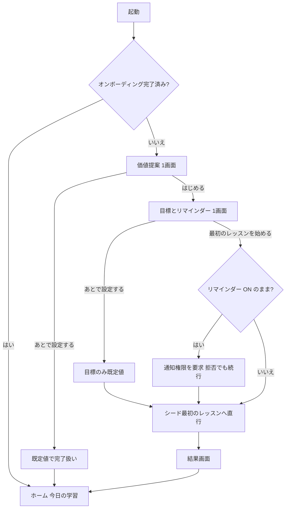
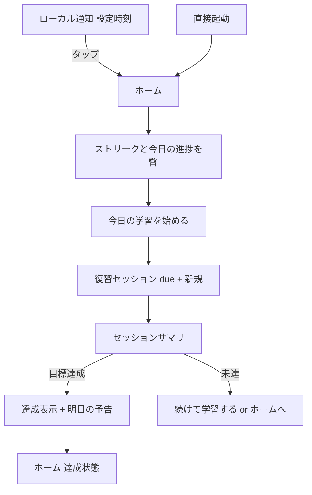
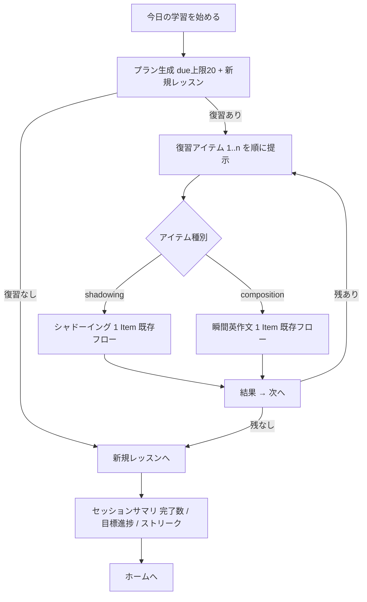
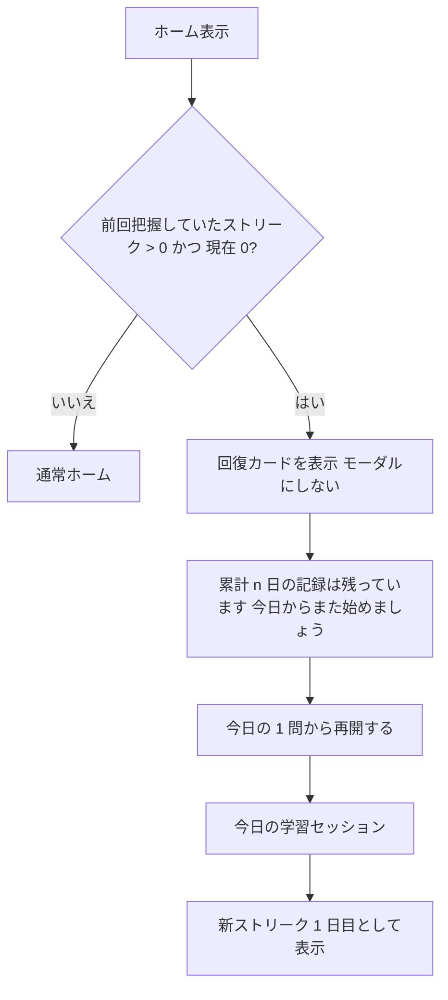

# UX 設計 — オンボーディングと継続体験

本書は SnapSpeak の **UX 設計正本** である。対象は「簡単に始められる（オンボーディング）」と「継続し続けられる（リテンション）」の体験全体。プロダクト意図は [product-overview.md](./product-overview.md)、実装方針は [architecture.md](./architecture.md)、フェーズ分割は [roadmap.md](./roadmap.md) を正とし、食い違う場合は上位 3 文書が勝つ。実装の詳細分解は [phase2-retention-implementation-plan.md](./phase2-retention-implementation-plan.md)（本書の下位文書）。

本書が固定するもの:

- デザイン原則（§1）
- ストリーク / デイリーゴール / 今日の学習プランの **ルール仕様**（§2。境界条件含む。実装はこの仕様のテスト可能な写像であること）
- 主要ユーザーフロー（§3）と画面仕様（§4）
- 状態マトリクス（§5）、通知戦略（§6）、アクセシビリティ（§7）、i18n キー方針（§8）、計測（§9）

---

## 1. デザイン原則

| # | 原則 | 意味 | やらないこと |
|---|------|------|--------------|
| P1 | 教えるより即体験 | 初回起動から最初のレッスン開始まで **60 秒以内・タップ 2 回**。説明はレッスンの中で最小限に出す | チュートリアル画面の連打、機能ツアー、初回のアカウント登録 |
| P2 | ホームは「今日やること」 | 開いた瞬間に「今日何をどれだけやるか」「どこまで進んだか」が 1 画面で分かる | コース階層をホームの一等地に置く、意思決定を毎回ユーザーに委ねる |
| P3 | 罰よりも回復しやすさ | ストリークは壊れにくく設計し、壊れたときは喪失感より「積み上げは消えていない」を先に見せる | 喪失を煽る文言、課金による復活（Phase 2 では導入しない）、ギルトトリップ通知 |
| P4 | 通知は静かに | ユーザーが設定した 1 日 1 回のみ。文言はストリーク状態で変わるが **本数は増えない** | 未設定ユーザーへの勝手な通知、バッジの常時点灯、1 日複数回のリマインド |
| P5 | 劣化を隠さない | ASR 不可・権限拒否・オフラインでも学習は継続できる。制限は明示し、責めない | 劣化状態での機能の黙殺、権限取得のための行き止まり画面 |
| P6 | 数字は正直に | ストリークは実学習完了のみカウント（起動だけでは進まない）。採点は「スクリプト一致率」であり発音評価と誤認させない | 形だけの起動をカウントする、ストリークを主 KPI にする |
| P7 | 最初から国際化・アクセシブル | 文字列は String Catalog、日付・数値は地域設定、Dynamic Type / VoiceOver は初期実装から前提 | 日本語ハードコード、色だけに依存した状態表示 |

---

## 2. ルール仕様（ストリーク / デイリーゴール / 今日の学習）

### 2.1 学習アクティビティの定義

| 用語 | 定義 |
|------|------|
| アイテム完了 | 1 Item の試行が完了し `LessonAttempt` が追記されたこと。**未採点（ASR 不可の劣化・タイプ入力・低 confidence）も 1 完了として数える** |
| 学習日 (StudyDay) | ローカル時刻 **04:00 境界**（SRSKit `StudyDay` と同一実装を使う。二重実装しない）。03:59 の完了は前日、04:00 ちょうどは当日 |
| 学習した日 | その学習日にアイテム完了が **1 件以上** ある日 |

設計判断: ストリークとゴールの母数を `ReviewEvent` ではなく `LessonAttempt` にする。`ReviewEvent` は低 confidence や劣化モードでは追記されないため、ASR 非対応端末のユーザーが構造的にストリークを積めなくなる。継続の仕組みは「練習した事実」に紐づける（P5・P6）。

### 2.2 デイリーゴール

| 項目 | 仕様 |
|------|------|
| 単位 | **アイテム数 / 日**（分数は採用しない。滞在時間は学習量の正直な尺度にならず、計測も自己申告的になるため） |
| プリセット | かるめ 5 / ふつう 10 / しっかり 20。オンボーディングで選択（既定 10）。Settings でいつでも変更可 |
| 達成判定 | 当該学習日のアイテム完了数 ≥ 目標数 |
| 反復の扱い | 同一アイテムの反復完了もカウントする（反復練習は正当な学習。水増し対策はしない — P6 の「実学習完了」は担保済み） |
| 目標変更当日 | その時点の新しい目標値で進捗を再評価する（遡及計算はしない） |
| ゴールとストリークの関係 | **独立**。ストリークは「1 件以上」で維持され、ゴール達成は進捗リングの完成として別に祝う。多忙な日に 1 問でも触れば火は消えない（P3） |

### 2.3 ストリーク

**定義**: 「学習した日」の連なり。現在ストリーク・最長ストリーク・累計学習日数の 3 つを持つ。

**救済策の設計判断 — 休み 1 日の橋渡し（グレース）を採用する**:

- 連続する休みが **1 学習日以内** ならストリークは途切れない（橋渡し）。**連続 2 学習日** 休むと途切れる。
- 橋渡しした休み日はカウントに **含めない**（30 日ストリーク = 実際に 30 日学習した。P6）。
- フリーズ（ストック消費型）は **採用しない**。理由: (1) 在庫という経済圏を持ち込むと Phase 2 の課金設計と癒着しやすく「課金で罰を回避」への圧力が生まれる（P3 に反する）、(2) アカウントなしのローカルデータでは在庫の同期・復元に将来コストがかかる、(3) 純関数として仕様化しにくい。橋渡しは入力（完了日集合）だけから決定的に計算でき、テスト容易。
- 喪失時の UI は「壊れた」より先に **累計は消えていない** ことを見せる（§3.4）。

**計算仕様**（純関数。実装は `HabitKit.StreakCalculator`）:

```
入力: 全 LessonAttempt の createdAt 列、now、Calendar（現在の端末タイムゾーン）、境界時刻 04:00
1. 各 createdAt を StudyDay に写像し、学習した日の集合 D を得る（同一日重複は 1）
2. today = StudyDay(now)
3. studiedToday = today ∈ D
4. 現在ストリーク: today から過去へ走査する。today が未学習でもペナルティなし
   （当日はまだ進行中）。それ以前は、休み 1 日は橋渡し（カウントせず継続）、
   休みが 2 日連続した時点で打ち切り。カウントは D に含まれる日のみ。
5. 最長ストリーク: 全履歴に同じ橋渡し規則を適用した最大値
6. 累計学習日数: |D|
```

**境界条件（テストで固定する）**:

| 条件 | 期待 |
|------|------|
| 03:59 に完了 | 前学習日にカウント |
| 04:00 ちょうどに完了 | 当学習日にカウント |
| 今日未学習・昨日学習済み | ストリーク維持（`isAtRisk = true`。通知文言が変わる） |
| 今日未学習・昨日休み・一昨日学習済み | 橋渡しで維持（`isOnLastGraceDay = true`。今日学習しないと明日途切れる） |
| 昨日・一昨日とも休み | 現在ストリーク 0（喪失） |
| タイムゾーン変更（例: Asia/Tokyo → America/Los_Angeles） | 過去の完了時刻（絶対時刻）は書き換えず、**現在のタイムゾーンの 04:00 境界で全日付を再解釈**する。ストリークが ±1 日変動しうることを許容し、補正はしない |
| DST 切替日 | `Calendar` の 04:00 解決に従う（独自の秒数計算をしない） |
| 端末時計の未来改ざん | ローカルでは検出しない（Phase 3 同期時にサーバー時刻でクリップ。architecture §6.4） |
| 同一学習日に複数完了 | 学習した日は 1 日として数える |

### 2.4 今日の学習プラン

ホームの主 CTA「今日の学習を始める」で開始する 1 セッションの中身。

| 項目 | 仕様 |
|------|------|
| 構成 | **期日到来の復習カード**（上限あり）＋ **新規レッスン 1 本**（コース順で次の未完了レッスン） |
| due 判定 | `dueAt <= now` かつ再学習ゲート（失敗後 10 分）通過。SRSKit の `SRSState.isDue` と同義 |
| 復習上限 | 1 セッション **20 件**（初期値。設定値として保持し校正可能にする）。超過分は「ほか n 件はまた明日」と表示し、タイムゾーンジャンプ等での due 一斉到来を吸収する（architecture §6.4） |
| 並び順 | `dueAt` 昇順（延滞が古いものから）→ 同時刻は composition 優先 → itemId 昇順。**決定的**（乱数なし） |
| skill 混在 | 混在を許す（roadmap Phase 2 のとおり）。並びは上記規則に従い、人工的なインターリーブはしない（シャッフルは再現性を壊しテスト不能になる） |
| 新規レッスンの定義 | カタログ順（Course → Unit → Lesson）で「全 Item に試行が付いていない」最初のレッスン。全コース完了なら新規なし |
| 復習ゼロのとき | 新規レッスンのみ提示。新規もなければ「今日の分は完了」状態（§4.3） |
| セッション中断 | アイテムごとに完了時点で永続化済みのため、中断しても完了分の進捗・ストリークは保持。再開時はプランを再生成する（静的プランを持ち越さない） |
| 失敗カードの同日再挑戦 | プラン生成時点でゲート未通過のカードは含めない。セッション終了後の再生成で、ゲートを過ぎていれば再登場する |

---

## 3. 主要ユーザーフロー

### 3.1 初回起動（オンボーディング）

**バジェット: 起動から最初のレッスン開始まで 60 秒以内・タップ 2 回**（権限ダイアログはレッスン内で just-in-time）。

| 段階 | 画面 | ユーザー操作 | 目安秒数 |
|------|------|--------------|----------|
| 1 | コールドローンチ | — | 〜2 秒 |
| 2 | 価値提案（1 画面） | 読む＋「はじめる」タップ | 〜10 秒 |
| 3 | 目標とリマインダー（1 画面） | プリセット選択（既定選択済み）＋「最初のレッスンを始める」タップ | 〜15 秒 |
| 4 | シードコースの最初のレッスンへ直行 | レッスン内で録音開始時にマイク / 音声認識の権限を just-in-time 要求 | — |

- アカウント登録なし。言語ペアは既定 `ja→en`（設定から確認可能。Phase 1 方針のまま）。
- 各画面に「あとで設定する」スキップを置く。スキップ時は既定値（目標 10 問 / リマインダー OFF）で完了扱い。
- 通知権限は **リマインダーを ON のまま完了したときだけ**、目標画面の完了タップ直後に要求する（ユーザーが「リマインドして」と言った直後 = 使用直前）。OFF なら要求しない。後から Settings で ON にしたときも同様に just-in-time。
- マイク / 音声認識の権限はオンボーディングでは **要求しない**。既存レッスンフローの録音直前要求に従う（architecture §11.2）。



### 3.2 2 日目以降の再訪



- 通知タップはホーム（今日の学習）に着地する。ディープリンクで特定レッスンへは飛ばさない（プラン生成はホームの責務）。
- ホーム表示のたびに、当日分の未発火リマインダーを再計算する（既に学習済みなら当日分を取り消す。§6）。

### 3.3 復習セッション



- 各アイテムの学習 UI は既存のシャドーイング / 瞬間英作文の 1 Item フローをそのまま使う（採点・`ReviewEvent` 追記・fold は既存ユースケースの責務。二重実装しない）。
- セッション側が足すのは: 進捗ヘッダ（3/12）、結果画面の「次へ」、欠損コンテンツのスキップ、サマリ。
- 途中離脱は確認ダイアログ 1 回（「完了した分は保存されています」）。

### 3.4 ストリーク喪失時（回復フロー）



- **モーダルで遮らない**。ホーム内のカードとして 1 回だけ表示（閉じられる）。
- 文言は喪失（「途切れました」）を 1 行で事実として伝え、直後に累計学習日数と最長記録が **残っている** ことを示す（P3）。
- 「連続 2 日休むと途切れる」ルール自体は、初回のストリーク獲得時とこのカードで説明する（隠しルールにしない）。

---

## 4. 画面仕様（テキストワイヤーフレーム）

### 4.1 オンボーディング 1: 価値提案

```
┌────────────────────────────────┐
│                                │
│   [アプリアイコン / キービジュアル]   │
│                                │
│   聞いて、まねて、即座に話す         │  ← onboarding.welcome.title
│   シャドーイングと瞬間英作文を、      │  ← onboarding.welcome.subtitle
│   1 日 10 分から。               │
│                                │
│   ・お手本に声を重ねるシャドーイング   │  ← 箇条書き 2 行のみ（読み物にしない）
│   ・日本語を見て即座に英語で言う      │
│                                │
│   ┌──────────────────────────┐ │
│   │       はじめる             │ │  ← PrimaryButton
│   └──────────────────────────┘ │
│         あとで設定する            │  ← テキストボタン（スキップ）
└────────────────────────────────┘
```

| 要素 | 仕様 |
|------|------|
| 構成 | 1 画面固定。ページング・動画・カルーセルなし（P1） |
| はじめる | 目標画面へ |
| あとで設定する | 既定値（目標 10 / リマインダー OFF）で完了扱いにしてホームへ。分析 `onboarding_skipped(step: welcome)` |

### 4.2 オンボーディング 2: 目標とリマインダー

```
┌────────────────────────────────┐
│  1 日の目標を決めましょう           │  ← onboarding.goal.title
│  続けやすい小さな目標がおすすめです。  │  ← onboarding.goal.subtitle
│  あとから設定でいつでも変えられます。  │
│                                │
│  ( ) かるめ（5 問/日）            │  ← 単一選択。既定は「ふつう」
│  (●) ふつう（10 問/日）           │
│  ( ) しっかり（20 問/日）          │
│                                │
│  ── リマインダー ──               │
│  [✓] 毎日リマインドする            │  ← 既定 ON（時刻を選ばせて価値を見せる）
│  時刻            [ 21:00 ▾ ]     │  ← ホイール。地域設定の時刻書式に従う
│                                │
│  ┌──────────────────────────┐  │
│  │  最初のレッスンを始める        │  │  ← PrimaryButton
│  └──────────────────────────┘  │
│        あとで設定する             │
└────────────────────────────────┘
```

| 要素 | 仕様 |
|------|------|
| 目標選択 | 3 プリセット。自由入力は置かない（迷わせない。Settings 側にも同じ 3 択） |
| リマインダー | トグル ON のまま「最初のレッスンを始める」をタップした場合のみ、その場で通知権限を要求。拒否されても止めずレッスンへ進む（トグルは OFF 表示に戻し、Settings に導線を残す） |
| 最初のレッスンを始める | 設定を保存し、シードコースの最初のレッスンへ **直接遷移**（ホームを経由しない）。分析 `onboarding_completed` |
| あとで設定する | 目標は既定値で保存し、そのままレッスンへ。分析 `onboarding_skipped(step: goal)` |

### 4.3 ホーム（再設計。「今日やること」中心）

```
┌────────────────────────────────┐
│ 今日の学習                (nav)  │
│                                │
│ ┌────────────────────────────┐ │
│ │ 🔥 12 日連続      ◔ 4/10 問 │ │  ← StreakBadge + ProgressRing（ゴール進捗）
│ │ （危機時: 今日まだ学習していません）│ │  ← isAtRisk のときのみ 1 行
│ └────────────────────────────┘ │
│ ┌────────────────────────────┐ │
│ │ 今日の学習                   │ │
│ │ 復習 8 件 ・ 新しいレッスン     │ │  ← プラン内訳。超過時「ほか n 件はまた明日」
│ │ ┌────────────────────────┐ │ │
│ │ │   今日の学習を始める        │ │ │  ← 主 CTA（画面で唯一の Primary）
│ │ └────────────────────────┘ │ │
│ └────────────────────────────┘ │
│ ┌────────────────────────────┐ │
│ │ ▶ 続きから: あいさつと予定調整   │ │  ← 直近レッスンへのショートカット（副 CTA）
│ └────────────────────────────┘ │
│ （状態バナー: 劣化 / オフライン等）   │
└────────────────────────────────┘
  タブ: [ホーム] [コース] [設定]
```

| 領域 | 要素 | 仕様 |
|------|------|------|
| ヘッダカード | StreakBadge | 炎シンボル＋「n 日連続」。`isAtRisk` で「今日まだ学習していません」を添える。喪失直後は回復カード（§3.4）に置き換わる |
| | ProgressRing | 今日の完了数 / 目標。達成でリングが閉じチェックに変化 |
| 今日の学習カード | 内訳行 | 「復習 n 件 ・ 新しいレッスン」。復習 0 なら新規のみ、新規なしなら復習のみを表示 |
| | 主 CTA | 「今日の学習を始める」。プランが空（復習 0・新規なし）のときは達成状態表示に切替 |
| 達成状態 | | リング完成＋「今日の目標を達成しました」＋副 CTA「続けて学習する」（コース一覧へ）。追加学習を妨げない |
| 続きから | | 最後に開いたレッスン。初回起動直後は非表示 |
| 状態バナー | | §5 の状態マトリクスに従う。学習を止めない情報提示に留める |

**状態遷移**: `loading → ready(プランあり) / goalMet(達成) / empty(コースなし) / recovery(喪失直後)`。いずれの状態でもタブ・設定への導線は生きている。

### 4.4 復習セッション（コンテナ）

```
┌────────────────────────────────┐
│ ✕   復習   3 / 12               │  ← 進捗ヘッダ。✕は確認ダイアログ経由で離脱
│ ┌────────────────────────────┐ │
│ │                            │ │
│ │  （既存の 1 Item 学習 UI:      │ │  ← シャドーイング or 瞬間英作文
│ │    シャドーイングプレイヤー      │ │     既存画面をそのまま埋め込む
│ │    または瞬間英作文カード）      │ │
│ │                            │ │
│ └────────────────────────────┘ │
│ （結果表示後）                    │
│ ┌────────────────────────────┐ │
│ │          次へ               │ │  ← 結果確認後に出現
│ └────────────────────────────┘ │
└────────────────────────────────┘
```

| 要素 | 仕様 |
|------|------|
| 進捗ヘッダ | 「3 / 12」形式。VoiceOver は「12 問中 3 問目」と読む |
| ✕（離脱） | 確認ダイアログ「セッションを終了しますか？ 完了した分は保存されています」。破壊的操作ではない色 |
| 次へ | 各アイテムの結果表示後に出現。復習では「もう一度」より「次へ」を優位に置く（同日再挑戦は 10 分ゲートの管轄） |
| 欠損コンテンツ | コース削除等でアイテムを解決できない場合は自動スキップし、サマリに「教材が見つからないためスキップしました」を出す |
| 新規レッスン部 | 復習消化後に「新しいレッスン」区切りを 1 画面挟んで開始（心理的な切れ目を作る） |

### 4.5 セッションサマリ

```
┌────────────────────────────────┐
│         セッション完了            │
│                                │
│      ◎ 12 問 完了               │
│      ◔ → ● 今日 12/10 問        │  ← ゴール進捗の前後
│      🔥 12 → 13 日連続           │  ← ストリーク更新があれば
│                                │
│   （目標達成時: 今日の目標を達成    │
│     しました！）                  │
│                                │
│ ┌────────────────────────────┐ │
│ │        ホームへ戻る           │ │
│ └────────────────────────────┘ │
│        続けて学習する             │  ← 副 CTA（コース一覧へ）
└────────────────────────────────┘
```

- 祝いはこの画面に集約する（レッスン中に都度出さない）。Reduce Motion 時はアニメーションを静止表現に落とす。
- ストリークが当日初学習で伸びた場合のみ「n → n+1 日連続」を表示する。

### 4.6 設定（追加分）

既存の設定画面に「継続」セクションを追加する。

```
│ ── 継続 ──                      │
│ 1 日の目標          ふつう（10）▾ │  ← 3 プリセットのメニュー
│ リマインダー              [✓]    │
│ 時刻                 21:00 ▾    │  ← リマインダー ON のときのみ表示
│ （権限拒否時: 通知が許可されていま   │
│   せん。→ 通知設定を開く）         │
```

| 要素 | 仕様 |
|------|------|
| 目標変更 | 即時反映（当日の進捗は新目標で再評価） |
| リマインダー ON | 通知権限が未決定なら just-in-time で要求。拒否済みなら設定アプリへの導線を出す（`UIApplication.openSettingsURLString`） |
| リマインダー OFF | 予約済み通知をすべて取り消す |

### 4.7 通知（表示物）

| 種別 | タイトル | 本文 | 発火条件 |
|------|----------|------|----------|
| 通常デイリー | 今日の英語、始めましょう | 1 日 %lld 問の目標が待っています。すきま時間にどうぞ。 | 設定時刻。当日未学習のときのみ |
| ストリーク危機 | ストリークが途切れそうです | %lld 日連続の記録を、今日の 1 問でつなげましょう。 | 設定時刻。当日未学習かつ現在ストリーク ≥ 1 のとき、通常文言の **代わりに** 出す（本数は同じ） |

---

## 5. 状態マトリクス

各画面 × 特殊状態の定義。空欄は「影響なし（通常表示）」。

| 状態 | ホーム | 復習セッション | オンボーディング | 設定（継続） |
|------|--------|----------------|------------------|--------------|
| **コースなし（空）** | 今日の学習カードの代わりに「コースがありません。コース一覧からダウンロードしてください」＋コース一覧への導線。ストリーク表示は履歴があれば出す | 到達しない（ホームで CTA が出ない） | シードが常に同梱されるため通常発生しない（シード読込失敗時はホームの空状態に落ちる） | |
| **due 0・新規なし（全完了）** | 達成状態（§4.3）。「続けて学習する」でコース一覧へ | 開始できない（CTA 非表示） | | |
| **ASR 劣化（オンデバイス不可）** | バナー「オンデバイス音声認識が使えないため、録音と自己再生のみです」（既存キー再利用）。プラン・ストリークは通常どおり | シャドーイング Item は既存の劣化フロー。完了は録音完了で成立し、ゴール / ストリークにカウント。SRS 品質は書かれない（既存仕様） | | |
| **オフライン** | 影響なし（プラン生成・ストリーク・SRS は全てローカル）。ダウンロード導線のみ失敗しうる | 影響なし（ダウンロード済み / シードで完結） | 影響なし | 影響なし |
| **マイク権限拒否** | 影響なし | シャドーイングはお手本再生のみ（既存仕様。完了条件を満たせないため、当該 Item はスキップ導線を出す）。瞬間英作文はタイプ入力で完了可 | 権限を要求しない設計のため影響なし | |
| **音声認識権限拒否** | 影響なし | シャドーイングは録音・自己再生（完了カウント可）。瞬間英作文はタイプ入力 | 同上 | |
| **通知権限拒否** | 影響なし（学習機能は劣化しない。roadmap Phase 2 DoD） | 影響なし | リマインダートグルが OFF に戻り、続行 | 「通知が許可されていません」＋設定アプリ導線 |
| **ストリーク喪失直後** | 回復カード（§3.4）。1 回閉じたら通常表示 | | | |
| **タイムゾーン大移動** | due 一斉到来は復習上限 20 件で削る。「ほか n 件はまた明日」で明示 | 同左 | | |

### 5.1 実装対応メモ（目視確認）

状態マトリクスは次の実装に写像した。実機確認は計画書 §6.3（通知実発火・権限 3 状態・60 秒計測・VoiceOver）に残す。

| 状態 | 実装箇所 |
|------|----------|
| コースなし | `HomeView` が `courses.isEmpty` / `TodayState.empty` で `home.today.empty_course` ＋ コース一覧へ |
| due 0・新規なし | `SessionPlan.isEmpty` のとき達成カード（`home.today.all_done_*`）＋ `home.today.extra` |
| ASR 劣化 | 既存 `degraded.no_asr` バナー。完了は `LessonAttempt` 追記でゴール / ストリークに算入 |
| オフライン | プラン・ストリークはローカル（`HabitKit` + SwiftData）。追加取得のみ失敗しうる |
| マイク / Speech 拒否 | 既存レッスンフロー。オンボーディングでは要求しない |
| 通知権限拒否 | オンボーディングはトグル OFF で続行。Settings は `settings.reminder_denied` ＋ 設定アプリ導線 |
| ストリーク喪失直後 | `TodayViewModel` が `lastKnownStreakDays > 0 && current == 0` で回復カード。1 回閉じたら通常 |
| タイムゾーン大移動 | `SessionPlanPolicy.maxReviews = 20` と `home.today.deferred` |

---

## 6. 通知戦略

| 項目 | 方針 |
|------|------|
| チャネル | **ローカル通知のみ**（サーバープッシュなし。Phase 1〜2 はアカウントなし） |
| 本数の上限 | **1 日最大 1 本**（ユーザー設定時刻）。ストリーク危機は本数を増やさず **同じ 1 本の文言を差し替える** |
| 既定 | リマインダーはオンボーディングで既定 ON 提示だが、**権限要求はユーザーが ON のまま進めたときだけ**。スキップ・OFF なら一切通知しない |
| 取り消し | 当日分は「その学習日に 1 件以上完了」した時点で取り消す（達成済みの人に鳴らさない）。アプリのフォアグラウンド復帰時・セッション完了時に再計算 |
| 先読み予約 | ローカル通知は発火時点の状態を知れないため、**3 日分** を予約し、アプリが開かれるたびに全消し＋再予約（識別子はカレンダー日で冪等）。数日開かれない場合も 3 日で自然停止し、放置ユーザーへ鳴らし続けない |
| 文言 | §4.7 の 2 種のみ。罪悪感を煽る表現（「もう忘れたの？」等）を使わない。絵文字は使わない |
| バッジ | 使わない（P4） |
| 深夜帯 | ユーザーが明示的に深夜を選んだ場合はそのまま尊重する（勝手に補正しない） |
| 権限 UI | 拒否されても学習機能は無劣化。再要求はせず、Settings に設定アプリへの導線を常設 |

---

## 7. アクセシビリティ指針

architecture §11.5 の Phase 1 基準を継続機能にも適用する。追加分:

| 対象 | 指針 |
|------|------|
| ProgressRing | `accessibilityValue` に「今日 4/10 問」を数値で提供。リングの色（達成 = success）に依存せず、達成時はチェック記号＋テキストを併記 |
| StreakBadge | `accessibilityLabel` =「12 日連続学習中」。危機時は「今日まだ学習していません」を `accessibilityHint` で追加。炎シンボルは装飾（`accessibilityHidden`） |
| 進捗ヘッダ（3/12） | 「12 問中 3 問目」と読み上げる。アイテム遷移時に `accessibilityNotification` でアナウンス（録音中は抑制 — 既存の VoiceOver 混入防止規則を維持） |
| 達成演出 | Reduce Motion で静止画に差し替え。音は鳴らさない（シャドーイングの音声体験と干渉させない） |
| Dynamic Type | 最大サイズでホームのカードは縦積みに再配置。リングは固定サイズを保ちテキストのみ拡大。全ボタン 44pt 以上 |
| オンボーディング | 2 画面とも VoiceOver の操作順が視覚順に一致。目標プリセットはラジオグループとして読み上げ |
| 通知 | 文言はプレーンテキストのみ（読み上げ互換） |

---

## 8. i18n キー方針

architecture §9 に従う。継続機能で追加するキーの規約:

| 規約 | 内容 |
|------|------|
| 命名 | `<画面/ドメイン>.<要素>[.<状態>]` の英語ドット区切り。単語内は snake_case（既存の `settings.reset_install_id` と同型）。例: `home.today.start`、`streak.broken.title` |
| 名前空間 | `onboarding.*` / `home.today.*` / `home.goal.*` / `streak.*` / `review.session.*` / `review.summary.*` / `notification.*` / `settings.*`（既存に追加） |
| 変数 | 件数は `%lld`、複数変数は位置指定（`%1$lld / %2$lld`）。将来の英語 UI で複数形が必要になるキー（件数系）は最初から変数化しておき、`.xcstrings` の plural variation を英語追加時に付与する |
| 値 | Phase 2 時点は `ja` のみ。キー名から意味が推測できること（翻訳者がコード無しで訳せる） |
| 禁止 | 文字列連結による文生成、コード内日本語リテラル（SwiftLint カスタムルールで強制）、`AppleLanguages` 書換え |
| 通知文言 | UI と同じ String Catalog を使い、予約時に `String(localized:)` で解決する（ローカル通知は表示時でなく予約時に文字列が固定されるため、言語変更後はアプリ起動時の再予約で追従する） |
| 用語 | 「ストリーク」「今日の学習」「復習」を glossary に追加。「連続記録」と「ストリーク」を混在させない |

キーの全一覧（ja 値付き）は [phase2-retention-implementation-plan.md](./phase2-retention-implementation-plan.md) §5 を正とする。

---

## 9. 計測（分析イベント）

AnalyticsCore の原則（生テキスト・音声・個人データを送らない。量子化した帯のみ）を維持する。オンボーディング完了率とストリーク継続率を測るため、次のイベント ID を予約・実装する。

| イベント ID | 発火点 | ペイロード（帯・コードのみ） |
|-------------|--------|------------------------------|
| `onboarding_started` | 価値提案画面の表示 | — |
| `onboarding_completed` | 目標画面の完了（スキップ経由含む） | goalItems、reminderEnabled、skippedGoal |
| `onboarding_skipped` | 各画面のスキップ | step（`welcome` / `goal`） |
| `review_session_started` | 今日の学習セッション開始 | dueCount、newCount |
| `review_session_completed` | セッションサマリ表示 | completedCount、durationBand |
| `goal_met` | 当日初の目標達成 | goalItems |
| `streak_day_recorded` | 当日初のアイテム完了（studiedToday が false→true） | streakBand（1 / 2-3 / 4-6 / 7-13 / 14-29 / 30+） |
| `streak_broken` | ホームで喪失検出（前回把握 > 0 かつ現在 0） | lengthBand（同上の帯） |
| `reminder_scheduled` | 通知予約の同期 | kind（daily / streak_risk） |
| `reminder_opened` | 通知タップ起動 | kind |

導出 KPI: オンボーディング完了率 = `onboarding_completed` / `onboarding_started`。活性化は既存どおり初回 `lesson_completed`。ストリーク継続率 = `streak_day_recorded` の帯遷移と `streak_broken` の分布で見る（ストリーク日数の生値は送らず帯のみ。product-overview §8.5 の「ストリークだけを成功指標にしない」を維持）。
